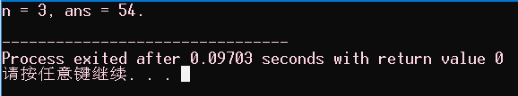
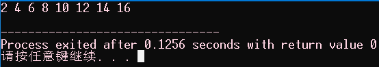
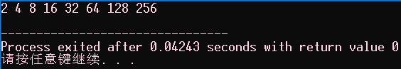
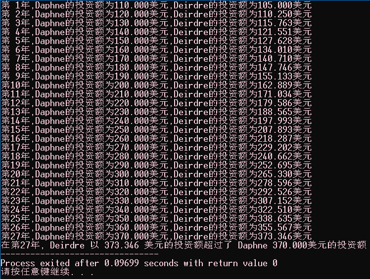
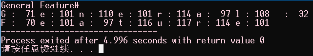
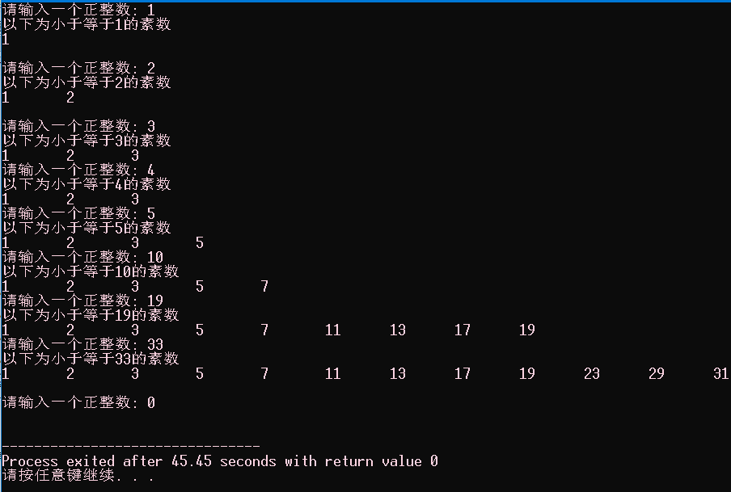
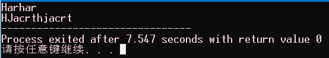

#  C Primer Plus 第6版

## P168 3.10复习题

1、 指出下面各种数据使用的合适数据类型（有些可使用多种数据类型）

> A.East Simpleton的人口
> B.DVD影碟的价格
> B.本章出现次数最多的字母
> D.本章出现次数最多的字母次数

```C
A. int32_t, long, long long;
B. float, double;
C. char;
D. int32_t, long, long long;
```

2、在什么情况下要用long类型的变量代替int类型的变量？

（1）当使用的整型数据必须使用 32 位以上的储存单元来存放时；

（2）当程序本身有明确的要求的时候。

3、 使用哪些可移植的数据类型可以获得32位有符号整数？选择的理由是什么？ 

（1）`long`  ，在C语言标准中规定 `long` 类型的长度不小于 32 位；

（2）`int32_t` ，在C语言标准（C99标准）中引入了头文件 ` inttypes.h ` ，在该头文件中规定 `int32_t` 类型的长度一定是 32 位。

4、指出下列常量的类型和含义（如果有的话） 

> a.'\b'
> b.1066
> c.99.44
> d.0XAA
> e.2.0e30 

```C
a. char,转义字符,表示退格;
b. int,一个整型常量;
c. double,一个浮点型常量;
d. int,一个整形常量,十六进制;
e. double,一个浮点型常量,科学计数法表示;
```

 5、Dottie Cawm编写了一个程序，请找出程序中的错误。

```C
include <stdio.h>
main
(
float g; h;
float tax, rate;
g = e21;
tax = rate*g;
)
```

将程序修改后

```c
#include <stdio.h>
int main(void)
{
float g, h;
float tax, rate;
g = 1.0e21;
tax = rate * g;
return 0;
}
```

6、写出下列常量在声明中使用的数据类型和在printf()中对应的转换说明：

| 常量       | 类型     | 转换说明（%转换字符） |
| -------- | ------ | ----------- |
| 12       | int    | %d          |
| 0x3      | int    | %x          |
| ‘C’      | char   | %c          |
| 2.34E07  | double | %f          |
| ‘\040’   | char   | %c          |
| 7.0      | double | %f          |
| 6L       | long   | %ld         |
| 6.0L     | float  | %f          |
| 0x5.bp12 | double | %a          |

 7、写出下列常量在声明中使用的数据类型和在printf()中对应的转换说明（假设int为16位） 

| 常量      | 类型          | 转换说明（%转换字符） |
| ------- | ----------- | ----------- |
| 012     | int         | %o          |
| 2.9e05L | long double | %lf         |
| ‘s’     | char        | %c          |
| 100000  | int         | %d          |
| ‘\n’    | char        | %c          |
| 20.0f   | float       | %f          |
| 0x44    | int         | %x          |
| -40     | int         | %d          |

8、假设程序的开头有下列声明： 

```C
int imate = 2;
long shot = 53456;
char grade = 'A';
float log = 2.71828;
```

 把下面printf()语句中的转换字符补充完整：

```C
printf("The odds against the %__ were %__ to 1.\n", imate, shot);
printf("A score of %__ is not an %__ grade.\n", log, grade);
```

补充完整后：

```C
printf("The odds against the %d were %ld to 1.\n", imate, shot);
printf("A score of %f is not an %c grade.\n", log, grade);
```

9、假设ch是char类型的变量。分别使用转义序列、十进制值、八进制字符常量和十六进制字符常量把回车字符赋给ch（假设使用ASCII编码值）。 

```c
int main(void)
{
    char ch;
    ch = '\n'; // 转义字符
    ch = 13; // 十进制值
    ch = '\015'; // 八进制字符常量
    ch = '\x0d'; // 十六进制字符常量
}
```

10、修正下面的程序（在C中，/表示除以）。

```C
void main(int) / this program is perfect /
{
cows, legs integer;
printf("How many cow legs did you count?\n);
scanf("%c", legs);
cows = legs / 4;
printf("That implies there are %f cows.\n", cows)
}
```

修正后：

```C
int main(void) /* this program is perfect */
{
    int legs_integer;
    float cows;
    printf("How many cow legs did you count?\n");
    scanf("%d", legs_integer);
    cows = legs_integer / 4;
    printf("That implies there are %.0f cows.\n", cows);
    return 0;
}
```

11、指出下列转义序列的含义：

> a.\n
> b.\\\
> c.\\"
> d.\t 

```C
a. \n 换行;
b. \\ 一个反斜杠;
c. \" 一个双引号;
d. \t 制表符;
```

## P172 3.11编程练习

1、通过试验（即编写带有此类问题的程序）观察系统如何处理整数上溢、浮点数上溢和浮点数下溢的情况。

```C
#include <stdio.h>
int main(void)
{
    short a = 32767;
    float b = 3.14E38;
    float c = 3.14159;
    printf("a = %hd, b = %f, c = %f\n", a+1, b*10.0F, c/100.0F);
    return 0;
}
```


2、编写一个程序，要求提示输入一个ASCII码值（如，66），然后打印输入的字符。

```C
#include <stdio.h>
int main(void)
{
    char ch;
    printf("请输入一个ANSII值：");
    scanf("%d", &ch);
    printf("ch = %c\n", ch);
    return 0;
}
```


3、编写一个程序，发出一声警报，然后打印下面的文本：

```
Startled by the sudden sound, Sally shouted,
"By the Great Pumpkin, what was that!
```

```C
#include <stdio.h>
int main(void)
{
    printf("\aStartled by the sudden sound, Sally shouted,\n\"By the Great Pumpkin, what was that!");
    return 0;
}
```


4、编写一个程序，读取一个浮点数，先打印成小数点形式，再打印成指数形式。然后，如果系统支持，再打印成p记数法（即十六进制记数法）。按以下格式输出（实际显示的指数位数因系统而异）：

```
Enter a floating-point value: 64.25
fixed-point notation: 64.250000
exponential notation: 6.425000e+01
p notation: 0x1.01p+6
```

```C
#include <stdio.h>
int main(void)
{
    double d;
    printf("Enter a floating-point value: ");
    scanf("%f", &d);
    printf("fixed-point notation: %8.6f\nexponential notation: %e\np notation: %a\n", d, d, d);
    return 0;
}
```


5、一年大约有3.156×10^7^秒。编写一个程序，提示用户输入年龄，然后显示该年龄对应的秒数。 

```c
#include <stdio.h>
#define SEC    3.156e7
int main(void)
{
    int age;
    printf("please input your age : ");
    scanf("%d", &age);
    printf("you have already lost %lf seconds\n", SEC * age);
    return 0;
}
```


6、1个水分子的质量约为3.0×10−23克。1夸脱水大约是950克。编写一个程序，提示用户输入水的夸脱数，并显示水分子的数量。 

```C
#include <stdio.h>
#define WEIGHT 3e-23
int main(void)
{
    double quark;
    printf("please input the weight of the water : ");
    scanf("%lf", &quark);
    printf("the weight of the water is %e\n", quark * 950 / WEIGHT);
    return 0;
}
```


 7、1英寸相当于2.54厘米。编写一个程序，提示用户输入身高（英寸），然后以厘米为单位显示身高。 

```C
#include <stdio.h>
#define ITM 2.54
int main(void)
{
    double height;
    printf("please input the height of your body : ");
    scanf("%lf", &height);
    printf("the height of your body is %.2f MM\n", height * ITM);
    return 0;
}
```


8、在美国的体积测量系统中，1品脱（pint）等于2杯（cup），1杯等于8盎司（ounce），1盎司等于2大汤勺（ladle），1大汤勺等于3茶勺（teaspoon）。编写一个程序，提示用户输入杯数，并以品脱、盎司、汤勺、茶勺为单位显示等价容量。思考对于该程序，为何使用浮点类型比整数类型更合适？

```C
#include <stdio.h>
#define PINT_TO_CUP 2
#define CUP_TO_OUNCE 8
#define OUNCE_TO_LADLE 2
#define LADLE_TO_TEASPOON 3
int main(void)
{
    double cup;
    printf("How many cups do you need : ");
    scanf("%lf", &cup);
    printf("%.2f cup is %.2f pint\n", cup, cup / PINT_TO_CUP);
    printf("%.2f cup is %.2f ounce\n", cup, cup * CUP_TO_OUNCE);
    printf("%.2f cup is %.2f ladle\n", cup, cup * CUP_TO_OUNCE * OUNCE_TO_LADLE);
    printf("%.2f cup is %.2f teaspoon\n", cup, cup * CUP_TO_OUNCE * OUNCE_TO_LADLE * LADLE_TO_TEASPOON);
    return 0;
}
```


## P175 4.1 talkbakc.c

```c
#include <stdio.h>
#include <string.h>
#define DENSITY 62.4
int main(void)
{
    float weight, volume;
    int size, letters;
    char name[40]; // name是一个可容纳40个字符的数组

    printf("Hi! What's your first name?\n");
    scanf("%s", name); // 输入一个字符串,但是不能有空格

    printf("%s, what's your weight in pounds?\n", name);
    scanf("%f", &weight);

    // size = sizeof(name); 
    size = sizeof name; // sizeof(name); 和 sizeof name; 两种写法都可以,但是更推荐前者
    letters = strlen(name);

    volume = weight / DENSITY;

    printf("Well, %s, your volume is %2.2f cubic feet.\n",name, volume);
    printf("Also, your first name has %d letters,\n",letters);
    printf("and we have %d bytes to store it.\n", size);

    return 0;
}
```


上例中可以看出，在控制台中输入一个字符串“Dream Snow”时，使用空格在中间隔开，则空格之前的内容“Dream”会当做字符串存入，但是空格之后的内容“Snow”不会，而是被下一个输入接收。

## P179 4.2.2 praise.c

```C
#include <stdio.h>
#define PRAISE "You are an extraordinary being"
int main(void)
{
    char name[40];
    printf("What's your name? ");
    scanf("%s", name);
    printf("Hello, %s.%s\n", name, PRAISE);
    return 0;
}
```


## P181 4.2.3 praise2.c

```C
#include <stdio.h>
#include <string.h> 
#define PRAISE "You are an extraordinary being."
int main(void)
{
    char name[40];
    printf("What's your name? ");
    scanf("%s", name);
    printf("Hello, %s.%s\n", name, PRAISE);
    printf("Your name of %zd letters occupies %zd memory cells.\n", strlen(name), sizeof name);
    printf("The phrase of praise has %zd letters ", strlen(PRAISE));
    printf("and occupies %zd memory cells.\n", sizeof PRAISE);
    return 0;
}
```


`printf`的格式控制符`%zd`需要所使用的C编译器支持C99 / C11标准，否则根据编译器提示使用`%u`或者`%lu`。

## P188 4.3 pizza.c

```C
#include <stdio.h>
#define PI 3.1415926535
int main(void)
{
    float area, circum, radius;
    printf("What is the radius of your pizza?\n");
    scanf("%f", &radius);
    area = PI * radius * radius;
    circum = 2.0 * PI *radius;
    printf("Your basic pizza parameters are as follows:\n");
    printf("circumference = %1.2f, area = %1.2f\n", circum,area);
    return 0;
}
```


## P192 4.3.2 defines.c

```C
#include <stdio.h>
#include <limits.h>
#include <float.h>
int main(void)
{
    printf("Some number limits for this system:\n");
    printf("Biggest int: %d\n", INT_MAX);
    printf("Smallest long long: %lld\n", LLONG_MIN);
    printf("One byte = %d bits on this system.\n", CHAR_BIT);
    printf("Largest double: %e\n", DBL_MAX);
    printf("Smallest normal float: %e\n", FLT_MIN);
    printf("float precision = %d digits\n", FLT_DIG);
    printf("float epsilon = %e\n", FLT_EPSILON); // 误差，浮点数比较大小时，实际上是两个浮点数之间的差值的绝对值与误差比较大小，比误差小就是true，比误差大就是false
    return 0;
}
```


```C
#include <stdio.h>
#include <float.h>
#include <math.h>
int main(void)
{
    float a = 0.9F, b = 1.0F, c = 20F;
    printf("a = %.20lf\nb = %.20lf\nc = %.20lf", a, b, c);
    if( fabs(a+0.1-b) > FLT_EPSILON ) printf("a != b\n");
    else printf("a = b\n");
    if( fabs(b-c) > FLT_EPSILON && b > c ) printf("b > c\n");
    else if (fabs(b-c) > FLT_EPSILON && b < c)printf("b < c\n");
    return 0;
}
```


==对于浮点数之间的大小比较，首先必须判断两者之差的绝对值是否小于误差（即判断两者是否相等），若是两者之间的绝对值大于误差，那么再判断两者的之间的是属于大于还是小于的关系。==

## P195 4.4.2 printout.c

```C
#include <stdio.h>
#define PI 3.1415926535
int main(void)
{
    int number = 7;
    float pies = 12.75F;
    int cost = 7800;
    printf("The %d contestants ate %f berry pies.\n", number, pies);
    printf("The value of pi is %f.\n", PI);
    printf("Farewell! thou art too dear for my possessing,\n");
    printf("%c%d\n", '$', 2 * cost);
    return 0;
}
```


## P201 4.4.3 width.c

```C
#include <stdio.h>
#define PAGES 959
int main(void)
{
    printf("*%d*\n", PAGES);
    printf("*%2d*\n", PAGES); // 字段宽度为2但是需要输出的字段宽度为3因此字段宽度自动扩大以符合整数的长度
    printf("*%10d*\n", PAGES);
    printf("*%-10d*\n", PAGES);
    return 0;
}
```


## P203 4.4.3 floats.c

```C
#include <stdio.h>
int main(void)
{
    const double RENT = 3852.99; // const变量
    printf("*%f*\n", RENT);
    printf("*%e*\n", RENT);
    printf("*%4.2f*\n", RENT);
    printf("*%3.1f*\n", RENT);
    printf("*%10.3f*\n", RENT);
    printf("*%10.3E*\n", RENT);
    printf("*%+4.2f*\n", RENT);
    printf("*%010.2f*\n", RENT);
    return 0;
}
```


## P205 4.4.3 flags.c

```C
#include <stdio.h>
int main(void)
{
    printf("%x %X %#x\n", 31, 31, 31);
    printf("**%d**% d**% d**\n", 42, 42, -42);
    printf("**%5d**%5.3d**%05d**%05.3d**\n", 6, 6, 6, 6);
    return 0;
}
```


## P206 4.4.3 stringf.c

```c
#include <stdio.h>
#define BLURB "Authentic imitation!"
int main(void)
{
    printf("[%2s]\n", BLURB);
    printf("[%24s]\n", BLURB);
    printf("[%24.5s]\n", BLURB);
    printf("[%-24.5s]\n", BLURB);
    return 0;
}
```


`%24.5s`指明精度限制了待打印字符的个数为24个字符， 以及只打印字符串中的前5个字符。

## P208 4.4.4 intconv.c

```C
#include <stdio.h>
#define PAGES 336
#define WORDS 65618
int main(void)
{
    short num = PAGES;
    short mnum = -PAGES;
    printf("num as short and unsigned short: %hd %hu\n", num, num);
    printf("-num as short and unsigned short: %hd %hu\n", mnum, mnum);
    printf("num as int and char: %d %c\n", num, num);
    printf("WORDS as int, short, and char: %d %hd %c\n", WORDS, WORDS, WORDS);
    return 0;
}
```


## P210 4.4.4 floatconv.c

```C
#include <stdio.h>
int main(void)
{
    float n1 = 3.0F;
    double n2 = 3.0;
    long n3 = 2000000000L;
    long n4 = 1234567890L;
    printf("%.1e %.1e %.1e %.1e\n", n1, n2, n3, n4);
    printf("%ld %ld\n", n3, n4);
    printf("%ld %ld %ld %ld\n", n1, n2, n3, n4);
    return 0;
}
```


## P214 4.4.4 prntval

```C
#include <stdio.h>
int main(void)
{
    int bph2o = 212;
    int rv;
    rv = printf("%d F is water's boiling point.\n", bph2o);
    printf("The printf() function printed %d characters.\n", rv);
    return 0;
}
```


## P215 4.4.4 longstrg.c

```C
#include <stdio.h>
int main(void)
{
    // 1、使用多个 printf() 函数将一个长字符串分次输出
    printf("Here's one way to print a ");
    printf("long string.\n");

    // 2、使用反斜杠
    printf("Here's another way to print a \
long string.\n");

    // 3、使用 多个双引号 组合输出
    printf("Here's the newest way to print a "
    "long string.\n"); /* ANSI C */
    return 0;
}
```


## P218 4.4.5 input.c

```C
#include <stdio.h>
int main(void)
{
    int age; // 变量
    float assets; // 变量
    char pet[30]; // 字符数组，用于储存字符串
    printf("Enter your age, assets, and favorite pet.\n");
    scanf("%d %f", &age, &assets); // 这里要使用&
    scanf("%s", pet); // 字符数组不使用&
    printf("%d $%.2f %s\n", age, assets, pet);
    return 0;
}
```


## P224 4.4.6 varwid.c

```C
#include <stdio.h>
int main(void)
{
    unsigned width, precision;
    int number = 256;
    double weight = 242.5;
    printf("Enter a field width:\n");
    scanf("%u", &width);
    printf("The number is :%*d:\n", width, number);
    printf("Now enter a width and a precision:\n");
    scanf("%u %u", &width, &precision);
    printf("Weight = %*.*f\n", width, precision, weight);
    printf("Done!\n");
    return 0;
}
```


## P226 4.4.6 skip2.c

```C
#include <stdio.h>
int main(void)
{
    int n;
    printf("Please enter three integers:\n");
    scanf("%*d %*d %d", &n);
    printf("The last integer was %d\n", n);
    return 0;
}
```


## P232 4.7 复习题

1、再次运行程序清单 4.1，但是在要求输入名时，请输入名和姓（根据英文书写习惯，名和姓中间有一个空格），看看会发生什么情况？为什么？ 

```C
#include <stdio.h>
#include <string.h>
#define DENSITY 62.4
int main(void)
{
    float weight, volume;
    int size, letters;
    char name[40]; // name是一个可容纳40个字符的数组
    printf("Hi! What's your first name?\n");
    scanf("%s", name); // 输入一个字符串,但是不能有空格
    printf("%s, what's your weight in pounds?\n", name);
    scanf("%f", &weight);
    // size = sizeof(name);
    size = sizeof name;
    letters = strlen(name);
    volume = weight / DENSITY;
    printf("Well, %s, your volume is %2.2f cubic feet.\n",name, volume);
    printf("Also, your first name has %d letters,\n",letters);
    printf("and we have %d bytes to store it.\n", size);
    return 0;
}
```


本程序在输入“Dream Snow”再按下回车键之后，“Dream”被正确的存储到了字符数组“name”中，但是之后的“ Snow”并没有被存放到字符数组“name”中，并且变量程序没有等待用户为变量“weight”指定数值，便直接运行下去了。

之所以产生上述情况，是由于在输入“Dream Snow”再按下回车键之后，函数“scanf()”从输入缓冲区内读取内容时，在“Dream”之后读取到了空格，对于函数“scanf()”而言空格、制表符、回车都会终止本次读取，因此只有“Dream”被正确的存储到了字符数组“name”中，而“ Snow”仍然在缓冲区内，这就导致缓冲区内仍有内容存在，之后第二个“scanf()”就直接从缓冲区内读取内容，不在等待用户输入内容，于是第一个字符是空格，函数“scanf()”会跳过字符之前的全部空格，因此就会读取到“Snow”，且“Snow”之后是回车，终止读取，并将读取的内容存放在至变量“weight”，但是变量“weight”是整形类型，存放失败，变量“weight”的内容为任意值。

2、假设下列示例都是完整程序中的一部分，它们打印的结果分别是什么？

```C
a.printf("He sold the painting for $%2.2f.\n", 2.345e2);
b.printf("%c%c%c\n", 'H', 105, '\41');
c.#define Q "His Hamlet was funny without being vulgar."
  printf("%s\nhas %d characters.\n", Q, strlen(Q));
d.printf("Is %2.2e the same as %2.2f?\n", 1201.0, 1201.0);
```

```C
a. He sold the painting for $234.50
b. Hi!
c. His Hamlet was funny without being vulgar.
   has 42 characters.
d. Is 1.20e+003 the same as 1201.00?
```

````C
#include <stdio.h>
#include <string.h>
#define Q "His Hamlet was funny without being vulgar."
int main(void)
{
	printf("He sold the painting for $%2.2f.\n", 2.345e2);
	printf("%c%c%c\n", 'H', 105, '\41');
	printf("%s\nhas %d characters.\n", Q, strlen(Q));
	printf("Is %2.2e the same as %2.2f?\n", 1201.0, 1201.0);
	return 0;
}
````


3、在第2题的c中，要输出包含双引号的字符串Q，应如何修改？

```C
#define Q "His Hamlet was funny without being vulgar."
printf("\"%s\"\nhas %d characters.\n", Q, strlen(Q));
```

```C
#include <stdio.h>
#include <string.h>
#define Q "His Hamlet was funny without being vulgar."
int main(void)
{
	printf("\"%s\"\nhas %d characters.\n", Q, strlen(Q));
	return 0;
}
```


4、找出下面程序中的错误。

```C
define B booboo
define X 10
main(int)
{
    int age;
    char name;
    printf("Please enter your first name.");
    scanf("%s", name);
    printf("All right, %c, what's your age?\n", name);
    scanf("%f", age);
    xp = age + X;
    printf("That's a %s! You must be at least %d.\n", B, xp);
    rerun 0;
}
```

```C
#include <stdio.h>
#define B "booboo"
#define X 10
int main(void)
{
    int age, xp;
    char name[40];
    printf("Please enter your first name.");
    scanf("%s", name);
    printf("All right, %s, what's your age?\n", name);
    scanf("%d", age);
    xp = age + X;
    printf("That's a %s! You must be at least %d.\n", B, xp);
    return 0;
}
```


5、假设一个程序的开头是这样：

```C
#define BOOK "War and Peace"
int main(void)
{
float cost =12.99;
float percent = 80.0;
...
```

请构造一个使用BOOK、cost和percent的printf()语句，打印以下内容：

> This copy of "War and Peace" sells for $12.99.
> That is 80% of list.

```C
#include <stdio.h>
#define BOOK "War and Peace"
int main(void)
{
    float cost = 12.99F;
    float percent = 80.0F;
    printf("This copy of \"%s\" sells for $%.2f.\n", BOOK, cost);
    printf("That is %.0f%% of list.\n", percent);
    return 0;
}
```


6、打印下列各项内容要分别使用什么转换说明？

> a.一个字段宽度与位数相同的十进制整数
> b.一个形如8A、字段宽度为4的十六进制整数
> c.一个形如232.346、字段宽度为10的浮点数
> d.一个形如2.33e+002、字段宽度为12的浮点数
> e.一个字段宽度为30、左对齐的字符串

```C
a. %d
b. %4X
c. %10.3f
d. %12.2e
e. %-30s
```

7、打印下面各项内容要分别使用什么转换说明？

> a. 字段宽度为15的unsigned long类型的整数
> b. 一个形如0x8a、字段宽度为4的十六进制整数
> c. 一个形如2.33E+02、字段宽度为12、左对齐的浮点数
> d. 一个形如+232.346、字段宽度为10的浮点数
> e. 一个字段宽度为8的字符串的前8个字符 

```C
a. %15lu
b. %#4x
c. %-12.2E
d. %+10.3f
e. %8.8s
```

8、打印下面各项内容要分别使用什么转换说明？

> a.一个字段宽度为6、最少有4位数字的十进制整数
> b.一个在参数列表中给定字段宽度的八进制整数
> c.一个字段宽度为2的字符
> d.一个形如+3.13、字段宽度等于数字中字符数的浮点数
> e.一个字段宽度为7、左对齐字符串中的前5个字符 

```C
a. %6.4d
b. %*o
c. %2c
d. %+.2f
e. %-7.5s
```

9、分别写出读取下列各输入行的scanf()语句，并声明语句中用到变量和数组。

> a. 101
> 
> b. 22.32 8.34E-09
> 
> c. linguini
> 
> d. catch 22
> 
> e. catch 22 (但是跳过catch)

```c
a. int a; scanf("%d", &a);
b. float a, b; scanf("%f %f", &a, &b);
c. char ch[10]; scanf("%s", ch);
d. char ch[10]; int a; scanf("%s %d", ch, &a);
e. char ch[10]; int a; scanf("%*s %d", ch, &a);
```

10、什么是空白？

一个或者多个空格？

==空白包括空格、制表符和换行符。C 语言使用空白分隔记号。scanf()使用空白分隔连续的输入项。==

11、下面的语句有什么问题？如何修正？ 

```C
printf("The double type is %z bytes..\n", sizeof(double);
```

由于`%z`中的`z`是修饰符不是转换字符，因此使用`%z`是不能输出`sizeof(double)`的数值，对于`sizeof(double)`可以使用`%zd,%zu,%zo,%zx`等输出其数值。

12、假设要在程序中用圆括号代替花括号，以下方法是否可行？

```C
#define ( {
#define ) }
```

不可行，`#define`定义的宏，宏标识必须是由数字、字母、下划线组成，其中宏标识的起始位必须使用字母或者下划线。

## P236 4.8 编程练习

1、编写一个程序，提示用户输入名和姓，然后以“名,姓”的格式打印出来。

```C
#include <stdio.h>
int main(void)
{
    char fname[10];
    char lname[10];
    printf("Please input your first name : ");
    scanf("%s", fname);
    printf("Please input your last name : ");
    scanf("%s", lname);
    printf("%s,%s\n", fname, lname);
    return 0;
}
```


2、编写一个程序，提示用户输入名和姓，并执行以下操作：

> a.打印名和姓，包括双引号；
> b.在宽度为20的字段右端打印名和姓，包括双引号；
> c.在宽度为20的字段左端打印名和姓，包括双引号；
> d.在比姓名宽度宽3的字段中打印名和姓。 

```C
#include <stdio.h>
#include <string.h>
int main(void)
{
    char fname[10];
    char lname[10];
    printf("Please input your first name : ");
    scanf("%s", fname);
    printf("Please input your last name : ");
    scanf("%s", lname);
    // a.打印名和姓，包括双引号；
    printf("\"%s\",\"%s\"\n", fname, lname);
    // b.在宽度为20的字段右端打印名和姓，包括双引号；
    printf("\"%20s\",\"%20s\"\n", fname, lname);
    // c.在宽度为20的字段左端打印名和姓，包括双引号；
    printf("\"%-20s\",\"%-20s\"\n", fname, lname);
    // d.在比姓名宽度宽3的字段中打印名和姓。
    printf("\"%*s\",\"%*s\"\n", strlen(fname)+3, fname, strlen(lname)+3, lname);
    return 0;
}
```


3、编写一个程序，读取一个浮点数，首先以小数点记数法打印，然后以指数记数法打印。用下面的格式进行输出（系统不同，指数记数法显示的位数可能不同）：

> a.输入21.3或2.1e+001；
> b.输入+21.290或2.129E+001； 

```C
#include <stdio.h>
int main(void)
{
    float num;
    short i = 0;
    do{
        scanf("%f", &num);
        printf("%f, %e, %g, %a\n", num, num, num, num);
        ++i;
    }while(i < 4);
    return 0;
}
```


4、编写一个程序，提示用户输入身高（单位：英寸）和姓名，然后以下面的格式显示用户刚输入的信息：

> Dabney, you are 6.208 feet tall
> 使用float类型，并用/作为除号。如果你愿意，可以要求用户以厘米为单位输入身高，并以米为单位显示出来。 

```C
#include <stdio.h>
int main(void)
{
    char name[40];
    float height;
    printf("please input your name : ");
    scanf("%s", name);
    printf("please input your height (mm) : ");
    scanf("%f", &height);
    height /= 100.0F;
    printf("%s, you are %g meters tall.\n", name, height);
    return 0;
}
```


5、编写一个程序，提示用户输入以兆位每秒（Mb/s）为单位的下载速度和以兆字节（MB）为单位的文件大小。程序中应计算文件的下载时间。注意，这里1字节等于8位。使用float类型，并用/作为除号。该程序要以下面的格式打印3个变量的值（下载速度、文件大小和下载时间），显示小数点后面两位数字：

> At 18.12 megabits per second, a file of 2.20 megabytes
> downloads in 0.97 second 

```C
#include <stdio.h>
int main(void)
{
    float speed, volume, seconds;
    printf("please input speed and volume of the files : ");
    scanf("%f %f", &speed, &volume);
    seconds = volume * 8 / speed;
    printf("At %.2f megabits per second, a file of %.2f megabytes\ndownloads in %.2f second ", speed, volume, seconds);
    return 0;
}
```


6、编写一个程序，先提示用户输入名，然后提示用户输入姓。在一行打印用户输入的名和姓，下一行分别打印名和姓的字母数。字母数要与相应名和姓的结尾对齐，如下所示：

> Melissa Honeybee
> 
> 7 8

接下来，再打印相同的信息，但是字母个数与相应名和姓的开头对齐，如下所示：

> Melissa Honeybee
> 7           8 

```C
#include <stdio.h>
#include <string.h>
int main(void)
{
    char fname[10], lname[10];
    printf("please input your first name and last name : ");
    scanf("%s %s", fname, lname);
    printf("%s %s\n%-*hd %-*hd\n", fname, lname, strlen(fname), strlen(fname), strlen(lname), strlen(lname));
    return 0;
}
```


7、编写一个程序，将一个double类型的变量设置为1.0/3.0，一个float类型的变量设置为1.0/3.0。分别显示两次计算的结果各3次：一次显示小数点后面6位数字；一次显示小数点后面12位数字；一次显示小数点后面16位数字。程序中要包含float.h头文件，并显示FLT_DIG和DBL_DIG的值。1.0/3.0的值与这些值一致吗？

```C
#include <stdio.h>
#include <float.h>
int main(void)
{
    float f_res = 1.0F/3.0F;
    double d_res = 1.0/3.0;
    printf("6 precision: %.6f, %.6f\n", f_res, d_res);
    printf("12 precision: %.12f, %.12f\n", f_res, d_res);
    printf("16 precision: %.16f, %.16f\n", f_res, d_res);
    printf("FLT_DIG=%u, DBL_DIG=%u\n", FLT_DIG, DBL_DIG);
    return 0;
}
```


8、编写一个程序，提示用户输入旅行的里程和消耗的汽油量。然后计算并显示消耗每加仑汽油行驶的英里数，显示小数点后面一位数字。接下来，使用1加仑大约3.785升，1英里大约为1.609千米，把单位是英里/加仑的值转换为升/100公里（欧洲通用的燃料消耗表示法），并显示结果，显示小数点后面 1 位数字。注意，美国采用的方案测量消耗单位燃料的行程（值越大越好），而欧洲则采用单位距离消耗的燃料测量方案（值越低越好）。使用#define 创建符号常量或使用 const 限定符创建变量来表示两个转换系数。 

```C
#include <stdio.h>
#define GALLON_TO_LITRE 3.785
#define MILE_TO_KILOMETER 1.609
int main(void)
{
    double m_g, l_k;
    printf("please input mill/gallon : ");
    scanf("%lf", &m_g);
    l_k = 1.0 / (m_g * (GALLON_TO_LITRE / (MILE_TO_KILOMETER * 100.0)));
    printf("%.1f\n", l_k);
    return 0;
}
```


## P240 5.1 shoes1.c

```C
#include <stdio.h>
#define ADJUST 7.31
int main(void)
{
    const double SCALE = 0.333;// const变量
    double shoe, foot;
    shoe = 9.0;
    foot = SCALE * shoe + ADJUST;
    printf("Shoe size (men's) foot length\n");
    printf("%10.1f %15.2f inches\n", shoe, foot);
    return 0;
}
```


## P241 5.1 shoes2.c

```C
#include <stdio.h>
#define ADJUST 7.31
int main(void)
{
    const double SCALE = 0.333;// const变量
    double shoe, foot;
    printf("Shoe size (men's) foot length\n");
    shoe = 3.0;
    while (shoe < 18.5) /* while循环开始 */
    { /* 块开始 */
        foot = SCALE * shoe + ADJUST;
        printf("%10.1f %15.2f inches\n", shoe, foot);
        shoe = shoe + 1.0;
    } /* 块结束 */
    printf("If the shoe fits, wear it.\n");
    return 0;
}
```


## P248 5.2.1 golf.c

```C
#include <stdio.h>
int main(void)
{
    int jane, tarzan, cheeta;
    cheeta = tarzan = jane = 68;
    printf("cheeta tarzan jane\n");
    printf("First round score %-4d %-8d %-8d\n", cheeta, tarzan, jane);
    return 0;
}
```


## P251 5.2.5 squares.c

```C
#include <stdio.h>
int main(void)
{
    int num = 1;
    while(num < 21)
    {
        printf("%4d%6d\n", num, num*num);
        num = num + 1;
    }
    return 0;
}
```


## P253 5.2.5 wheat

```C
#include <stdio.h> 
#define SQUARES 64 // 棋盘中方格数 
int main(void) 
{     
    const double CROP = 2E16; // 世界小麦年产粒数     
    int count = 1; // 棋盘上第一个方格     
    double current = 1, total = 1; // 第一个方格中只有 1 粒谷粒,总谷粒数也是 1     
    printf("square\tgrains\ttotal\tfraction of added grains world total\n");     
    printf("%4d %13.2e %12.2e %12.2e\n", count, current, total, total/CROP);     
    while(count < CROP)     
    {         
        count = count + 1;         
        current = 2.0 * current; // 下一个方格中谷粒的数目翻倍         
        total = total + current; // 当前方格以及之前的方格中总谷粒数目         
        printf("%4d %13.2e %12.2e %12.2e\n", count, current, total, total/CROP);     
    }     
    printf("That's all.\n");     
    return 0; 
}
```


## P255 5.2.6 divide.c

```C
#include <stdio.h>
int main(void)
{
    printf("integer division: 5/4 is %d \n", 5 / 4);
    printf("integer division: 6/3 is %d\n", 6 / 3);
    printf("integer division: 7/4 is %d\n", 7 / 4);
    printf("floating division 7./4. is %1.2f\n", 7. / 4.);
    printf("mixed division: 7./4 is %1.2f\n", 7. / 4);
    return 0;
}
```


## P260 5.2.8 rules.c

```C
#include <stdio.h>
int main(void)
{
    int top, score;
    top = score = -(2+5)*6+(4+3*(2+3));
    printf("top = %d, score = %d\n", top, score);
    return 0;
}
```


## P262 5.3.1 sizeof.c

```C
#include <stdio.h>
int main(void)
{
    int n = 0;
    size_t intsize;
    intsize = sizeof(int);
    printf("n = %d, n has %zd bytes; all ints have %zd bytes.\n", n, sizeof n, intsize); // %zd 为C99 标准新增的转换说明
    return 0;
}
```


## P264 5.3.2 min_sec.c

```C
#include <stdio.h>
#define SEC_PER_MIN 60
int main(void)
{
    int sec, min, left;
    printf("Convert seconds to minutes and seconds!\n");
    printf("Enter the number of seconds (<= 0 to quit):\n");
    scanf("%d", &sec);
    while(sec > 0)
    {
        min = sec / SEC_PER_MIN; // 求整分钟数
        left = sec % SEC_PER_MIN; // 不够整分钟数的秒数
        printf("%d seconds is %d minutes, %d seconds.\n", sec, min, left);
        printf("Enter the next value (<= 0 to quit):\n");
        scanf("%d", &sec);
    }
    printf("Done!\n");
    return 0;
}
```


## P266 5.3.2 test.c

> 无论任何情况，只要a和b都是整数值，便可以通过`a-(a/b)*b`来计算`a%b`。

```C
#include <stdio.h>
int main(void)
{
    int a = 1, b = 1, i, j;
    for(i = 0; i < 20; ++i)
    {
        for(j = 0; j < 20; ++j)
        {
            printf("%d-(%d/%d)*%d=%d\t\t\t", a, a, b, b, a-(a/b)*b);
            printf("%d%%%d=%d\n", a, b, a%b);
            ++b;
            if(a < b) break;
        }
        ++a;
        b = 1;
    }
    return 0;
}
```


## P266 5.3.3 add_one.c

```c
#include <stdio.h>
int main(void)
{
    int ultra = 0, super = 0;
    while(super < 5)
    {
        super++;
        ++ultra;
        printf("super = %d, ultra = %d\n", super, ultra);
    }
    return 0;
}
```


## P270 5.3.3 post_pre.c

```c
#include <stdio.h>
int main(void)
{
    int a = 1, b = 1;
    int a_post, pre_b;
    a_post = a++;
    pre_b = ++b;
    printf("a a_post b pre_b\n%1d %5d %5d %5d\n", a, a_post, b, pre_b);
    return 0;
}
```


## P272 5.3.4 bottles.c

```c
#include <stdio.h>
#define MAX 100
int main(void)
{
    int count = MAX + 1;
    while(--count > 0)
    {
        printf("%d bottles of spring water on the wall, %d bottles of spring water!\n", count, count);
        printf("Take one down and pass it around,\n%d bottles of spring water!\n", count - 1);
    }
    return 0;
}
```


（==以上程序截图并不是全部，只是一部分==）

## P274 5.3.5 test.c

> 测试内容：`x*y++`表示的是`(x)*(y++)`，而不是`(x+y)++`
> 
> **个人觉得：`x*y++`的计算顺序应该是 `x*y; y = y + 1;`**

```C
#include <stdio.h>
int main(void)
{
    int x = 1, y = 2, res1 = 0, res2 = 0, res3 = 0;
    res1 = x*y++;
    printf("x = %d, y = %d, res1 = %d\n", x, y, res1);
    res2 = (x)*(y++);
    // res3 = (x+y)++; // 编译器报错: [Error] value required as increment operand
    printf("x = %d, y = %d, res2 = %d\n", x, y, res2);
    return 0;
}
```


## P279 5.4.2 addemup.c

```C
#include <stdio.h>
int main(void)
{
    int count, sum; // 声明
    count = 0; // 赋值语句,表达式语句
    sum = 0; // 赋值语句,表达式语句
    while(count++<20) // 迭代语句(也成结构化语句)
        sum = sum + count; // 赋值语句
    printf("sum = %d\n", sum); // 函数调用,表达式语句
    return 0; // 跳转语句
}
```


## P288 5.5 convert.c

```C
#include <stdio.h>
int main(void)
{
    char ch;
    int i;
    float f;
    f = i = ch = 'C';
    printf("ch = %c, i = %d, f = %2.2f\n", ch, i, f);
    ch = ch + 1;
    i = f + 2 * ch;
    f = 2.0 * ch + i;
    printf("ch = %c, i = %d, f = %2.2f\n", ch, i, f);
    ch = 1107;
    printf("Now ch = %c\n", ch);
    ch = 80.89;
    printf("Now ch = %c\n", ch);
    return 0;
}
```


## P293 5.6 pound.c

```C
#include <stdio.h>
void pound(int n);
int main(void)
{
    int times = 5;
    char ch = '!';
    float f = 6.0f;
    pound(times);
    pound(ch);
    pound(f);
    return 0;
}
void pound(int n)
{
    while(n-- > 0)
        printf("#");
    printf("\n");
}
```


## P297 5.7 running.c

```C
#include <stdio.h>
const int S_PER_M = 60; // 1分钟的秒数
const int S_PER_H = 3600;  // 1小时的分钟数
const double M_PER_K = 0.62137; // 1公里的英里数
int main(void)
{
    double distk, distm; // 跑过的距离（分别以公里和英里为单位）
    double rate; // 平均速度（以英里/小时为单位）
    int min, sec; // 跑步用时（以分钟和秒为单位）
    int time; // 跑步用时（以秒为单位）
    int mmin, msec; // 跑1英里需要的时间（以分钟和秒为单位）
    double mtime; // 跑1英里需要的时间（以秒为单位）
    printf("This program converts your time for a metric race\n");
    printf("to a time for running a mile and to your average\n");
    printf("speed in miles per hour.\n");
    printf("Please enter, in kilometers, the distance run.\n");
    scanf("%lf", &distk);
    printf("Next enter the time in minutes and seconds.\n");
    printf("Begin by entering the minutes.\n");
    scanf("%d", &min);
    printf("Now enter the seconds.\n");
    scanf("%d", &sec);
    time = S_PER_M * min + sec; // 把时间转换成秒
    distm = M_PER_K * distk; // 把公里转换成英里
    rate = distm / time * S_PER_H; // 英里/秒×秒/小时 = 英里/小时
    mtime = (double) time / distm; // 时间/距离 = 跑1英里所用的时间
    mmin = (int) mtime / S_PER_M; // 求出分钟数
    msec = (int) mtime % S_PER_M; // 求出剩余的秒数
    printf("You ran %1.2f km (%1.2f miles) in %d min, %d sec.\n", distk, distm, min, sec);
    printf("That pace corresponds to runnning a mile in %d min.", mmin);
    printf("%d sec.\nYour average speed was %1.2f mph.\n", msec, rate);
    return 0;
}
```


## P303 5.10 复习题

1、假设所有变量的类型都是int，下列各项变量的值是多少：

> a. `x = (2+3)*6`
> 
> b. `x = (12+6)/2*3`
> 
> c. `y = x = (2+3)/4`
> 
> d. `y = 3+2*(x = 7/2)`

```C
#include <stdio.h>
int main(void)
{
    int x, y;
    printf("x = (2+3)*6 : %d\n", x = (2+3)*6); // 30
    printf("x = (12+6)/2*3 : %d\n", x = (12+6)/2*3); // 27
    printf("y = x = (2+3)/4 : %d\n", y = x = (2+3)/4); // 1
    printf("y = 3+2*(x = 7/2) : %d\n", y = 3+2*(x = 7/2)); // 9
    return 0;
}
```


2、假设所有变量的类型都是int，下列各项变量的值是多少：

> a. `x = (int)3.8 + 3.3`
> 
> b. `x = (2 + 3)*10.5`
> 
> c. `x = 3/5*22.0`
> 
> d. `x = 22.0*3/5`

```C
#include <stdio.h>
int main(void)
{
    int x;
    printf("x = (int)3.8 + 3.3 : %d\n", x = (int)3.8 + 3.3); // 6
    printf("x = (2 + 3) * 10.5 : %d\n", x = (2 + 3)*10.5); // 52
    printf("x = 3 / 5 * 22.0 : %d\n", x = 3/5*22.0); // 0
    printf("x = 22.0 * 3 / 5 : %d\n", x = 22.0*3/5); // 13
    return 0;
}
```


3、对下列各表达式求值：

> a. 30.0 / 4.0 * 5.0;
> b. 30.0 / (4.0 * 5.0);
> c. 30 / 4 * 5;
> d. 30 * 5 / 4;
> e. 30 / 4.0 * 5;
> f. 30 / 4 * 5.0; 

```C
#include <stdio.h>
int main(void)
{
    printf("30.0 / 4.0 * 5.0 : %f\n", 30.0 / 4.0 * 5.0); // 37.5
    printf("30.0 / (4.0 * 5.0) : %f\n", 30.0 / (4.0 * 5.0)); // 1.5
    printf("30 / 4 * 5 : %d\n", 30 / 4 * 5); // 35
    printf("30 * 5 / 4 : %d\n", 30 * 5 / 4); // 37
    printf("30 / 4.0 * 5 : %f\n", 30 / 4.0 * 5); // 37.5
    printf("30 / 4 * 5.0 : %f\n", 30 / 4 * 5.0); // 35.0
    return 0;
}
```


4、请找出下面的程序中的错误。

```C
int main(void)
{
    int i = 1,
    float n;
    printf("Watch out! Here come a bunch of fractions!\n");
    while (i < 30)
    n = 1/i;
    printf(" %f", n);
    printf("That's all, folks!\n");
    return;
}
```

以下为修改之后的：

```C
#include <stdio.h>
int main(void)
{
    int i = 1;
    float n;
    printf("Watch out! Here come a bunch of fractions!\n");
    while(i < 30)
    {
        n = 1.0F / (float) i;
        printf("%f\n", n);
        ++i;
    }
    printf("That's all, folks!\n");
    return 0;
}
```


5、这是程序清单 5.9 的另一个版本。从表面上看，该程序只使用了一条scanf()语句，比程序清单5.9简单。请找出不如原版之处。

```C
#include <stdio.h>
#define S_TO_M 60
int main(void)
{
    int sec, min, left;
    printf("This program converts seconds to minutes and ");
    printf("seconds.\n");
    printf("Just enter the number of seconds.\n");
    printf("Enter 0 to end the program.\n");
    while (sec > 0) // sec 没有初始化,那么 sec 所标识的存储空间内存放的值就是无法确定的随即值,在进入 while 循环时,就会有直接结束循环的可能
    {
        scanf("%d", &sec);
        min = sec/S_TO_M;
        left = sec % S_TO_M;
        printf("%d sec is %d min, %d sec. \n", sec, min, left);
        printf("Next input?\n");
    }
    printf("Bye!\n");
    return 0;
}
```

6、下面的程序将打印出什么内容？

```C
#include <stdio.h>
#define FORMAT "%s! C is cool!\n"
int main(void)
{
    int num = 10;
    printf(FORMAT,FORMAT); // "%s! C is cool!\n! C is cool!\n"
    printf("%d\n", ++num);
    printf("%d\n", num++);
    printf("%d\n", num--);
    printf("%d\n", num);
    return 0;
}
/*
%s! C is cool!
! C is cool!
11
11
12
11
*/
```


7、下面的程序将打印出什么内容？

```C
#include <stdio.h>
int main(void)
{
    char c1, c2;
    int diff;
    float num;
    c1 = 'S'; // 83
    c2 = 'O'; // 79
    diff = c1 - c2; // 4
    num = diff; // 4.0
    printf("%c%c%c:%d %3.2f\n", c1, c2, c1, diff, num); // SOS:4 4.00
    return 0;
}
```


8、下面的程序将打印出什么内容？

```C
#include <stdio.h>
#define TEN 10
int main(void)
{
    int n = 0;
    while (n++ < TEN) // n < 10; ++n;
        printf("%5d", n);
    printf("\n");
    return 0;
}
/*
     1     2     3    4    5    6    7    8    9   10

*/
```


9、修改上一个程序，使其可以打印字母a～g。

```C
#include <stdio.h>
#define END 'g'
int main(void)
{
    char ch = 'a';
    while(ch <= END)
    {
        printf("%5c", ch);  
        ++ch;
    }
    /*
    char ch = 'a' - 1;
    while(ch++<END)
        printf("%5c", ch);
    */
    /*
    #define END 'g'+1
    ...
    while(ch < END)
    {
        printf("%5c", ch);  
        ++ch;
    }
    */
    printf("\n");
    return 0;
}
/* (参考答案附赠)
while(ch <= 'g')
    printf("%5c", ch++);
*/
```


10、假设下面是完整程序中的一部分，它们分别打印什么？

> a. `int x = 0; while(++x<3) printf("%4d", x);`
> 
> b. `int x = 100; while(x++<103) printf("%4d\n", x); printf("%4d\n", x); `
> 
> c. `char ch = 's'; while(ch < 'w'){printf("%c", ch); ch++;} printf("%c\n", ch);`

```C
#include <stdio.h>
void a(void);
void b(void);
void c(void);
int main(void)
{
    printf("---- a ----\n");
    a();
    printf("\n");
    printf("---- b ----\n");
    b();
    printf("---- c ----\n");
    c();
    return 0;
}
void a(void)
{
    int x = 0;
    while(++x<3) // ++x; x<3
        printf("%4d", x);
}
void b(void)
{
    int x = 100;
    while(x++<103) // x<103; x++;
        printf("%4d\n", x);
    printf("%4d\n", x);
}
void c(void)
{
    char ch = 's';
    while(ch < 'w')
    {
        printf("%c", ch);
        ch++;
    }
    printf("%c\n", ch);
}
/*
---- a -----
   1   2
---- b -----
 101
 102
 103
 104
---- c ----
stuvw

*/
```


11、下面的程序会打印出什么？

```C
#define MESG "COMPUTER BYTES DOG"
#include <stdio.h>
int main(void)
{
    int n = 0;
    while ( n < 5 )
        printf("%s\n", MESG); // while 循环没有设置结束,会无止境的输出 COMPUTER BYTES DOG
    n++;
    printf("That's all.\n");
    return 0;
}
```

12、分别编写一条语句，完成下列各任务（或者说，使其具有以下副作用）：

> a. 将变量x的值增加10
> b. 将变量x的值增加1
> c. 将a与b之和的两倍赋给c
> d. 将a与b的两倍之和赋给c 

```C
a. x = x + 10;
b. ++x; x++; x = x + 1;
c. c = (a + b) * 2;
d. c = a + 2 * b;
```

13、分别编写一条语句，完成下列各任务：

> a. 将变量x的值减少1
> b. 将n除以k的余数赋给m
> c. q除以b减去a**的差**，并将结果赋给p
> d. a与b之和除以c与d的乘积，并将结果赋给x 

```C
a. --x; x--; x = x - 1;
b. m = n % k;
c. p = q / (b - a);
d. x = (a + b) / (c * d);
```

## P310 5.11 编程练习

1、编写一个程序，把用分钟表示的时间转换成用小时和分钟表示的时间。使用#define或const创建一个表示60的符号常量或const变量。通过while循环让用户重复输入值，直到用户输入小于或等于0的值才停止循环。

```C
#include <stdio.h>
#define MIN_TO_HOUR 60
int main(void)
{
    int min_count = 0, min = 0, hour = 0;

    printf("Please input the total minutes : ");
    scanf("%d", &min_count);

    printf("%d\n", min_count);

    while(min_count > 0)
    {
        hour = min_count / MIN_TO_HOUR;
        min = min_count % MIN_TO_HOUR;
        printf("%d 分钟是 %d 小时 %d 分钟\n", min_count, hour, min);
        scanf("%d", &min_count);
    }

    return 0;
}
```


2、编写一个程序，提示用户输入一个整数，然后打印从该数到比该数大10的所有整数（例如，用户输入5，则打印5～15的所有整数，包括5和15）。要求打印的各值之间用一个空格、制表符或换行符分开。

```C
#include <stdio.h>
#define END 10
int main(void)
{
    int num = 0, i = 0;
    scanf("%d", &num);
    while(i <= END)
        printf("%d ", num+i++);
    return 0;
}
```


3、 编写一个程序，提示用户输入天数，然后将其转换成周数和天数。例如，用户输入18，则转换成2周4天。以下面的格式显示结果：

> 18 days are 2 weeks, 4 days. 

通过while循环让用户重复输入天数，当用户输入一个非正值时（如0或-20），循环结束。

```C
#include <stdio.h>
int main(void)
{
    int day_count = 0, days = 0, weeks = 0;

    scanf("%d", &day_count);
    while(day_count > 0)
    {
        weeks = day_count / 7;
        days = day_count % 7;
        printf("%d days are %d weeks,%ddays.\n", day_count, weeks, days);
        scanf("%d", &day_count);
    }

    return 0;
}
```


4、编写一个程序，提示用户输入一个身高（单位：厘米），并分别以厘米和英寸为单位显示该值，允许有小数部分。程序应该能让用户重复输入身高，直到用户输入一个非正值。其输出示例如下：

> Enter a height in centimeters: 182
> 182.0 cm = 5 feet, 11.7 inches
> Enter a height in centimeters (<=0 to quit): 168.7
> 168.0 cm = 5 feet, 6.4 inches
> Enter a height in centimeters (<=0 to quit): 0
> bye 

```C
#include <stdio.h>
#define FEET_TO_CENTIMETER 30.48 // 1脚 = 30.48 厘米
#define INCH_TO_CENTIMETER 2.54 // 1英寸 = 2.54 厘米
#define FEET_TO_INCH 12 // 1脚 = 12英寸
int main(void)
{
    double centimeter = 0, inch = 0;
    int feet = 0;

    printf("Enter a height in centimeters: ");
    scanf("%lf", &centimeter);
    while(centimeter > 0)
    {
        inch = centimeter / INCH_TO_CENTIMETER;
        feet = (int)(inch / FEET_TO_INCH);
        inch = inch - feet * FEET_TO_INCH;
        printf("%.1f cm = %d feet, %.1f inches.\n", centimeter, feet, inch);
        printf("Enter a height in centimeters (<=0 to quit): ");
        scanf("%lf", &centimeter);
    }
    // printf("bye\n");
    puts("bye");
    return 0;
}
```


5、修改程序addemup.c（程序清单5.13），你可以认为addemup.c是计算20天里赚多少钱的程序（假设第1天赚\$1、第2天赚\$2、第3天赚​\$3，以此类推）。修改程序，使其可以与用户交互，根据用户输入的数进行计算（即，用读入的一个变量来代替20）。

```C
#include <stdio.h>
#include <stdlib.h>
int main(void)
{
    int count = 0, sum = 0, i = 0;

    printf("Enter how many days do you want to work: ");
    scanf("%d", &count);
    if(count < 0) exit(0); // 工作天数不可能小于0
    while(i <= count)
        sum = sum + i++;
    printf("you work %d days, gian $%d\n", count, sum);
    return 0;
}
```


6、 修改编程练习5的程序，使其能计算整数的平方和（可以认为第1天赚\$1、第2天赚\$4、第3天赚\$9，以此类推，这看起来很不错）。C没有平方函数，但是可以用n * n来表示n的平方。

> 使用 `#include <math.h>` 引入数学函数库文件，使用`double pow(double x, double y)`计算$$x^{y}$$。

```C
#include <stdio.h>
#include <stdlib.h>
#include <math.h>
int main(void)
{
    int count = 0, sum = 0, i = 0;

    printf("Enter how many days do you want to work: ");
    scanf("%d", &count);
    if(count <= 0) exit(0);
    i = 2;
    sum = 1;
    while(i <= count)
        sum = sum + pow(i++, 2);
    printf("you work %d days, gian $%d\n", count, sum);
    return 0;
}
```


7、编写一个程序，提示用户输入一个double类型的数，并打印该数的立方值。自己设计一个函数计算并打印立方值。main()函数要把用户输入的值传递给该函数。

```C
#include <stdio.h>
#include <math.h>
double cube(double num)
{
    return pow(num, 3);
}
int main(void)
{
    double num;
    scanf("%lf", &num);
    printf("the cube of %.2f is %.2f\n", num, cube(num));
    return 0;
}
```


8、编写一个程序，显示求模运算的结果。把用户输入的第1个整数作为求模运算符的第2个运算对象，该数在运算过程中保持不变。用户后面输入的数是第1个运算对象。当用户输入一个非正值时，程序结束。其输出示例如下：

> This program computes moduli.
> Enter an integer to serve as the second operand: 256
> Now enter the first operand: 438
> 438 % 256 is 182
> Enter next number for first operand (<= 0 to quit): 1234567
> 1234567 % 256 is 135
> Enter next number for first operand (<= 0 to quit): 0
> Done 

```C
#include <stdio.h>
int main(void)
{
    int num1 = 0, num2 = 0;
    printf("This program computes moduli.\n");
    printf("Enter an integer to serve as the second operand: ");
    scanf("%d", &num2);
    printf("Now enter the first operand: ");
    scanf("%d", &num1);
    while(num1 > 0 && num2 > 0)
    {
        printf("%d %% %d is %d\n", num1, num2, num1 % num2);
        printf("Enter next number for first operand (<= 0 to quit): ");
        scanf("%d", &num1);
    }
    puts("Done");
    return 0;
}
```


9、编写一个程序，要求用户输入一个华氏温度。程序应读取double类型的值作为温度值，并把该值作为参数传递给一个用户自定义的函数Temperatures()。该函数计算摄氏温度和开氏温度，并以小数点后面两位数字的精度显示3种温度。要使用不同的温标来表示这3个温度值。下面是华氏温度转摄氏温度的公式：

> 摄氏温度 = 5.0 / 9.0 * (华氏温度 - 32.0) 

开氏温标常用于科学研究，0表示绝对零，代表最低的温度。下面是摄氏温度转开氏温度的公式：

> 开氏温度 = 摄氏温度 + 273.16

Temperatures()函数中用const创建温度转换中使用的变量。在main()函数中使用一个循环让用户重复输入温度，当用户输入 q 或其他非数字时，循环结束。scanf()函数返回读取数据的数量，所以如果读取数字则返回1，如果读取q则不返回1。可以使用==运算符将scanf()的返回值和1作比较，测试两值是否相等。

```C
#include <stdio.h>
double Temperatures(double fahrenheit)
{
    double celsius = 0, kelvin = 0;
    const double CELSIUS = 32.0;
    const double KELVIN = 273.16;
    celsius = 5.0 / 9.0 * (fahrenheit - CELSIUS);
    kelvin = celsius + KELVIN;
    printf("华氏温度 %.2f 是 %.2f 摄氏温度，%.2f 开氏温度\n", fahrenheit, celsius, kelvin);
}
int main(void)
{
    double fahrenheit = 0;
    int flag;
    printf("请输入华氏温度: ");
    flag = scanf("%lf", &fahrenheit);
    while(1 == flag)
    {
        Temperatures(fahrenheit);
        printf("请输入华氏温度(输入 q 退出): ");
        flag = scanf("%lf", &fahrenheit);
    }
    return 0;
}
```


## P315 6.1 summing.c

> 根据用户从键盘输入的整数进行求和

```C
#include <stdio.h>
int main(void)
{
    long num;
    long sum = 0L;
    int status;

    printf("Please enter an integer to be summed (q to quit): ");

    status = scanf("%ld", &num);
    while(1 == status)
    {
        sum = sum + num;
        printf("Please enter next integer (q to quit): ");
        status = scanf("%ld", &num);
    }

    /*
    以上的读取和循环也可以简化为如下形式:
    while(1 == scanf("%ld", &num))
    {
        sum = sum + num;
        printf("Please enter next integer (q to quit): ");
    }
    */

    printf("Those integers sum to %ld.\n", sum);
    return 0;
}
```


## P322 6.2.2 when.c

```C
#include <stdio.h>
int main(void)
{
    int n = 5;
    while(n < 7)
    {
        printf("n = %d\n", n);
        n++;
        printf("Now n = %d\n", n);
    }
    printf("The loop has finished.\n");
    return 0;
}
```


## P326 6.2.4 while2.c

```C
#include <stdio.h>
int main(void)
{
    int n = 0;
    while(n++<3);
    printf("n is %d\n", n);
    printf("That's all this program does.\n");
    return 0;
}
```


## P329 6.3 cmpflt.c

```C
#include <stdio.h>
#include <math.h>
int main(void)
{
    const double ANSWER = 3.14159;
    double response;
    printf("What is the value of pi>\n");
    scanf("%lf", &response);
    while(fabs(response - ANSWER)>0.0001)
    {
        printf("Try again!\n");
        scanf("%lf", &response);
    }
    printf("Close enough!\n");
    return 0;
}
```


## P331 6.3.1 t_and_f.c

```C
#include <stdio.h>
int main(void)
{
    int true_val, false_val;
    true_val = (10 > 2);
    false_val = (10 == 2);
    printf("true = %d; false = %d\n", true_val, false_val);
    return 0;
}
```


## P332 6.3.2 truth.c

```C
#include <stdio.h>
int main(void)
{
    int n = 3;
    while(n)
        printf("%2d is true\n", n--);
    printf("%2d is false\n", n);
    n = -3;
    while(n)
        printf("%2d is true\n", n++);
    printf("%2d is false\n", n);
    return 0;
}
```


## P338 6.3.4 boolean.c

```C
#include <stdio.h>
int main(void)
{
    long num;
    long sum = 0L;
    _Bool input_is_good;
    printf("Please enter an integer to be summed");
    printf("(q to quit): ");
    input_is_good = (scanf("%ld", &num) == 1);
    while(input_is_good)
    {
        sum = sum + num;
        printf("Please enter next integer (q to quit): ");
        input_is_good = (scanf("%ld", &num) == 1);
    }
    printf("Those integers sum to %ld.\n", sum);
    return 0;
}
```


## P343 6.4 sweetie1.c

```C
#include <stdio.h>
int main(void)
{
    const int NUMBER = 22;
    int count = 1;
    while(count <= NUMBER)
    {
        printf("Be my Valentine!\n");
        count++;
    }
    return 0;
}
```


## P345 6.5 sweetie2.c

```C
#include <stdio.h>
int main(void)
{
    const int NUMBER = 22;
    int count = 1;
    for(count = 1; count <= NUMBER; count++)
        printf("Be my Valentine!\n");
    return 0;
}
```


## P346 6.5 for_cube.c

```C
#include <stdio.h>
int main(void)
{
    int num;
    printf("n    n cubed\n");
    for(num = 1; num <= 6; num++)
        printf("%-5d%-5d\n", num, num*num*num);
    return 0;
}
```


## P347 6.5.1 for_down.c

```C
#include <stdio.h>
int main(void)
{
    int secs;
    for(secs = 5; secs > 0; secs--)
        printf("%d seconds!\n", secs);
    printf("We have ignition!\n");
    return 0;
}
```


## P348 6.5.1 for_13s.c

```C
#include <stdio.h>
int main(void)
{
    int n;
    for(n = 2; n < 60; n = n + 13)
        printf("%d\n", n);
    return 0;
}
```


## P349 6.5.1 for_char.c

```C
#include <stdio.h>
int main(void)
{
    char ch;
    for(ch = 'a'; ch <= 'z'; ch++)
        printf("The ASCII value for %c is %d.\n", ch, ch);
    return 0;
}
```


## P351 6.5.1 for_geo.c

```C
#include <stdio.h>
int main(void)
{
    double debt;
    for(debt = 100.0; debt < 150.0; debt = debt*1.1)
        printf("Your debt is now $%.2f.\n", debt);
    return 0;
}
```


## P352 6.5.1 for_wild.c

```C
#include <stdio.h>
int main(void)
{
    int x;
    int y = 55;
    for(x = 1; y <= 75; y = (++x*5)+50) // 虽然不影响程序运行,但是不推荐这种方式,影响程序的理解
        printf("%10d %10d\n", x, y);
    return 0;
}
```


## P353 6.5.1 for_none.c

```C
#include <stdio.h>
int main(void)
{
    int ans, n;
    ans = 2;
    for(n = 3; ans <= 25;)
        ans = ans*n;
    printf("n = %d, ans = %d.\n", n ,ans);
    return 0;
}
```



## P354 6.5.1 for_show.c

```C
#include <stdio.h>
int main(void)
{
    int num = 0;
    for(printf("Keep entering numbers!\n"); num != 6; )
        scanf("%d", &num);
    printf("That's the one i want!\n");
    return 0;
}
```


## P358 6.7 postage.c

```C
#include <stdio.h>
int main(void)
{
    const int FIRST_OZ = 46;
    const int NEXT_OZ = 20;
    int ounces, cost;
    printf("ounces cost\n");
    for(ounces = 1, cost = FIRST_OZ; ounces <= 16; ounces++, cost += NEXT_OZ)
        printf("%5d $%4.2f\n", ounces, cost / 100.0);
    return 0;
}
```


## P362 6.7.1 zeno.c

```C
#include <stdio.h>
int main(void)
{
    int t_ct;
    double time, power_of_2;
    int limit;
    printf("Enter the number of terms you want: ");
    scanf("%d", &limit);
    for(time = 0, power_of_2 = 1, t_ct = 1; t_ct <= limit; t_ct++, power_of_2 *= 2.0)
    {
        time += 1.0 / power_of_2;
        printf("time = %f when terms = %d.\n", time, t_ct);
    }
    return 0;
}
```


## P366 6.8 do_while.c

```C
#include <stdio.h>
int main(void)
{
    const int secret_code = 13;
    int code_entered;
    do
    {
        printf("To enter the triskaidekaphobia therapy club,\n");
        printf("please enter the secret code number: ");
        scanf("%d", &code_entered);
    } while(code_entered != secret_code);
    printf("Congratulations! You are cured!\n");
    return 0;
}
```


## P367 6.8 entry.c

```C
#include <stdio.h>
int main(void)
{
    const int secret_code = 13;
    int code_entered;
    printf("To enter the triskaidekaphobia therapy club,\n");
    printf("please enter the secret code number: ");
    scanf("%d", &code_entered);
    while(code_entered != secret_code)
    {
        printf("To enter the triskaidekaphobia therapy club,\n");
        printf("please enter the secret code number: ");
        scanf("%d", &code_entered);
    }
    printf("Congratulations! You are cured!\n");
    return 0;
}
```


## P373 6.10 rows1.c

```C
#include <stdio.h>
#define ROWS 6
#define CHARS 10
int main(void)
{
    int row;
    char ch;
    for(row = 0; row < ROWS; row++)
    {
        for(ch = 'A'; ch <('A'+CHARS); ch++)
            printf("%c", ch);
        printf("\n");
    }
    return 0;
}
```


## P375 6.10.2 rows2.c

```C
#include <stdio.h>
int main(void)
{
    const int ROWS = 6;
    const int CHARS = 6;
    int row;
    char ch;
    for(row = 0; row < ROWS; row++)
    {
        for(ch = ('A' + row); ch < ('A' + CHARS); ch++)
            printf("%c", ch);
        printf("\n");
    }
    return 0;
}
```


## P379 6.11 scores_in.c

```C
#include <stdio.h>
#define SIZE 10
#define PAR 72
int main(void)
{
    int index, score[SIZE];
    int sum = 0;
    float average;
    printf("Enter %d golf scores:\n", SIZE);
    for(index = 0; index < SIZE; index++)
        scanf("%d", &score[index]);
    printf("The scores read in are as follows:\n");
    for(index = 0; index < SIZE; index++)
        printf("%-5d", score[index]);
    printf("\n");
    for(index = 0; index < SIZE; index++)
        sum += score[index];
    average = (float) sum / SIZE;
    printf("Sum of scores = %d, average = %.2f\n", sum, average);
    printf("That's a handicap of %.0f.\n", average - PAR);
    return 0;
}
```


## P384 6.12 powwer.c

```C
#include <stdio.h>
double power(double n, int p);
int main(void)
{
    double x, xpow;
    int exp;
    printf("Enter a number and the positive integer power");
    printf("to which\nthe number will be raised. Enter q");
    printf("to quit.\n");
    while(scanf("%lf%d", &x, &exp) == 2)
    {
        xpow = power(x, exp);
        printf("%.3g to the power %d is %.5g\n", x, exp, xpow);
        printf("Enter next pair of numbers or q to quit.\n");
    }
    printf("Hope you enjoyed this power trip -- bye!\n");
    return 0;
}
double power(double n, int p)
{
    double pow = 1;
    int i;
    for(i = 1; i <= p; i++)
        pow *= n;
    return pow;
}
```


## P392 6.15 复习题

1、写出执行完下列各行后quack的值是多少。后5行中使用的是第1行quack的值。

```C
int quack = 2;
quack += 5; // quack = quack + 5 = 2 + 5 = 7
quack *= 10; // quack = quack * 10 = 7 * 10 = 70
quack -= 6; // quack = quack - 6 = 70 - 6 = 64
quack /= 8; // quack = quack / 8 = 64 / 8 = 8
quack %= 3; // quack = quack % 3 = 8 % 3 = 2
```


2、假设value是int类型，下面循环的输出是什么？如果value是double类型，会出现什么问题？

```C
for ( value = 36; value > 0; value /= 2)
printf("%3d", value);
```

> /*---- int value; -----*/
> 36// 36 > 0
> 18// 36 / 2 = 18; 18 > 0;
> 9// 18 / 2 = 9; 9 > 0;
> 4// 9 / 2 = 4; 4 > 0;
> 2// 4 / 2 = 2; 2 > 0;
> 1// 2 / 2 = 1; 1 > 0;
> // 1 / 2 = 0; 0 > 0;为假循环终止,没有输出
> 
> /*---- double value; ----*/
> 36// 36 > 0
> 18// 36 / 2 = 18; 18 > 0;
> 9// 18 / 2 = 9; 9 > 0;
> 4// 9 / 2 = 4.5; 4.5 > 0; (int)4.5 = 4;
> 2// 4.5 / 2 = 2.25; 2.25 > 0; (int)2.25 = 2;
> 1// 2.25 / 2 = 1.125; 1.125 > 0; (int)1.125 = 1;
> 0// 1.125 / 2 = 0.5625; 0.5625 > 0; (int) 0.5625 = 0;
> 0// 循环会一直输出 0 直到超出 double 类型的有效位数,导致数值不再是一个大于 0 的数值
> 
> ==请注意，类型转换和转义字符之间对于类型的解释方式==


3、用代码表示以下测试条件：

> a. X大于5
> 
> b. scanf()读取一个名为X的double类型值且失败
> 
> c. X的值等于5

```C
a. X > 5;
b. scanf("%lf", &X) != 1;
c. 5 == X;
```

4、用代码表示以下测试条件：

> a. scanf()成功读取一个整数
> 
> b. X 不等于 5
> 
> c. X 大于等于 20

```C
a. scanf("%d", &X) == 1;
b. X != 5;
c. X >= 20;
```

5、下面的程序有点问题，请找出问题所在。

```C
#include <stdio.h>
int main(void)
{
int i, j, list(10);
for (i = 1, i <= 10, i++)
{
list[i] = 2*i + 3;
for (j = 1, j > = i, j++)
printf(" %d", list[j]);
printf("\n");
}
```

以下为修改之后的程序：

```C
#include <stdio.h>
int main(void)
{
    int i, j, list[10];
    for(i = 0; i < 10; i++)
    {
        list[i] = 2*i+3;
        for(j = 0; j <= i; j++)
            printf(" %d", list[j]);
        printf("\n");
    }
    return 0;
}
```


6、编写一个程序打印下面的图案，要求使用嵌套循环：

> $$$$$$$$
> 
> $$$$$$$$
> 
> $$$$$$$$
> 
> $$$$$$$$

```C
#include <stdio.h>
int main(void)
{
    int i = 0, j = 0;
    for(i = 0; i < 3; ++i)
    {
        for(j = 0; j < 8; ++j)
            printf("$");
        printf("\n");
    }
    return 0;
}
```


7、下面的程序各打印什么内容？

```C
a.
    #include <stdio.h>
    int main(void)
    {
        int i = 0;
        while(++i < 4)
            printf("Hi! ");
        do
            printf("Bye! ");
        while(i++ < 8);
        return 0;
    }
b.
    #include <stdio.h>
    int main(void)
    {
        int i;
        char ch;
        for(i = 0, ch = 'A'; i < 4; i++, ch += 2*i)
            printf("%c", ch);
        return 0;
    }
```

> a.
> 
> Hi! Hi! Hi! Bye! Bye! Bye! Bye! Bye! 
> 
> b.
> 
> ACGM


8、假设用户输入的是“Go weat, young man!”，下面各程序的输出是什么？（在ASCII码中，!紧跟在空格字符后面）

```C
a.
    #include <stdio.h>
    int main(void)
    {
        char ch;
        scanf("%c", &ch);
        while(ch != 'g')
        {
            printf("%c", ch);
            scanf("%c", &ch);
        }
        return 0;
    }
b.
    #include <stdio.h>
    int main(void)
    {
        char ch;
        scanf("%c", &ch);
        while(ch != 'g')
        {
           printf("%c", ++ch);
          scanf("%c", &ch);
        }
        return 0;
    }
c.
    #include <stdio.h>
    int main(void)
    {
        char ch;
        do
        {
            scanf("%c", &ch);
            printf("%c", ch);
        } while(ch != 'g');
        return 0;
    }
d.
    #include <stdio.h>
    int main(void)
    {
        char ch;
        scanf("%c", &ch);
        for(ch = '$'; ch != 'g'; scanf("%c", &ch))
            printf("%c", ch);
        return 0;
    }
```

> a.
> 
> Go west, youn
> 
> b.
> 
> Hp!xftu(!zpvo ==Hp!xftu-!zpvo；查表要看清楚==
> 
> c.
> 
> Go west, youn==Go west, young；分析时，要看清楚每一步！！！==
> 
> d.
> 
> \$Go west, youn==\$o west, youn；分析时，要看清楚每一步！！！==


9、下面的程序打印什么内容？

```C
#include <stdio.h>
int main(void)
{
    int n, m;
    n = 30;
    while(++n <= 33)
        printf("%d|", n);
    n = 30;
    do
        printf("%d|", n);
    while(++n <= 33);
    printf("\n***\n");
    for(n = 2, m = 6; n < m; n *= 2, m += 2)
        printf("%d  %d\n", n, m);
    printf("\n***\n");
    for(n = 5; n > 0; n--)
    {
        for(m = 0; m <= n; m++)
            printf("=");
        printf("\n");
    }
    return 0;
}
```

> 31|32|33|30|31|32|33|
> 
> \*\*\*
> 
> 2  6
> 
> 4  8
> 
> 8  10
> 
> ==看清楚，不要漏了转义字符==
> 
> \*\*\*
> 
> \=\=\=\==\=
> 
> \=\=\=\=\=
> 
> \=\=\=\=
> 
> \=\=\=
> 
> \=\=


10、考虑下面的声明：

`double mint[10]`

> a.数组名是什么？
> b.该数组有多少个元素？
> c.每个元素可以储存什么类型的值？
> d.下面的哪一个scanf()的用法正确？
> i.scanf("%lf", mint[2])
> ii.scanf("%lf", &mint[2])
> iii.scanf("%lf", &mint)

> a. mint
> 
> b. 10
> 
> c. double
> 
> d. ii.scanf(“%lf”, &mint[2])

11、Noah先生喜欢以2计数，所以编写了下面的程序，创建了一个储存2、4、6、8等数字的数组。 这个程序是否有错误之处？如果有，请指出。

```C
#include <stdio.h>
#define SIZE 8
int main(void)
{
int by_twos[SIZE];
int index;
for (index = 1; index <= SIZE; index++)
by_twos[index] = 2 * index;
for (index = 1; index <= SIZE; index++)
printf("%d ", by_twos);
printf("\n");
return 0;
}
```

以下为修改之后的程序：

```C
#include <stdio.h>
#define SIZE 8
int main(void)
{
    int by_twos[SIZE];
    int index;
    for (index = 0; index < SIZE; index++)
        by_twos[index] = 2 * (index + 1);
    for (index = 0; index < SIZE; index++)
        printf("%d ", by_twos[index]);
    printf("\n");
    return 0;
}
```



12、假设要编写一个返回long类型值的函数，函数定义中应包含什么？

```C
long fun(void)
{
    long number;
    return number;
}
```

> 1、函数类型为 `long`
> 
> 2、函数名
> 
> 3、`return`一个`long`类型的值

13、定义一个函数，接受一个int类型的参数，并以long类型返回参数的平方值。

```C
long fun(int number)
{
    return (long)(number*number);
}
```

14、下面的程序打印什么内容？

```C
#include <stdio.h>
int main(void)
{
int k;
for (k = 1, printf("%d: Hi!\n", k); printf("k = %d\n", k), k*k < 26; k += 2, printf("Now k is %d\n", k))
printf("k is %d in the loop\n", k);
return 0;
}
```

> 1: Hi!
> 
> k = 1
> 
> k is 1 in the loop
> 
> Now k is 3
> 
> k = 3
> 
> k is 3 in the loop
> 
> Now k is 5
> 
> k = 5
> 
> k is 5 in the loop
> 
> Now k is 7
> 
> k = 7


## P402 6.16 编程练习

1、编写一个程序，创建一个包含26个元素的数组，并在其中储存26个小写字母。然后打印数组的所有内容。

```C
#include <stdio.h>
#define END_CHARACTER 'z'
#define END_LOOP 26
int main(void)
{
    char character[26], ch = 'a';
    int i = 0;
    while(ch <= END_CHARACTER)
        character[i++] = ch++;
    for(i = 0; i < END_LOOP; ++i)
        printf("%-2c", character[i]);
    return 0;
}
```


2、使用嵌套循环，按下面的格式打印字符：

> $
> $$
> $$$
> $$$$
> $$$$$ 

```C
#include <stdio.h>
int main(void)
{
    int i = 0, j = 0;
    for(i = 1; i <= 5; ++i)
    {
        for(j = 1; j <= i; ++j)
            printf("$");
        printf("\n");
    }
    return 0;
}
```


3、使用嵌套循环，按下面的格式打印字母：

> F
> FE
> FED
> FEDC
> FEDCB
> FEDCBA 
> 
> 注意：如果你的系统不使用ASCII或其他以数字顺序编码的代码，可以把字符数组初始化为字母表中的字母：
> 
> `char lets[27] = "ABCDEFGHIJKLMNOPQRSTUVWXYZ"`
> 
> 然后用数组下标选择单独的字母，例如`lets[0]`是`‘A’`，等等。 

```C
#include <stdio.h>
int main(void)
{
    char ch = 'F';
    int i = 0, j = 0;
    for(i = 1; i <= 6; ++i)
    {
        ch = 'F';
        for(j = 0; j < i; ++j)
            printf("%c", ch-j);
        printf("\n");
    }
    return 0;
}
```


4、使用嵌套循环，按下面的格式打印字母：

> A
> BC
> DEF
> GHIJ
> KLMNO
> PQRSTU

```C
#include <stdio.h>
int main(void)
{
    char ch = 'A';
    int i = 0, j = 0;
    for(i = 0; i < 6; ++i)
    {
        for(j = 0; j <= i; ++j, ++ch)
            printf("%c", ch);
        printf("\n");
    }
    return 0;
}
```


5、编写一个程序，提示用户输入大写字母。使用嵌套循环以下面金字塔型的格式打印字母：

>        A
>        ABA
>        ABCBA
>        ABCDCBA
>        ABCDEDCBA

打印这样的图形，要根据用户输入的字母来决定。例如，上面的图形是在用户输入`E`后的打印结果。 

```C
#include <stdio.h>
int main(void)
{
    char ch, col_ch = 'A';
    int total_row = 0, row = 0, col = 0;
    scanf("%c", &ch);
    total_row = (int)(ch - 'A' + 1); // 确定总的行数
    for(row = 0; row < total_row; ++row)
    {
        col_ch = 'A';
        for(col = 0; col < total_row - row - 1; ++col)
            printf(" ");
        for(col = 0; col <= row; ++col)
            printf("%c", col_ch+col);
        for(col = row - 1; col >= 0; --col)
            printf("%c", col_ch+col);
        printf("\n");
    }
    return 0;
}
```


6、编写一个程序打印一个表格，每一行打印一个整数、该数的平方、该数的立方。要求用户输入表格的上下限。使用一个for循环。

```C
#include <stdio.h>
#include <math.h>
int main(void)
{
    int start = 0, end = 0, max, min, i = 0;
    puts("请输入表格的上下限,两者之间使用空格隔开: ");
    scanf("%d %d", &start, &end);
    if(start == end)
        max = min = start;
    else
    {
        max = start > end ? start : end;
        min = start > end ? end : start;
    }
    for(i = min; i <= max; ++i)
        // printf("%d, %d, %d\n", i, (int)(pow(i, 2)), (int)(pow(i, 3)));
        /*
         * double pow(double x, double y);
         * 注意 printf(); 参数和转义字符的数据类型一定要匹配,
         * 否则就要执行强制类型转换,否则一定会出现错误
        */
        printf("%d, %d, %d\n", i, (int)(pow(i, 2)), (int)(pow(i, 3))); //
    return 0;
}
```


7、编写一个程序把一个单词读入一个字符数组中，然后倒序打印这个单词。提示：strlen()函数（第4章介绍过）可用于计算数组最后一个字符的下标。

```C
#include <stdio.h>
#include <string.h>
int main(void)
{
    char str[100] = {'\0'};
    int length = 0, i = 0;;
    printf("Please input a word: ");
    scanf("%s", str);
    length = strlen(str);
    for(i = length - 1; i >= 0; --i)
        printf("%c", str[i]);
    return 0;
}
```


8、编写一个程序，要求用户输入两个浮点数，并打印两数之差除以两数乘积的结果。在用户输入非数字之前，程序应循环处理用户输入的每对值。

```C
#include <stdio.h>
int main(void)
{
    double number1 = 0, number2 = 0;
    while(2 == scanf("%lf%lf", &number1, &number2))
        printf("%.3f\n", (number1 - number2)/(number1 * number2));
    return 0;
}
```


9、修改练习8，使用一个函数返回计算的结果。

```C
#include <stdio.h>
double calc(double x, double y);
int main(void)
{
    double number1 = 0, number2 = 0;
    while(2 == scanf("%lf%lf", &number1, &number2))
        printf("%.3f\n", clac(number1, number2));
    return 0;
}
double calc(double x, double y)
{
    return (x - y)/(x * y);
}
```


10、 编写一个程序，要求用户输入一个上限整数和一个下限整数，计算从上限到下限范围内所有整数的平方和，并显示计算结果。然后程序继续提示用户输入上限和下限整数，并显示结果，直到用户输入的上限整数小于下限整数为止。程序的运行示例如下： 

> Enter lower and upper integer limits: 5 9
> The sums of the squares from 25 to 81 is 255
> Enter next set of limits: 3 25
> The sums of the squares from 9 to 625 is 5520
> Enter next set of limits: 5 5
> Done 

```C
#include <stdio.h>
int main(void)
{
    int number1 = 0, number2 = 0, max = 0, min = 0, i = 0;
    long sum = 0;
    printf("Enter lower and upper integer limits: ");
    scanf("%d%d", &number1, &number2);
    if(number1 == number2)
        max = min = number1;
    else
    {
        max = number1 > number2 ? number1 : number2;
        min = number1 > number2 ? number2 : number1;
    }
    while(max > min)
    {
        for(i = min, sum = 0; i <= max; ++i)
            sum += i * i;
        printf("The sums of the squares from %d to %d is %ld\n", min*min, max*max, sum);
        printf("Enter next set of limits: ");
        scanf("%d%d", &number1, &number2);
        if(number1 == number2)
            max = min = number1;
        else
        {
            max = number1 > number2 ? number1 : number2;
            min = number1 > number2 ? number2 : number1;
        }
    }
    printf("Done!\n");
    return 0;
}
```


11、编写一个程序，在数组中读入8个整数，然后按倒序打印这8个整数。

```C
#include <stdio.h>
#define length 8
int main(void)
{
    int number[length] = {0}, i = 0;
    while(i < length)
        scanf("%d", &number[i++]);
    for(i = length - 1; i >= 0; --i)
        printf("%d ", number[i]);
    printf("\n");
    return 0;
}
```


12、==考虑下面两个无限序列==：

> 1.0 + 1.0/2.0 + 1.0/3.0 + 1.0/4.0 + ...
> 1.0 - 1.0/2.0 + 1.0/3.0 - 1.0/4.0 + ... 

编写一个程序计算这两个无限序列的总和，直到到达某次数。提示：奇数个-1 相乘得-1，偶数个-1相乘得1。让用户交互地输入指定的次数，当用户输入0或负值时结束输入。查看运行100项、1000项、10000项后的总和，是否发现每个序列都收敛于某值？

```C
#include <stdio.h>
int main(void)
{
    int end = 0, i = 0, flag = 1;
    double sum1 = 0.0, sum2 = 0.0;
    scanf("%d", &end);
    while(end > 0)
    {
        for(i = 1, sum1 = 0.0, sum2 = 0.0, flag = 1; i <= end; ++i)
        {
            sum1 += 1.0 / ((double)i);
            sum2 += flag * (1.0 / ((double)i));
            flag = - flag;
        }
        printf("1.0 + ... + 1.0 / %d = %.6f\n", end, sum1);
        printf("1.0 - ... + 1.0 / %d = %.6f\n", end, sum2);
        scanf("%d", &end);
    }
    return 0;
}
```


13、 编写一个程序，创建一个包含8个元素的int类型数组，分别把数组元素设置为2的前8次幂。使用for循环设置数组元素的值，使用do while循环显示数组元素的值。 

```C
#include <stdio.h>
#include <math.h>
#define length 8
int main(void)
{
    int number[length] = {0}, i = 0;
    for(i = 0; i < length; ++i)
        number[i] = pow(2, i+1);
    i = 0;
    do
    {
        printf("%d ", number[i]);
        ++i;
    }while(i < length);
    printf("\n");
    return 0;
}
```



14、编写一个程序，创建两个包含8个元素的double类型数组，使用循环提示用户为第一个数组输入8 个值。第二个数组元素的值设置为第一个数组对应元素的累积之和。例如，第二个数组的第 4个元素的值是第一个数组前4个元素之和，第二个数组的第5个元素的值是第一个数组前5个元素之和（用嵌套循环可以完成，但是利用第二个数组的第5个元素是第二个数组的第4个元素与第一个数组的第5个元素之和，只用一个循环就能完成任务，不需要使用嵌套循环）。最后，使用循环显示两个数组的内容，第一个数组显示成一行，第二个数组显示在第一个数组的下一行，而且每个元素都与第一个数组各元素相对应。

```C
#include <stdio.h>
#define length 8
int main(void)
{
    double arr1[length] = {0.0}, arr2[length] = {0.0};
    int i = 0, j = 0;
    while(i < length)
        scanf("%lf", &arr1[i++]);
    for(i = 0; i < length; ++i)
        printf("%-8.6f ", arr1[i]);
    printf("\n");
    /* 方式一 */
    /*for(i = 0; i < length; ++i)
    {
        for(j = 0; j <= i; ++j)
            arr2[i] += arr1[j];
    }*/
    /* 方式二 */
    for(i = 1, arr2[0] = arr1[0]; i < length; ++i)
        arr2[i] = arr2[i-1] + arr1[i];
    for(i = 0; i < length; ++i)
        printf("%-8.6f ", arr2[i]);
    printf("\n");
    return 0;
}
```


15、编写一个程序，读取一行输入，然后把输入的内容倒序打印出来。可以把输入储存在char类型的数组中，假设每行字符不超过255。回忆一下，根据%c转换说明，scanf()函数一次只能从输入中读取一个字符，而且在用户按下Enter键时scanf()函数会生成一个换行字符（\n）。

```C
#include <stdio.h>
#include <string.h>
#define length 255
int main(void)
{
    char ch = 0, arr[length] = {'\0'};
    int i = 0, count_ch = 0;
    while((ch = getchar()) != '\n')
    {
        arr[i] = ch;
        ++i;
    }
    count_ch = strlen(arr);
    for(i = count_ch - 1; i >= 0; --i)
        printf("%c", arr[i]);
    return 0;
}
```


16、Daphne以10%的单利息投资了100美元（==也就是说，每年投资获利相当于原始投资的10%==）。Deirdre以 5%的复合利息投资了 100 美元（也就是说，利息是当前余额的 5%，包含之前的利息）。编写一个程序，计算需要多少年Deirdre的投资额才会超过Daphne，并显示那时两人的投资额。

```C
#include <stdio.h>
int main(void)
{
    double count_Daphne = 100.0, count_Deirdre = 100.0;
    int i = 0;
    for(i = 1; count_Deirdre <= count_Daphne; ++i)
    {
        count_Daphne += 100.0 * 0.1;
        count_Deirdre *= 1 + 0.05;
        printf("第%2d年,Daphne的投资额为%.3f美元,Deirdre的投资额为%.3f美元\n", i, count_Daphne, count_Deirdre);
    }
    printf("在第%d年, Deirdre 以 %.3f 美元的投资额超过了 Daphne %.3f美元的投资额", i-1, count_Deirdre, count_Daphne);
    return 0;
}
```



17、Chuckie Lucky赢得了100万美元（税后），他把奖金存入年利率8%的账户。在每年的最后一天， Chuckie取出10万美元。编写一个程序，计算多少年后Chuckie会取完账户的钱？

```C
#include <stdio.h>
int main(void)
{
    double money = 1000000.0, lose = 100000.0;
    int i = 0;
    for(i = 1; money >= lose; ++i)
    {
        money *= 1 + 0.08;
        money -= lose;
        printf("第%d年,Chuckie的账户余额为%.3f美元\n", i, money);
    }
    if(money > 0) printf("第%d年,Chuckie会取完账户的钱", i);
    else if(0 == money) printf("第%d年,Chuckie会取完账户的钱", i-1);
    return 0;
}
```


18、Rabnud博士加入了一个社交圈。起初他有5个朋友。他注意到他的朋友数量以下面的方式增长。第1周少了1个朋友，剩下的朋友数量翻倍；第2周少了2个朋友，剩下的朋友数量翻倍。一般而言，第N周少了N个朋友，剩下的朋友数量翻倍。编写一个程序，计算并显示Rabnud博士每周的朋友数量。该程序一直运行，直到超过邓巴数（Dunbar’s number）。邓巴数是粗略估算一个人在社交圈中有稳定关系的成员的最大值，该值大约是150。

```C
#include <stdio.h>
int main(void)
{
    int count = 5, i = 0;
    i = 1;
    do
    {
        count -= i;
        count *= 2;
        printf("第%d周,Rabnud博士的朋友数量为%d\n", i, count);
        ++i;
    }while(count <= 150);
}
```


## P408 7.1 colddays.c

```C
#include <stdio.h>
int main(void)
{
    const int FREEZING = 0;
    float temperature;
    int cold_days = 0;
    int all_days = 0;
    printf("Enter the list of daily low temperature.\n");
    printf("Use Celsius, and enter q to quit.\n");
    while(1 == scanf("%f", &temperature))
    {
        all_days++;
        if(tempearture < FREEZING)
            cold_days++;
    }
    if(0 != all_days)
        printf("%d days total:%.1f%% were below freezing.\n", all_days, 100.0*(float)cold_days/all_days);
    if(0 == all_days)
        printf("No data entered!\n");
    return 0;
}
```


## P416 7.2.1 cypher1.c

```C
#include <stdio.h>
#define SPACE ' '
int main(void)
{
    char ch;
    ch = getchar();
    while (ch != '\n')
    {
        if (SPACE == ch) putchar(ch);
        else putchar(ch+1);
        ch = getchar();
    }
    putchar(ch);
    return 0;
}
```


## P419 7.2.2 cypher2.c

```C
#include <stdio.h>
#include <ctype.h>
int main(void)
{
    char ch;
    while((ch = getchar()) != '\n')
    {
        if(isalpha(ch))
            putchar(ch+1);
        else
            putchar(ch);
    }
    putchar(ch);
    return 0;
}
```


## P422 7.2.3 electric.c

```C
#include <stdio.h>
#define RATE1 0.13230 // 首次使用 360 kwh 的费率
#define RATE2 0.15040 // 接着再使用 108 kwh 的费率
#define RATE3 0.30025 // 接着再使用 252 kwh 的费率
#define RATE4 0.34025 // 使用超过 720kwh 的费率
#define BREAK1 360.0 // 费率的第1个分界点
#define BREAK2 468.0 // 费率的第2个分界点
#define BREAK3 720.0 // 费率的第3个分界点
// 使用360kwh的费用
#define BASE1 (RATE1 * BREAK1)
// 使用468kwh的费用
#define BASE2 (BASE1 + (RATE2 * (BREAK2 - BREAK1)))
// 使用720kwh的费用
#define BASE3 (BASE1 + BASE2 + (RATE3 *(BREAK3 - BREAK2)))
int main(void)
{
    double kwh; // 使用的千瓦时
    double bill; // 电费
    printf("Please enter the kwh used.\n");
    scanf("%lf", &kwh); // %lf对应double类型
    if (kwh <= BREAK1)
        bill = RATE1 * kwh;
    else if (kwh <= BREAK2) // 360～468 kwh
        bill = BASE1 + (RATE2 * (kwh - BREAK1));
    else if (kwh <= BREAK3) // 468～720 kwh
        bill = BASE2 + (RATE3 * (kwh - BREAK2));
    else // 超过 720 kwh
        bill = BASE3 + (RATE4 * (kwh - BREAK3));
    printf("The charge for %.1f kwh is $%1.2f.\n", kwh, bill);
    return 0;
}
```


## P431 7.2.5 divisors.c

```C
#include <stdio.h>
#include <stdbool.h>
int main(void)
{
    unsigned long num; // 待测试的数
    unsigned long div; // 可能的约数
    bool isPrime; // 素数标记
    printf("Please enter an integer for analysis; ");
    printf("Enter q to quit.\n");
    while (scanf("%lu", &num) == 1)
    {
        for (div = 2, isPrime = true; (div * div) <= num; div++)
        {
            if (num % div == 0)
            {
                if ((div * div) != num)
                    printf("%lu is divisible by %lu and %lu.\n", num, div, num / div);
                else
                    printf("%lu is divisible by %lu.\n", num, div);
                isPrime = false; // 该数不是素数
            }
        }
        if (isPrime)
            printf("%lu is prime.\n", num);
        printf("Please enter another integer for analysis; ");
        printf("Enter q to quit.\n");
    }
    printf("Bye.\n");
    return 0;
}
```


## P437 7.3 chcount.c

```C
#include <stdio.h>
#define PERIOD '.'
int main(void)
{
    char ch;
    int charcount = 0;
    while ((ch = getchar()) != PERIOD)
    {
        if (ch != '"' && ch != '\'')
        charcount++;
    }
    printf("There are %d non-quote characters.\n", charcount);
    return 0;
}
```


## P446 7.4 wordcnt.c

```C
#include <stdio.h>
#include <ctype.h>
#include <stdbool.h>
#define STOP '|'
int main(void)
{
    char c; // 读入字符
    char prev; // 读入的前一个字符
    long n_chars = 0L;// 字符数
    int n_lines = 0; // 行数
    int n_words = 0; // 单词数
    int p_lines = 0; // 不完整的行数
    bool inword = false; // 如果c在单词中，inword 等于 true
    printf("Enter text to be analyzed (| to terminate):\n");
    prev = '\n'; // 用于识别完整的行
    while ((c = getchar()) != STOP)
    {
        n_chars++; // 统计字符
        if (c == '\n')
            n_lines++; // 统计行
        if (!isspace(c) && !inword)
        {
            inword = true;// 开始一个新的单词
            n_words++; // 统计单词
        }
        if (isspace(c) && inword)
            inword = false; // 打到单词的末尾
        prev = c; // 保存字符的值
    }
    if (prev != '\n')
        p_lines = 1;
    printf("characters = %ld, words = %d, lines = %d, ", n_chars, n_words, n_lines);
    printf("partial lines = %d\n", p_lines);
    return 0;
}
```


## P451 7.5 paint.c

```C
#include <stdio.h>
#define COVERAGE 350 // 每罐油漆可刷的面积（单位：平方英尺）
int main(void)
{
    int sq_feet;
    int cans;
    printf("Enter number of square feet to be painted:\n");
    while (scanf("%d", &sq_feet) == 1)
    {
        cans = sq_feet / COVERAGE;
        cans += (sq_feet % COVERAGE == 0) ? 0 : 1;
        printf("You need %d %s of paint.\n", cans, cans == 1 ? "can" : "cans");
        printf("Enter next value (q to quit):\n");
    }
    return 0;
}
```


## P454 7.6.1 skippart.c

```C
#include <stdio.h>
int main(void)
{
    const float MIN = 0.0f;
    const float MAX = 100.0f;
    float score;
    float total = 0.0f;
    int n = 0;
    float min = MAX;
    float max = MIN;
    printf("Enter the first score (q to quit): ");
    while (scanf("%f", &score) == 1)
    {
        if (score < MIN || score > MAX)
        {
            printf("%0.1f is an invalid value.Try again: ",score);
            continue; // 跳转至while循环的测试条件
        }
        printf("Accepting %0.1f:\n", score);
        min = (score < min) ? score : min;
        max = (score > max) ? score : max;
        total += score;
        n++;
        printf("Enter next score (q to quit): ");
    }
    if (n > 0)
    {
        printf("Average of %d scores is %0.1f.\n", n, total / n);
        printf("Low = %0.1f, high = %0.1f\n", min, max);
    }
    else
        printf("No valid scores were entered.\n");
    return 0;
}
```


## P461 7.6.2 break.c

```C
#include <stdio.h>
int main(void)
{
    float length, width;
    printf("Enter the length of the rectangle:\n");

    while (scanf("%f", &length) == 1)
    {
        // 这里还存在一个问题,输入的是负值时,并不能判断出来 
        printf("Length = %0.2f:\n", length); 
        printf("Enter its width:\n");
        if (scanf("%f", &width) != 1)
            break;
        printf("Width = %0.2f:\n", width);
        printf("Area = %0.2f:\n", length * width);
        printf("Enter the length of the rectangle:\n");
    }

    /*
    while (scanf("%f %f", &length, &width) == 2)
    这种方式也可以,但是此时不能很好的判断输入的哪一个值是长,哪一个值是宽
    */

    printf("Done.\n");
    return 0;
}
```


## P464 7.7 animals.c

```C
#include <stdio.h>
#include <ctype.h>
int main(void)
{
    char ch;
    printf("Give me a letter of the alphabet, and I will give ");
    printf("an animal name\nbeginning with that letter.\n");
    printf("Please type in a letter; type # to end my act.\n");
    while ((ch = getchar()) != '#')
    {
        if ('\n' == ch)
            continue;
        if (islower(ch)) /* 只接受小写字母*/
            switch (ch)
            {
                case 'a':
                    printf("argali, a wild sheep of Asia\n");
                    break;
                case 'b':
                    printf("babirusa, a wild pig of Malay\n");
                    break;
                case 'c':
                    printf("coati, racoonlike mammal\n");
                    break;
                case 'd':
                    printf("desman, aquatic, molelike critter\n");
                    break;
                case 'e':
                    printf("echidna, the spiny anteater\n");
                    break;
                case 'f':
                    printf("fisher, brownish marten\n");
                    break;
                default:
                    printf("That's a stumper!\n");
            } /* switch结束 */
        else
            printf("I recognize only lowercase letters.\n");
        while (getchar() != '\n')
            continue; /* 跳过输入行的剩余部分 */
        printf("Please type another letter or a #.\n");
    } /* while循环结束 */
    printf("Bye!\n");
    return 0;
}
```


## P472 7.7.3 vowels.c

```C
#include <stdio.h>
int main(void)
{
    char ch;
    int a_ct, e_ct, i_ct, o_ct, u_ct;
    a_ct = e_ct = i_ct = o_ct = u_ct = 0;
    printf("Enter some text; enter \'#\' to quit.\n");
    while( (ch = getchar()) != '#' )
    {
        switch(ch)
        {
            case 'a':
            case 'A': 
                a_ct++;
            case 'e':
            case 'E':
                e_ct++;
                break;
            case 'i':
            case 'I':
                i_ct++;
                break;
            case 'o':
            case 'O':
                o_ct++;
                break;
            case 'u':
            case 'U':
                u_ct++;
                break;
            default:
                break;
        }
    }
    printf("number of vowels:    A     E     I     O     U\n");
    printf("                 %4d %4d %4d %4d %4d\n", a_ct, e_ct, i_ct, o_ct, u_ct);
    return 0;
}
```


## P487 7.11 复习题

1、判断下列表达式是`true`还是`false`。 

```C
a. 100>3&&'a'>'c';
b. 100>3||'a'>'c';
c. !(100>3);
```

> a. false
> 
> b. true
> 
> c. false

2、根据下列描述的条件，分别构造一个表达式：

> a. number等于或者大于90，但是小于100
> 
> b. ch不是字符q或者k
> 
> c. number的值在1~9之间（包括1和9），但是不是5
> 
> d. number的值不在1~9之间

```C
a. (number>=90)&&(number<100);
b. (ch!='q')||(ch!='k');
c. (number>=1)&&(number<=9)&&(number!=5);
d. (number<=1)||(number>=9);
```

3、下面的程序关系表达式过于复杂，而且还有些错误，请简化并改正。

```C
#include <stdio.h>
int main(void) /* 1 */
{ /* 2 */
int weight, height; /* weight以磅为单位，height以英寸为单位 *//* 4 */
scanf("%d", weight, height); /* 5 */
if (weight < 100 && height > 64) /* 6 */
if (height >= 72) /* 7 */
printf("You are very tall for your weight.\n");
else if (height < 72 &&> 64) /* 9 */
printf("You are tall for your weight.\n");/* 10 */
else if (weight > 300 && !(weight <= 300) /* 11 */
&& height < 48) /* 12 */
if (!(height >= 48)) /* 13 */
printf(" You are quite short for your weight.\n");
else /* 15 */
printf("Your weight is ideal.\n"); /* 16 */
/* 17 */
return 0;
}
```

程序修改并简化如下：

```C
#include <stdio.h>
int main(void)
{
    int weight, height;
    scanf("%d%d", &weight, &height);
    if(weight < 100)
    {
        if(height >= 72)
            printf("You are very tall for your weight.\n");
        else if(height < 72 && height > 64) /* 前一个if已经判断了大于等于 72 的部分,所以这里不必在判断一次,只需要写上 height > 64 即可*/
            printf("You are tall for your weight.\n");
    }
    else if(weight > 300 && height < 48)
        printf(" You are quite short for your weight.\n");
    else
           printf("Your weight is ideal.\n");
    return 0;
}
```

参考答案中的：

```C
#include <stdio.h>
int main(void)
{
    int weight, height; /* weight in lbs, height in inches */
    printf("Enter your weight in pounds and ");
    printf("your height in inches.\n");
    scanf("%d %d", &weight, &height);
    if (weight < 100 && height > 64)
        if (height >= 72)
            printf("You are very tall for your weight.\n");
        else
            printf("You are tall for your weight.\n");
    else if (weight > 300 && height < 48)
        printf(" You are quite short for your weight.\n");
    else
        printf("Your weight is ideal.\n");
    return 0;
}
```

4、下列各表达式的值是多少？

```C
a.5 > 2;
b.3 + 4 > 2 && 3 < 2;
c.x >= y || y > x;
d.d = 5 + ( 6 > 2 );
e.'X' > 'T' ? 10 : 5;
f.x > y ? y > x : x > y;
```

> a. 1
> 
> b. 0
> 
> c. 0 ==1，前后两个表达式中必有一个是真的==
> 
> d. 6
> 
> e. 10
> 
> f. ==0，不论 x>y 真假与否，之后的判断都是假==

5、下面的程序将打印什么？

```C
#include <stdio.h>
int main(void)
{
    int num;
    for (num = 1; num <= 11; num++)
    {
        if (num % 3 == 0)
            putchar('$');
        else
            putchar('*');
        putchar('#');
        putchar('%');
    }
    putchar('\n');
    return 0;
}
```

> \*#%\*#%\$#%\*#%\*#%\$#%\*#%\*#%\$#%\*#%\*#%


6、下面的程序将打印什么？

```C
#include <stdio.h>
int main(void)
{
    int i = 0;
    while (i < 3)
    {
        switch (i++)
        {
            case 0: printf("fat ");
            case 1: printf("hat ");
            case 2: printf("cat ");
            default: printf("Oh no!");
        }
        putchar('\n');
    }
    return 0;
}
```

> fat hat cat Oh no!
> 
> hat cat Oh no!
> 
> cat Oh no!


7、下面的程序有哪些错误？

```C
#include <stdio.h>
int main(void)
{
char ch;
int lc = 0; /* 统计小写字母
int uc = 0; /* 统计大写字母
int oc = 0; /* 统计其他字母
while ((ch = getchar()) != '#')
{
if ('a' <= ch >= 'z')
lc++;
else if (!(ch < 'A') || !(ch > 'Z')
uc++;
oc++;
}
printf(%d lowercase, %d uppercase, %d other, lc, uc, oc);
return 0;
}
```

程序修改并简化如下：

```C
#include <stdio.h>
int main(void)
{
    char ch;
    int lc = 0; // 统计小写字母
    int uc = 0; // 统计大写字母
    int oc = 0; // 统计其他字母
    while( (ch = getchar()) != '#')
    {
        if( ('a' <= ch) && (ch <= 'z'))
            lc++;
        else if ( ('A' <= ch) && (ch <= 'Z') )
            uc++;
        else
            oc++;
    }
    printf("%d lowercase, %d uppercase, %d other", lc, uc, oc);
    return 0;
}
```


参考答案中给出的：

```C
#include <ctype.h>
int main(void)
{
    char ch;
    int lc = 0; /*统计小写字母*/
    int uc = 0; /*统计大写字母*/
    int oc = 0; /*统计其他字母*/
    while ((ch = getchar()) != '#')
    {
        if (islower(ch))
            lc++;
        else if (isupper(ch))
            uc++;
        else
            oc++;
    }
    printf("%d lowercase, %d uppercase, %d other", lc, uc, oc);
    return 0;
}
```

8、下面的程序将打印什么？

```C
/* retire.c */
#include <stdio.h>
int main(void)
{
    int age = 20;
    while (age++ <= 65)
    {
        if ((age % 20) == 0) /* age是否能被20整除？ */
            printf("You are %d.Here is a raise.\n", age);
        if (age = 65)
            printf("You are %d.Here is your gold watch.\n", age);
    }
    return 0;
}
```

> You are 40.Here is a raise.
> 
> You are 60.Here is a raise.
> 
> You are 65.Here is your gold watch.
> 
> You are 65.Here is your gold watch.
> 
> …(无休止的打印`You are 65.Here is your gold watch.` 直到强制终止程序)
> 
> ==无休止的打印`You are 65.Here is your gold watch.` 直到强制终止程序，因为`if (age = 65)`==

9、给定下面的输入时，以下程序将打印什么？

> q
> c
> h
> b 

```C
#include <stdio.h>
int main(void)
{
    char ch;
    while ( (ch = getchar()) != '#' )
    {
        if (ch == '\n')
            continue;
        printf("Step 1\n");
        if (ch == 'c')
            continue;
        else if (ch == 'b')
            break;
        else if (ch == 'h')
            goto laststep;
        printf("Step 2\n");
        laststep: printf("Step 3\n");
    }
    printf("Done\n");
    return 0;
}
```

> **q**
> 
> Step 1
> 
> Step 2
> 
> ==Step 3==
> 
> **c**
> 
> Step 1
> 
> **h**
> 
> Step 1
> 
> Step 3
> 
> **b**
> 
> Step 1
> 
> Done


10、重写复习题9，但这次不能使用continue和goto语句。

```C
#include <stdio.h>
int main(void)
{
    char ch;
    while ( (ch = getchar()) != '#' )
    {
        if('b' == ch)
        {
            printf("Step 1\n");
            break;
        }
        else
        {
            switch(ch)
            {
                case '\n':
                    break;
                case 'c':
                    printf("Step 1\n");
                    break;
                case 'h':
                    printf("Step 1\n");
                    printf("Step 3\n");
                    break;
                default:
                    printf("Step 1\n");
                    printf("Step 2\n");
                    printf("Step 3\n");
                    break;
            }
        }
    }
    printf("Done\n");
    return 0;
}
```


参考答案中给出的：

```C
#include <stdio.h>
int main(void)
{
    char ch;
    while ((ch = getchar()) != '#')
    {
        if (ch != '\n')
        {
            printf("Step 1\n");
            if (ch == 'b')
                break;
            else if (ch != 'c')
            {
                if (ch != 'h')
                    printf("Step 2\n");
                printf("Step 3\n");
            }
        }
    }
    printf("Done\n");
    return 0;
}
```

## P484 7.12 编程练习

1、编写一个程序读取输入，读到#字符停止，然后报告读取的空格数、换行符数和所有其他字符的数量。

```C
#include <stdio.h>
#include <ctype.h>
int main(void)
{
    int space_count = 0, enter_count = 0, letter_count = 0, other_count = 0;
    char ch = 0;
    puts("请输入一段文本,在文本的最后使用 \'#\' 表示输入完毕。");
    while( (ch = getchar()) != '#' )
    {
        // if(' ' == ch)
        if(isblank(ch))
            ++space_count;
        else if('\n' == ch)
            ++enter_count;
        // else if('a'<=ch && ch<='z' || 'A'<=ch&&ch<='Z')
        else if(isalpha(ch))
            ++letter_count;
        else
            ++other_count;
    }
       printf("本段文本中含有 %d 空格, %d 换行字符, %d 英文字母, %d 个其他字符!\n", space_count, enter_count, letter_count, other_count);
    return 0;
}
```


2、编写一个程序读取输入，读到#字符停止。程序要打印每个输入的字符以及对应的ASCII码（十进制）。一行打印8个字符。建议:使用字符计数和求模运算符（%）在每8个循环周期时打印一个换行符。

```C
#include <stdio.h>
int main(void)
{
    char ch = 0;
    int count = 0;
    while( (ch = getchar()) != '#' )
    {
        printf("%c : %d \n", ch, ch);
        ++count;
        if(0 == count%8) putchar('\n');
    }
    return 0;
}
```



3、编写一个程序，读取整数直到用户输入 0。输入结束后，程序应报告用户输入的偶数（不包括 0）个数、这些偶数的平均值、输入的奇数个数及其奇数的平均值。

```C
#include <stdio.h>
int main(void)
{
    int number = 0, odd_count = 0, odd_sum = 0, even_count = 0, even_sum = 0;
    scanf("%d", &number);
    while(number > 0)
    {
        if(0 == number % 2)
        {
            ++even_count;
            even_sum+=number;
        }
        else
        {
            ++odd_count;
            odd_sum+=number;
        }
    }
    printf("一共输入 %d 个偶数,平均值为 %.2f\n", even_count, (double)even_sum/even_count);
    printf("一共输入 %d 个奇数,平均数为 %.2f\n", odd_count, (double)odd_sum/odd_count);
    return 0;
}
```


4、使用if else语句编写一个程序读取输入，读到#停止。用感叹号替换句号，用两个感叹号替换原来的感叹号，最后报告进行了多少次替换。

```C
#include <stdio.h>
int main(void)
{
    char ch = 0;
    while((ch = getchar())!='#')
    {
        if('.' == ch)
        {
            putchar('!');
            continue;
        }
        else if('!' == ch)
        {
            printf("!!");
            continue;
        }
        else
            putchar(ch);
    }
    return 0;
}
```


5、使用switch重写练习4。

```C
#include <stdio.h>
int main(void)
{
    char ch = 0;
    while((ch = getchar())!='#')
    {
        switch(ch)
        {
            case '.':
                putchar('!');
                break;
            case '!':
                printf("!!");
                break;
            default:
                putchar(ch);
                break;
        }
    }
    return 0;
}
```


6、编写程序读取输入，读到#停止，报告ei出现的次数。注意：该程序要记录前一个字符和当前字符。用“Receive your eieio award”这样的输入来测试。

```C
#include <stdio.h>
int main(void)
{
    char ch = 0;
    int ei_count = 0, flag = 0;
    puts("输入一段包含 ei 的文本:");
    while((ch = getchar())!='#')
    {
        if('e' == ch)
        {
            flag = 1;
            continue;
        }
        if(flag)
        {
            flag = 0;
            if('i' == ch)
                ++ei_count;
            continue;
        }
    }
    printf("本段文本中 ei 出现的次数为 %d \n", ei_count);
    return 0;
}
```


7、编写一个程序，提示用户输入一周工作的小时数，然后打印工资总额、税金和净收入。做如下假设：
a.基本工资 = 1000美元/小时；
b.加班（超过40小时） = 1.5倍的时间；
c.税率： 前300美元为15%，续150美元为20% ，余下的为25%；
使用`#define`定义符号常量。不用在意是否符合当前的税法。 

```C
#include <stdio.h>
#define BASE_SALARY 1000 // 基本工资
#define OVERTIME_SALARY 1500 // 加班部分的工资
#define BASE_TIME 40 // 加班时长的分界点
#define TAX_PART_ONE 300 // 税的第一个分界点
#define TAX_PART_TWO 450 // 税的第二个分界点
#define TAX_RATE_ONE 0.15 // 税的第一部分的税率
#define TAX_RATE_TWO 0.2 // 税的第二部分的税率
#define TAX_RATE_THREE 0.25 // 税的第三部分的税率
#define TAX_BASE_ONE (TAX_PART_ONE * TAX_RATE_ONE) // 工资 300 的税
#define TAX_BASE_TWO (TAX_BASE_ONE + (TAX_PART_TWO - TAX_PART_ONE) * TAX_RATE_TWO) // 工资 450 的税
int main(void)
{
    double worktime = 0.0, pre_salary = 0.0, tax = 0.0, late_salary = 0.0;
    printf("输入本周的工作时长(以小时为单位,输入0结束程序): ");
    scanf("%lf", &worktime);
    while(worktime > 0)
    {
        if(worktime <= BASE_TIME)
            pre_salary = worktime * BASE_SALARY;
        else
            pre_salary = (worktime - BASE_TIME) * OVERTIME_SALARY + BASE_TIME * BASE_SALARY;
        if(pre_salary < TAX_PART_ONE)
        {
            tax = pre_salary * TAX_RATE_ONE;
            late_salary = pre_salary - tax;
        }
        else if(pre_salary < TAX_PART_TWO)
        {
            tax = TAX_BASE_ONE + (pre_salary - TAX_PART_ONE) * TAX_RATE_TWO;
            late_salary = pre_salary - tax;
        }
        else
        {
            tax = TAX_BASE_TWO + (pre_salary - TAX_PART_TWO) * TAX_RATE_THREE;
            late_salary = pre_salary - tax;
        }
        printf("工资总额 | 税 金 | 净收入\n");
        printf("%-8.2f|%-8.2f|%-8.2f\n", pre_salary, tax, late_salary);
        printf("输入本周的工作时长(以小时为单位,输入0结束程序): ");
        scanf("%lf", &worktime);
    }
    return 0;
}
```


8、修改练习7的假设a，让程序可以给出一个供选择的工资等级菜单。使用switch完成工资等级选择。运行程序后，显示的菜单应该类似这样：

> \*\*\*\*\*\*\*\*\*\*\*\*\*\*\*\*\*\*\*\*\*\*\*\*\*\*\*\*\*\*\*\*\*\*\*\*\*\*\*\*\*\*\*\*\*\*\*\*\*\*\*\*\*\*\*\*\*\*\*\*\*\*\*\*\*\*\*\*\*\*
> 
> Enter the number corresponding to the desired pay rate or action:
> 
> 1) \$8.75/hr                              2) \$9.33/hr
> 2) \$10.00/hr                            4) \$11.20/hr
> 3) quit
> 
> \*\*\*\*\*\*\*\*\*\*\*\*\*\*\*\*\*\*\*\*\*\*\*\*\*\*\*\*\*\*\*\*\*\*\*\*\*\*\*\*\*\*\*\*\*\*\*\*\*\*\*\*\*\*\*\*\*\*\*\*\*\*\*\*\*\*\*\*\*\*

```C
#include <stdio.h>
#include <math.h>
#include <stdlib.h>
#define BASE_SALARY_CLASS_ONE 8.75 // 基本工资为8.75美元/小时
#define BASE_SALARY_CLASS_TWO 9.33 // 基本工资为9.33美元/小时
#define BASE_SALARY_CLASS_THREE 10.0 // 基本工资为10.0美元/小时
#define BASE_SALARY_CLASS_FOUR 11.2 // 基本工资为11.2美元/小时
#define BASE_WORK_TIME 40 // 基本工作时长和加班工作时长的分界点40小时
#define OVERTIME_SALARY_RATE 1.5 // 加班工资是基本工资的1.5倍
#define TAX_PART_ONE 300 // 税的第一个分界点300美元
#define TAX_PART_TWO 450 // 税的第二个分界点450美元
#define TAX_RATE_ONE 0.15 // 税的第一部分的税率0.15
#define TAX_RATE_TWO 0.2 // 税的第二部分的税率0.2
#define TAX_RATE_THREE 0.25 // 税的第三部分的税率0.25
#define TAX_BASE_ONE (TAX_PART_ONE * TAX_RATE_ONE) // 工资 300 的税
#define TAX_BASE_TWO (TAX_BASE_ONE + (TAX_PART_TWO - TAX_PART_ONE) * TAX_RATE_TWO) // 工资 450 的税
void calc_salary_tax(const double base_salary_class);
int main(void)
{
    /*
     * choice 表示用户选择的工作时薪标准或者退出程序
    */
    int choice = 0, i = 0;
    do
    {
        for(i = 0; i < 66; ++i) printf("*"); // 分割线
        printf("\n");
        puts("\t\t输入与所需支付时薪相对应的数字: ");
        printf("\t1)$ 8.75/每小时\t\t\t\t2)$ 9.33/每小时\n");
        printf("\t3)$10.00/每小时\t\t\t\t4)$11.20/每小时\n");
        printf("\t\t\t\t5)退出程序\n");
        for(i = 0; i < 66; ++i) printf("*"); // 分割线
        printf("\n");
        scanf("%d", &choice);
        switch(choice)
        {
            case 1:
                system("cls");
                calc_salary_tax(BASE_SALARY_CLASS_ONE);
                system("cls");
                break;
            case 2:
                system("cls");
                calc_salary_tax(BASE_SALARY_CLASS_TWO);
                system("cls");
                break;
            case 3:
                system("cls");
                calc_salary_tax(BASE_SALARY_CLASS_THREE);
                system("cls");
                break;
            case 4:
                system("cls");
                calc_salary_tax(BASE_SALARY_CLASS_FOUR);
                system("cls");
                break;
            case 5:
                system("cls");
                puts("感谢使用本程序!");
                exit(0);
            default:
                system("cls");
                puts("请输入正确的菜单序号!!!");
                break;
        }
    }while(1);
    return 0;
}
void calc_salary_tax(const double base_salary_class)
{
    /*
     * worktime 表示本周工作时长
     * pre_salary 表示税前工资
     * tax 表示本周工作所得需要缴纳的税款额度
     * late_salary 表示本周工作所得交税
    */
    double worktime = 0.0, pre_salary = 0.0, tax = 0.0, late_salary = 0.0;
    printf("输入本周的工作时长(以小时为单位,输入-1结束): ");
    scanf("%lf", &worktime);
    while(worktime >= 0)
    {
        if(worktime <= BASE_WORK_TIME) // 本周工作时长不超过40小时
        {
            pre_salary = worktime * base_salary_class;
            //printf("worktime<=40;pre_salary=%.2f\n", pre_salary);
        }
        else // 本周工作时长超过40小时
        {
            pre_salary = (worktime - BASE_WORK_TIME) * base_salary_class * OVERTIME_SALARY_RATE + BASE_WORK_TIME * base_salary_class;
        }

        if(pre_salary <= TAX_PART_ONE) // 税前工资小于300美元时需要缴纳的税收额度以及税后工资
        {
            tax = pre_salary * TAX_RATE_ONE;
            late_salary = pre_salary - tax;
        }
        else if(pre_salary <= TAX_PART_TWO) // 税前工资在300~450美元之间时需要缴纳的税收额度以及税后工资
        {
            tax = TAX_BASE_ONE + (pre_salary - TAX_PART_ONE) * TAX_RATE_TWO;
            late_salary = pre_salary - tax;
        }
        else
        {
            tax = TAX_BASE_TWO + (pre_salary - TAX_PART_TWO) * TAX_RATE_THREE;
            late_salary = pre_salary - tax;
        }
        printf("    工资总额    |    税    金    |    净 收 入\n");
        printf("%-16.2f|%-16.2f|%-16.2f\n", pre_salary, tax, late_salary);
        printf("输入本周的工作时长(以小时为单位,输入-1结束): ");
        scanf("%lf", &worktime);
    }
}
```


9、编写一个程序，只接受正整数输入，然后显示所有小于或等于该数的素数。

```C
#include <stdio.h>
int main(void)
{
    int number = 0, i = 0, j = 0, flag = 1;
    printf("请输入一个正整数: ");
    scanf("%d", &number);

    while(number > 0)
    {
        if(1 == number)
        {
            printf("以下为小于等于%d的素数\n", number);
            printf("1\n");
        }
        else if(2 == number)
        {
            printf("以下为小于等于%d的素数\n", number);
            printf("1\t2\n");
        }
        else
        {
            printf("以下为小于等于%d的素数\n", number);
            printf("1\t2\t");
            for(i = 3; i <= number; ++i)
            {
                flag = 1;
                 for(j = 2; j < i; ++j)
                {
                    if(0 == i % j)
                    {
                        flag = 0;
                        break;
                    }
                }
                if(flag)
                {
                    printf("%d\t", i);
                }
            }
        }
        printf("\n请输入一个正整数: ");
        scanf("%d", &number);
    }
    return 0;
}
```



10、1988年的美国联邦税收计划是近代最简单的税收方案。它分为4个类别，每个类别有两个等级。下面是该税收计划的摘要（美元数为应征税的收入）：

| 类别    | 税金                     |
| ----- | ---------------------- |
| 单身    | 17850美元按15%计，超出部分按28%计 |
| 户主    | 23900美元按15%计，超出部分按28%计 |
| 已婚，共有 | 29750美元按15%计，超出部分按28%计 |
| 已婚，离异 | 14875美元按15%计，超出部分按28%计 |

例如，一位工资为20000美元的单身纳税人，应缴纳税费0.15×17850+0.28×（20000−17850）美元。编写一个程序，让用户指定缴纳税金的种类和应纳税收入，然后计算税金。程序应通过循环让用户可以多次输入。

```C
#include <stdio.h>
#include <stdlib.h>
#define ALONE_BASE_SALARY 17850.00 // 单身税收分界点
#define HOUSEHOLD_BASE_SALARY 23900.00 // 户主税收分界点
#define MARRIED_SHARE_BASE_SALARY 29750.00 // 已婚，共有税收分界点
#define MARRIED_DIVORCE_BASE_SALARY 14875.00 // 已婚，离异税收分界点
#define TAX_RATE_PART_ONE 0.15 // 第一部分税收比率
#define TAX_RATE_PART_TWO 0.28 // 第二部分税收比率
#define STAR_COUNT 66 // 分割线输出的 * 的总个数
void calc_tax(const double base_salary);
int main(void)
{
    /*
     * choice 菜单选项
    */
    int choice = 0, i = 0;
    do
    {
        for(i = 0; i STAR_COUNT; ++i) // 分割线
        {
            printf("*");
        }
        putchar('\n');
        printf("\t\t输入与纳税人身份相对应的数字序号:\n");
        printf("\t(1)单身\t\t\t\t\t(2)户主\n");
        printf("\t(3)已婚,共有\t\t\t\t(4)已婚,离异\n");
        printf("\t\t\t\t(5)退出程序\n");
        for(i = 0; i STAR_COUNT; ++i) // 分割线
        {
            printf("*");
        }
        putchar('\n');
        scanf("%d", &choice);
        switch(choice)
        {
            case 1:
                system("cls");
                calc(ALONE_BASE_SALARY);
                system("cls");
                break;
            case 2:
                system("cls");
                calc(HOUSEHOLD_BASE_SALARY);
                system("cls");
                break;
            case 3:
                system("cls");
                calc(MARRIED_SHARE_BASE_SALARY);
                system("cls");
                break;
            case 4:
                system("cls");
                calc(MARRIED_DIVORCE_BASE_SALARY);
                system("cls");
                break;
            case 5:
                puts("感谢使用本程序!!!");
                exit(0);
                break;
            default:
                printf("输入菜单中正确的数字序号!!!");
                break;
        }
    }while(1);
    return 0;
}
void calc_tax(const double base_salary)
{
    /*
     * salary 纳税人当前的工资
     * tax 纳税人需要缴纳的税款额度
    */
    double salary = 0.0, tax = 0.0;
    printf("输入纳税人的工资(输入 -1 结束): ");
    scanf("%lf", &salary);
    while(salary >= 0)
    {
        if(salary <= base_salary)
        {
            tax = salary * TAX_RATE_PART_ONE;
        }
        else
        {
            tax = base_salary * TAX_RATE_PART_ONE + (salary - base_salary) * TAX_RATE_PART_TWO;
        }
        printf("    税前工资    |    税款额度    \n");
        printf("%-16.2f|%-16.2f\n", salary, tax);
        printf("输入纳税人的工资(输入 -1 结束): ");
        scanf("%lf", &salary);
    }
}
```


11、 ABC 邮购杂货店出售的洋蓟售价为 2.05 美元/磅，甜菜售价为 1.15美元/磅，胡萝卜售价为 1.09美元/磅。在添加运费之前，100美元的订单有5%的打折优惠。少于或等于5磅的订单收取6.5美元的运费和包装费，5磅～20磅的订单收取14美元的运费和包装费，超过20磅的订单在14美元的基础上每续重1磅增加0.5美元。编写一个程序，在循环中用switch语句实现用户输入不同的字母时有不同的响应，即输入a的响应是让用户输入洋蓟的磅数，b是甜菜的磅数，c是胡萝卜的磅数，q 是退出订购。程序要记录累计的重量。即，如果用户输入 4 磅的甜菜，然后输入 5磅的甜菜，程序应报告9磅的甜菜。然后，该程序要计算货物总价、折扣（如果有的话）、运费和包装费。随后，程序应显示所有的购买信息：物品售价、订购的重量（单位：磅）、订购的蔬菜费用、订单的总费用、折扣（如果有的话）、运费和包装费，以及所有的费用总额。

```C
#include <stdio.h>
#include <stdlib.h>
#include <ctype.h>
#define ARTICHOKE_UNIT_PRICE 2.05 // 洋蓟的单价(美元/磅)
#define BEET_UNIT_PRICE 1.15 // 甜菜的单价(美元/磅)
#define CARROT_UNIT_PRICE 1.09 // 胡萝卜的单价(美元/磅)
#define EXTRA_WEIGHT_PART_ONE 5 // 运费和包装费的第一个重量分界点(磅)
#define EXTRA_WEIGHT_PART_TWO 20 // 运费和包装费的第二个重量分界点(磅)
#define EXTRA_EXPENSE_PART_ONE 6.5 // 运费和包装费的第一个费用分界点
#define EXTRA_EXPENSE_PART_TWO 14 // 运费和包装费的第二个费用分界点
#define EXTRA_EXPENSE_PART_THREE 0.5 // 超过20磅之后每增加一磅需要再多付运费和包装费0.5美元
#define GOODS_DISCOUNT_PART 100.0 // 商品费用(不包含运费和包装费)有折扣的价格分界点
#define GOODS_DISCOUNT_RATE 0.05 // 商品费用(不包含运费和包装费)超过100美元有0.05的折扣
#define GOODS_COUNT 3 // 可以订购的商品种类的数量
#define STAR_COUNT 66 // 分隔线中包含的 * 的个数
char get_alphabet(const char *tip);
struct menu
{
    char *goods; // 商品名称
    double unit_price; // 商品单价
    double weight; // 商品重量
};
/*
 * 初始化商品名称和重量
*/
struct menu goods_weight[GOODS_COUNT] = {
    {"洋蓟", ARTICHOKE_UNIT_PRICE, 0.0},
    {"甜菜", BEET_UNIT_PRICE, 0.0},
    {"胡萝卜", CARROT_UNIT_PRICE, 0.0}
};
void calc_price(struct menu *bill);
void show_goods_bill(struct menu *bill);
int main(void)
{
    /*
     * choice 菜单中选项对应的字母
     * flag 用于判断是否需要输出菜单
    */
    char choice;
    int i = 0, flag = 1;
    do
    {
        if(flag)
        {
            for(i = 0; i < STAR_COUNT; ++i) // 分割线
            {
                printf("*");
            }
            putchar('\n');
            printf("\t\t输入与蔬菜商品相对应的字母编号\n");
            printf("\t(a)洋蓟\t\t\t\t(b)甜菜\n");
            printf("\t(c)胡萝卜\t\t\t(m)查看订单\n");
            printf("\t\t\t(q)退出订购\n");
            for(i = 0; i < STAR_COUNT; ++i) // 分割线
            {
                printf("*");
            }
            putchar('\n');
        }

        /*
         * 用户如果输入的非菜单中 a, b, c, m, q 任意一个,
           那么都要判定用户输入的是不合法选项
        */
        choice = get_alphabet("请输入菜单选项中对应的字母!!!");

        switch(choice)
        {
            case 'a':
                // puts("洋蓟");
                system("cls");
                calc_price(&goods_weight[0]);
                system("cls");
                flag = 1;
                break;
            case 'b':
                // puts("甜菜");
                system("cls");
                calc_price(&goods_weight[1]);
                system("cls");
                flag = 1;
                break;
            case 'c':
                // puts("胡萝卜");
                system("cls");
                calc_price(&goods_weight[2]);
                system("cls");
                flag = 1;
                break;
            case 'm':
                system("cls");
                show_goods_bill(goods_weight);
                system("cls");
                flag = 1;
                break;
            case 'q':
                puts("感谢使用本订购程序!!!");
                exit(0);
                break;
            default:
                puts("请输入菜单选项中对应的字母!!!");
                flag = 0;
                break;
        }

    }while(1);
}
char get_alphabet(const char *tip)
{
    char choice;
    /*
     * 1.程序输出菜单之后,一定是新的一行的最开始位置;
     * 2.因此本行第一个字符若是 \n \t 等空白符直接读取下一个字符;
     * 3.若是本行第一个非空白字符是非字母字符时,则舍弃本行;
     * 3.若是本行第一个非空白字符是字母字符时,但是本行内还有其他非空白字符,舍弃本行;
     * 4.若是本行第一个非空白字符是字母字符时,本行的其他字符要么是空白字符,要么就是\n,
         那么本行判定只有一个字符,就可以返回给菜单判断是否是菜单中的选项.
    */

    do
    {
        choice = getchar();
        while(isspace(choice)) // 舍弃\n \t等空白字符
        {
            choice = getchar();
            continue;
        } // 结束循环时 choice 一定不是一个空白字符

        if(!isalpha(choice)) // 本行读取到的第一个非空白字符不是字母,舍弃本行
        {
            while('\n' != (choice = getchar()))
            {
                continue;
            }
                puts(tip);
        } // 结束 if 时, choice == '\n'

        else if(!isspace(next_ch = getchar())) // choice 是一个字母,但是其后一个字符不是\n而是一个非空白字符,判定输入不合法,舍弃本行
        {
            while('\n' != (choice = getchar()))
            {
                continue;
            }
            puts(tip);
        } // 结束 if 时, choice == '\n'
        else
        {
            /*
             * 1.本行读取的第一个字符是一个字母,第二个字符是一个空白字符,
             *   此时若是本行之后的字符都是空白字符,然后是一个\n,那么本行
             *   可以认为只输入了一个字符,就可以返回给菜单判断输入的字母是否匹配
             *       若是本行之后的字符中有非空白字符,那么本行就输入了不止一个字符,
             *   那么判定本行的输入不合法,舍弃本行
            */
            do
            {
                if('\n' == next_ch)
                {
                    choice = tolower(choice);
                    return choice;
                }
                else
                {
                    next_ch = getchar();
                }
            } while(isspace(next_ch))
            while('\n' != (choice = getchar()))
            {
                continue;
            }
        }

    }while(1);
}
void calc_price(struct menu *bill)
{
    double unit_weight = 0.0; // 单次订购的商品重量
    printf("输入需要订购的%s的重量(单位:磅): ", bill->goods);

    /*
     * 以下程序代码存在问题：
     * 1. 当用户输入 非数字字符时,都会导致计算商品重量结束;
     *    例如 : @ / * 等 while(1 == scanf("%lf", &unit_weight)) 都会直接结束
     * 2. 当用户在同一行输入多个数字,以空白字符隔开时,
     *    按下回车后,会导致程序将每一个数字都读取并处理.
     *    例如: 10 20 30 40 50 60
                程序应当只读取 10 进行处理,但是实际上
                以上 6 个数都会被读取被处理
    */
    /*while(1 == scanf("%lf", &unit_weight))
    {
        bill->weight += unit_weight;
        if(bill->weight < 0)
        {
            bill->weight = 0.0; // 商品的重量不能为负值
        }
        printf("当前订购%s的重量为%.2f磅,共计%.2f美元\n", bill->goods, bill->weight, bill->unit_price * bill->weight);
        printf("若需要继续订购%s,输入需要订购的重量(单位:磅)或者输入 # 结束订购: ", bill->goods);
    }
    getchar(); // 舍弃输入的 # 字符,不然导致回退菜单时,出现错误输入的提示*/

    /*
     * 针对以上问题,做出如下修改：
    */
    do
    {
        if(1 == scanf("%lf", &unit_weight))
        {
            bill->weight += unit_weight;
            if(bill->weight < 0)
            {
                bill->weight = 0.0; // 商品的重量不能为负值
            }
            printf("当前订购%s的重量为%.2f磅,共计%.2f美元\n", bill->goods, bill->weight, bill->unit_price * bill->weight);
            printf("若需要继续订购%s,输入需要订购的重量(单位:磅)或者输入 # 结束订购: ", bill->goods);

            while('\n' != getchar()) // 舍弃同一行之后未被读取的字符
            {
                continue;
            }
        }
        else // 用户在本行输入的不是数字,而是非数字字符
        {
            if('#' == getchar())
            {
                if('\n' == getchar())
                {
                    break;
                }
                printf("输入需要订购的重量(单位:磅)或者输入 # 结束订购: ");
                while('\n' != getchar()) // 舍弃同一行之后未被读取的字符
                {
                    continue;
                }
            }
            else
            {
                printf("输入需要订购的重量(单位:磅)或者输入 # 结束订购: ");
                while('\n' != getchar()) // 舍弃同一行之后未被读取的字符
                {
                    continue;
                }
            }
        }
    }while(1);
}
void show_goods_bill(struct menu *bill)
{
    /*
     * total_price 商品总的价格
     * total_weight 商品总的重量
     * extra_expense 商品的运费和包装费
     * discount 商品的折扣
    */
    int i = 0, back = 1;
    char choice;
    double total_price = 0.0, total_weight = 0.0, extra_expense = 0.0, discount = 0.0;

    for(i = 0; i < STAR_COUNT; ++i) // 分割线
    {
        printf("*");
    }
    putchar('\n');

    printf("  商品名称  |   单  价   |   重  量   |  商品总价\n");
    for(i = 0; i < GOODS_COUNT; ++i)
    {
        total_price += (bill+i)->unit_price * (bill+i)->weight;
        total_weight += (bill+i)->weight;
        printf("%-12s|%12.2f|%12.2f|%12.2f\n", (bill+i)->goods, (bill+i)->unit_price, (bill+i)->weight, (bill+i)->unit_price * (bill+i)->weight);
    }

    if(total_price > GOODS_DISCOUNT_PART) // 计算商品折扣
    {
        discount = total_price * GOODS_DISCOUNT_RATE;
    }

    if(total_weight <= 0.0) // 计算运费和包装费在 0.0 时
    {
        extra_expense = 0.0;
    }
    else if(total_weight <= EXTRA_WEIGHT_PART_ONE) // 计算运费和包装费在 (0.0, 5.0]
    {
        extra_expense = EXTRA_EXPENSE_PART_ONE;
    }
    else if(total_weight <= EXTRA_WEIGHT_PART_TWO) // 计算运费和包装费在 (5.0, 20.0]
    {
        extra_expense = EXTRA_EXPENSE_PART_TWO;
    }
    else // 计算运费和包装费在 20.0 以上
    {
        extra_expense = EXTRA_EXPENSE_PART_TWO + (total_weight - EXTRA_WEIGHT_PART_TWO) * EXTRA_EXPENSE_PART_THREE;
    }

    for(i = 0; i < STAR_COUNT; ++i) // 分割线
    {
        printf("*");
    }
    putchar('\n');

    printf("商品的运费和包装费为: %.2f\n", extra_expense);
    printf("订单的总价格为:       %.2f\n", total_price + extra_expense);
    printf("订单的折扣金额为:     %.2f\n", discount);
    printf("订单应支付的金额为:   %.2f\n", total_price + extra_expense - discount);

    for(i = 0; i < STAR_COUNT; ++i) // 分割线
    {
        printf("*");
    }
    putchar('\n');

    /*
     * 返回菜单 功能说明:
     * 1. 用户输入字母 q (或者 Q 也可以) ,按下回车返回菜单;
     * 2. 用户输入的字母 q 之前是一个 \n ,即本行的第一个字母是 q ;
     * 3. 用户输入的字母 q 之后应该为 \n ,即本行的最后一个字母是 \n;
     * 4. 若是用户输入的字母 q 之后还有 空格等空白字符 然后才是 \n ,
          则也要视为用户选择返回菜单
    */

    printf("输入 q 返回菜单: ");
    do
    {
        choice = get_alphabet("输入 q 返回菜单: ");
        if('q' == choice)
        {
            break;
        }
        printf("输入 q 返回菜单: ");
    }while(1);
}
```


## P499 8.1 echo.c

```C
#include <stdio.h>
int main(void)
{
    char ch;
    while ((ch = getchar()) != '#')
        putchar(ch);
    return 0;
}
```


## P506 8.3.2 echo_eof.c

```C
#include <stdio.h>
int main(void)
{
    int ch;
    while ((ch = getchar()) != EOF)
        putchar(ch);
    return 0;
}
```


## P514 8.4 file_eof.c

```C
#include <stdio.h>
#include <stdlib.h> // 为了使用exit()
int main()
{
    int ch;
    FILE * fp;
    char fname[50]; // 储存文件名
    printf("Enter the name of the file: ");
    scanf("%s", fname);
    fp = fopen(fname, "r"); // 打开待读取文件
    if (fp == NULL) // 如果失败
    {
        printf("Failed to open file. Bye\n");
        exit(1); // 退出程序
    }
    // getc(fp)从打开的文件中获取一个字符
    while ((ch = getc(fp)) != EOF)
        putchar(ch);
    fclose(fp); // 关闭文件
    return 0;
}
```


## P517 8.5.1 guess.c

```C
#include <stdio.h>
int main(void)
{
    int guess = 1;
    printf("Pick an integer form 1 to 100. I will try to guess ");
    printf("it.\nRespond with a y if my guess is right and with");
    printf("\nan n if it is wrong.\n");
    printf("Uh...is your number %d?\n", guess);
    while(getchar()!='y')
        printf("Well, then, is it %d?\n", ++guess);
    printf("I knew I could do it!\n");
    return 0;
}
```


程序修改读取数据部分：

```C
#include <stdio.h>
int main(void)
{
    int guess = 1;
    printf("Pick an integer form 1 to 100. I will try to guess ");
    printf("it.\nRespond with a y if my guess is right and with");
    printf("\nan n if it is wrong.\n");
    printf("Uh...is your number %d?\n", guess);
    while(getchar()!='y')
    {
        printf("Well, then, is it %d?\n", ++guess);
        while(getchar() != '\n')
            continue;
    }
    printf("I knew I could do it!\n");
    return 0;
}
```


再次修改程序读取数据部分：

```C
#include <stdio.h>
int main(void)
{
    int guess = 1;
    char respond;
    printf("Pick an integer form 1 to 100. I will try to guess ");
    printf("it.\nRespond with a y if my guess is right and with");
    printf("\nan n if it is wrong.\n");
    printf("Uh...is your number %d?\n", guess);
    while((respond = getchar())!='y')
    {
        if('n' == respond)
        {
            printf("Well, then, is it %d?\n", ++guess);
        }
        else
        {
            printf("Sorry, I understand only y or n.\n");
        }
        while(getchar() != '\n')
            continue;
    }
    printf("I knew I could do it!\n");
    return 0;
}
```


## P522 8.5.2 showchar1.c

```C
#include <stdio.h>
void display(char cr, int lines, int width);
int main(void)
{
    int ch; /* 待打印字符 */
    int rows, cols; /* 行数和列数 */
    printf("Enter a character and two integers:\n");
    while ((ch = getchar()) != '\n')
    {
        scanf("%d %d", &rows, &cols);
        display(ch, rows, cols);
        printf("Enter another character and two integers;\n");
        printf("Enter a newline to quit.\n");
    }
    printf("Bye.\n");
    return 0;
}
void display(char cr, int lines, int width)
{
    int row, col;
    for (row = 1; row <= lines; row++)
    {
        for (col = 1; col <= width; col++)
            putchar(cr);
        putchar('\n');/* 结束一行并开始新的一行 */
    }
}
```


修改程序读取数据部分：

```C
#include <stdio.h>
void display(char cr, int lines, int width);
int main(void)
{
    int ch; /* 待打印字符 */
    int rows, cols; /* 行数和列数 */
    printf("Enter a character and two integers:\n");
    while ((ch = getchar()) != '\n')
    {
        if (scanf("%d %d", &rows, &cols) != 2)
            break;
        display(ch, rows, cols);
        while (getchar() != '\n')
            continue;
        printf("Enter another character and two integers;\n");
        printf("Enter a newline to quit.\n");
    }
    printf("Bye.\n");
    return 0;
}
void display(char cr, int lines, int width)
{
    int row, col;
    for (row = 1; row <= lines; row++)
    {
        for (col = 1; col <= width; col++)
            putchar(cr);
        putchar('\n');/* 结束一行并开始新的一行 */
    }
}
```


## P531 8.6 checking.c

```C
#include <stdio.h>
#include <stdbool.h>
long get_long(void); // 验证输入是一个整数
bool bad_limits(long begin, long end, long low, long high); // 验证范围的上下限是否有效
double sum_squares(long a, long b); // 计算a～b之间的整数平方和
int main(void)
{
    const long MIN = -10000000L; // 范围的下限
    const long MAX = +10000000L; // 范围的上限
    long start; // 用户指定的范围最小值
    long stop; // 用户指定的范围最大值
    double answer;
    printf("This program computes the sum of the squares of "
           "integers in a range.\nThe lower bound should not "
           "be less than -10000000 and\nthe upper bound "
           "should not be more than +10000000.\nEnter the "
           "limits (enter 0 for both limits to quit):\n"
           "lower limit: ");
    start = get_long();
    printf("upper limit: ");
    stop = get_long();
    while (start != 0 || stop != 0)
    {
        if (bad_limits(start, stop, MIN, MAX))
            printf("Please try again.\n");
        else
        {
            answer = sum_squares(start, stop);
            printf("The sum of the squares of the integers ");
            printf("from %ld to %ld is %g\n", start, stop, answer);
        }
        printf("Enter the limits (enter 0 for both "
               "limits to quit):\n");
        printf("lower limit: ");
        start = get_long();
        printf("upper limit: ");
        stop = get_long();
    }
    printf("Done.\n");
    return 0;
}
long get_long(void)
{
    long input;
    char ch;
    while (scanf("%ld", &input) != 1)
    {
        while ((ch = getchar()) != '\n')
            putchar(ch); // 处理错误输入
        printf(" is not an integer.\nPlease enter an ");
        printf("integer value, such as 25, -178, or 3: ");
    }
    return input;
}
double sum_squares(long a, long b)
{
    double total = 0;
    long i;
    for (i = a; i <= b; i++)
        total += (double) i * (double) i;
    return total;
}
bool bad_limits(long begin, long end, long low, long high)
{
    bool not_good = false;
    if (begin > end)
    {
        printf("%ld isn't smaller than %ld.\n", begin, end);
        not_good = true;
    }
    if (begin < low || end < low)
    {
        printf("Values must be %ld or greater.\n", low);
        not_good = true;
    }
    if (begin > high || end > high)
    {
        printf("Values must be %ld or less.\n", high);
        not_good = true;
    }
    return not_good;
}
```


## P547 8.7.3 menuette.c

```C
#include <stdio.h>
char get_choice(void);
char get_first(void);
int get_int(void);
void count(void);
int main(void)
{
    int choice;
    void count(void);
    while((choice = get_choice()) != 'q')
    {
        switch(choice)
        {
            case 'a':
                printf("Buy low, sell hight.\n");
                break;
            case 'b':
                putchar('\a');
                break;
            case 'c':
                count();
                break;
            default:
                printf("Program error!\n");
                break;
        }
    }
    printf("Bye.\n");
    return 0;
}
void count(void)
{
    int n, i;
    printf("Count how far? Enter an integer:\n");
    n = get_int();
    for(i = 1; i <= n; ++i)
        printf("%d\n", i);
    while(getchar() != '\n')
        continue;
}
char get_choice(void)
{
    int ch;
    printf("Enter the letter of your choice:\n");
    printf("a. advice\t\t\tb. bell\n");
    printf("c. count\t\t\td. quir\n");
    ch = get_first();
    while((ch < 'a' || ch >'c') &&(ch != 'q'))
    {
        printf("Please respond with a, b, c, or q.\n");
        ch = get_first();
    }
    return ch;
}
char get_first(void)
{
    int ch;
    ch = getchar();
    while(getchar() != '\n')
        continue;
    return ch;
}
int get_int(void)
{
    int input;
    char ch;
    while(scanf("%d", &input) != 1)
    {
        while((ch = getchar()) != '\n')
            putchar(ch); // 处理错误输入
        printf(" is not an integer.\nPlease enter an integer value, such as 25, -178, 3: ");
    }
    return input;
}
```


## P556 8.10 复习题

1、`putchar(getchar())`是一个有效表达式，它实现什么功能？`getchar(putchar())`是否也是有效表达式？

> （1）对于`putchar(getchar())`：
>
> `getchar()`函数从换从区内读取一个字符，并将这个字符作为函数的返回值，之后这个字符又作为`putchar()`函数的参数，被输出。
>
> 因此`putchar(getchar())`实现的功能为：读取一个字符并原样输出。
>
> （2）对于`getchar(putchar())`：
>
> `putchar()`函数输出字符，需要给传递参数，但是在表达式中并没有传参，所以调用`putchar()`函数不合法；
>
> `getchar()`函数读取字符，不需要传递参数，但是在表达式中试图将`putchar()`函数的返回值作为参数传递给`getchar()`函数，所以调用`getchar()`函数不合法。
>
> 表达式`getchar(putchar())`不是一个有效的表达式。

```C
#include <stdio.h>
int main(void)
{
	putchar(getchar());
    // [Error] too few arguments to function 'putchar'
    // [Error] too many arguments to function 'getchar'
	getchar(putchar()); 
	return 0;
}
```


2、下面的语句分别完成什么任务？

```C
a. putchar('H');
b. putchar('\007');
c. putchar('\n');
d. putchar('b');
```

> a. 输出字符 **H**
>
> b. '\007'对应的是转义字符‘\a’ **响铃**
>
> c. **换行**
>
> d. 输出字符 **b**

```C
#include <stdio.h>
int main(void)
{
    printf("putchar(\'H\') : ");
    putchar('H');
    printf("\n");
    printf("putchar(\'\\007\') : ");
    putchar('\007');
    printf("\n");
    printf("putchar(\'\\n\') : ");
    putchar('\n');
    printf("\n");
    printf("putchar(\'b\') : ");
    putchar('b');
    printf("\n");
    return 0;
}
```


3、假设有一个名为 count 的可执行程序，用于统计输入的字符数。设计一个使用 count 程序统计essay文件中字符数的命令行，并把统计结果保存在essayct文件中。

```C
#include <stdio.h>
#include <stdlib.h>
int main(void)
{
    char ch;
    long long count = 0;
    FILE *fp = NULL;
    fp = fopen("./essay.txt", "r");
    if (NULL == fp)
    {
        puts("essay.txt 文件打开失败!!!");
        exit(1);
    }
    while(EOF != getc(fp))
        if(!isspace(ch))
            ++count;
    fclose(fp);
    fp = fopen("./essayct.txt", "w");
    if (NULL == fp)
    {
        puts("essayct.txt 文件打开失败!!!");
        exit(1);
    }
    fprintf(fp, "essay.txt 文件中共计 %d 个非空白字符.\n", count);
    fclose(fp);
    fp = NULL;
    return 0;
}
```


4、给定复习题3中的程序和文件，下面哪一条是有效的命令？

> a. essayct < count
>
> b. count essay
>
> c. essay > count

> 选项C的`essay > count`是一条有效的命令。
>
> ==都不是有效的命令==

5、EOF是什么？

> `EOF`是一个定义在头文件`stdio.h`中的宏常量，一般为`-1`，也可能是其他值。当程序从一个文件中读取到`EOF`时，就表示该文件的全部内容已经读取完毕。
>
> ==EOF是由getchar()和scanf()返回的信号（一个特殊值），表明函数检测到文件结尾。==

6、对于给定的输出（ch是int类型，而且是缓冲输入），下面各程序段的输出分别是什么？

a. 输入如下：

> If you quit, I will.[enter]

程序段如下：

```C
while((ch = getchar()) != 'i')
    putchar(ch);
```

b. 输入如下：

> Harhar[enter]

程序片段如下：

```C
while((ch = getchar()) != '\n')
{
    putchar(ch++);
    putchar(++ch);
}
```

> 对于 a 的输出为：If you qu
>
> 对于 a 的输出为：HJacrthjacrt

```C
#include <stdio.h>
int main(void)
{
    char ch;
    while((ch = getchar()) != 'i')
    	putchar(ch);
    return 0;
}
```


```C
#include <stdio.h>
int main(void)
{
    while((ch = getchar()) != '\n')
	{
    	putchar(ch++);
    	putchar(++ch);
	}
}
```



7、C如何处理不同计算机系统中的不同文件和换行约定？

对于C语言来说，无论是windows系统中的`CR LF`还是Unix系统中的`LF`换行，C语言都统一使用`\n`表示。

==C的标准I/O库把不同的文件映射为统一的流来统一处理。==

8、在使用缓冲输入的系统中，把数值和字符混合输入会遇到什么潜在的问题？

若是使用`getchar()`函数读取，那么输入的内容会被逐个字符字符读取，直到输入内容被读取完毕或者被终止；若是使用`scanf()`函数读取，那么所读取的内容会依据转换说明进行类型转换，一旦读取内容不能被转换为转换说明指定的类型，那么`scanf()`函数就会判定读取失败，不仅会将已经读取的内容重新放回缓冲区，还会终止读取。

==数值输入会跳过空格和换行符，但是字符输入不会。假设有下面的代码：==

```C
int score;
char grade;
printf("Enter the score.\n");
scanf("%s", %score);
printf("Enter the letter grade.\n");
grade = getchar()
```

==如果输入分数98，然后按下Enter键把分数发送给程序，其实还发送了一个换行符。这个换行符会留在输入序列中，成为下一个读取的值（grade）。如果在字符输入之前输入了数字，就应该在处理字符输入之前添加删除换行符的代码==

## P558 8.11 编程练习

1、设计一个程序，统计在读到文件结尾之前读取的字符数。

````C
#include <stdio.h>
#include <stdlib.h>
int main(void)
{
    char ch;
    long long count = 0;
    FILE *fp = NULL;
    fp = fopen("./essay.txt", "r");
    if(NULL == fp)
    {
        puts("文件打开失败!!!");
        exit(1);
    }
    while((ch = getc(fp))!=EOF)
        ++count;
    fclose(fp);
    printf("文件 essay.txt 中有 %lld 个字符(包含空白字符在内)。\n", count);
    return 0;
}
````


2、编写一个程序，在遇到 EOF 之前，把输入作为字符流读取。程序要打印每个输入的字符及其相应的ASCII十进制值。注意，在ASCII序列中，空格字符前面的字符都是非打印字符，要特殊处理这些字符。如果非打印字符是换行符或制表符，则分别打印\n或\t。否则，使用控制字符表示法。例如，ASCII的1是Ctrl+A，可显示为^A。注意，A的ASCII值是Ctrl+A的值加上64。其他非打印字符也有类似的关系。除每次遇到换行符打印新的一行之外，每行打印10对值。（注意：不同的操作系统其控制字符可能不同。）

```C
#include <stdio.h>
#include <stdlib.h>
#include <stdint.h>
int main(void)
{
	int16_t ch;
	uint64_t count = 0;

	FILE *fp = NULL;
	fp = fopen("./essay.txt", "r");
	if(NULL == fp)
	{
		exit(1);
	}
	
	while((ch = getc(fp)) != EOF)
	{
		++count;
		
		switch(ch)
		{
			case 0:
				printf("| NULL | %-6hhu", ch);
				break;
			case 1:
				printf("| SOH  | %-6hhu", ch);
				break;
			case 2:
				printf("| STX  | %-6hhu", ch);
				break;
			case 3:
				printf("| ETX  | %-6hhu", ch);
				break;
			case 4:
				printf("| EOT  | %-6hhu", ch);
				break;
			case 5:
				printf("| ENQ  | %-6hhu", ch);
				break;
			case 6:
				printf("| ACK  | %-6hhu", ch);
				break;
			case 7:
				printf("| BELL | %-6hhu", ch);
				break;
			case 8:
				printf("| BS   | %-6hhu", ch);
				break;
			case 9:
				printf("| \\t  | %-6hhu", ch);
				break;
			case 10:
				printf("| \\n  | %-6hhu", ch);
				break;
			case 11:
				printf("| VT   | %-6hhu", ch);
				break;
			case 12:
				printf("| NP   | %-6hhu", ch);
				break;
			case 13:
				printf("| CR   | %-6hhu", ch);
				break;
			case 14:
				printf("| SO   | %-6hhu", ch);
				break;
			case 15:
				printf("| SI   | %-6hhu", ch);
				break;
			case 16:
				printf("| DEL  | %-6hhu", ch);
				break;
			case 17:
				printf("| DC1  | %-6hhu", ch);
				break;
			case 18:
				printf("| DC2  | %-6hhu", ch);
				break;
			case 19:
				printf("| DC3  | %-6hhu", ch);
				break;
			case 20:
				printf("| DC4  | %-6hhu", ch);
				break;
			case 21:
				printf("| NAK  | %-6hhu", ch);
				break;
			case 22:
				printf("| SYN  | %-6hhu", ch);
				break;
			case 23:
				printf("| ETB  | %-6hhu", ch);
				break;
			case 24:
				printf("| CAN  | %-6hhu", ch);
				break;
			case 25:
				printf("| EM   | %-6hhu", ch);
				break;
			case 26:
				printf("| SUB  | %-6hhu", ch);
				break;
			case 27:
				printf("| ESC  | %-6hhu", ch);
				break;
			case 28:
				printf("| FS   | %-6hhu", ch);
				break;
			case 29:
				printf("| GS   | %-6hhu", ch);
				break;
			case 30:
				printf("| RS   | %-6hhu", ch);
				break;
			case 31:
				printf("| US   | %-6hhu", ch);
				break;
			default:
				printf("| %-5c | %-6hhu", ch, ch);
				break;
		}
		
		if(0 == count % 10)
			puts("|");
	}
	fclose(fp);
	return 0;
}
```


3、编写一个程序，在遇到 EOF 之前，把输入作为字符流读取。该程序要报告输入中的大写字母和小写字母的个数。假设大小写字母数值是连续的。或者使用ctype.h库中合适的分类函数更方便。

```C
#include <stdio.h>
#include <ctype.h>
#include <stdint.h>
#include <stdlib.h>
int main(void)  
{
    int16_t ch;
    uint64_t upper_count = 0, lower_count = 0;
    FILE *fp = NULL;
    fp = fopen("./essay.txt", "r");
    if(NULL == fp)
    {
        exit(1);
    }
    while((ch = getc(fp)) != EOF)
    {
        if(isalpha(ch))
        {
            if(isupper(ch))
            {
                ++upper_count;
            }
            else if(islower(ch))
            {
                ++lower_count;
            }
        }
    }
    printf("upper is %lld, lower is %lld\n", upper_count, lower_count);
    return 0;
}
```


4、编写一个程序，在遇到EOF之前，把输入作为字符流读取。该程序要报告平均每个单词的字母数。不要把空白统计为单词的字母。实际上，标点符号也不应该统计，但是现在暂时不同考虑这么多（如果你比较在意这点，考虑使用ctype.h系列中的ispunct()函数）。

```C
#include <stdio.h>
#include <stdlib.h>
#include <stdint.h>
#include <ctype.h>
int main(void)
{
    int16_t ch_pre, ch_aft;
    uint64_t count;
    FILE *fp = NULL;
    fp = fopen("./essay.txt", "r");
    if(NULL == fp)
    {
        exit(1);
    }
    while((ch_pre = getc(fp)) != EOF)
    {
        if(isalpha(ch_pre))
        {
            count = 1;
            putchar(ch_pre);
            while(isalpha(ch_aft = getc(fp)))
            {
                ++count;
                putchar(ch_aft);
            }
            ch_pre = ch_aft;
            printf(" : %lld\n", count);
        }
        if(EOF == ch_pre)
            break;
    }
    fclose(fp);
    return 0;
}
```


5、修改程序清单8.4的猜数字程序，使用更智能的猜测策略。例如，程序最初猜50，询问用户是猜大了、猜小了还是猜对了。如果猜小了，那么下一次猜测的值应是50和100中值，也就是75。如果这次猜大了，那么下一次猜测的值应是50和75的中值，等等。使用二分查找（binary search）策略，如果用户没有欺骗程序，那么程序很快就会猜到正确的答案。

>   计算两个数的中值，① $$\frac{a+b}{2}$$ ；② $$a+\frac{b-a}{2}$$

```C
#include <stdio.h>
#include <stdint.h>
#include <ctype.h>
#include <stdlib.h>
/*
 * 读取一个字符,该字符满足如下条件
 * 1、该字符所在的那一行,在该字符之前若有字符,
      那么字符一定是 \n \t 空格等空白字符;
      若在那字符之前没有字符,该字符为本行第一个字符
 * 2、该字符所在的哪一行,在该字符之后字符的要么是一个 \n,
      要么就是若干 \t 空格等字符,然后一个 \n
*/
uint8_t get_alphabet(char *tip);
int main(void)
{
	uint8_t guess = 1, big = 100, small = 1, choice = 0;
	printf("Pick an integer form 1 to 100. I will try to guess it.\n");
	do
	{
		printf("Uh...is your number %d?\n\t(a)big  \t(b)small\t(c)right\n", guess);
		choice = get_alphabet("Please enter \"a\" or \"b\" or \"c\".");
		switch(choice)
		{
			case 'a':
				if(guess == small)
				{
					puts("I knew I could do it!");
					exit(0);
				}
				big = guess;
				guess = small + (guess - small) / 2;
				break;
			case 'b':
				if(guess == big)
				{
					puts("I knew I could do it!");
					exit(0);
				}
				small = guess;
				guess = guess + (big - guess) / 2;
				break;
			case 'c':
				puts("I knew I could do it!");
				exit(0);
				break;
			default:
				puts("Please enter \"a\" or \"b\" or \"c\".");
				break;
		}
	}while(1);
	return 0;
}
uint8_t get_alphabet(char *tip)
{
	uint8_t choice = 0, ch_next = 0;
	do
	{
		choice = getchar();
		/*
     	 * 当前行读取的第一个字符是空白字符,那么直接读取本行下一个字符
		*/
		while(isspace(choice))
		{
			choice = getchar();
			continue;
		}// 循环结束时,choice一定是一个非空白字符
		/*
    	 * 当本行第一个非空白字符是一个非字母字符时,舍弃本行全部字符
		*/
		if(!isalpha(choice))
		{
			puts(tip);
			while((choice = getchar()) != '\n')
			{
				continue;
			} // 循环结束时,choice一定是一个 \n
			continue; // 本行字符已读取完毕,要重新读取新的一行,回到 do while 循环体的第一条语句
		}
		/*
		 * 当本行第一个非空白字符是一个字母字符时,
		 * 1. 下一个字符是 \n ,直接将choice返回给调用函数
		 * 2. 其后字符是若干空白字符与一个 \n ,舍弃空白字符后,将choice返回给调用函数
		 * 3. 下一个字符是一个非空白、非 \n 字符时,直接舍弃本行全部字符
		*/
		else
		{
			/*
			 * do while循环正常结束时,说明ch_next是一个非空白、非 \n 字符
			*/
			do
			{
				ch_next = getchar();
				if('\n' == ch_next)
				{
					return choice;
				}
			}while(isspace(ch_next));

			// 执行到这里的语句说明ch_next是一个非空白、非 \n 字符,
			// 舍弃本行全部字符
			puts(tip);
			while((choice = getchar()) != '\n')
			{
				continue;
			}
		}
	}while(1);
}
```


6、修改程序清单8.8中的get_first()函数，让该函数返回读取的第1个非空白字符，并在一个简单的程序中测试。

```C
#include <stdio.h>
#include <ctype.h>
char get_first();
int main(void)
{
    char ch;
    ch = get_first();
    putchar(ch);
    return 0;
}
char get_first()
{
    char ch = 0;
    ch = getchar();
    while(isspace(ch))
    {
        ch = getchar();
        continue;
    }
    return ch;
}
```


7、修改第7章的编程练习8，用字符代替数字标记菜单的选项。用q代替5作为结束输入的标记。

>   \*\*\*\*\*\*\*\*\*\*\*\*\*\*\*\*\*\*\*\*\*\*\*\*\*\*\*\*\*\*\*\*\*\*\*\*\*\*\*\*\*\*\*\*\*\*\*\*\*\*\*\*\*\*\*\*\*\*\*\*\*\*\*\*\*\*\*\*\*\*
>
>   Enter the number corresponding to the desired pay rate or action:
>
>   a) \$8.75/hr                              b) \$9.33/hr
>   c) \$10.00/hr                            d) \$11.20/hr
>   q) quit
>
>   \*\*\*\*\*\*\*\*\*\*\*\*\*\*\*\*\*\*\*\*\*\*\*\*\*\*\*\*\*\*\*\*\*\*\*\*\*\*\*\*\*\*\*\*\*\*\*\*\*\*\*\*\*\*\*\*\*\*\*\*\*\*\*\*\*\*\*\*\*\*

```C
#include <stdio.h>
#include <math.h>
#include <stdlib.h>
#include <ctype.h>
#define BASE_SALARY_CLASS_ONE 8.75 // 基本工资为8.75美元/小时
#define BASE_SALARY_CLASS_TWO 9.33 // 基本工资为9.33美元/小时
#define BASE_SALARY_CLASS_THREE 10.0 // 基本工资为10.0美元/小时
#define BASE_SALARY_CLASS_FOUR 11.2 // 基本工资为11.2美元/小时
#define BASE_WORK_TIME 40 // 基本工作时长和加班工作时长的分界点40小时
#define OVERTIME_SALARY_RATE 1.5 // 加班工资是基本工资的1.5倍
#define TAX_PART_ONE 300 // 税的第一个分界点300美元
#define TAX_PART_TWO 450 // 税的第二个分界点450美元
#define TAX_RATE_ONE 0.15 // 税的第一部分的税率0.15
#define TAX_RATE_TWO 0.2 // 税的第二部分的税率0.2
#define TAX_RATE_THREE 0.25 // 税的第三部分的税率0.25
#define TAX_BASE_ONE (TAX_PART_ONE * TAX_RATE_ONE) // 工资 300 的税
#define TAX_BASE_TWO (TAX_BASE_ONE + (TAX_PART_TWO - TAX_PART_ONE) * TAX_RATE_TWO) // 工资 450 的税
char get_alphabet(char *tip);
void calc_salary_tax(const double base_salary_class);
int main(void)
{
    /*
     * choice 表示用户选择的工作时薪标准或者退出程序
    */
    int choice = 0, i = 0;
    do
    {
        for(i = 0; i < 66; ++i) printf("*"); // 分割线
        printf("\n");
        puts("\t\t输入与所需支付时薪相对应的数字: ");
        printf("\ta)$ 8.75/每小时\t\t\t\tb)$ 9.33/每小时\n");
        printf("\tc)$10.00/每小时\t\t\t\td)$11.20/每小时\n");
        printf("\t\t\t\tq)退出程序\n");
        for(i = 0; i < 66; ++i) printf("*"); // 分割线
        printf("\n");
        choice = get_alphabet("请输入正确的菜单序号!!!");
        switch(choice)
        {
            case 'a':
                system("cls");
                calc_salary_tax(BASE_SALARY_CLASS_ONE);
                system("cls");
                break;
            case 'b':
                system("cls");
                calc_salary_tax(BASE_SALARY_CLASS_TWO);
                system("cls");
                break;
            case 'c':
                system("cls");
                calc_salary_tax(BASE_SALARY_CLASS_THREE);
                system("cls");
                break;
            case 'd':
                system("cls");
                calc_salary_tax(BASE_SALARY_CLASS_FOUR);
                system("cls");
                break;
            case 'q':
                system("cls");
                puts("感谢使用本程序!");
                exit(0);
            default:
                system("cls");
                puts("请输入正确的菜单序号!!!");
                break;
        }
    }while(1);
    return 0;
}
void calc_salary_tax(const double base_salary_class)
{
    /*
     * worktime 表示本周工作时长
     * pre_salary 表示税前工资
     * tax 表示本周工作所得需要缴纳的税款额度
     * late_salary 表示本周工作所得交税
    */
    double worktime = 0.0, pre_salary = 0.0, tax = 0.0, late_salary = 0.0;
    printf("输入本周的工作时长(以小时为单位,输入-1结束): ");
    scanf("%lf", &worktime);
    while(worktime >= 0)
    {
        if(worktime <= BASE_WORK_TIME) // 本周工作时长不超过40小时
        {
            pre_salary = worktime * base_salary_class;
            //printf("worktime<=40;pre_salary=%.2f\n", pre_salary);
        }
        else // 本周工作时长超过40小时
        {
            pre_salary = (worktime - BASE_WORK_TIME) * base_salary_class * OVERTIME_SALARY_RATE + BASE_WORK_TIME * base_salary_class;
        }

        if(pre_salary <= TAX_PART_ONE) // 税前工资小于300美元时需要缴纳的税收额度以及税后工资
        {
            tax = pre_salary * TAX_RATE_ONE;
            late_salary = pre_salary - tax;
        }
        else if(pre_salary <= TAX_PART_TWO) // 税前工资在300~450美元之间时需要缴纳的税收额度以及税后工资
        {
            tax = TAX_BASE_ONE + (pre_salary - TAX_PART_ONE) * TAX_RATE_TWO;
            late_salary = pre_salary - tax;
        }
        else
        {
            tax = TAX_BASE_TWO + (pre_salary - TAX_PART_TWO) * TAX_RATE_THREE;
            late_salary = pre_salary - tax;
        }
        printf("    工资总额    |    税    金    |    净 收 入\n");
        printf("%-16.2f|%-16.2f|%-16.2f\n", pre_salary, tax, late_salary);
        printf("输入本周的工作时长(以小时为单位,输入-1结束): ");
        scanf("%lf", &worktime);
    }
}
char get_alphabet(char *tip)
{
	char choice = 0, ch_next = 0;
	do
	{
		choice = getchar();
		/*
     	 * 当前行读取的第一个字符是空白字符,那么直接读取本行下一个字符
		*/
		while(isspace(choice))
		{
			choice = getchar();
			continue;
		}// 循环结束时,choice一定是一个非空白字符
		/*
    	 * 当本行第一个非空白字符是一个非字母字符时,舍弃本行全部字符
		*/
		if(!isalpha(choice))
		{
			puts(tip);
			while((choice = getchar()) != '\n')
			{
				continue;
			} // 循环结束时,choice一定是一个 \n
			continue; // 本行字符已读取完毕,要重新读取新的一行,回到 do while 循环体的第一条语句
		}
		/*
		 * 当本行第一个非空白字符是一个字母字符时,
		 * 1. 下一个字符是 \n ,直接将choice返回给调用函数
		 * 2. 其后字符是若干空白字符与一个 \n ,舍弃空白字符后,将choice返回给调用函数
		 * 3. 下一个字符是一个非空白、非 \n 字符时,直接舍弃本行全部字符
		*/
		else
		{
			/*
			 * do while循环正常结束时,说明ch_next是一个非空白、非 \n 字符
			*/
			do
			{
				ch_next = getchar();
				if('\n' == ch_next)
				{
					return choice;
				}
			}while(isspace(ch_next));

			// 执行到这里的语句说明ch_next是一个非空白、非 \n 字符,
			// 舍弃本行全部字符
			puts(tip);
			while((choice = getchar()) != '\n')
			{
				continue;
			}
		}
	}while(1);
}
```

8、编写一个程序，显示一个提供加法、减法、乘法、除法的菜单。获得用户选择的选项后，程序提示用户输入两个数字，然后执行用户刚才选择的操作。该程序只接受菜单提供的选项。程序使用float类型的变量储存用户输入的数字，如果用户输入失败，则允许再次输入。进行除法运算时，如果用户输入0作为第2个数（除数），程序应提示用户重新输入一个新值。该程序的一个运行示例如下： 

>Enter the operation of your choice:
>a. add           s. subtract
>m. multiply  d. divide
>q. quit
>a
>Enter first number: 22 .4
>Enter second number: one
>one is not an number.
>Please enter a number, such as 2.5, -1.78E8, or 3: 1
>22.4 + 1 = 23.4
>Enter the operation of your choice:
>a. add           s. subtract
>m. multiply  d. divide
>
>q. quit
>d
>Enter first number: 18.4
>Enter second number: 0
>Enter a number other than 0: 0.2
>18.4 / 0.2 = 92
>Enter the operation of your choice:
>a. add s. subtract
>m. multiply d. divide
>q. quit
>q
>Bye. 

```C
#include <stdio.h>
#include <ctype.h>
#include <stdint.h>
#include <stdbool.h>
#include <stdlib.h>
#include <float.h>
#include <math.h>
void menu();
uint8_t getAlphabet(char *tip);
void add();
void subtract();
void multiply();
void divide();
int main(void)
{
    uint8_t choice = 0;
    bool flag = true;
    do
    {
        if(flag)
        {
            menu();
        }
        choice = getAlphabet("请输入菜单中的选项!!!");
        switch(choice)
        {
            case 'a':
                flag = true;
                add();
                break;
            case 's':
                flag = true;
                subtract();
                break;
            case 'm':
                flag = true;
                multiply();
                break;
            case 'd':
                flag = true;
                divide();
                break;
            case 'q':
                flag = true;
                puts("Bye!");
                exit(0);
            default:
                flag = false;
                puts("请输入菜单中的选项!!!");
                break;
        }
    }while(1);
}
void menu()
{
    for(uint8_t i = 0; i < 66; ++i)
    {
        printf("*");
    }
    putchar('\n');
    puts("Enter the operation of your choice:");
    printf("\ta. add     \ts. subtract\n");
    printf("\tm. multiply\td. divide\n");
    printf("\tq. quit\n");
    for(uint8_t i = 0; i < 66; ++i)
    {
        printf("*");
    }
    putchar('\n');
}
uint8_t getAlphabet(char *tip)
{
    uint8_t choice = 0, next_ch = 0;
    /*
     * 1. 读取用户输入时,是从一行的起始位置开始读取的
     * 2. 当读取当前行内容时,读取的是 空格 \n \t 等空白字符,那么直接读取下一个字符
     * 3. 当读取本行的第一个非空白字符是一个非字母字符时,那么本行的之后不论是否还有字符都全部舍弃
     * 4. 当读取本行的第一个非空白字符是一个字母字符时,若是其后面有其他非空白字符,那么本行的之后
     *    不论是否还有字符都全部舍弃
     * 5. 当读取本行的第一个非空白字符是一个字母字符时,若是其后面除了空白字符没有其他字符了,那么
     *    将当前读取的这个字母字符返回
    */
    do
    {
        choice = getchar();
        if(isspace(choice))
        {
            choice = getchar();
            while(isspace(choice))
            {
                choice = getchar();
                continue;
            }
        }// 本if判断结束时,那么 choice 存放的一定是一个非空白字符
        if(!isalpha(choice))
        {
            while((choice = getchar()) != '\n')
            {
                continue;
            }// 本循环结束时,已将包含了非字母字符的行舍弃完毕
            puts(tip);
            continue;// 这里是为了回到 do{}while(1); 循环的起始位置,重新开始新一轮的循环
        }// 本 if 判断未执行时,那么 choice 存放的一定是一个字母字符
        else
        {
            next_ch = getchar();
            if('\n' == next_ch)
            {
                return choice;
            }
            else if(isspace(next_ch))
            {
                next_ch = getchar();
                while(isspace(next_ch))
                {
                    if('\n' == next_ch)
                    {
                        return choice;
                    }
                    next_ch = getchar();
                }// 本循环结束时,next_ch中是一个非空白字符,说明本行有其他非空白字符,舍弃本行
                while((next_ch = getchar()) != '\n')
                {
                    continue;
                }
                puts(tip);
                continue; // 这里是为了回到 do{}while(1); 循环的起始位置,重新开始新一轮的循环
            }
            else // 执行这条分支,那么next_ch一定是一个非空白、非字母字符
            {
                while((next_ch = getchar()) != '\n')
                {
                    continue;
                }
                puts(tip);
                continue; // 这里是为了回到 do{}while(1); 循环的起始位置,重新开始新一轮的循环
            }
        }
    }while(1);
}
void add()
{
    double num1 = 0.0, num2 = 0.0;
    uint8_t ch = 0;
    printf("Enter first number: ");
    while(1 != scanf("%lf", &num1))
    {
        while((ch = getchar()) != '\n'){
            putchar(ch);
        }
        puts(" is not an number.");
        printf("Please enter a number, such as 2.5, -1.78E8, or 3: ");
    }
    printf("Enter second number: ");
    while(1 != scanf("%lf", &num2))
    {
        while((ch = getchar()) != '\n'){
            putchar(ch);
        }
        puts(" is not an number.");
        printf("Please enter a number, such as 2.5, -1.78E8, or 3: ");
    }
    printf("%.2lf+%.2lf=%.2lf\n", num1, num2, num1+num2);
}
void subtract()
{
    double num1 = 0.0, num2 = 0.0;
    uint8_t ch = 0;
    printf("Enter first number: ");
    while(1 != scanf("%lf", &num1))
    {
        while((ch = getchar()) != '\n'){
            putchar(ch);
        }
        puts(" is not an number.");
        printf("Please enter a number, such as 2.5, -1.78E8, or 3: ");
    }
    printf("Enter second number: ");
    while(1 != scanf("%lf", &num2))
    {
        while((ch = getchar()) != '\n'){
            putchar(ch);
        }
        puts(" is not an number.");
        printf("Please enter a number, such as 2.5, -1.78E8, or 3: ");
    }
    printf("%.2lf-%.2lf=%.2lf\n", num1, num2, num1-num2);
}
void multiply()
{
    double num1 = 0.0, num2 = 0.0;
    uint8_t ch = 0;
    printf("Enter first number: ");
    while(1 != scanf("%lf", &num1))
    {
        while((ch = getchar()) != '\n'){
            putchar(ch);
        }
        puts(" is not an number.");
        printf("Please enter a number, such as 2.5, -1.78E8, or 3: ");
    }
    printf("Enter second number: ");
    while(1 != scanf("%lf", &num2))
    {
        while((ch = getchar()) != '\n'){
            putchar(ch);
        }
        puts(" is not an number.");
        printf("Please enter a number, such as 2.5, -1.78E8, or 3: ");
    }
    printf("%.2lf×%.2lf=%.2lf\n", num1, num2, num1*num2);
}
void divide()
{
    double num1 = 0.0, num2 = 0.0;
    uint8_t ch = 0;
    printf("Enter first number: ");
    while(1 != scanf("%lf", &num1))
    {
        while((ch = getchar()) != '\n'){
            putchar(ch);
        }
        puts(" is not an number.");
        printf("Please enter a number, such as 2.5, -1.78E8, or 3: ");
    }
    printf("Enter second number: ");
    do
    {
        if(1 != scanf("%lf", &num2))
    	{
        	while((ch = getchar()) != '\n'){
            	putchar(ch);
            }
            puts(" is not an number.");
            printf("Please enter a number, such as 2.5, -1.78E8, or 3: ");
        }
        else if(fabs(num2) <= DBL_EPSILON)
        {
            printf("Enter a number other than 0: ");
        }
        else
        {
            break;
        }
    }while(1);
    printf("%.2lf÷%.2lf=%.2lf\n", num1, num2, num1/num2);
}
```


## P564 9.1.1 lethead1.c

```C
#include <stdio.h>
#define NAME "GIGATHINK, INC."
#define ADDRESS "101 Megabuck Plaza"
#define PLACE "Megapolis, CA 94904"
#define WIDTH 40
void starbar(void); /* 函数原型 */
int main(void)
{
    starbar();
    printf("%s\n", NAME);
    printf("%s\n", ADDRESS);
    printf("%s\n", PLACE);
    starbar(); /* 使用函数 */
    return 0;
}
void starbar(void)
{
    int count;
    for(count = 1; count <= WIDTH; count++)
        putchar('*');
    putchar('\n');
}
```


## p570 9.1.3 lethead2.c

```C
#include <stdio.h>
#include <string.h>
#define NAME "GIGATHINK, INC"
#define ADDRESS "101 Megabuck Plaza"
#define Place "Megapolis, CA 94904"
#define WIDTH 40
#define SPACE ' '
void show_n_char(char ch, int num);
int main(void)
{
    int spaces;
    show_n_char('*', WIDTH); /* 用符号常量作为参数 */
    putchar('\n');
    show_n_char(' ', 12); /* 用符号常量作为参数 */
    printf("%s\n", NAME);
    spaces = (WIDTH - strlen(ADDRESS)) / 2; /* 计算要跳过多少个空格 */ 
    show_n_char(SPACE, spaces); /* 用一个变量作为参数 */
    printf("%s\n", ADDRESS);
    show_n_char(SPACE, (WIDTH - strlen(PLACE)) / 2);
    printf("%s\n", PLACE); /* 用一个表达式作为参数 */
    
}
```

