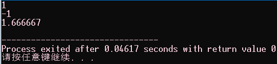
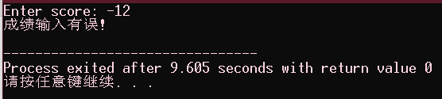
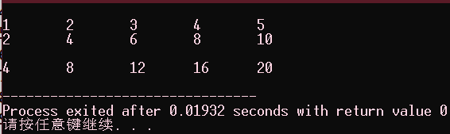
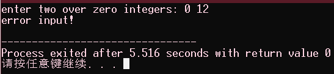

# C-book-study-谭浩强

## P5 1.4.1 例1.1

编写一个C程序，运行时输出：

> This is a C program.

```C
#include <stdio.h>
int main(void)
{
    printf("This is a C program.\n");
    return 0;
}
```


## P7 1.4.1 例1.2

求两个整数之和。

```C
#include <stdio.h>
int main(void)
{
    int a, b, sum;
    a = 123;
    b = 456;
    sum = a + b;
    printf("sum is %d.\n", sum);
    return 0;
}
```


## P8 1.4.1 例1.3

求两个整数中的较大者。

```c
 #include <stdio.h>
 int main(void)
 {
     int max(int x, int y);     
     int a, b, c;     
     scanf("%d,%d", &a, &b);     
     c = max(a, b);     
     printf("max = %d\n", c);     
     return 0; 
 } 
int max(int x, int y) 
{     
    int z;     
    if(x > y) z = x;     
    else z = y;     
    return z; 
}
```


## P14 习题

4、编写一个C程序，运行时输出：

>   Hello World!

```c
#include <stdio.h>
int main(void){
    // printf("Hello World!\n");
    puts("Hello World!");
    return 0;
}
```


5、编写一个C程序,运行时输出

```
*****
  ***** 
    *****
      *****
        *****
```

```C
#include <stdio.h>
int main(void){
    printf("*****\n");
    printf("  *****\n");
    printf("    *****\n");
    printf("      *****\n");
    printf("        *****\n");
    return 0;
}
```


6、编写一个C程序，运行时输入a,b,c三个值，输出其中值最大者

```C
#include <stdio.h>
int main(void){
    int a, b, c;
    scanf("%d %d %d", &a, &b, &c);
    if (a > b || a == b){
        if (a > c) printf("max = %d\n", a);
        else printf("max = %d\n", c);
    }
    else {
        if (b > c || b == c) printf("max = %d\n", b);
        else printf("max = %d\n", c);
    }
    return 0;
}
```


## P17 2.3 例2.1

求 1×2×3×4×5 。

```C
#include <stdio.h>
int main(void){
    int sum = 2, i = 3;
    for(i = 3; i < 6; ++i) sum*=i;
    printf("sum = %d\n", sum);
    return 0;
}
```


## P18 2.3 例2.2

有50个学生,要求输出成绩在80分以上的学生的学号和成绩。

```C
#include <stdio.h>
struct student{
    long id;
    float score;
};
int main(void){
    struct student stulist[50] = {
        {16478001, 0},
        {16478002, 2},
        {16478003, 4},
        {16478004, 6},
        {16478005, 8},
        {16478006, 10},
        {16478007, 12},
        {16478008, 14},
        {16478009, 16},
        {16478010, 18},
        {16478011, 20},
        {16478012, 22},
        {16478013, 24},
        {16478014, 26},
        {16478015, 28},
        {16478016, 30},
        {16478017, 32},
        {16478018, 34},
        {16478019, 36},
        {16478020, 38},
        {16478021, 40},
        {16478022, 42},
        {16478023, 44},
        {16478024, 46},
        {16478025, 48},
        {16478026, 50},
        {16478027, 52},
        {16478028, 54},
        {16478029, 56},
        {16478030, 58},
        {16478031, 60},
        {16478032, 62},
        {16478033, 64},
        {16478034, 66},
        {16478035, 68},
        {16478036, 70},
        {16478037, 72},
        {16478038, 74},
        {16478039, 76},
        {16478040, 78},
        {16478041, 80},
        {16478042, 82},
        {16478043, 84},
        {16478044, 86},
        {16478045, 88},
        {16478046, 90},
        {16478047, 92},
        {16478048, 94},
        {16478049, 96},
        {16478050, 98},
    };
    int i = 0;
    for(i = 0; i <= 50; ++i)
        if(stulist[i].score > 80)
            printf("%ld\n", stulist[i].id);
    return 0;
}
```


## P18 2.3 例2.3

判断2000-2500年中哪一个年是闰年，并输出结果。

>   闰年的规则:能被4但不能被100整除的年份，或者能够被400整除的年份为闰年。

```C
#include <stdio.h>
int main(void)
{
    int i = 2000, j = 0;
    for(i = 2000; i <= 2500; ++i)
    {
        if((0 == (i % 4) && 0 != (i % 100)) || (0 == (i % 400)))
        {
            printf("%d是闰年\t", i);
            ++j;
        }
        if(5 == j)
        {
            printf("\n");
            j = 0;
        }
    }
    return 0;
}
```


## P19 2.3 例2.4

求 1-$$\frac{1}{2}$$+$$\frac{1}{3}$$-$$\frac{1}{4}$$+···+$$\frac{1}{99}$$-$$\frac{1}{100}$$ 。

> 通项$$ (-1)^{n-1} × \frac{1}{n}$$

```C
#include <stdio.h>
int main(void){
    int sign = 1, i = 0;
    float sum = 0;
    for(i = 1; i <= 100; ++i){
        sum = sign*(1.0/i) + sum;
        // printf("%f\n", sign*(1.0/i));
        sign = (-1)*sign;
    }
    printf("%f\n", sum);
    return 0;
}
```


## P20 2.3 例2.5

给出一个大于或者等于3的正整数,判断它是不是一个素数。

>   素数即只能被1和本身整除的数

```C
#include <stdio.h>
int main(void){
    int num = 0, i = 0, leap = 0;
    scanf("%d", &num);
    if(num >= 3){
        for(i = 2; i < num; ++i)
            if(0 == num%i){
                leap = 1;
                break;
            }
        if(leap) printf("%d不是一个素数\n", num);
        else printf("%d是一个素数\n", num);
    }
    else printf("不符合判断条件!!!");
}
```


## P35 习题

4（1）有两个瓶子A和B，分别盛放醋和酱油，要求将他们互换（即A屏原来盛放醋，现改盛放酱油，B瓶则相反）。

```C
#include <stdio.h>
int main(void)
{
    char *A = "醋";
    char *B = "酱油";
    char *temp = "";
    printf("pre exchange: A : %s, B : %s\n", A, B);
    temp = A;
    A = B;
    B = temp;
    printf("after exchange: A : %s, B : %s\n", A, B);
    return 0;
}
```


4（2）依次将10个数输入，要求输出其中最大的数。

```C
#include <stdio.h>
#define length 10
void way_one()
{
    /*
     * 第一种方式：
     * 先从缓冲区中读取第一个值，并假设该值为最大值 max，
     * 然后依次读取剩下的值，每读取一个值都和当前的最大值 max 相比较，
     * 若是小于最大值 max 就继续读取下一个值，
     * 若是大于最大值 max 就将该值写入 max 所标识的存储空间
    */
    int max, temp, i; 

    scanf("%d", &max);
    for(i = 1; i < length; ++i)
    {
        scanf("%d", &temp);
        if(temp > max)
            max = temp;
    }

    printf("最大值 ：%d\n", max);
}
void way_two()
{
    /*
     * 第二种方式：
     * 先从缓冲区中读取数值并将读取的数值全部存放在一个数组中，
     * 使用 冒泡排序 将数组中的值按从大到小的方式排序，
     * 那么数组中第一个元素就是最大值
    */
    int num[length], i = 0, j = 0, temp = 0;

    /*
     * 接受输入的方式：
     * 1、使用 for 循环，最容易理解的循环方式
    */
    /*for(i = 0; i < length; ++i)
        scanf("%d", num+i);*/
    /*
     * 接受输入的方式：
     * 2、使用 while 循环
     *     （1）++i 自增在循环内部（这种方式与 for 循环方式差不多，
     *          但是不如 for 循环一目了然）；
     *     （2）i++ 自增在循环判断中，（这种方式不易理解，
     *          并且还要注意数组下标问题，不然很容易出现数组溢出错误）。
    */

    /*while(i < length)
    {
        scanf("%d", num+i);
        ++i;
    }*/

    /*while(i < length)
        scanf("%d", num+i++);*/

    while(i++ < length)
        scanf("%d", num+i-1);

    /*for(i = 0; i < length; ++i)
        printf("%-4d", *(num+i));
    printf("\n");*/

    /*
     * 冒泡排序     
    */
    for(i = 0; i < length - 1; ++i)
    {
        for(j = 0; j < length - i - 1; ++j)
        {
            if ( *(num+j) < *(num+j+1) )
            {
                temp = *(num+j);
                *(num+j) = *(num+j+1);
                *(num+j+1) = temp;
            }
        }
    }

    /*for(i = 0; i < length; ++i)
        printf("%-4d", *(num+i));
    printf("\n");*/

    printf("the max one is %d\n", *num);
}
int main(void)
{
    // way_one();

    way_two();

    return 0;
}
```


4（3）有3个数a，b，c，要求按大小顺序把他们输出。

```C
#include <stdio.h>
int main(void)
{
    int a = 15, b = 2, c = 5;
    if(a > b)
    {
        if(a > c)
        {
            if(b > c) printf("a=%d>b=%d>c=%d\n", a, b, c);
            else if(b < c) printf("a=%d>c=%d>b=%d\n", a, c, b);
            else if(b = c) printf("a=%d>b=%d=c=%d\n", a, b, c);
        }
        else if(a < c) printf("c=%d>a=%d>b=%d\n", c, a, b);
        else if(a == c) printf("a=%d=c=%d>b=%d\n", a, c, b);
    }
    else if(a < b)
    {
        if(b > c)
        {
            if(a > c) printf("b=%d>a=%d>c=%d\n", b, a, c);
            else if(a < c) printf("b=%d>c=%d>a=%d\n", b, c, a);
            else if(a == c) printf("b=%d>a=%d=c=%d\n", b, a, c);
        }
        else if(b < c) printf("c=%d>b=%d>a=%d\n", c, b, a);
        else if(b == c) printf("b=%d=c=%d>a=%d\n", b, c, a);
    }
    else if(a == b)
    {
        if(a > c) printf("a=%d=b=%d>c=%d\n", a, b, c);
        else if(a < c) printf("c=%d>a=%d=b=%d\n", c, a, b);
        else if(a == c) printf("a=%d=b=%d=c=%d\n", a, b, c);
    }
    return 0;
}
```


4（4）求1+2+···+100。

```C
#include <stdio.h>
#define END 100
int main(void)
{
    int i = 1, sum = 1;

    // for(i = 2; i <= 100; ++i) sum += i;

    while(i++ < END)
        sum += i;
    printf("1+2+3+···+100 = %d\n", sum);
    return 0;
}
```


4（5）判断一个数n能否同时被3和5整除。

```C
#include <stdio.h>
int main(void)
{
    int num = 0;
    scanf("%d", &num);
    if( (0 == num % 3) && (0 == num % 5)) printf("%d可以同时被3和5整除\n", num);
    else printf("%d不能同时被3和5整除\n", num);
    return 0;
}
```


4（6）将100~200之间的素数输出。

```C
#include <stdio.h>
int main(void)
{
    int i = 100, j = 0, flag = 1;
    for(i = 100; i <= 200; ++i)
    {
        for(j = 2; j < i; ++j)
        {
            if(0 == i%j)
            {
                flag = 0;
                break;
            }
        }
        if(flag) printf("%d 是一个素数！\n", i);
        // else printf("%d不是一个素数\n", num);
        flag = 1;
    }
    return 0;
}
```


4（7）求两个数m和n的最大公约数。

>   最大公约数是可以被m和n同时整除的数。

```C
#include <stdio.h>
int main(void)
{
    int m = 18, n = 12, min = 0, i = 0, flag = 0;
    min = m > n ? n : m;
    for(i = 1; i <= min; ++i)
        if( (0 == m%i) && (0 == n%i) ) flag = i;
    printf("最大公约数为 : %d\n", flag);
    return 0;
}
```


4（8）求方程式$$ax^{2}+bx+c=0$$的根。分别考虑：

① 有两个不相等的根；

② 有两个相等的根。

>   判别公式：
> 
>   ① 当$$\Delta=b^{2}-4ac>0$$时，方程有两个不相等的实根；
> 
>   ② 当$$\Delta=b^{2}-4ac=0$$时，方程有两个相等的实根；
> 
>   ③ 当$$\Delta=b^{2}-4ac<0$$时，方程根为一对共轭复根。
> 
>   求根公式：
> 
>   ① 当根为两个不相等的实根时，根为$$\frac{-b±\sqrt{b^{2}-4ac}}{2a}$$
> 
>   ② 当根为两个相等的实根时，根为$$\frac{-b}{2a}$$
> 
>   ③ 当根为一对共轭复根时，根为$$\frac{-b}{2a}i\pm\frac{\sqrt{4ac-b^{2}}}{2a}$$

```C
#include <stdio.h>
#include <math.h>
int main(void)
{
    int a, b, c; // 方程 ax^2+bx+c=0 的三个系数
    int delta;
    scanf("%d %d %d", &a, &b, &c);
    delta = pow(b, 2) - 4*a*c;
    if(delta > 0)
    {
        double temp1, temp2;
        temp1 = ( (double)(-b) + sqrt(delta) ) / (double)(2*a);
        temp2 = ( (double)(-b) - sqrt(delta) ) / (double)(2*a);
        printf("%dx^2+%dx+%d=0 有两个不相等的根\n", a, b, c);
        printf("%dx^2+%dx+%d=0 的根为 %.2f, %.2f\n", a, b, c, temp1, temp2);
    }
    else if(0 == delta)
    {
        double temp;
        temp = (double)(-b) / (double)(2*a);
        printf("%dx^2+%dx+%d=0 有两个相等的根\n", a, b, c);
        printf("%dx^2+%dx+%d=0 的根为 %.2f\n", a, b, c, temp);
    }
    else if(delta < 0)
    {
        double temp1, temp2;
        temp1 = (double)(-b) / (double)(2*a);
        temp2 = (double)(sqrt(-delta)) / (double)(2*a);
        printf("%dx^2+%dx+%d=0 有一对共轭复根\n", a, b, c);
        printf("%dx^2+%dx+%d=0 的根为 %.2fi+%.2f, %.2fi-%.2f\n", a, b, c, temp1, temp2, temp1, temp2);
    }
    return 0;
}
```


8、输出1900~2000年中是闰年的年份，符合下列两个条件之一的年份是闰年：

① 能被4整除但是不能被100整除；

② 能被100整除且能被400整除。

```C
#include <stdio.h>
int main(void)
{
    int i = 0;
    for(i = 1900; i < 2000; ++i)
        if((0 == i%4 && 0 != i%100) || (0 == i%100 && 0 == i%400))
            printf("%d是闰年!\n", i);
    return 0;
}
```


## P37 3.1 例3.1

>   有人用温度计测试出用华氏法表示的温度（如64℉），今要求把它转化为以摄氏度表示的温度（如17.8℃）。
> 
>   转换公式：$$摄氏温度=\frac{5}{9}*(华氏温度-32)$$

```C
#include <stdio.h>
int main(void)
{
    float f, c;
    f = 64.0F;
    c = (float)(5.0 / 9.0 * (f - 32));
    printf("f = %.2f\nc = %.2f\n", f, c);
    return 0;
}
```


## P38 3.1 例3.2

>   计算存款利息。有 1000 元，想要存一年。有3种方式可选：
> 
>   （1）活期，年利率为0.0036；
> 
>   （2）一年期定期，年利率为0.0225
> 
>   （3）存两次半年定期， 年利率为0.0198；
> 
>   请分别计算出一年后，按三种方式所得到的本息和。
> 
>   $$一年本息和=本金*（1+年利率）$$
> 
>   $$半年的本息和=本金*（1+\frac{年利率}{2}）$$

```C
#include <stdio.h>
int main(void)
{
    float p0 = 1000.0F, r1 = 0.0036F, r2 = 0.0225F, r3 = 0.0198F, p1 = 0.0F, p2 = 0.0F, p3 = 0.0F;
    p1 = (float)(p0 * (1 + r1));
    p2 = (float)(p0 * (1 + r2));
    p3 = (float)(p0 * (1 + r3 / 2) * (1 + r3 / 2));
    printf("p1 = %.2f\np2 = %.2f\np3 = %.2f\n", p1, p2, p3);
    return 0;
}
```


## P47 3.2.3 测试整型变量溢出

> 对于`short`类型变量，其存储的整数范围为**-32768~+32767**，若是存储一个超出此范围的整数，则会出现溢出。

```C
#include <stdio.h>
int main()
{
    short i = 0, j = -0, k = 32767, l = 32768;
    short r = k + 1;
    short m = 32769;
    short n = 0x8000; // 对应十进制的 32768
    printf("%d, %d, %d, %d, %d, %d\n", i, j, k, l, k+1, r);
    printf("%d, %d\n", m, n);
    return 0;
}
```


> 对于以上程序有两种分析方式（这里假设`int`类型的存储空间为4个字节（32位），`short`类型的存储空间为2个字节（16位））：
> 
> （1）从二进制的原码、反码、补码的角度分析
> 
> 首先在 C 语言中，整型常量是`int`类型的（当`int`类型容量不够大时，会使用`long`、`long long`等类型）
> 
> 0 ：0 （二进制形式）
> 
>    ：0000 0000 0000 0000 0000 0000 0000 0000 （存储时的二进制形式，即原码）
> 
>    ：0000 0000 0000 0000 0000 0000 0000 0000 （补码，正数的补码就是原码）
> 
>    ：                                   0000 0000 0000 0000 （`short i = 0;`截取16位，存放至变量`i`对应的存储空间中）
> 
> -0 ：0 （绝对值，二进制形式）
> 
> ​    ：1000 0000 0000 0000 0000 0000 0000 0000 （存储时的二进制形式，即原码）
> 
> ​    ：1111 1111 1111 1111 1111 1111 1111 1111 （符号位不变，其余位按位取反，反码）
> 
> ​    ：1 0000 0000 0000 0000 0000 0000 0000 0000 （整体+1，补码）
> 
> ​    ：  0000 0000 0000 0000 0000 0000 0000 0000 （`int`类型，截取32位）
> 
> ​    ：                                     0000 0000 0000 0000 （`short j = -0;`截取16位，存放至变量`j`对应的存储空间中）
> 
> ==在补码形式下，`0`和`-0`具有相同的补码。==
> 
> 32767 ：111 1111 1111 1111（二进制形式）
> 
> ​           ：0000 0000 0000 0000 0111 1111 1111 1111 （存储时的二进制形式，即原码）
> 
> ​           ：0000 0000 0000 0000 0111 1111 1111 1111 （补码，正数的补码就是原码）
> 
> ​           ：                                   0111 1111 1111 1111 （`short k = 32767`，截取16位，存放至变量`k`对应存储空间中）
> 
> 32768：1000 0000 0000 0000 （二进制形式）
> 
> ​          ：0000 0000 0000 0000 1000 0000 0000 0000 （存储时的二进制形式，即原码）
> 
> ​          ：0000 0000 0000 0000 1000 0000 0000 0000 （补码，正数的补码就是原码）
> 
> ​          ：                                   1000 0000 0000 0000 （`short l = 32768;`，截取16位，存放至变量`l`对应的存储空间中）
> 
> 但是变量`l`的最高位此时为`1`，对于有符号的变量而言，最高位是符号位，`1`代表负值，`0`代表正值；
> 
> 1000 0000 0000 0000（补码）
> 
> 1111 1111 1111 1111（符号位不变，其余位按位取反，反码）
> 
> 1 0000 0000 0000 0000（整体+1，原码）
> 
>    0000 0000 0000 0000（只保留低位16位）= 0
> 
> ==分析到这里，可以发现，通过二进制原码、补码、反码的方式分析，没有办法得出变量`i = -32768`==
> 
> ==实际上，这里由于`0`和`-0`拥有相同的补码，而补码中的`1000 0000 0000 0000`就多了出来，为了不浪费，人为规定了`1000 0000 0000 0000`就是`-32768`==
> 
> 因此变量`i = -32768`。
> 
> 32769：1000 0000 0000 0001 （二进制形式）
> 
> ​          ：0000 0000 0000 0000 1000 0000 0000 0001 （存储时的二进制形式，即原码）
> 
> ​          ：0000 0000 0000 0000 1000 0000 0000 0001 （补码，正数的补码就是原码）
> 
> ​           ：                                   1000 0000 0000 0001 （`short l = 32769;`，截取16位，存放至变量`l`对应的存储空间中）
> 
> 但是变量`l`的最高位此时为`1`，对于有符号的变量而言，最高位是符号位，`1`代表负值，`0`代表正值；
> 
> 1000 0000 0000 0001
> 
> 0111 1111 1111 1110（按位取反）
> 
> 0111 1111 1111 1111（+1） = 32767
> 
> 因此变量`i = -32767`。
> 
> （2）从溢出的上下限角度分析
> 
> 对于`short`类型的变量，其上下限为**-32768~+32767**
> 
> 因此`short k = 32768;`，$$k=32768-32768-32768=-32768$$，
> 
> `short l = 32769;`，$$l=32769-32768-32768=-32767$$。

## P53 3.3.1 测试运算符示例1

> 逻辑运算符`&&`和`!`

```C
#include <stdio.h>
int main()
{
    int i = 10, k = 20, m;
    m = (11 > i) && (k = 8);
    printf("m = %d, k = %d\n", m, k); // m = 1, k = 8

    m = (11 > i) && (k = 0);
    printf("m = %d, k = %d\n", m, k); // m = 0, k = 0

    m = (7 > i) && (k = 8);
    printf("m = %d, k = %d\n", m, k); // m = 0, k = 20

    m = !i;
    printf("m = %d\n", m); // m = 0
    return 0;
}
```


> 1、对于`m = (11 > i) && (k = 8);`：
> 
> `(11 > i)`是$$11 > 10$$结果为真（1），由于赋值运算符的结果为其右侧的值，因此`k = 8`的结果为 8 ，因此`(11 > i) && (k = 8)`实际上就是`1 && 8`，在C语言中，非0即为真（1），因此`1 && 8`结果为真（1），所以`m = 1`。
> 
> 2、对于`m = (11 > i) && (k = 0);`：
> 
> `k = 0`的结果为 0 ，因此`m = (11 > i) && (k = 0);`实际上就是`1 && 0`，由于`&&`运算符两侧的运算对象必须都是真（非 0），运算结果才是真（1），所以`m = 0`。
> 
> 3、对于`m = (7 > i) && (k = 8);`
> 
> `(7 > i)`就是$$7 > 10$$结果为假（0），由于`&&`运算符在运算时，只有当其左侧的运算对象为真（非0）时，才会处理其右侧的运算对象，因此左侧为假（0），那么就不会处理右侧的运算对象，所以`m=0`而变量`k`的值不变。
> 
> 4、对于`m = !i;`
> 
> 当`!`运算符右侧的运算对象为真（非0）时，运算结果为假（0）；当右侧的运算对象为假（0）时，运算结果为真（1），所以`m = 0`。

## P53 3.3.1 测试运算符示例2

> 位运算符`>>`、`<<`、`~`、`^`、`|`

```C
#include <stdio.h>
int main () {
    char a = 60;
    char b = -13;
    char c = 30;
    /*
        a    = 0011 1100 （二进制形式）
               0011 1100 （正数的二进制，即二进制补码）
        a>>2 = 0000 1111 = 60 / (2 * 2) = 15 (正数移位补0)
        a<<2 = 1111 0000 = 60 *2 *2 = 240
    */
    // 正数的右移、左移,最高位为数值位
    printf("a>>2 = %d\n", a>>2); // 15
    printf("a<<2 = %d\n", a<<2); // 240
    /*
        b    = 1000 1101 (二进制)
               1111 0010 (符号位不变,其余位按位取反,反码)
               1111 0011 (整体加1,负数补码)
        b>>2 = 1111 1100 （负数移位高位补1）
               1000 0011 （符号位不变,其余位按位取反,反码）
               1000 0100 （整体加1,负数原码）
        b    = 1000 0100 = -4
        b<<2 = 1100 1100 （负数移位高位补0）
               1011 0011 (符号位不变,其余位按位取反,反码)
               1011 0100 (整体加1,负数原码)
        b    = 1011 0100 = -52
    */
    // 负数的右移、左移,最高位为符号位
    printf("b>>2 = %d\n", b>>2); // -4
    printf("b<<2 = %d\n", b<<2); // -52
    /*
        a  = 0011 1100
             0011 1100 （二进制补码）
        ~a = 1100 0011 （二进制补码）
             1011 1100 (符号位不变,其余位按位取反,反码)
             1011 1101 (整体加1,负数原码)
        a  = 1011 1101 = -61
    */
    printf("~a = %d\n", ~a); // -61
    /*
        b  = 1000 1101
             1111 0010 (符号位不变,其余位按位取反,反码)
             1111 0011 (整体加1,负数补码)
        ~b = 0000 1100 (二进制补码) = 12
    */
    printf("~b = %d\n", ~b); // 12
    /*
        a   = 0011 1100 (二进制补码)
        b   = 1111 0011 (二进制补码)
        a|b = 1111 1111 (二进制补码)
              1000 0001 = -1
    */
    printf("a|b = %d\n", a|b); // -1
    /*
        a    = 0011 1100 (二进制补码)
        c    = 0001 1110 (二进制补码)
        a|c = 0011 1110 (二进制补码) = 62
    */
    printf("a|c = %d\n", a|c); // 62
    /*
        a   = 0011 1100 (二进制补码)
        b   = 1111 0011 (二进制补码)
        a^b = 1100 1111 (二进制补码)
              1011 0001 = -49
    */
    printf("a^b = %d\n", a^b); // -49
    /*
        a    = 0011 1100 (二进制补码)
        c    = 0001 1110 (二进制补码)
        a^c = 0010 0010 (二进制补码) = 34
    */
    printf("a^c = %d\n", a^c); // 34
    return 0;
}
```


## P53 3.3.1 测试运算符示例3

> 逗号运算符`,`

```C
#include <stdio.h>
int main()
{
    int i = 0, j = 2;
    i = (j++, ++j, j + 2, j - 3);
    // 3 , 4 , 4+2=6, 4-3=1
    printf("i = %d\n", i); // 1
    return 0;
}
```


> 在一条C语句中，使用逗号运算符分隔多个表达式，那么表达式从左至右依次处理，最右侧的表达式的值，将作为整个逗号运算符最终的结果。
> 
> 对于`j++, ++j, j + 2, j - 3`，`j - 3`为最右侧的表达式，其运算结果就是`j++, ++j, j + 2, j - 3`的值。

## P53 3.3.1   测试运算符示例4

> 除法运算符`/`

```C
#include <stdio.h>
int main()
{
    printf("%d\n", 5/3); // 1
    printf("%d\n", -5/3); // -1
    printf("%f\n", 5.0/3); // 1.666667
    return 0;
}
```



> 使用`/`运算，若两侧的运算对象为整数，那么运算结果就是这两个整数的商，但是不保留余数部；若两侧的运算对象是浮点数，那么运算结果为商，则保留一定精度的小数。

## P54 3.3.5 例3.3

>   给定一个大写字母，要求使用小写字母输出。
> 
>   **字母 A 的ANSII码为 65 ，字母 a 的ANSII码为 97，两者之间相差 32**

```C
#include <stdio.h>
int main(void)
{
    char c1, c2;
    c1 = 'A';
    c2 = (char)(c1+32);
    printf("%c\n%d", c2, c2);
    return 0;
}
```


## P58 3.4.2 例3.4

>   给出三角形的三边长，求三角形的面积。
> 
>   假设三角形的三边长为a，b， c，则$$面积=\sqrt{s×(s-a)(s-b)(s-c)}),其中s=\frac{a+b+c}{2}$$

```C
#include <stdio.h>
#include <math.h>
int main(void)
{
    double a, b, c, s, area;
    a = 3.67;
    b = 5.43;
    c = 6.21;
    s = (a+b+c)/2;
    area = sqrt(s*(s-a)*(s-b)*(s-c));
    printf("a=%.2f, b = %.2f, c = %.2f\n", a, b, c);
    printf("area = %.2f\n", area);
    return 0;
}
```


## P64 3.5.1 例3.5

>   求$$ax^{2}+bx+c=0$$的方程的根。a，b，c，由键盘输入，设$$b^{2}-4ac>0$$。
> 
>    当$\Delta=b^{2}-4ac>0$时，方程有两个不相等的实根，根为$$\frac{-b±\sqrt{b^{2}-4ac}}{2a} $$

```C
#include <stdio.h>
#include <math.h>
int main(void)
{
    double a, b, c, disc, x1, x2, p, q;
    scanf("%lf%lf%lf", &a, &b, &c);
    disc = b * b - 4 * a * c;
    p = -b / (2.0 * a);
    q = sqrt(disc) / (2.0 * a);
    x1 = p + q;
    x2 = p - q;
    printf("x1 = %7.2f\nx2 = %7.2f\n", x1, x2);
    return 0;
}
```


## P70 3.5.3 例3.6

>   使用`%f`输出实数，只能得到6位小数。

```C
#include <stdio.h>
int main(void)
{
    double a = 1.0;
    printf("%f\n", a/3);
    return 0;
}
```


## P70 3.5.3 例3.7

>   `float`类型数据的有效位。

```C
#include <stdio.h>
int main(void)
{
    float a;
    a = 10000 / 3.0;
    printf("%f\n", a); // 虽然有 7 位数是符合的,但是只有从左至右的 6~7 位可以确保正确
    return 0;
}
```


## P73 3.5.3 测试 printf 示例1

>   对于`printf("%*.*d\n", a);printf("%*.*d\n", m, n, a);`

```C
#include <stdio.h>
int main()
{
    int a = 123;
    double b = 123.456789;
    int m = 5, n = 2;
    // 指定变量a的域宽为5个单位宽度
    printf("%5d\n", a);
    printf("%*d\n", m, a);
    // 指定变量a的域宽为5个单位宽度,且在域内左对齐
    printf("%-5d\n", a);
    printf("%-*d\n", m, a);
    // 指定变量b的域宽为5点单位宽度,其中小数部分占2位
    printf("%5.2f\n", b);
    printf("%*.*f\n", m, n, b);
    // 指定变量b的域宽为5点单位宽度,其中小数部分占2位,且在域内左对齐
    printf("%-5.2f\n", b);
    printf("%-*.*f\n", m, n, b);
    return 0;
}
```


>   对于修饰符`*`用在转换说明中，可以指定输出时的域宽和精度，而不是直接在转换说明中直接使用固定的数值，可以使程序更加的灵活。

## P73 3.5.3 测试 printf 示例2

> 对于`printf("%%d\n");`

```C
#include <stdio.h>
int main()
{
    printf("%%d\n");
    return 0;
}
```


> 符号`%`是转换说明的一部分，但是同样他也是一个需要被应用于其他的符号，所以在`printf()`函数中，使用`%%`就可以输出一个`%`。

## P73 3.5.3 测试 printf 示例3

> 对于`printf("%hhd, %hd, %d, %ld\n", a, b, c, d);`

```C
#include <stdio.h>
int main()
{
    char ch = 127;
    short a = 32767;
    int b = 2147483647;
    long c = 2147483647;
    printf("%hhd, %hhd, %hd\n", ch, ch+1, ch+1);
    printf("%hd, %hd, %d\n", a, a+1, a+1);
    printf("%d, %d, %ld\n", b, b+1, b+1);
    printf("%ld, %ld, %lld\n", c, c+1, c+1);
    return 0;
    return 0;
}
```


> `%hhd`是以有符号十进制整数输出`char`类型变量；
> 
> `%hd`是以有符号十进制整数输出`short`类型变量；
> 
> `%d`是以有符号十进制整数输出`int`类型变量；
> 
> `%ld`是以有符号十进制整数输出`long`类型变量；
> 
> `%lld`是以有符号十进制整数输出`long`类型变量。

## P73 3.5.3 测试 printf 示例4

> 对于`printf("%f, %#f, %e, %E, %#e, %#E, %g, %G, %#g, %#G\n");`

```C
#include <stdio.h>
int main(void)
{
    float k = 30.0F;
    float l = 40.0F;
    float m = 50.50F;
    float n = 60.0F;
    float o = 70.787F;

    printf("%f, %#f, %f, %#f\n", k, k, -k, -k);
    printf("%e, %E, %e, %E\n", l, l, -l, -l);
    printf("%E, %#E, %E, %#E\n", m, m, -m, -m);
    printf("%g, %G, %g, %G\n", n, n, -n, -n);
    printf("%#g, %#G, %#g, %#G\n", o, o, -o, -o);
    return 0;
}
```


> 对于浮点数，有多种方式输出，对于`%f`在没有任何修饰符的情况下，默认输出小数点后6位；
> 
> 对于`%e`和`%E`是以科学计数法输出浮点数，其中默认数值部分输出小数点后6为，指数部分默认输出3位有效数字；
> 
> 对于`%g`和`%G`是取`%f`和`%e`或者`%E`中最简洁的方式输出，且没有小数时，默认不输出小数部分。

## P73 3.5.3 测试 printf 示例5

> 对于`printf("%d\n%d\n%d\n%d\n%d\n%d\n",++i,--i,i++,i--,-i++,-i--);`

```C
#include <stdio.h>
int main(){

    int i = 8;
    int j = 8;
    int k = 8;

    printf("%d\n%d\n%d\n%d\n%d\n%d\n",++i,--i,i++,i--,-i++,-i--);
    // 8
    // 8
    // 7
    // 8
    // -7
    // -8

    printf("-j--=%d\n",-j--); //-j = -8, j = j - 1 = 7 ---- -8
    printf("-j++=%d\n",-j++); //-j = -7, j = j + 1 = 8 ---- -7
    printf("j--=%d\n",j--);   //j  = 8,  j = j - 1 = 7 ---- 8
    printf("j++=%d\n",j++);   //j  = 7,  j = j + 1 = 8 ---- 7
    printf("--j=%d\n",--j);   //j = j - 1 = 7 ----- 7
    printf("++j=%d\n",++j);   //j = j + 1 = 8 ----- 8

    printf("++k=%d\n",++k);  // k = k + 1 = 9 ---- 9
    printf("--k=%d\n",--k);  // k = k - 1 = 8 ---- 8
    printf("k++=%d\n",k++);  // k = 8, k = k + 1 = 9 ---- 8
    printf("k--=%d\n",k--);  // k = 9, k = k - 1 = 8 ---- 9
    printf("-k++=%d\n",-k++);// -k = -8, k = k + 1 = 9 ---- -8
    printf("-k--=%d\n",-k--);// -k = -9, k = k - 1 = 8 ---- -9

    return 0;
}
```


> `printf()`函数由于在不同的编译系统中实现的方式不一定相同，
> 
> （1）计算顺序不一定相同：**从左至右**、**从右至左**两种方式；
> 
> （2）入栈的顺序不一定相同：**边计算边入栈**、**先计算后一次性入栈**两种方式。
> 
> 对于`printf("%d\n%d\n%d\n%d\n%d\n%d\n",++i,--i,i++,i--,-i++,-i--);`在不同的编译系统中输出的结果不一定相同：
> 
> 1、在**从右至左**、**边计算边入栈**的编译系统中：
> 
> `temp1 = -i; push temp1;`
> 
> `temp2 = -i; push temp2;`
> 
> `temp3 = i; push temp3;`
> 
> `temp4 = i; push temp4;`
> 
> `--i; push i;`
> 
> `++i; push i;`
> 
> `i--;`
> 
> `i++;`
> 
> `i--;`
> 
> `i++;`
> 
> 此时入栈的顺序为：`temp1`、`temp2`、`temp3`、`temp4`、`i`、`i`即-8，-8，8，8，7，8
> 
> 故出栈的顺序为（即`printf()`函数输出的顺序）：8，7，8，8，-8，-8
> 
> 2、在**从右至左**、**先计算后一次性入栈**的编译系统中：
> 
> `temp1 = -i; i--;`
> 
> `temp2 = -i; i++;`
> 
> `temp3 = i; i--;`
> 
> `temp4 = i; i++;`
> 
> `--i;`
> 
> `++i;`
> 
> `push temp1;`
> 
> `push temp2;`
> 
> `push temp3;`
> 
> `push temp4;`
> 
> `push i;`
> 
> `push i;`
> 
> 此时入栈的顺序为：`temp1`、`temp2`、`temp3`、`temp4`、`i`、`i`即-8，-7，8，7，8，8
> 
> 故出栈的顺序为（即`printf()`函数输出的顺序）：8，8，7，8，-7，-8
> 
> ==因此在`printf()`函数的参数列表中，避免出现对同一变量的赋值运算、或者自增、自减运算==

## P75 3.5.4 测试 scanf 示例1

>   对于`scanf("%c", &a);scanf("%c", &b);scanf("%c", &c);`读取三个字符

```C
#include <stdio.h>
int main(void)
{
    char a, b, c;
    scanf("%c", &a);
    scanf("%c", &b);
    scanf("%c", &c);
    printf("a=%c,b=%c,c=%c\n", a, b, c);
    return 0;
}
```


> 1、当每输入一个字符就按下一次回车（`\n`），`scanf()`一样会将回车（`\n`）当做第二字符进行读取，并存储到存储空间；这里对于`scanf()`函数而言，其实输入的内容为`x\ny\nz\n`六个字符，但是由于只指定读取三个字符，因此前三个字符被读取并被存储。
> 
> 2、当输入`x y z`使用空格分隔，`scanf()`会将空格当做第二字符进行读取，并存储到存储空间；这里对于`scanf()`函数而言，其实输入的内容为`x y z\n`六个字符，但是由于只指定读取三个字符，因此前三个字符被读取并被存储。
> 
> 3、当直接输入`xyz`且不使用空格分隔，`scanf()`可以正常读取这三个字符，并存储到指定存储空间；这里对于`scanf()`函数而言，其实输入的内容为`xyz\n`四个字符，但是由于只指定读取三个字符，因此前三个字符被读取并被存储。

## P75 3.5.4 测试 scanf 示例2

>   对于`scanf("%c%c%c", &a, &b, &c);`这样的方式读取输入的三个字符

```C
#include <stdio.h>
int main(void)
{
    char a, b, c;
    scanf("%c%c%c", &a, &b, &c);
    printf("a=%c,b=%c,c=%c\n", a, b, c);
    return 0;
}
```


>   1、当直接输入`xyz`且不使用空格分隔，`scanf()`可以正常读取这三个字符，并存储到指定存储空间；这里对于`scanf()`函数而言，其实输入的内容为`xyz\n`四个字符，但是由于只指定读取三个字符，因此前三个字符被读取并被存储。
> 
>   2、当输入`x y z`使用空格分隔，`scanf()`会将空格当做第二字符进行读取，并存储到存储空间；这里对于`scanf()`函数而言，其实输入的内容为`x y z\n`六个字符，但是由于只指定读取三个字符，因此前三个字符被读取并被存储。
> 
>   3、当每输入一个字符就按下一次回车（`\n`），`scanf()`一样会将回车（`\n`）当做第二字符进行读取，并存储到存储空间；这里对于`scanf()`函数而言，其实输入的内容为`x\ny\nz\n`六个字符，但是由于只指定读取三个字符，因此前三个字符被读取并被存储。

## P75 3.5.4 测试 scanf 示例3

> 对于`scanf("%d", &a);scanf("%d", &b);scanf("%d", &c);`读取三个整数

```C
#include <stdio.h>
int main(void)
{
    int a, b, c;
    scanf("%d", &a);
    scanf("%d", &b);
    scanf("%d", &c);
    printf("a=%d,b=%d,c=%d\n", a, b, c);
    return 0;
}
/* 在scanf();中格式控制符%d%d%d是连在一起的,但是在实际输入的时候,三个整数两两之间需要使用空格分隔,否则编译器无法区分输入的是三个整数还是一个整数,或者每输入一个整数就按一次回车键也可以让编译器正确区分输入的是三个整数 */
```


> 1、当直接输入三个整数，但既不使用空格分隔，也不使用回车（`\n`）分隔，`scanf()`没有办法将这三个数准确区分并存储；这里对于`scanf()`函数而言，其实输入的内容为`102030\n`一个整数一个字符，这里只读取并存储了一个整数。
> 
> 2、当每输入一个整数就按下一次回车（`\n`），`scanf()`可以将三个整数进行读取，并存储到存储空间；这里对于`scanf()`函数而言，其实输入的内容为`102030\n2030\n30\n`三个整数三个字符，这里三个整数并读取，而用来分隔整数的回车（`\n`）被`scanf()`直接舍弃。
> 
> 3、当输入三个整数，且使用空格分隔时，`scanf()`可以将三个整数进行读取，并存储到存储空间；这里对于`scanf()`函数而言，其实输入的内容为`10 20 30\n`三个整数三个字符，这里三个整数并读取，而用来分隔整数的空格被`scanf()`直接舍弃。

## P75 3.5.4 测试 scanf 示例4

>   对于`scanf("%d,%d", &a, &b);scanf("c=%d", &c);`读取三个整数

```C
#include <stdio.h>
int main(void)
{
    int a = 1, b = 2, c = 3;
    scanf("%d,%d", &a, &b);
    scanf("c=%d", &c);
    printf("a=%d,b=%d,c=%d\n", a, b, c);
    return 0;
}
```


> 1、当输入三个整数，整数之间使用空格分隔时，`scanf()`只读取了一个整数，并存储到存储空间；这里对于`scanf()`函数而言，其实输入的内容为`10 20 30\n`三个整数三个字符，但是根据`scanf("%d,%d", &a, &b);`第一个整数后面有一个`,`，但是输入的内容中第一个整数后面是一个空格，于是`scanf()`判定之后的读取不合法，并将读取到的空格又放回了缓冲区，于是`scanf("c=%d", &c);`读取的第一项应该字符`c`但是读取到的是一个空格，同样`scanf()`判定读取不合法，并将读取到的空格又放回了缓冲区，因此只有变量`a`并赋值，而变量`b`和`c`由于`scanf()`判定读取不合法，并没有被赋值。
> 
> 2、每输入一个整数就按下一次回车（`\n`），`scanf()`只读取了一个整数，并存储到存储空间；这里对于`scanf()`函数而言，其实输入的内容为`10\n`一个整数一个字符，但是根据`scanf("%d,%d", &a, &b);`第一个整数后面有一个`,`，但是输入的内容中第一个整数后面是一个回车（`\n`），于是`scanf()`判定之后的读取不合法，并将读取到的回车（`\n`）又放回了缓冲区，于是`scanf("c=%d", &c);`读取的第一项应该字符`c`但是读取到的是一个空格，同样`scanf()`判定读取不合法，并将读取到的空格又放回了缓冲区，因此只有变量`a`被赋值，而变量`b`和`c`由于`scanf()`判定读取不合法，并没有被赋值。
> 
> 3、当输入三个整数，前两个整数使用`,`分隔，后两个整数使用回车（`\n`）分隔，这时`scanf()`读取了两个整数，并存储到存储空间；这里对于`scanf()`函数而言，其实输入的内容为`10,20\n`，根据`scanf("%d,%d", &a, &b);scanf("c=%d", &c)`第一个整数后面是`,`第二个整数后面是字符`c`，但是输入的内容中第二个整数后面是一个回车（`\n`），于是`scanf()`判定之后的读取不合法，并将读取到的回车（`\n`）又放回了缓冲区，因此变量`a`和`b`被赋值，而变量`c`由于`scanf()`判定读取不合法，并没有被赋值。

## P75 3.5.4 测试 scanf 示例5

>   对于`scanf("%*d %d %d %*d", &a, &b, &c, &d);`

```C
#include <stdio.h>
int main(void)
{
    int a = 1, b = 2, c = 3, d = 4;
    scanf("%*d %d %d %*d", &a, &b, &c, &d);
    printf("%d, %d, %d, %d\n", a, b, c, d);
    return 0;
}
```


>   由于`*`修饰符的存在，`scanf()`函数虽然会按照规则正常的读取数据，但是与带有`*`的格式字符相对应的数据会被舍弃，不会被存储到存储空间中。

## P76 3.5.5 例3.8

>   依次输出`BOY`三个字符。

```C
#include <stdio.h>
int main(void)
{
    char a = 'B', b = 'O', c = 'Y'; // char a = 66, b = 79, c = 89;
    putchar(a);
    putchar(b);
    putchar(c);
    putchar('\n');
    return 0;
}
```


## P78 3.5.5 例3.9

>   键盘输入三个字符`BOY`，然后再将它们依次输出。

```C
#include <stdio.h>
int main(void)
{
    char a, b, c;
    a = getchar();
    b = getchar();
    c = getchar();
    putchar(a);
    putchar(b);
    putchar(c);
    putchar('\n');
    /*
    getchar(putchar());
    getchar(putchar());
    getchar(putchar());
    getchar(putchar());
    */
    return 0;
}
```


## P79 3.5.5 例3.10

>   从键盘输入一个任意的大写字母，然后输出对应的小写字母。

```C
#include <stdio.h>
int main(void)
{
    char c1, c2;
    c1 = getchar();
    c2 = c1 + 32;
    putchar(c2);
    putchar('\n');
    return 0;
}
```


## P80 习题

1、假如我国国民生产总值的年增长率为7%，计算10年后我国国民生产总值与现在相比增长多少百分比。计算公式为$$p=(1+r)^{n}$$，其中r为年增长率，n为年数，p为与现在相比的倍数。

```C
#include <stdio.h>
#include <math.h>
int main(void)
{
    double p = 0.0, r = 0.07;
    int n = 10;
    p = pow(1 + r, n);
    printf("%.3f\n", p);
    return 0;
}
```


2、存款利息的计算。有1000元，想要存5年，有以下5种办法存：

（1）一次性存5年；

（2）先存2年期，到期后将本息再存3年期；

（3）先存3年期，到期后将本息再存2年期；

（4）存1年期，到期后将本息再存1年期，连续存5次；

（5）存活期存款。活期存款利息每一季度结算一次。

现2017年的银行存款利息如下：

（1）1年期定期存款利息为1.5%；

（2）2年期定期存款利息为2.1%；

（3）3年期定期存款利息为2.75%；

（4）5年期定期存款利息为3%；

（5）活期存款利息为0.35%（活期存款每一季度结算一次利息）。

若 r 为年利率，n 为存款年数，则计算本息和的公式如下：

（1）1年期本息和：$$p=1000×(1+r)$$；

（2）n年期本息和：$$p=1000×(1+n×r)$$；

（3）存n次1年期的本息和：$$p=1000×(1+r)^{n}$$；

（4）存n年期活期存款本息和：$$p=1000×(1+\frac{r}{4})^{4n}$$。

```C
#include <stdio.h>
#include <math.h>
int main(void)
{
    double money = 1000.0, salary[5] = {0.0}, r0 = 0.0035, r1 = 0.015, r2 = 0.021, r3 = 0.0275, r5 = 0.03;
    int i = 0;
    // 一次性存5年期定期存款
    salary[0] = money * (1 + 5 * r5);
    // 先存2年定期存款,再存3年定期存款
    salary[1] = money * (1 + 2 * r2) * (1 + 3 * r3);
    // 先存3年定期存款,再存2年定期存款
    salary[2] = money * (1 + 3 * r3) * (1 + 2 * r2);
    // 连续存5次1年期定期存款
    salary[3] = money * pow((1 + r1), 5);
    // 存5年期活期存款
    salary[4] = money * pow((1 + r0 / 4), 4 * 5);

    printf("一次性存5年期定期存款的本息和: %.4f\n", salary[0]);
    printf("先存2年定期存款,再存3年定期存款的本息和: %.4f\n", salary[1]);
    printf("先存3年定期存款,再存2年定期存款的本息和: %.4f\n", salary[2]);
    printf("连续存5次1年期定期存款的本息和: %.4f\n", salary[3]);
    printf("存5年期活期存款的本息和: %.4f\n", salary[4]);

    return 0;
}
```


3、购房从银行贷了一笔款d，准备每月还款额为p，月利率为r，计算多少月能还清。设d为300000元，p为6000元，r为1%。对求得的月份取小数点后一位，对第2位按四舍五入处理。

>   计算还清月数m的公式为：$$m=\frac{logp-log(p-d×r)}{log(1+r)}$$。

```C
#include <stdio.h>
#include <math.h>
#define d 300000 // 贷款额度
#define p 6000 // 每月还款金额
#define r 0.01 // 月利率
int main(void)
{
    double part = 0.0, res = 0.0;
    part = p / (p - d * r);
    res = log(part) / log(1 + r);
    printf("还清贷款的月数为: %.1f", res);
    return 0;
}
```


4、分析下面的程序：

```C
#include <stdio.h>
int main(void)
{
    char c1, c2;
    c1 = 97;
    c2 = 98;
    printf("c1=%c,c2=%c\n", c1, c2);
    printf("c1=%d,c2=%d\n", c1, c2);
    return 0;
}
```

（1）运行时会输出什么信息？为什么？

（2）如果将程序第4，5行改为`c1=197; c2=198;`运行时会输出什么？为什么？

（3）如果将程序的第3行改为`int c1,c2;`运行时会输出什么？为什么？

>   c1=a,c2=b
> 
>   c1=97,c2=98

为什么？不为什么。

>   c1=?c2=?
> 
>   c1=-59,c2=-58

为什么？`c1`和`c2`是`char`类型，能够存储的最大整数值为`127`，而`197`和`198` 都是大于`127`的整数值，因此会导致整数上溢，从而出现`197-128-128=-59,198-128-128=-58`的结果。

>   c1=a,c2=b
> 
>   c1=97,c2=98

为什么？

5、用下面的`scanf()`函数输入数据，使`a=3,b=7,x=8.5,y=71.82,c1='A',c2='a'`。在键盘上应如何输入。

```C
#inclde <stdio.h>
int main(void)
{
    int a, b;
    float x, y;
    char c1, c2;
    scanf("a=%db=%d",&a,&b);
    scanf("%f%e",&x,&y);
    scanf("%c%c",&c1,&c2);
    return 0;
}
```

>   a=3b=7 8.5 71.82 Aa

6、请编程序将“China”译成密码，密码规律是：用原来的字母后面第4个字母代替原来的字母。例如，字母“A”后面第4个字母是“E”，用“E”代替“A”。因此，“China”应译为“Glmre”。请编写一程序，用赋值的方法使c1，c2，c3，c4，c5这5个变量的值分别为‘C’，‘h’，‘i’，‘n’，‘a’，经过运算，使c1，c2，c3，c4，c5分别变成‘G’，‘l’，‘m’，‘r’，‘e’。分别用`putchar()`函数和`printf()`函数输出这5个字符。

```C
#include <stdio.h>
int main(void)
{
    char c1, c2, c3, c4, c5;
    c1 = 'C';
    c2 = 'h';
    c3 = 'i';
    c4 = 'n';
    c5 = 'a';
    c1 += 4;
    c2 += 4;
    c3 += 4;
    c4 += 4;
    c5 += 4;
    putchar(c1);
    putchar(c2);
    putchar(c3);
    putchar(c4);
    putchar(c5);
    putchar('\n');
    printf("%c%c%c%c%c\n", c1, c2, c3, c4, c5);
    return 0;
}
```


7、设圆的半径r=1.5，圆柱高h=3，求圆周长、圆面积、圆球表面积、圆球体积、圆柱体积。用`scanf()`函数输入数据，输出计算结果，输出时要求有文字说明，取小数点后2位数字。请编程序。

>   已知圆半径为 R
> 
>   则圆周长为$$S=2{\pi}R$$
> 
>   圆面积为$$A={\pi}R^{2}$$
> 
>   圆球表面积$$A=4{\pi}R^{2}$$
> 
>   圆球体积$$V=\frac{4}{3}{\pi}R^{3}$$
> 
>   已知圆半径为R，高为H
> 
>   则圆柱体积为$$V={\pi}R^{2}H$$

```C
#include <stdio.h>
#include <math.h>
#define R 1.5 //圆半径
#define H 3 // 圆柱的高
int main(void)
{
    printf("圆周长为 : %.2f\n", 2 * M_PI * R);
    printf("圆面积为 : %.2f\n", M_PI * pow(R, 2));
    printf("圆球表面积为 : %.2f\n", 4 * M_PI * pow(R, 2));
    printf("圆球体积为 : %.2f\n", 4.0 / 3.0 * M_PI * pow(R, 3));
    printf("圆柱体积为 : %.2f\n", M_PI * pow(R, 2) * H);
    return 0;
}
```


8、编程序，使用`getchar()`函数读取两个字符存放在`c1`和`c2`，然后分别使用`putchar()`和`printf()`函数输出这两个字符。思考以下问题：

（1）变量`c1`和`c2`应定义为字符型、整型还是二者皆可？

（2）要求输出`c1`和`c2`对应的ANSII码，应如何处理？使用`putchar()`函数还是`printf()`函数？

（3）整型变量和字符型变量是否在任何情况下都可以相互代替？如：`char c1,c2;`与`int c1,c2;`是否无条件地等价？

```C
#include <stdio.h>
int main(void)
{
    char c1, c2;
    c1 = getchar();
    c2 = getchar();
    putchar(c1);
    putchar(c2);
    putchar('\n');
    printf("%c%c\n", c1, c2);
    return 0;
}
```


（1）变量`c1`和`c2`在存放字符的情况下，必然是定义为 `char`类型。

（2）直接使用`printf("%d, %d\n", c1, c2);`输出变量`c1`和`c2`对应的ANSII码，`putchar()`函数只能输出字符，不能输出整数。

（3）整型变量和字符变量不能在任何情况下都可以相互代替；`char c1,c2;`与`int c1,c2;`是绝对不可能无条件等价的。整型变量和字符变量占用的存储空间的字节数不同、能够表示的整数范围不同；字符变量变量可以使用`getchar()`和`putchar()`函数进行读取和输出，但是整型变量不行。

## P84 4.1 例4.1

>   求解方程$$ax^{2}+bx+c=0$$的根，要求由键盘输入 a，b，c 。

```C
#include <stdio.h>
#include <math.h>
int main(void)
{
    double a, b, c, disc, x1, x2, p, q;
    scanf("%lf%lf%lf", &a, &b, &c);
    disc = b * b - 4 * a * c;
    if(disc < 0)
    {
        printf("This equation hasn\'t real root\n");
    }
    else
    {
        p = -b /(2.0*a);
        q = sqrt(disc) / (2.0 * a);
        x1 = p + q;
        x2 = p - q;
        printf("real roots\nx1=%7.2f\nx2=%7.2f\n", x1, x2);
    }
    return 0;
}
```


## P85 4.2.1 例4.2

>   输入两个实数，按从小到大的顺序输出这两个数。

```C
#include <stdio.h>
int main(void)
{
    float a, b, t;
    scanf("%f,%f", &a, &b);
    if(a > b)
    {
        t = a;
        a = b;
        b = t;
    }
    printf("%5.2f, %5.2f\n", a, b);
    return 0;
}
```


## P86 4.2.1 例4.3

>   输入3个数，要求按从小到大的顺序输出。

```C
#include <stdio.h>
int main(void)
{
    float a, b, c, t;
    scanf("%f,%f,%f", &a, &b, &c);
    if(a>b)
    {
        t = a;
        a = b;
        b = t;
    } // 此时必有 a<b
    if(a > c)
    {
        t = a;
        a = c;
        c = t;
    } // 此时必有 a<c 且 a 为a, b, c中最小值
    if(b>c)
    {
        t = b;
        b = c;
        c = t;
    } // 此时必有 b<c 且有 a<b<c
    printf("%5.2f,%5.2f,%5.2f\n", a, b, c);
    return 0;
}
```


## P96 4.5 例4.4

>   输入一个字符，判断它是否为大写字母，如果是，将它转换成小写字母；若果不是，就不转换。然后输出这个字符。

```C
#include <stdio.h>
int main(void)
{
    char ch;
    scanf("%c", &ch);
    ch = (ch>='A'&&ch<='Z')?(ch+32):ch;
    printf("%c\n", ch);
    return 0;
}
```


## P97 4.6 例4.5

>   有一阶跃函数$$y=-1(x<0);y=0(x=0);y=1(x>0);$$编写程序，输入一个x值，要求输出相应的y值。

```C
#include <stdio.h>
int main(void)
{
    int x, y;
    scanf("%d", &x);
    if(x<0) y = -1;
    else if(x=0) y = 0;
    else y = 1;
    printf("x=%d, y=%d\n", x, y);
    return 0;
}
```


```C
#include <stdio.h>
int main(void)
{
    int x, y;
    scanf("%d", &x);
    if(x>=0)
        if(x>0) y = 1;
        else y = 0;
    else y = -1;
    printf("x=%d, y=%d\n", x, y);
    return 0;
}
```


## P99 4.7 例4.6

>   要求按照考试成绩的等级输出百分制分数段，A等为85分以上，B等为70\~84分，C等为60\~69分，D等为60分以下。成绩的等级由键盘输入。

```C
#include <stdio.h>
int main(void)
{
    char grade;
    scanf("%c", &grade);
    printf("Your score: ");
    switch(grade)
    {
        case 'A':
            printf("85~100\n");
            break;
        case 'B':
            printf("70~84\n");
            break;
        case 'C':
            printf("60~69\n");
            break;
        case 'D':
            printf("<60\n");
            break;
        default:
            printf("enter data error!\n");
            break;
    }
    return 0;
}
```


## P101 4.7 例4.7

>   使用`switch`语句处理菜单命令。

```C
#include <stdio.h>
int main(void)
{
    void action1(int, int), action2(int, int); // 函数声明
    char ch;
    int a = 15, b = 23;
    ch = getchar();
    switch(ch)
    {
        case 'a':
        case 'A': action1(a, b);break;
        case 'b':
        case 'B': action2(a, b);break;
        default: putchar('\a');
    }
    return 0;
}
void action1(int x, int y)
{
    printf("x+y=%d\n", x+y);
}
void action2(int x, int y)
{
    printf("x*y=%d\n", x*y);
}
```


## P102 4.8 例4.8

>   判断给定的年份是否为闰年。
>
>   **能被4整除但不能被100整除，或者能被400整除**

~~~C
#include <stdio.h>
int main(void)
{
    int year, leap;
    printf("enter year: ");
    scanf("%d", &year);
    if(year % 4 == 0)
    {
        if(year % 100 == 0)
        {
            if(year % 400 == 0)
                leap = 1;
            else
                leap = 0;
        }
        else
            leap = 1;
    }
    else 
        leap = 0;
    if(leap)
        printf("%d is ", year);
    else
        printf("%d is not", year);
    printf("a leap year.\n");
    return 0;
}
~~~


以上程序的`if ... else`部分还可以改写成如下形式：

```C
#include <stdio.h>
int main(void)
{
    int year, leap;
    printf("enter year: ");
    scanf("%d", &year);
    if(year % 4 != 0)
        leap = 0;
    else if(year % 100 != 0)
        leap = 1;
    else if(year % 400 != 0)
        leap = 0;
    else
        leap = 1;
    if(leap)
        printf("%d is ", year);
    else
        printf("%d is not ", year);
    printf("a leap year.\n");
    return 0;
}
```


以上程序的`if ... else`部分还可以改写成如下形式：

```C
#include <stdio.h>
int main(void)
{
    int year, leap;
    printf("enter year: ");
    scanf("%d", &year);
    if((year%4 == 0 && year % 100 != 0)||(year % 400 == 0))
        leap = 1;
    else
        leap = 0;
    if(leap)
        printf("%d is ", year);
    else
        printf("%d is not ", year);
    printf("a leap year.\n");
    return 0;
}
```


## P104 4.8 例4.9

>   求$$ax^{2}+bx+c=0$$方程的解。
>
>   由于实际编程中，计算机无法存储无限个数的数值，特别是浮点数在精度有限的情况下，是难以使用`==`运算符来判断相等的，因此为了判断两个浮点数是否相等，通常是将两个浮点数作差，在用这个差值的绝对值和一个误差（`1e-6`）进行比较，当差值小于误差，那么就判定两个浮点数相等，否则，这两个浮点数不相等；当一个浮点数的绝对值小于误差时，判定这个浮点数就是`0`。

```C
#include <stdio.h>
#include <math.h>
int main(void)
{
    double a, b, c, disc, x1, x2, realpart, imagpart;
    scanf("%lf,%lf,%lf", &a, &b, &c);
    printf("The equation ");
    if(fabs(a) <= 1e-6) // fabs(x) < 1e-6 其实就相当于数学概念中的 x = 0
        printf("is not a quadratic\n");
    else
    {
        disc = pow(b, 2) - 4 * a * c;
        if(fabs(disc) <= 1e-6) // disc == 0, 两个相等的实根
            printf("has two equal roots: %8.4f\n", -b/(2.0 * a));
        else
        {
            if(disc > 1e-6) // disc > 0, 两个不相等的实根
            {
                x1 = (-b + sqrt(disc)) / (2.0 * a);
                x2 = (-b - sqrt(disc)) / (2.0 * a);
                printf("has distinct real roots: %8.4f and %8.4f\n", x1, x2);
            }
            else
            {
                realpart = -b / (2.0 * a);
                imagpart = sqrt(-disc) / (2.0 * a);
                printf("has complex roots:\n");
                printf("%8.4f+%8.4fi\n", realpart, imagpart);
                printf("%8.4f-%8.4fi\n", realpart, imagpart);
            }
        }
    }
    return 0;
}
```


## P105 4.8 例4.10

>   运输公司对用户计算运输费用。路程越远，运费越低。标准如下：
>
>   s<250				没有折扣
>
>   250≤s<500	   2%折扣
>
>   500≤s<1000	 5%折扣
>
>   1000≤s<2000   8%折扣
>
>   2000≤s<3000   10%折扣
>
>   3000≤s              15%折扣

~~~C
#include <stdio.h>
int main(void)
{
    int c, s;
    float p, w, d, f;
    printf("please enter price,weight,discount: ");
    scanf("%f,%f,%d", &p, &w, &s);
    if(s>=3000) c = 12;
    else c = s / 250;
    switch(c)
    {
        case 0: d = 0; break;
        case 1: d = 2; break;
        case 2:
        case 3: d = 5; break;
        case 4:
        case 5:
        case 6:
        case 7: d = 8; break;
        case 8:
        case 9:
        case 10:
        case 11: d = 10; break;
        case 12: d = 15; break;
    }
    f = p * w * s * (1 - d / 100);
    printf("freight = %10.2f\n", f);
    return 0;
}
~~~


## P80 习题

1、什么是算术运算？什么是关系运算？什么是逻辑运算？

算术运算符有：`+`、`-`、`*`、`/`、`%`、`++`、`--`。

关系运算符有：`>`、`<`、`==`、`>=`、`<=`、`!=`。

逻辑运算符有：`&&`、`||`、`!`。

2、C语言中如何表示“真”和“假”？系统如何判断一个量的“真”和“假”？

在C语言中使用数值`0`表示“假”，使用一个非`0`的数值表示“真”。

3、写出下面各个逻辑表达式的值。设`a=3,b=4,c=5`。

（1）`a+b>c&&b==c;`

（2）`a||b+c&&b-c;`

（3）`!(a>b)&&!c||1;`

（4）`!(x=a)&&(y=b)&&0;`

（5）`!(a+b)+c-1&&b+c/2;`

>   （1）1 ==0==
>
>   （2）1
>
>   （3）1
>
>   （4）0
>
>   （5）1

~~~C
#include <stdio.h>
int main(void)
{
    int8_t a = 3, b = 4, c = 5;
    if(a+b>c&&b==c) puts("1");
    else puts("0");
    if(a||b+c&&b-c) puts("1");
    else puts("0");
    if(!(a>b)&&!c||1) puts("1");
    else puts("0");
    if(!(x=a)&&(y=b)&&0) puts("1");
    else puts("0");
    if(!(a+b)+c-1&&b+c/2) puts("1");
    else puts("0");
    return 0;
}
~~~


4、有三个整数a，b，c，由键盘输入，输出其中最大的数。

```C
#include <stdio.h>
#include <stdint.h>
int main(void)
{
    int64_t a = 0, b = 0, c = 0, max = 0;
    scanf("%d%d%d", &a, &b, &c);
    max = a > b ? (a > c ? a : c) : (b > c ? b : c);
    printf("max = %d\n", max);
    return 0;
}
```


5、从键盘输入一个小于1000的正数，要求输出它的平方根（若是平方根不是一个整数，则输出其整数部分）。要求在输入数据后先对其检查是否为小于1000的正数。若不是，则要求重新输入。

```C
#include <stdio.h>
#include <float.h>
#include <stdint.h>
#include <math.h>
int main(void)
{
	double number = 0.0;
	printf("请输入: ");
	do
	{
		scanf("%lf", &number);
        /*
         * 这里将 DBL_EPSILON 看作是 0.0 
         * 若是 number <= EPSILON 就是 number == 0
         * 若是 fabs( number - 1000.0) <= DBL_EPSILON 就是 number - 1000.0 == 0
         *      即 number == 1000
        */ 
		if(number <= DBL_EPSILON || fabs( number - 1000.0) <= DBL_EPSILON || number > 1000.0)
		{
			printf("请重新输入: ");
		}
		else
		{
			printf("(uint64_t)number=%d\n", (uint64_t)sqrt(number));
			break;
		}
	}while(1);
}
```


6、有一个函数：$$y=x(x<1);y=2x-1(1{\leq}x<10);y=3x-11(x{\geq}10);$$写程序，输入x的值，输出y相应的值。

```C
#include <stdio.h>
int main(void)
{
    double x = 0, y = 0;
    scanf("%lf", &x);
    if(x < 1)
        y = x;
    else if(x < 10)
        y = 2 * x - 1;
    else
        y = 3 * x - 11;
    printf("y = %f\n", y);
    return 0;
}
```


7、有一函数：$$y=-1(x<0);y=0(x=0);y=1(x>0);$$有人编写了以下两个程序，请分析它们是否能实现题目要求。不要急于上机运行程序，观察和分析结果。

（1）

```C
#include <stdio.h>
int main()
{
    int x,y;
    printf("enter x:");
    scanf("%d", &x);
    y=-1;
    if(x!=0)
        if(x>0)
            y=1;
    else
        y=0;
    printf("x=%d,y=%d\n", x, y);
    return 0;
}
```

（2）

```C
#include <stdio.h>
int main(void)
{
    int x,y;
    printf("enter x:");
    scanf("%d", &x);
    y = 0;
    if(x >= 0)
        if(x>0) y = 1;
    else y = -1;
    printf("x=%d,y=%d\n", x, y);
    return 0;
}
```

>   （1）x = 1 时 y = 1；x = 0 时 y = -1；x = -1 时 y = 0 不符合题目要求。
>
>   （2）x = 1 时 y = 1；x = 0 时 y = -1；x = -1 时 y = 0 不符合题目要求。

（1）


（2）


8、给出一百分制成绩，要求输出成绩等级`A`、`B`、`C`、`D`、`E`。90分以上为`A`，80\~89分为`B`，70\~79分为`C`，60\~69分为`D`，60分以下为`E`。

```C
#include <stdio.h>
#include <float.h>
int main(void)
{
    float score = 0.0F;
    printf("Enter score: ");
    scanf("%f", &score);
    if(score < 0.0 || score > 100.0)
        printf("成绩输入有误!\n");
    else if(score <= FLT_EPSILON || score < 60)
        printf("E\n");
    else if(score < 70)
        printf("D\n");
    else if(score < 80)
        printf("C\n");
    else if(score < 90)
        printf("B\n");
    else
        printf("A\n");
    return 0;
}
```





9、给出一个不多于5位数的正整数，要求：

（1）求出它是几位数；

（2）分别输出每一位数；

（3）按逆序输出各位数字，例如原数为321，应输出123。

```C
#include <stdio.h>
#include <stdint.h>
int main(void)
{
    int32_t number = 0;
    uint32_t number_copy = 0, number_invert = 0, j = 0;
    uint8_t count = 0, i = 0;
    printf("Enter a number: ");
    scanf("%d", &number);
    if(number >= 0)
    {
        number_copy = number;
        if(0 == number)
       		count = 1;
    	else
    	{
            count = 1;
            number_invert = number % 10;
            number /= 10;
        	while(number > 0)
            {
                ++count;
               number_invert = number_invert * 10 + number % 10;
                number /= 10;
            }
            number = number_copy;
            for(i = j = 1; i < count; ++i)
                j *= 10;
            for(;j > 0; j /= 10)
            {
                printf("%u\n", number / j);
                number = number - (number / j) * j;
            }
    	}
        printf("%d共有%hhu位数,它的逆序为%u\n", number_copy, count, number_invert);
    }
    else
        printf("%d 不是一个正整数！\n", number);
    return 0;
}
```


10、企业发放的奖金根据利润提成。利润`I`低于或等于100000元的，奖金可提成10%；利润高于100000元，低于或等于200000元的，低于100000元的部分按10%提成，高于100000元的部分，可提7.5%；利润高于200000元，低于或等于400000元的，低于100000元的部分按10%提成，高于100000元但低于200000元的部分按7.5%提成，高于200000元的部分，可提5%；利润高于400000元，低于或等于600000元的，低于100000元的部分按10%提成，高于100000元但低于200000元的部分按7.5%提成，高于200000元但低于400000的部分按5%提成，高于400000的部分，可提3%；利润高于600000元，低于或等于1000000元的，低于100000元的部分按10%提成，高于100000元但低于200000元的部分按7.5%提成，高于200000元但低于400000的部分按5%提成，高于400000但低于600000的部分按3%提成，高于600000元的部分，可提1.5%；利润高于1000000元，低于或等于1000000元的，低于100000元的部分按10%提成，高于100000元但低于200000元的部分按7.5%提成，高于200000元但低于400000的部分按5%提成，高于400000但低于600000的部分按3%提成，高于600000元的部分按1.5%提成，高于1000000元的部分，可提1%。从键盘输入当月的利润`I`，求应发奖金总数。

要求：（1）使用`if`语句编写程序；（2）使用`switch`语句编写程序。

```C
#include <stdio.h>
#include <stdint.h>
#define PROFIT_AMOUNT_ONE 100000 // 利润提成第一个分界点
#define PROFIT_AMOUNT_TWO 200000 // 利润提成第二个分界点
#define PROFIT_AMOUNT_THREE 400000 // 利润提成第三个分界点
#define PROFIT_AMOUNT_FOUR 600000 // 利润提成第四个分界点
#define PROFIT_AMOUNT_FIVE 1000000 // 利润提成第五个分界点
#define COMMISSION_RATE_ONE 0.1 // 小于等于100000元的提成比例
#define COMMISSION_RATE_TWO 0.075 // 大于100000元小于等于200000元的提成比例
#define COMMISSION_RATE_THREE 0.05  // 大于200000元小于等于400000元的提成比例
#define COMMISSION_RATE_FOUR 0.03 // 大于400000元小于等于600000元的提成比例
#define COMMISSION_RATE_FIVE 0.015 // 大于600000元小于等于1000000元的提成比例
#define COMMISSION_RATE_SIX 0.01 // 大于1000000元的提成比例
#define COMMISSION_AMOUNT_ONE (PROFIT_AMOUNT_ONE * COMMISSION_RATE_ONE) // 100000提成金额
#define COMMISSION_AMOUNT_TWO (COMMISSION_AMOUNT_ONE + (PROFIT_AMOUNT_TWO - PROFIT_AMOUNT_ONE) * COMMISSION_RATE_TWO) // 200000提成金额
#define COMMISSION_AMOUNT_THREE (COMMISSION_AMOUNT_TWO + (PROFIT_AMOUNT_THREE - PROFIT_AMOUNT_TWO) * COMMISSION_RATE_THREE) // 400000提成金额
#define COMMISSION_AMOUNT_FOUR (COMMISSION_AMOUNT_THREE + (PROFIT_AMOUNT_FOUR - PROFIT_AMOUNT_THREE) * COMMISSION_RATE_FOUR) // 600000提成金额
#define COMMISSION_AMOUNT_FIVE (COMMISSION_AMOUNT_FOUR + (PROFIT_AMOUNT_FIVE - PROFIT_AMOUNT_FOUR) * COMMISSION_RATE_FIVE) // 1000000提成金额
int main(void)
{
    double profit = 0.0, commission = 0.0;
    printf("Enter profit: ");
    scanf("%lf", &profit);
    if(profit < 0.0) // 没有利润
        commission = 0.0;
    else if(profit <= PROFIT_AMOUNT_ONE) // 利润小于等于100000元
        commission = profit * COMMISSION_RATE_ONE;
    else if(profit <= PROFIT_AMOUNT_TWO) // 利润小于等于200000元
        commission = COMMISSION_AMOUNT_ONE + (profit - PROFIT_AMOUNT_ONE) * COMMISSION_RATE_TWO;
    else if(profit <= PROFIT_AMOUNT_THREE) // 利润小于等于400000元
        commission = COMMISSION_AMOUNT_TWO + (profit - PROFIT_AMOUNT_TWO) * COMMISSION_RATE_THREE;
    else if(profit <= PROFIT_AMOUNT_FOUR) // 利润小于等于600000元
        commission = COMMISSION_AMOUNT_THREE + (profit - PROFIT_AMOUNT_THREE) * COMMISSION_RATE_FOUR;
    else if(profit <= PROFIT_AMOUNT_FIVE) // 利润小于等于1000000元
        commission = COMMISSION_AMOUNT_FOUR + (profit - PROFIT_AMOUNT_FOUR) * COMMISSION_RATE_FIVE;
    else
        commission = COMMISSION_AMOUNT_FIVE + (profit - PROFIT_AMOUNT_FIVE) * COMMISSION_RATE_SIX;
    printf("提成金额为%.2f", commission);
    return 0;
}
```


11、输入4个整数，要求按从大到小的顺序输出。

```C
#include <stdio.h>
#include <stdint.h>
#define LENGTH 4
int main(void)
{
    int64_t number[4] = {0}, temp = 0;
    uint8_t i = 0, j = 0;
    printf("Enter 4 numbers：");
    for(i = 0; i < LENGTH; ++i)
        scanf("%d", number+i);
    for(i = 0; i < LENGTH - 1; ++i)
        for(j = 0; j < LENGTH - i; ++j)
            if(number[j] > number[j+1])
            {
                temp = number[j+1];
                number[j+1] = number[j];
                number[j] = temp;
            }
    for(i = 0; i < LENGTH; ++i)
        printf("%lld ", number[i]);
    printf("\n");
    return 0;
}
```


12、有4个圆塔，圆心分别为（2，2）、（-2，2）、（-2，-2）、（2，-2），圆半径为1。这4个圆塔的高度为10m，塔以外无建筑物。今输入任一点坐标，求该点的建筑高度（塔外的高度为零）。

>   四个圆的方程：$$(x-2)^{2}+(y-2)^{2}=1;(x-2)^{2}+(y+2)^{2}=1;(x+2)^{2}+(y-2)^{2}=1;(x+2)^{2}+(y+2)^{2}=1;$$坐标落在四个圆方程之外的，建筑物高度都是0
>
>   且这四个圆关于x轴y轴对称，因此只要对坐标点取绝对值，然后这个点仍满足$$(x-2)^{2}+(y-2)^{2}=1;$$方程，那么该坐标点的建筑物高度一定是10米。

```C
#include <stdio.h>
#include <math.h>
#define HEIGHT 10
int main(void)
{
    double x, y;
    printf("Enter (x,y): ");
    scanf("%lf,%lf", &x, &y);
    x = fabs(x);
    y = fabs(y);
    if( (pow(x-2.0, 2)+pow(y-2.0, 2)) > 1 )
        printf("建筑物高度为 0\n");
    else
    	printf("建筑物高度位 10 米\n");
    return 0;
}
```


## P111 5.2 例5.1

>   求$$1+2+3+……+100$$，即$$ \sum_{n=1}^{100}{n} $$

```C
#include <stdio.h>
int main(void)
{
    int i = 1, sum = 0;
    while(i <= 100)
    {
        sum = sum + i;
        i++;
    }
    printf("sum=%d\n", sum);
    return 0;
}
```


## P113 5.3 例5.2

>   使用`do……while`语句求$$1+2+3+……+100$$，即$$ \sum_{n=1}^{100}{n} $$

```C
#include <stdio.h>
int main(void)
{
    int i = 1, sum = 0;
    do
    {
        sum = sum + i;
        i++;
    }while(i <= 100);
    printf("sum = %d\n", sum);
    return 0;
}
```


## P115 5.3 例5.3

>   `while`和`do……while`循环比较。

```C
#include <stdio.h>
int main(void)
{
    int i, sum = 0;
    printf("please enter i,i=?");
    scanf("%d", &i);
    while(i <= 10)
    {
        sum = sum + i;
        i++;
    }
    printf("sum=%d\n", sum);
    return 0;
}
```


```C
#include <stdio.h>
int main(void)
{
    int i, sum = 0;
    printf("%d", &i);
    do
    {
        sum = sum + i;
        i++;
    }while(i <= 10);
    printf("sum=%d\n", sum);
    return 0;
}
```


## P122 5.7.1 例5.4

>   在全系1000名学生中举行慈善募捐，当总数达到10万元时就结束，统计此时捐款的人数以及平均每人捐款的数目。

```C
#include <stdio.h>
#define SUM 100000
int main()
{
    float amount,aver,total;
    int i;
    for(i = 1, total = 0;i <= 1000; i++)
    {
        printf("please enter amount:");
        scanf("%f", &amount);
        total = toal +amount;
        if(total >= SUM)
            break;
    }
    aver = total / i;
    printf("num=%d\naver=%10.2f\n", i, aver);
    return 0;
}
```


## P123 5.7.2 例5.5

>   要求输出100~200的不能被3整除的数。

```C
#include <stdio.h>
int main()
{
    int n;
    for(n = 100; n <= 200; ++n)
    {
        if(n%3 == 0)
        {
            continue;
        }
        printf("%d ", n);
    }
    printf("\n");
    return 0;
}
```


## P125 5.7.3 例5.6

>   输出以下4×5的矩阵：
>
>   1    2    3      4     5
>
>   2    4    6      8   10
>
>   3    6    9    12   15
>
>   4    8  12    16   20

````C
#include <stdio.h>
int main(void)
{
    int i,j,n=0;
    for(i=1;i<=4;i++)
        for(j=1;j<=5;j++,n++)
        {
            if(n%5==0) printf("\n");
            printf("%d\t",i*j);
        }
    printf("\n");
    return 0;
}
````


修改程序的第二层`for`循环部分：

```C
#include <stdio.h>
int main(void)
{
    int i,j,n=0;
    for(i=1;i<=4;i++)
        for(j=1;j<=5;j++,n++)
        {
            if(n%5==0) printf("\n");
            if(i==3&&j==1) break;
            printf("%d\t",i*j);
        }
    printf("\n");
    return 0;
}
```



修改程序的第二层`for`循环部分中`if(i==3&&j==1) break;`：

```C
#include <stdio.h>
int main(void)
{
    int i,j,n=0;
    for(i=1;i<=4;i++)
        for(j=1;j<=5;j++,n++)
        {
            if(n%5==0) printf("\n");
            if(i==3&&j==1) continue;
            printf("%d\t",i*j);
        }
    printf("\n");
    return 0;
}
```


## P127 5.8 例5.7

>   用公式$$\frac{\pi}{4}\approx1-\frac{1}{3}+\frac{1}{5}-\frac{1}{7}+\cdots$$求$$\pi$$得近似值，直到发现某一项的绝对值小于$$10^{-6}$$为止（该项不累加）。

```C
#include <stdio.h>
#include <math.h>
int main()
{
    int sign=1;
    double pi=0.0,n=1.0,term=1.0;
    while(fabs(term)>=1e-6)
    {
        pi=pi+term;
        n=n+2;
        sign=-sign;
        term=sign/n;
    }
    pi=pi*4;
    printf("pi=%10.8f\n",pi);
    return 0;
}
```


## P129 5.8 例5.8

>   求Fibonacci（斐波那契）数列的前40个数。这个数列有如下特点：第1，2两个数为1，1.从第3个数开始，该数是前两个数之和。即该数列为1，1，2，3，5，8，13，……，用数学方式表示为：
>   $$
>   \begin{cases}F_1,(n=1)\\ F_2,(n=2)\\ F_n=F_{n-1}+F_{n-2} \end{cases}
>   $$
>   这是一个有趣的古典数学问题：有一对兔子，从出生开始后第3个月起每个月都生一对兔子。小兔子长到第3个月后每个月又生一对兔子。假设所有兔子都不死，问每个月的兔子总数为多少？
>
>   每个月的兔子总数依次为1，1，2，3，5，8，13，……，这就是Fibonacci（斐波那契）数列。

```C
#include <stdio.h>
int main()
{
    int f1=1,f2=1,f3;
    int i;
    printf("%-12d\n%-12d\n",f1,f2);
    for(i=1;i<38;i++)
    {
        f3=f1+f2;
        printf("%-12d\n",f3);
        f1=f2;
        f2=f3;
    }
    return 0;
}
```


修改`for`循环中输出部分：

```C
#include <stdio.h>
int main()
{
    int f1=1,f2=1;
    int i;
    for(i=1;i<=20;i++)
    {
        printf("%-12d%-12d",f1,f2);
        if(i%2==0) printf("\n");
        f1=f1+f2;
        f2=f1+f2;
    }
    return 0;
}
```


## P131 5.8 例5.9

>   输入一个大于3的整数n，判定它是否为素数（prime，又称质数）。

```C
#include <stdio.h>
int main()
{
    int n,i;
    printf("please enter a integer number,n=?");
    scanf("%d", &n);
    for(i=2;i<n;i++)
    {
        if(n%i==0) break;
    }
    if(i<n) printf("%d is not a prime number.\n",n);
    else printf("%d is a prime number.\n",n);
    return 0;
}
```


>   判断一个数 n 是否为素数，实际上不一定要用 2~(n-1) 的各个整数去除，可以只使用 2~n/2 的各个整数，甚至只使用 2~$$\sqrt{n}$$之间的各个整数去除。

```C
#include <stdio.h>
#include <math.h>
int main()
{
    int n,i,k;
    printf("please enter a integer number:n=?");
    scanf("%d", &n);
    for(i=2;i<=sqrt(n);i++)
    {
        if(n%i==0) break;
    }
    if(i<sqrt(n)) printf("%d is not a prime number.\n", n);
    else printf("%d is a prime number.\n", n);
    return 0;
}
```


## P134 5.8 例5.10

>   求100~200之间的全部素数。

```C
#include <stdio.h>
#include <math.h>
int main()
{
    int n,k,i,m=0;
    for(n=101;n<=200;++n)
    {
        k=sqrt(n);
        for(i=2;i<=k;i++)
            if(n%i==0) break;
        if(i>=k+1)
        {
            printf("%d ", n);
            m=m+1;
        }
        if(m%10==0) printf("\n");
    }
    printf("\n");
    return 0;
}
```


## P135 5.8 例5.11

>   译密码。为使电文保密，往往按一定规律将其转换成密码，收报人再按约定的规律将其译回原文。例如，可以按照以下规律将电文变成密码：
>
>   将字母`A`变成字母`E`，`a`变成`e`，即将其变成其后的第4个字母，`W`变成`A`，`X`变成`B`，`Y`变成`C`，`Z`变成`D`。
>
>   字母按照如上规律转换，非字母字符保持原状不变，如“China!”转换成“GLMRE!”。
>
>   从键盘输入一行字符，要求输出相应的密码。

```C
#include <stdio.h>
int main()
{
    char c;
    c=getchar();
    while(c!='\n')
    {
        if('a'<c&&c<'z'||'A'<c&&c<'Z')
            if(c>='W'&&c<='Z'||c>='w'&&c<='z')
                c=c-22;
        	else
                c=c+4;
        putchar(c);
        c=getchar();
    }
    printf("\n");
    return 0;
}
```


对程序简化修改之后：

```C
#include <stdio.h>
int main()
{
    char c;
    while((c=getchar())!='\n')
    {
        if('a'<=c&&c<='z'||'A'<=c&&c<='Z')
        {
            c=c+4;
            if(c>'Z'&&c<='Z'+4||c>'z')
                c=c-26;
        }
        putchar(c);
    }
    printf("\n");
    return 0;
}
```


## P137 习题

2、请补充例5.7程序，分别统计当`fabs(t)>=1e-6`和`fabs(t)>=1e-8`时执行循环体的次数。

```C
#include <stdio.h>
#include <math.h>
#include <stdint.h>
int main()
{
    int8_t sign = 1;
    uint64_t count = 0;
    double pi = 0.0, n = 1.0, term = 1.0;
    while(fabs(term) >= 1e-6)
    {
        
        term = (double)sign / n;
        pi = pi + term;
        n += 2;
        sign = -sign;
        ++count;
    }
    pi = 4.0 * pi;
    printf("(1e-6) pi = %.10f, count = %lld\n", pi, count);
    sign = 1;
    count = 0;
    pi = 0.0;
    n = 1.0;
    term = 1.0;
    while(fabs(term) >= 1e-8)
    {
        term = (double)sign / n;
        pi = pi + term;
        n += 2;
        sign = -sign;
        ++count;
    }
    pi = 4.0 * pi;
    printf("(1e-8) pi = %10.f, count = %lld\n", pi, count);
    return 0;
}
```


3、输入两个正整数m和n，求其中最大公约数和最小公倍数。

>   析：对于两个正整数，可以使用`unsigned`类型，但是用户不一定会只输入正整数，因此必须使用`signed`类型，读取并正确存储后，判断这两个数是否为正整数；**最大公约数**是能够同时被这两个正整数整除的最大正数；**最小公倍数**是能够同时整除这两个正整数的最小正数；当输入的两个正整数相等时，那么最大公约数和最小公倍数都是其本身。

```C
#include <stdio.h>
#include <stdint.h>
#include <math.h>
int main(void)
{
    int64_t number1 = 0, number2 = 0;
    uint64_t max = 0, min = 0, i = 0, max_divisor = 0, min_multiple = 0;
    printf("enter two over zero integers: ");
    scanf("%lld%lld", &number1, &number2);
    if(number1 <= 0 || number2 <= 0)
    {
        /*
         * 1、当用户输入的数值中含有非正整数时,输入有误
         * 2、当用户使用数值和字符的组合时,scanf()函数不能正确读取,那么就不能正确存储数值,输入有误
        */
        puts("error input!");
    }
    else if(number1 == number2)
    {
        printf("max divisor is %lld, min multiple is %lld\n", number1, number2);
    }
    else
    {
        max = number1 > number2 ? number1 : number2;
        min = number1 > number2 ? number2 : number1;
        for(i = 1; i <= min; ++i)
        {
            if((0 == number1 % i) && (0 == number2 % i))
            {
                max_divisor = i;
            }
        }
        i = max;
        while(i <= (pow(2,64) - 1))
        {
            /*
             * uint64_t 能存储的最大正整数是 pow(2,64) - 1 ,再大就会溢出
            */
            if((0 == i % max) && (0 == i % min))
            {
                min_multiple = i;
                break; // 结束循环
            }
            ++i; // 推进循环,没有这句话,一旦if为假,就是无限死循环
        }
        printf("max divisor is %lld, min multiple is %lld\n", max_divisor, min_multiple);
    }
    return 0;
}
```




4、输入一行字符，分别统计出其中英文字母、空格、数字和其他字符的个数。

>   首先，一行就意味着有且只会读取到一个 ‘\n’ 符，一旦读取到 ‘\n’ 符就意味着该行结束，且 ‘\n’ 属于其他字符；英文字母有`a`\~`z`和`A`\~`Z`；数字为`0`\~`9`。

```C
#include <stdio.h>
#include <stdint.h>
int main(void)
{
    uint8_t ch = 0;
    uint64_t en = 0, space = 0, number = 0, other = 0;
    while((ch = getchar()) != '\n')
    {
        if(' ' == ch)
        {
            ++space;
        }
        else if('a' <= ch && ch <= 'z' || 'A' <= ch && ch <= 'Z')
        {
            ++en;
        }
        else if('0' <= ch && ch <= '9')
        {
            ++number;
        }
        else
        {
            ++other;
        }
    }
    ++other;
    printf("the paragraph has %lld english characters, %lld numbers, %lld spaces, %lld other characters.\n", en, number, space, other);
    return 0;
}
```


5、求$$s_n=a+aa+aaa+{\cdots}+{\overbrace{aa{\cdots}a}^{n个a}}$$之值，其中a是一个数字，n表示a的位数，n由键盘输入。例如：$$2+22+222+222+2222+22222$$，此时n的值为5。

```C
#include <stdio.h>
#include <stdint.h>
int main(void)
{
    uint64_t sum = 0, temp = 0, i = 0;
    int64_t n = 0, a = 0;
    printf("please enter a and n :");
    scanf("%lld%lld", &a, &n);
    if(a <= 0 || n <= 0)
    {
        puts("输入的数值不能小于 0 !");
    }
    else
    {
        for(i = 0; i < n; ++i)
    	{
            if(i)
            {
                printf("+");
            }
        	temp = (uint64_t)a + (temp * 10);
            sum += temp;
            printf("%llu", temp);
    	}
        printf("=%llu\n", sum);
    }
    return 0;
}
```


6、求$$\sum_{n=1}^{20}{n!}$$（即求$$1!+2!+3!+\cdots+20!$$）。

```C
#include <stdio.h>
#include <stdint.h>
int main(void)
{
    uint64_t sum = 0, n = 20, i = 0, j = 0, temp = 0;
    for(i = 1; i <= n; ++i)
    {
        if(i-1)
        {
            printf("+");
        }
        for(j = 1, temp = 1; j <= i; ++j)
        {
            temp *= j;
        }
        sum+= temp;
        printf("%llu!", i);
    }
    printf("=%llu\n", sum);
    return 0;
}
```


7、求$$\sum_{k=1}^{100}{k}+\sum_{k=1}^{50}{k^2}+\sum_{k=1}^{10}{\frac{1}{k}}$$。

```C
#include <stdio.h>
#include <stdint.h>
#include <math.h>
int main(void)
{
    double sum = 0.0, temp = 0.0;
    uint8_t i = 0;
    for(i = 1; i <= 100; ++i)
    {
        sum += (double)i;
    }
    for(i = 1; i <= 50; ++i)
    {
        sum += pow((double)i, 2.0);
    }
    for(i = 1; i < 10; ++i)
    {
        sum += 1.0 / (double) i;
    }
    printf("result=%.3f\n", sum);
    return 0;
}
```


8、输出所有的“水仙花数”，所谓“水仙花数”是指一个3位数，其各位数字立方和等于该数本身。例如：153是水仙花数，因为$$153=1^3+5^3+3^3$$。

```C
#include <stdio.h>
#include <stdint.h>
#include <math.h>
int main(void)
{
    uint16_t i = 0, j = 0, temp = 0;
    for(i = 100; i <= 999; ++i)
    {
        j = i;
        temp = (uint16_t)pow((double)(j%10), 3.0);
        j /= 10;
        temp += (uint16_t)pow((double)(j%10), 3.0);
        j /= 10;
        temp += (uint16_t)pow((double)(j), 3.0);
        if(temp == i)
        {
            printf("%hu 是水仙花数\n", i);
        }
    }
    return 0;
}
```


9、一个数如果恰好等于它的因子之和，这个数就成为“完数”。例如：6的因子为1，2，3，而1+2+3=6，因此6恰好是“完数”。编程序找出1000之内的所有完数，并按下面格式输出其因子：

>   6 its factors are 1,2,3

~~~C
#include <stdio.h>
#include <stdint.h>
int main(void)
{
    uint16_t i = 0, j = 0, sum = 0, factor[1000] = {0}, index = 0;
    for(i = 1; i <= 1000; ++i)
    {
        sum = index = 0;
        for(j = 1; j < i; ++j)
        {
            if(0 == i % j)
            {
                sum += j;
                factor[index] = j;
                ++index;
            }
        }
        if(sum == i)
        {
            printf("%hd its factors are ", i);
            for(j = 0; j < index; ++j)
            {
                if(j)
                {
                    putchar(',');
                }
                if(factor[j] > 0)
                {
                	printf("%hd", factor[j]);
                	factor[j] = 0;
				}
            }
            putchar('\n');
        }
    }
    return 0;
}
~~~


10、有一个分数序列：$$\frac{2}{1}$$，$$\frac{3}{2}$$，$$\frac{5}{3}$$，$$\frac{8}{5}$$，$$\frac{13}{8}$$，$$\frac{21}{13}$$，$$\cdots$$，求出这个数列前20项之和。

>   前一项的分子是后一项的分母，而前一项分子与分母之和是后一项的分子。

```C
#include <stdio.h>
#include <stdint.h>
#define LIMIT_UP 20
int main(void)
{
    uint16_t up = 2, down = 1, temp = 1;
    double res = 0.0;
    uint8_t i = 0;
    for(i = 0; i < LIMIT_UP; ++i)
    {
        res += (double)(up) / (double)(down);
        down = up;
        up = up + temp;
        temp = down;
    }
    printf("res = %.3f\n", res);
    return 0;
}
```


11、一个球从100m高度自由落下，每次落地后反弹回原高度的一半，再落下，再反弹。求它在第10次落地时共经过多少米，第10次反弹多高。

```C
#include <stdio.h>
#include <stdint.h>
int main(void)
{
    double distance = 100, temp = 100;
    uint8_t i = 0;
    for(i = 1; i < 10; i++)
    {
        temp /= 2;
        distance += 2 * temp;
    }
    printf("distance = %.3f, height = %.3f\n", distance, temp);
    return 0;
}
```


12、猴子吃桃问题。猴子第1天摘下若干个桃子，当即吃了一半，还不过瘾，又多吃了一个。第2天早上又将剩下的桃子吃了一半，又多吃了1个。以后每天早上都吃了前一天剩下的一半零一个。到第10天早上想再吃时，就只剩一个桃子了。求第1天共摘了多少个桃子。

>   由第10天早上只剩下1个推断，第9天吃剩下1个桃子，第8天吃剩下有$$(1+1)\times2=4$$个，第7天吃剩下有$$(4+1)\times2=10$$个，……，猴子一共吃了9次桃子，然后剩下1个桃子。

```C
#include <stdio.h>
int main(void)
{
    int taozi = 1, i = 0;
    for(i = 9; i >= 1; --i)
    {
        taozi = (taozi + 1) * 2;
    }
    printf("猴子第1天摘了%d个桃子\n", taozi);
    return 0;
}
```


13、用迭代法求$$x=\sqrt{a}$$.求平方根的迭代公式为$$x_{n+1}=\frac{1}{2}(x_n+\frac{a}{x_n})$$要求前后两次求出的$$x$$的差的绝对值小于$$10^{-5}$$。

```C
#include <stdio.h>
#include <stdint.h>
#include <math.h>
int main(void)
{
    uint16_t a = 10;
    double x = 0.0, x_next = 0.0;
    x = (double) a;
    x_next = (x + (double)a / x) / 2;
    while(fabs(x_next - x) >= 1e-5)
    {
        x = x_next;
        x_next = (x + (double)a / x) / 2;
    }
    printf("%.3f\n", x_next);
    return 0;
}
```


14、用牛顿迭代法求下面方程在1.5附近的根：$$2x^3-4x^2+3x-6=0$$


15、用二分法求下面方程在（-10，10）的根：$$2x^3-4x^2+3x-6=0$$


16、输出以下图案：

>   ​    \*
>
>      \*\*\*
>
>     \*\*\*\*\*
>
>   \*\*\*\*\*\*\*
>
>    \*\*\*\*\*
>
>     \*\*\*
>
>      \*

```C
/*
 * 对于上半部分
 * 每行 * 的个量都是奇数,每行的个数=当前的行数*2-1
 * 每行空格的个数=没有空格的哪一行的行数-当前行的行数
*/
#include <stdio.h>
#include <stdint.h>
int main(void)
{
    uint8_t start_count = 0, space_count = 0, line_count = 7;
    // 上半部分
    for(uint8_t i = 1; i <= line_count / 2 + 1; ++i)
    {
        // 空格
        for(uint8_t j = 1; j <= line_count / 2 + 1 - i; ++j)
        {
            printf(" ");
        }
        // *
        for(uint8_t j = 1; j <= 2 * i - 1; ++j )
        {
            printf("*");
        }
        printf("\n");
    }
    // 下半部分
    for(uint8_t i = line_count / 2; i >= 1; --i)
    {
        // 空格
        for(uint8_t j = line_count / 2 + 1 - i; j >= 1; --j)
        {
            printf(" ");
        }
        // *
        for(uint8_t j = 2 * i - 1; j >= 1; --j)
        {
            printf("*");
        }
        printf("\n");
    }
    return 0;
}
```


17、两个乒乓球队进行比赛，各出3人。甲队为A，B，C，3人，乙队为X，Y，Z，3人。已知抽签决定比赛名单。有人向队员打听比赛的名单，A说他不和X比，C说他不和X，Z比，请编程找出3对赛手的名单。

>   A —> Y，Z
>
>   C —> Y
>
>   ===> A —> Z，C —> Y，B —> X
