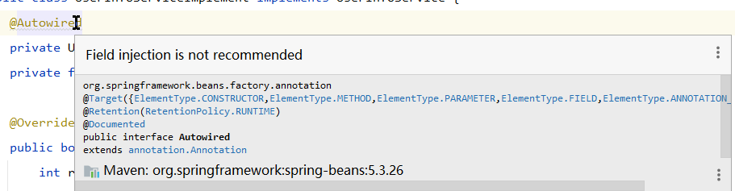

# Java

## ConcurrentModificationException

（1）错误原因：当遍历一个 `ArrayList` 或者 `HashMap` 并对其中的元素执行删除错误时，就会提示 `java.util.ConcurrentModificationException` 错误。

（2）使用 `CopyOnWriteArrayList` 替换 `ArrayList` ；

```java
List<UserEntity> list = new ArrayList<>();
// 替换为
CopyOnWriteArrayList<UserEntity> list = new CopyOnWriteArrayList<>();
```

（3）使用迭代器对象 ` Iterator ` 对 `ArrayList` 进行遍历并删除元素；

```java
List<UserEntity> list = new ArrayList<>();

Iterator<UserEntity> iterator = list.iterator();
while (iterator.hasNext()) { // 若是list中还有元素,while循环持续
    UserEntity userEntity = iterator.next();
    if (userEntity.getValue() < 10) {
        iterator.remove(); // 删除当前元素
    }
}
```

使用迭代器对象 ` Iterator ` 对 `ArrayList` 进行遍历并删除元素，在单线程环境中，其效率是要远高于使用 `CopyOnWriteArrayList` ，**但是在多线程环境中**，仍会提示 `java.util.ConcurrentModificationException` 错误；此时可使用如下的方式：

```java
public class test {

    public static void main(String[] args) {
        /** 初始化集合类*/
        ArrayList<TestObj> list = new ArrayList<>();
        for (int i = 0; i < 10000000; i++) {
            list.add(new TestObj(i));
        }
        
        // 将 ArrayList 对象作为参数传递给 CopyOnWriteArrayList 可以节省 CopyOnWriteArrayList 初始化的时间,CopyOnWriteArrayList 每次修改数据都会复制一个新的数组
        CopyOnWriteArrayList<TestObj> list1 = new CopyOnWriteArrayList<>(list);
        
        /**启动一个线程随机删除数据*/
        new Thread(new ThreadClass(list1)).start();

        /** 遍历元素*/
        Iterator<TestObj> iterator = list1.iterator();
        while (iterator.hasNext()) {
            TestObj testObj = iterator.next();
        }
    }
}


class ThreadClass implements Runnable {

    List<TestObj> list;

    public ThreadClass(List<TestObj> list) {
        this.list = list;
    }

    @Override
    public void run() {
        while (true) {
            int index = new Random().nextInt(list.size());
            list.remove(index);
        }
    }
}
```

（3）使用迭代器 `Iterator` 和 ` ConcurrentHashMap ` 遍历 `Map` 并删除元素；

```java
public class test {
    public static void main(String[] args) {
        /** 初始化集合类*/
        ConcurrentHashMap<Integer, TestObj> map = new ConcurrentHashMap<>();
        for (int i = 0; i < 1000000; i++) {
            map.put(i, new TestObj(i));
        }

        /**启动一个线程随机删除数据*/
        new Thread(new ThreadClass1(map)).start();

        /** 遍历元素*/
        Iterator<TestObj> iterator = map.values().iterator();
        while (iterator.hasNext()) {
            TestObj testObj = iterator.next();
        }

        System.out.println("end");
    }
}

class ThreadClass1 implements Runnable {

    Map<Integer, TestObj> map;

    public ThreadClass1(Map<Integer, TestObj> map) {
        this.map = map;
    }

    @Override
    public void run() {
        while (true) {
            if (map.size() > 0) {
                int index = new Random().nextInt(map.size());
                map.remove(index);
            }
        }
    }
}
```


# Mybatis

## NullPointerException

（1）检查 SQL 语句中的字段

- `#{}` 参数的名称是否与映射接口方法中的参数名称或者注解 `@Param` 别名保持一致；
- SQL 语句中使用的字段名称是否与数据库表中的字段名称保持一致，大小写也要注意；
- SQL 语句中使用的**字段名称**和**数据库表名称**是否使用 **``** 包含，防止发生名称和数据库中关键字重复，导致冲突错误；
- 属性 `resultType` 和 `ResultMap` 是否混用了。

（2）使用mapper时没有添加注解`@Autowire`

在使用 mapper 映射的时候没有在相关语句的上方添加 `@Autowire` 注解：

```java
private LoginMapper loginMapper;
```

此时，运行项目的时候就会导致 `NullPointerException` 错误，如下改正：

```java
@Autowire
private LoginMapper loginMapper;
```

在一个类中使用多个 mapper 映射的时候没有在每一条语句上方添加 `@Autowire` 注解：

```java
@Autowire
private LoginMapper loginMapper;
private UserInfoMapper userInfoMapper;
```

此时，运行项目的时候就会导致 `NullPointerException` 错误，只有紧挨`@Autowire` 的一个起作用，下面的都没有注入成功。这时需要在每一个注入的 Mapper 中都加上`@Autowire` 。如下改正：

```java
@Autowire
private LoginMapper loginMapper;
@Autowire
private UserInfoMapper userInfoMapper;
```

（3）检查字符编码

检查数据库、数据库表、数据库表的字段编码是否一致。

（4）开启 spring 的日志输出

在 spring + mybatis 组合中，在控制台输出 SQL 语句的输出情况，在文件 **application.yaml** 中添加 `logging.level.com.e3e4e20.mapper=debug` （若是映射接口文件存放这个目录 `com.e3e4e20.mapper` 下）。

（5）List All elements are null

当一个 **List** 显示 **List All elements are null** 时，虽然输入为 **null** ，但是 `list.size()=1` ，对于这种情况，使用 `list==null` 或者 `list.isEmpty()` 或者 `list.size()` 都无法判断该 **List** 是否为空。

对于这种情况的错误，可以使用 `list.remove(null)` 方式。

# Spring

## @Autowire注解不推荐使用

在 Spring 项目中，Controller 层调用 Service 层，还是 Service 层调用 Dao 层，都需要在注入的 Service 和 Dao 语句上方添加注解 `@Autowire` ，但是 Spring 官方不推荐使用，这就导致了在使用的时候，IDE 可能会提示 `Field injection is not recommended` （不建议直接在字段上进行依赖注入）。



`@Autowire` 是通过属性进行依赖注入的，这就会出现如下的问题：

（1）空指针错误

```java
@Autowire
private Person person;
private Stirng company;
public UserServiceImpl () {
    this.company = person.getConpany; // 空指针错误
}
```

之所以会出现空指针错误，是由于 Java 在初始化一个类的时候，其是按照 静态变量/静态语句块 --> 实例变量/初始化语句 --> 构造方法 --> `@Autowire` 的顺序，因此在执行类的构造方法时，`person` 对象并没有被注入到类中，其值为 `null` 。

（2）违背单一原则

使用 `@Autowire` 注入依赖十分方便，但是但一个类中被注入了大量的依赖时，就会导致当前这个类需要承担非常多的责任，从而违反单一原则。

（3）类和容器之间的强耦合

使用 `@Autowire` 会导致类不能绕过反射（例如：单元测试）进行实例化，必须依赖容器才能实例化。即类和依赖容器强耦合，不能再容器之外使用。

依赖注入的方式有 `@Autowire` 自动注入、构造器注入、Setter 注入，以及 `@Resource` 注入。

```java
// 构造器注入
@Controller
public class UserController {
    private final UserService userService;
    public UserController (UserService userService) {
        this.userService = userService;
    }
}
```

```java
// Setter 注入
@Controller
public class UserController {
    private UserService userService;
    @Autowire
    public void setUserService (UserService userService) {
        this.userService = userService;
    }
}
```

```java
// @Resource 注入
@Controller
public class UserController {
    @Resource
    private final UserService userService = new UserServiceImpl;
}

public class UserServiceImpl implements UserService{
    @Resource
    private UserMapper userMapper;
}
```

以上几种注入方式中，Spring 官方给出的建议是 **强制依赖就使用构造器注入，而可选、可变的依赖使用 Setter 注入**。 

并且 Spring 官方提倡使用基于构造方法的注入，一方面使用 `final` 可以保证变量不可修改，另一方面保证了变量值不为 `null`。通过使用构造方式注入，可以保证在调用的时候这些变量都已经准备完毕，而且若是一个构造方法过于庞大，通常代表代码结构出现了问题，这个类可能承担了过多的责任。对于使用 Setter 注入，则应该只用于注入非必需的依赖，同时要在类中对这个依赖提供一个合理的默认值；若是使用 Setter 注入必需的依赖，将会有过多的 `null` 检查充斥在类中，使用 Setter 注入的一个优点是，这个依赖可以很方便的被改变或者重新注入。

但在使用构造器注入时，要注意是否会产生**循环依赖**，对于会产生循环依赖的注入，要么改变代码结构，要么使用 Setter 注入。

`@Autowire` 注入和 `@Resource` 注入的区别：

（1）`@Autowire` 注解是由 Spring 本身提供的注入依赖的方式，默认使用 byType 方式注入依赖；`@Resource` 注解是由 J2EE 提供的，默认使用 byName 方式注入依赖。

```xml
<bean id="userService" class="com.e3e4e20.service.impl.UserServiceImpl"></bean>
```

byType 的方式就是通过 `class="com.e3e4e20.service.impl.UserServiceImpl"` 来查询 `UserServiceImpl` 中成员变量和成员方法；byName 的方式就是通过 `id="userService"` 来查询 Bean 中名称为 `userService` 的对象。

（2）`@Autowire` 注入的依赖需要在 IOC 容器中存在，否则就需要使用 `@Autowired(required = false)` 的方式，依赖存在于 IOC 容器中就注入，不存在就自动忽略要注入的依赖，不会报错。

-----------

`@Autowire` 注解注入：

-----

```java
@Service
public class UserServiceImpl implements UserService {}
```

使用 `@Autowire` 注解注入使用：

```java
@Autowire
private UserService userService;
```

通过 byType 的方式注入，由于 UserService 的实现类只有一个 UserServiceImple 因此匹配到这个实现类；

```java
@Service
public class UserServiceImpl1 implements UserService {}

@Service
public class UserServiceImpl2 implements UserService {}
```

对于 UserService 有两个实现类的时候，再使用 `@Autowire` 的方式注入：

```java
@Autowire
private UserService userService;
```

通过 byType 方式注入，匹配到 UserService 的实现类有两个 UserServiceImple1 和 UserServiceImple2 ，无法确定匹配哪一个实现类，转而通过 byName 的方式去匹配，但是在 IOC 容器中没有名称为 userService 的对象（在 IOC 容器中 UserService 的两个实现类 UserServiceImple1 和 UserServiceImple2 对应的 id 名称为 userServiceImple1 和 userServiceImple2），于是注入失败，报错。

**注：通过注解注入到 IOC 容器的 id 值，默认是其类名的对应的小驼峰命名方式。**

针对这种情况，可以通过指定变量名称的方式：

```java
@Autowire
private UserService userServiceImple1;
```

还可以通过注解 `@Qualifier` 显式指定 byName 的值：

```java
@Autowire
@Qualifier(value="userServiceImple1")
private UserService userService;
```

---

`@Resource` 注解注入：

---

```java
@Service
public class UserServiceImpl implements UserService {}
```

使用 `@Resource` 注入：

```java
@Resource
private UserService userService;
```

通过 byName 方式，在 IOC 容器中没有 id 值为 userService 的对象，转而使用 byType 方式去匹配，由于 UserService 的实现类只有一个 UserServiceImpl ，因此匹配到这个实现类。

```java
@Service
public class UserServiceImpl1 implements UserService {}

@Service
public class UserServiceImpl2 implements UserService {}
```

对于 UserService 有两个实现类的时候，再使用 `@Resource` 的方式注入：

```java
@Resource
private UserService userService;
```

通过 byName 方式，在 IOC 容器中没有 id 值为 userService 的对象，转而使用 byType 方式去匹配，由于 UserService 的实现类有两个 UserServiceImpl1 和  UserServiceImpl2，无法确定匹配哪一个实现类，于是注入失败，报错。

对于 `@Resource` 注入依赖的4种方式：

```java
// 1、默认方式先 byName 后 byType
@Resource
private UserService userService;

// 2、指定 byName
@Resource(name="userService")
private UserService userService;

// 3、指定 byType
@Resource(type=UserService.class)
private UserService userService;

// 4、同时指定 byName 和 byType
@Resource(name="userService",type=UserService.class)
private UserService userService;
```

（1）既没指定 name 属性，也没有指定 type 属性：默认通过 byName 方式匹配，若是匹配失败，则转而使用 byType 方式匹配；

（2）指定 name 属性：通过 byName 方式匹配，若是在 IOC 容器中没有 id 值可以匹配，那么注入失败、报错；

（3）指定 type 属性：通过 byType 方式匹配，若是 IOC 容器中没有与之匹配的类，或者匹配到多个相同的类，那么注入失败、报错；

（4）同时指定 name 属性和 type 属性：在 IOC 容器中，byName 和 byType 必须同时匹配，否则注入失败、报错。