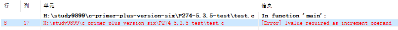
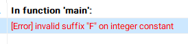
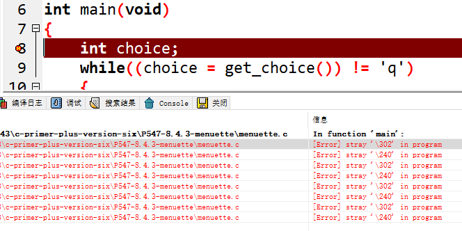

## 1、自增运算符

```C
#include <stdio.h>
int main(void)
{
    int x = 1, y = 2, res = 0;
    res = (x+y)++; // 编译器报错: [Error] value required as increment operand
    printf("x = %d, y = %d, res = %d\n", x, y, res);
    return 0;
}
```



> 错误说明：需要作为增量操作数的值
>
> **自增运算符的运算对象是一个可以修改的数据对象（即可以被赋值的变量）**

## 2、浮点型常量后缀

```C
#include <stdio.h>
int main(void)
{
    float f, c;
    f = 64F; // 编译器报错: [Error] invalid suffix "F" on integer constant
    c = (float)(5.0 / 9.0 * (f - 32));
    printf("f = %.2f\nc = %.2f\n", f, c);
    return 0;
}
```



>   错误说明：在整型常量后面使用 “F” 后缀是无效的
>
>   **浮点型常量的后缀，只能添加在浮点型常量后面**

## 3、‘\302’错误

```C
int main(void)
{
    int choice; // [Error] stray '\302' in program
    while((choice = get_choice()) != 'q')
    {
        switch(choice)
        {
            case 'a':
                printf("Buy low, sell hight.\n");
                break;
            case 'b':
                putchar('\a');
                break;
            case 'c':
                count();
                break;
            default:
                printf("Program error!\n");
                break;
        }
    }
    printf("Bye.\n");
    return 0;
}
```



> 错误说明： 这种错误提示会出现在从其他地方拷贝代码的过程中，是指源程序中含有非法字符，需要将非法字符去掉。 
>
> 1.把出错行的空格及其前后空格删掉重新打一下。
>
> 2.把明显和其他标点符号颜色不同的改掉。（大部分编译器都有颜色识别）
>
> 3.直接全部重打。