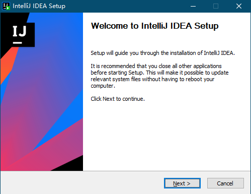
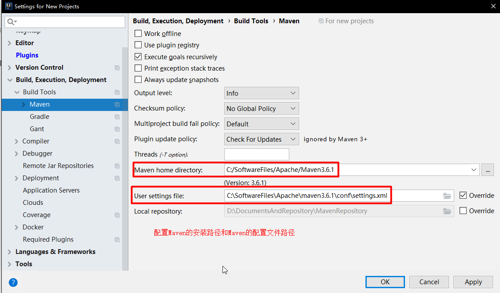
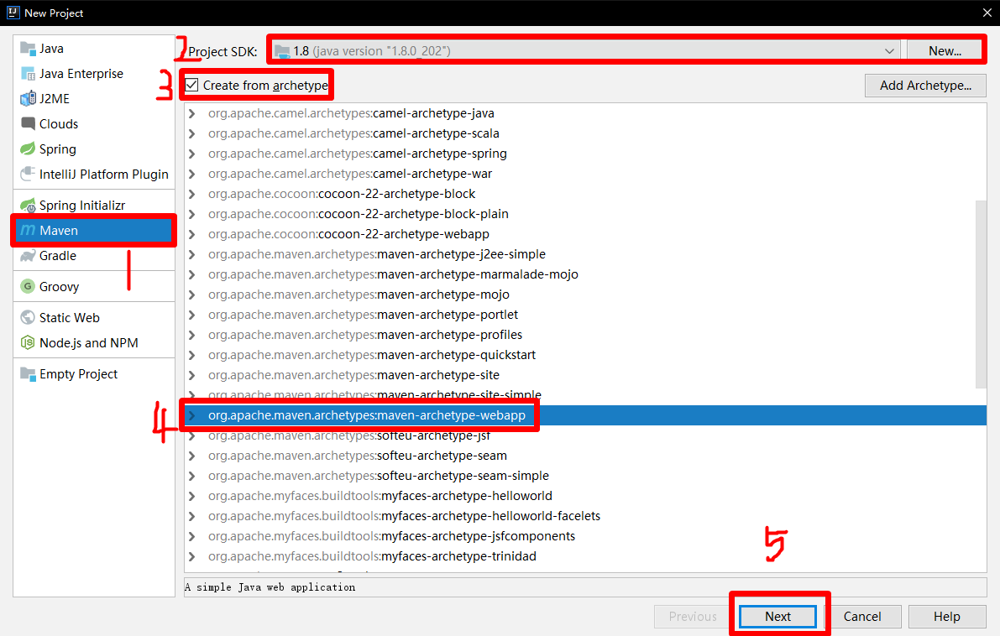
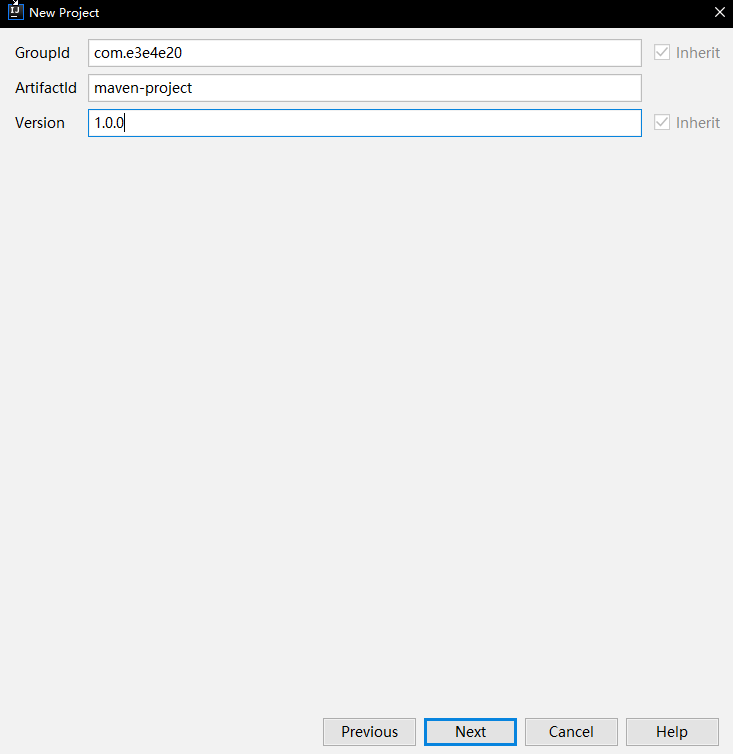

# Intellij IDEA安装说明

## 1、下载Intellij IDEA

[ 官网下载地址 ](https://www.jetbrains.com/idea/download/other.html)

## 2、注册官方账号说明

IDEA 自版本号为 2021.2.x 开始，激活 IDEA 需要登录官方账号（没有的话需要先去官网注册一个）。

## 3、安装IDEA

（1）启动 IDEA 2021.1.3.exe




（2）点击 **Next >** ，选择安装目录。


（3）点击 **Next >**，根据需要选择。


（4）点击 **Next >**，点击 **Install** 。


（5）等待安装。


（6）点击 **Finish**。


## 4、第三方手段激活

在[第三方网站](https://www.jiweichengzhu.com/ide/code)下载激活包：

（1）选择激活包 **ja-netfilter**，输入下载码，下载激活包。

（2）点击下方获取正版激活码。


（3）选择对应版本的激活码。


（4）将下载激活包 `ja-netfilter.jar` 解压出来，并修改 `config`目录下的配置文件。


（5）修改 IDEA 配置文件。

在 IDEA 安装目录 `A:\Software\JetBrains\IntelliJ IDEA 2021.1.3\bin` 下找到 `idea64.exe.vmoptions` 、`idea.exe.vmoptions`两个文件，并打开。


在文件中最后一行中添加如下内容：

```txt
-javaagent:A:/Software/JetBrains/ja-netfilter/ja-netfilter.jar
```

**这个 ja-netfilter.jar 文件的路径，取决于 jar-netfilter.jar 文件存放的位置。**


（6）修改 IDEA 用户配置文件的位置。

在 IDEA 安装目录 `A:\Software\JetBrains\IntelliJ IDEA 2021.1.3\bin` 下找到 `idea.properties` 文件，并打开。

找到如下内容：

```properties
# idea.config.path=${user.home}/.IntelliJIdea/config
# idea.system.path=${user.home}/.IntelliJIdea/system
# idea.plugins.path=${idea.config.path}/plugins
# idea.log.path=${idea.system.path}/log
```

这四行是用户配置文件默认的存放路径，将每一行起始位置的`#`删除，其中`${user.home}`指的是`A:\Users\Administrator`，`${idea.config.path}`指的是`idea.config.path`的路径，`idea.system.path`指的是`idea.system.path`；因此修改只需要将`${user.home}`替换为其他路径，就可以更换用户配置文件的存放路径。

```properties
idea.config.path=B:/Archive/Profile/.IntelliJIdea/config
idea.system.path=B:/Archive/Profile/.IntelliJIdea/system
idea.plugins.path=${idea.config.path}/plugins
idea.log.path=${idea.system.path}/log
```

（7）启动 IDEA 输入从第三方网站上获取的激活码，点击**Activate**。


# 配置IDEA的Settings





# IDEA快捷键

生成一个System.out.println()：sout

生成一个for循环：fori

生成一个public static void main方法：psvm

生成getter,setter方法；Alt + Insert

生成toString方法: Alt + Insert

生成无参和有参构造方法：Alt+Insert

代码格式化：Ctrl + Alt + L

选中当前行：Home + shift + End 或 End + shift + Home

上下移动当前行：Ctrl + shift + 上下键

任意处换行：shitf + enter

# IDEA创建Java工程

# IDEA创建Maven-Java Web工程

## 一、新建项目

1、选中Maven项目

2、选择项目开发使用的JDK版本

3、选择创建使用的Maven模板

4、选择Maven Web项目模板



5、GroupId：项目的组名，一般为域名倒着写

6、ArtifactId：项目名称或是模块名称，字母小写、单词直接使用“-”连接



7、选择项目开发使用的Maven路径


8、Project name：项目名称

9、Project location：项目存放目录

10、Module name：同Project name

11、Content root：同Project location

12、Module file location：同Project location


## 二、配置Maven项目目录结构

1、`File`——`Project Structure`


2、配置Web项目目录结构 `Modules`


3、创建`/src/test``/src/test/java``/src/test/resources``/src/main/java``/src/main/resources`四个项目目录，通过`Mark as`设置`Content Root`，完善maven的web项目目录结构


## 三、配置Tomcat容器

1、添加tomcat项目


2、配置部署war包，`Application Content`为虚拟映射的路径


3、配置启动tomcat时，使用的 `CATALINA_BASE`路径为tomcat的安装目录


## 四、配置pom.xml文件

```xml
<properties>
	<!-- 构建、编译项目时，使用UTF-8编码，JDK版本和项目使用的版本相同 -->
    <project.build.sourceEncoding>UTF-8</project.build.sourceEncoding>
    <maven.compiler.source>1.8</maven.compiler.source>
    <maven.compiler.target>1.8</maven.compiler.target>
</properties>
```

```xml
<build>
	<!-- 配置xml和properties文件目录防止在项目进行导出时被忽略，无法正常导出到war包中 -->
    <resources>
        <resource>
            <directory>src/main/java</directory>
            <includes>
                <include>**/*.xml</include>
                <include>**/*.properties</include>
            </includes>
            <filtering>false</filtering>
        </resource>
        <resource>
            <directory>src/main/resources</directory>
            <includes>
                <include>**/*.xml</include>
                <include>**/*.properties</include>
            </includes>
            <filtering>false</filtering>
        </resource>
    </resources>
</build>
```

```xml
<build>
    <!-- 指定maven打成war时的包名 -->
    <finalName>MavenProject</finalName>
</build>
```

## 五、启动tomcat查看项目是否部署成功


# IDEA创建springboot工程

## 一、新建工程


> Project：jar包的管理工具（Maven、Gradle）
>
> Language：编程语言（Java、Kotlin、Groovy）
>
> Spring Boot：springboot版本（带有 SNAPSHOT 表示这个版本目前处于开发中，属于不稳定版本）
>
> Group：项目所属的团体或者组织，通常为该团体或者组织的官方网址，从顶级域名向次级域名的顺序填写
>
> Artifact：项目的唯一标识，一般是项目的名称，**不能含有大写字母**
>
> Name：项目的名称
>
> Description：项目的简要描述
>
> Package name：springboot项目的main和test目录中java目录下的包名称，默认是Group+Artifact的形式
>
> Packaging：打包方式（jar、war）
>
> Java：项目所使用的 JDK 版本

> jar包：**类的归档文件**，在该包中的 com 目录下包含 `.class` 文件、配置文件等，META-INF 目录用于存储包和扩展的配置数据，如安全性和版本信息等；不仅可以用于压缩和发布，还可以用于部署和封装库、组件和插件程序，并且可以被编译成类似于 JVM 这样的工具直接使用；但是 jar 包中不包含 `.html`、`.css`、`.js` 等静态资源文件；对于 springboot 项目，由于其内置了 tomcat ，因此可以直接使用 jar 包运行。
>
> war包：**Java Web程序**，war 包里面的目录结构和项目的目录结构相同，在 WEB-INF 目录中包含了项目的代码的 `.class` 文件和配置文件，META-INF 目录中除了包含和 jar 包的 META-INF 目录中相同的内容外，还包含了`.html`、`.css`、`.js` 等静态资源文件，对于普通的 Java Web 项目，需要打包成 war 包，再使用 tomcat 运行。


## 二、springboot项目文件目录说明

一个从 springboot 官网中创建的 springboot 项目的目录结构如下：


一个使用IDEA新建完成的springboot项目的目录结构如下：


> `.idea`目录是由软件IDEA建立的目录，在该目录下存放项目的配置信息，其中包括版本控制信息、历史记录等等。所以该目录与当前项目能否正常执行无关，它只是负责对代码的历史变化进行一个记录，便于回溯查找和复原。
>
> `.idea/codeStyles`目录下是本项目在IDEA中使用的代码样式配置信息。
>
> `.idea/libraries`目录下有`compiler.xml`，`encodings.xml`，`misc.xml`，`modules.xml`，`vcs.xml`，`workspace.xml`对应的分别是编辑器配置，编码配置，JS配置，项目模块配置，VSC目录映射和工作空间的相关配置信息。简单的说就是当你对项目操作的同时，编辑器就对你的重要操作进行描述记录。
>
> `.mvn`目录下的` maven-wrapper.jar `，` maven-wrapper.properties` 可以为Java工程指定某个指定的Maven版本，避免因为版本差异引起的诡异错误，统一项目的开发环境，不再需要提前安装Maven，简化了开发环境的配置，以及在项目运行时找不到maven的时候，它会自动下载一个，或者碰到你的项目maven和你环境里的mavn不兼容，它也会自动下载一个。 **但是由于服务器在国外，无论是等他自动下载还是管理非本地 jar 包，都是十分缓慢，甚至直接报错；特别是使用团体或者组织搭建的 maven 私服，有自己的配置文件和账号，使用这个玩意，还得需要知道maven下载在哪了，找到以后替换它的配置文件。**==该目录可以直接删除，使用本地安装的 maven 即可==。
>
> `src`目录是项目的源代码目录。
>
> `.gitignore`文件当项目使用git做版本控制时用这个文件控制哪些文件或文件夹不被提交（不用git的话可删除，对项目运行没影响）。
>
> `HELP.md`文件是本项目的帮助文档，纯英文的，里面都是一些网址，==该文件可以直接删除，对项目运行没有影响==。
>
> `mvnw`程序是在**Linux操作系统**上处理mevan版本兼容问题， ==该文件可以直接删除，对项目运行没有影响==。
>
> `mvnw.cmd`程序**Windows操作系统**上处理mevan版本兼容问题， ==该文件可以直接删除，对项目运行没有影响==。
>
> `demo.iml`文件，每一个导入IDEA的项目都会生成一个项目同名的`.iml`文件，该文件用于保存你对这个项目的配置 （可以删除，但是删除了之后，程序重新导入后还会生成，而且由于配置丢失可能会造成程序异常）。

# IDEA同一窗口内创建前后分离项目

## 1、新建Empty Project


## 2、添加Modules

（1）点击 **+**。


（2）选择 **Import Module** 。


（3）将创建的 **Empty Project** 添加进来。


