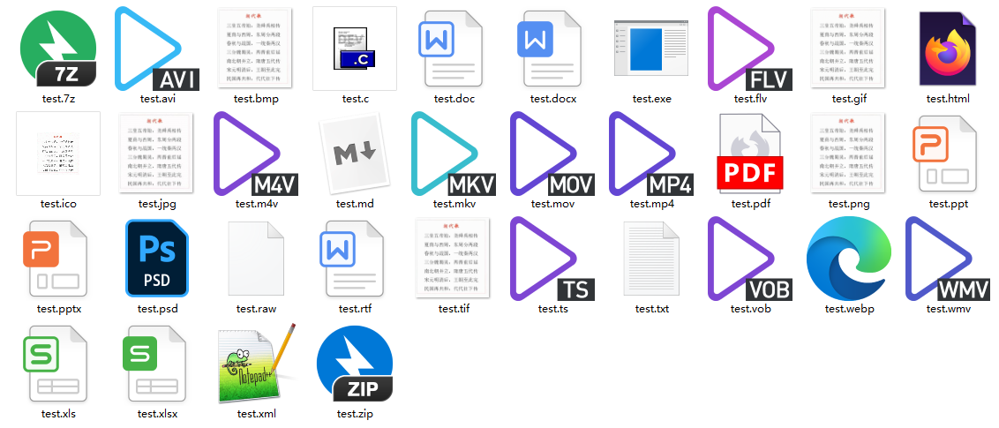

# Exception异常类

## 1、输出异常信息

```java
@Repository
@Mapper
public interface UserInfoMapper {
    UserInfoEntity selectUserInfoByUserid(@Param("id") String userid);
}
```

```java
public UserInfoEntity getUserInfoByUserid(String userid) {
    UserInfoEntity userInfoEntity = null;
    try {
        userInfoEntity = userInfoMapper.selectUserInfoByUserid(userid);
        logger.debug("用户唯一标识:" + userid + ",基本信息:" + userInfoEntity.toString());
    } catch (Exception e) {
        System.out.println("getCause:"+e.getCause());
        System.out.println("getMessage:"+e.getMessage());
        System.out.println("toString:"+e.toString());
        System.out.println("getLocalizedMessage:"+e.getLocalizedMessage());
        System.out.println("getStackTrace:"+e.getStackTrace());
        System.out.println("getSuppressed:"+e.getSuppressed());
        System.out.println("getClass:"+e.getClass());
        System.out.println("fillInStackTrace:"+e.fillInStackTrace());
        // System.out.println(e.initCause());
        System.out.println("hashCode:"+e.hashCode());
        // System.out.println(e.printStackTrace());
    }
    return userInfoEntity;
}
```

```shell
2023-05-19 09:21:22 DEBUG c.e.m.U.selectUserInfoByUserid - ==>  Preparing: select * from `t_userinfo` where `id`=?
2023-05-19 09:21:22 DEBUG c.e.m.U.selectUserInfoByUserid - ==>  Preparing: select * from `t_userinfo` where `id`=?
2023-05-19 09:21:22 DEBUG c.e.m.U.selectUserInfoByUserid - ==> Parameters: 1234567890(String)
2023-05-19 09:21:22 DEBUG c.e.m.U.selectUserInfoByUserid - ==> Parameters: 1234567890(String)
2023-05-19 09:21:22 DEBUG c.e.m.U.selectUserInfoByUserid - <==      Total: 0
2023-05-19 09:21:22 DEBUG c.e.m.U.selectUserInfoByUserid - <==      Total: 0
getCause:null
getMessage:null
toString:java.lang.NullPointerException
getLocalizedMessage:null
getStackTrace:[Ljava.lang.StackTraceElement;@70be89ec
getSuppressed:[Ljava.lang.Throwable;@2aee0704
getClass:class java.lang.NullPointerException
fillInStackTrace:java.lang.NullPointerException
hashCode:430290487
```

# 判断文件类型

判断一个文件使用的文件类型，其原理有两种：

（1）根据文件的后缀名判断文件类型，这种方式**优点**是代码简单、判断速度快，但是**缺点**是对于伪造的文件后缀名无法判断出文件的真实类型。

（2）根据文件的字节流中的文件类型标识判断文件类型，**优点**是可以判断出文件的真实类型，包括伪造的文件后缀名，但是**缺点**是代码复杂、判断速度慢。

## 1、读取指定目录下的所有文件

现有在目录`C:/Archive/Pictures/`下有如下图所示的文件，若是判断这些文件的类型，就需要一个文件一个文件的测试，不仅代码复用率低下，而且浪费时间，因此通过获取该目录下的所有文件，再去判断文件的文件类型，这样即便该目录下的文件有所删减或者增加，都不需要改变代码。



```java
void getDirectoryFile () throws Exception{
    try {
        File fileOrDirectory = new File("C:/Archive/Pictures/");
        if (fileOrDirectory.isDirectory()) {
            System.out.println(fileOrDirectory.toString()+": 文件夹!");
            String[] fileList = fileOrDirectory.list();
            for (int i = 0; i < fileList.length; i++) {
                File file = new File("C:/Archive/Pictures/"+fileList[i]);
                if (file.isFile()) {
                    System.out.println(file.toString()+": 文件!");
                    /* 调用判断文件类型的方法 */
                } else if (file.isDirectory()) {
                    System.out.println(file.toString()+": 文件夹!");
                } else {
                    System.out.println(file.toString()+": 文件类型未知!");
                }
            }
        } else if (fileOrDirectory.isFile()) {
            System.out.println(fileOrDirectory.toString()+": 文件!");
        }
    } catch (Exception e) {
        System.out.println(e.toString());
    }
}
```

```shell
C:\Archive\Pictures: 文件夹!
C:\Archive\Pictures\desktop.ini: 文件!
C:\Archive\Pictures\test.7z: 文件!
C:\Archive\Pictures\test.avi: 文件!
C:\Archive\Pictures\test.bmp: 文件!
C:\Archive\Pictures\test.c: 文件!
C:\Archive\Pictures\test.doc: 文件!
C:\Archive\Pictures\test.docx: 文件!
C:\Archive\Pictures\test.exe: 文件!
C:\Archive\Pictures\test.flv: 文件!
C:\Archive\Pictures\test.gif: 文件!
C:\Archive\Pictures\test.html: 文件!
C:\Archive\Pictures\test.ico: 文件!
C:\Archive\Pictures\test.jpg: 文件!
C:\Archive\Pictures\test.m4v: 文件!
C:\Archive\Pictures\test.md: 文件!
C:\Archive\Pictures\test.mkv: 文件!
C:\Archive\Pictures\test.mov: 文件!
C:\Archive\Pictures\test.mp4: 文件!
C:\Archive\Pictures\test.pdf: 文件!
C:\Archive\Pictures\test.png: 文件!
C:\Archive\Pictures\test.ppt: 文件!
C:\Archive\Pictures\test.pptx: 文件!
C:\Archive\Pictures\test.psd: 文件!
C:\Archive\Pictures\test.raw: 文件!
C:\Archive\Pictures\test.rtf: 文件!
C:\Archive\Pictures\test.tif: 文件!
C:\Archive\Pictures\test.ts: 文件!
C:\Archive\Pictures\test.txt: 文件!
C:\Archive\Pictures\test.vob: 文件!
C:\Archive\Pictures\test.webp: 文件!
C:\Archive\Pictures\test.wmv: 文件!
C:\Archive\Pictures\test.xls: 文件!
C:\Archive\Pictures\test.xlsx: 文件!
C:\Archive\Pictures\test.xml: 文件!
C:\Archive\Pictures\test.zip: 文件!
```

## 2、文件类型MIME-types

（1）MIME types 是什么？

MIME (Multipurpose Internet Mail Extensions) 是描述消息内容类型的标准，用来表示文档、文件或字节流的性质和格式。

浏览器通常使用 MIME 类型（而不是文件扩展名）来确定如何处理URL，因此 Web 服务器在响应头中添加正确的 MIME 类型非常重要。如果配置不正确，浏览器可能会无法解析文件内容，网站将无法正常工作，并且下载的文件也会被错误处理。

（2）MIME types 的基本格式

```shell
type/subtype
```

MIME types 的组成结构由类型与子类型两个字符串中间用 `/` 分隔而组成，不允许有空格。type 表示可以被分为多个子类别的独立类别，subtype 表示细分后的子类别。

MIME类型对大小写不敏感，但是传统写法都是小写。

两种主要的 MIME 类型在默认类型中扮演了重要的角色：

-  text/plain 表示文本文件的默认值。
-  application/octet-stream 表示所有其他情况的默认值。

（3）常见的 MIME types 格式

| MIME types                                                   | 文件后缀名             | 文件类型说明                                                 |
| ------------------------------------------------------------ | ---------------------- | ------------------------------------------------------------ |
| **application/msword**                                       | doc                    | 微软 Office Word 格式（Microsoft Word 97 - 2004 document）   |
| **application/vnd.openxmlformats-officedocument.wordprocessingml.document** | docx                   | 微软 Office Word 文档格式                                    |
| **application/vnd.ms-excel**                                 | xls                    | 微软 Office Excel 格式（Microsoft Excel 97 - 2004 Workbook   |
| **application/vnd.openxmlformats-officedocument.spreadsheetml.sheet** | xlsx                   | 微软 Office Excel 文档格式                                   |
| **application/vnd.ms-powerpoint**                            | ppt                    | 微软 Office PowerPoint 格式（Microsoft PowerPoint 97 - 2003 演示文稿） |
| **application/vnd.openxmlformats-officedocument.presentationml.presentation** | pptx                   | 微软 Office PowerPoint 文稿格式                              |
| **application/x-gzip**                                       | gz, gzip               | GZ 压缩文件格式                                              |
| **application/zip**                                          | zip, 7zip              | ZIP 压缩文件格式                                             |
| **application/rar**                                          | rar                    | RAR 压缩文件格式                                             |
| **application/x-tar**                                        | tar, tgz               | TAR 压缩文件格式                                             |
| **application/pdf**                                          | pdf                    | PDF 是 Portable Document Format 的简称，即便携式文档格式     |
| **application/rtf**                                          | rtf                    | RTF 是指 Rich Text Format，即通常所说的富文本格式            |
| **image/gif**                                                | gif                    | GIF 图像格式                                                 |
| **image/jpeg**                                               | jpg, jpeg              | JPG(JPEG) 图像格式                                           |
| **image/jp2**                                                | jpg2                   | JPG2 图像格式                                                |
| **image/png**                                                | png                    | PNG 图像格式                                                 |
| **image/tiff**                                               | tif, tiff              | TIF(TIFF) 图像格式                                           |
| **image/bmp**                                                | bmp                    | BMP 图像格式（位图格式）                                     |
| **image/svg+xml**                                            | svg, svgz              | SVG 图像格式                                                 |
| **image/webp**                                               | webp                   | WebP 图像格式                                                |
| **image/x-icon**                                             | ico                    | ico 图像格式，通常用于浏览器 Favicon 图标                    |
| **application/kswps**                                        | wps                    | 金山 Office 文字排版文件格式                                 |
| **application/kset**                                         | et                     | 金山 Office 表格文件格式                                     |
| **application/ksdps**                                        | dps                    | 金山 Office 演示文稿格式                                     |
| **application/x-photoshop**                                  | psd                    | Photoshop 源文件格式                                         |
| **application/x-coreldraw**                                  | cdr                    | Coreldraw 源文件格式                                         |
| **application/x-shockwave-flash**                            | swf                    | Adobe Flash 源文件格式                                       |
| **text/plain**                                               | txt                    | 普通文本格式                                                 |
| **application/x-javascript**                                 | js                     | Javascript 文件类型                                          |
| **text/javascript**                                          | js                     | 表示 Javascript 脚本文件                                     |
| **text/css**                                                 | css                    | 表示 CSS 样式表                                              |
| **text/html**                                                | htm, html, shtml       | HTML 文件格式                                                |
| **application/xhtml+xml**                                    | xht, xhtml             | XHTML 文件格式                                               |
| **text/xml**                                                 | xml                    | XML 文件格式                                                 |
| **text/x-vcard**                                             | vcf                    | VCF 文件格式                                                 |
| **application/x-httpd-php**                                  | php, php3, php4, phtml | PHP 文件格式                                                 |
| **application/java-archive**                                 | jar                    | Java 归档文件格式                                            |
| **application/vnd.android.package-archive**                  | apk                    | Android 平台包文件格式                                       |
| **application/octet-stream**                                 | exe                    | Windows 系统可执行文件格式                                   |
| **application/x-x509-user-cert**                             | crt, pem               | PEM 文件格式                                                 |
| **audio/mpeg**                                               | mp3                    | mpeg 音频格式                                                |
| **audio/midi**                                               | mid, midi              | mid 音频格式                                                 |
| **audio/x-wav**                                              | wav                    | wav 音频格式                                                 |
| **audio/x-mpegurl**                                          | m3u                    | m3u 音频格式                                                 |
| **audio/x-m4a**                                              | m4a                    | m4a 音频格式                                                 |
| **audio/ogg**                                                | ogg                    | ogg 音频格式                                                 |
| **audio/x-realaudio**                                        | ra                     | Real Audio 音频格式                                          |
| **video/mp4**                                                | mp4                    | mp4 视频格式                                                 |
| **video/mpeg**                                               | mpg, mpe, mpeg         | mpeg 视频格式                                                |
| **video/quicktime**                                          | qt, mov                | QuickTime 视频格式                                           |
| **video/x-m4v**                                              | m4v                    | m4v 视频格式                                                 |
| **video/x-ms-wmv**                                           | wmv                    | wmv 视频格式（Windows 操作系统上的一种视频格式）             |
| **video/x-msvideo**                                          | avi                    | avi 视频格式                                                 |
| **video/webm**                                               | webm                   | webm 视频格式                                                |
| **video/x-flv**                                              | flv                    | 一种基于 flash 技术的视频格式                                |

## 3、使用文件扩展名作为文件类型

（1）`String.split()`

```java
void stringSplitGetFileType() throws Exception {
    try {
        File fileOrDirectory = new File("C:/Archive/Pictures/");
        if (fileOrDirectory.isDirectory()) {
            String[] fileList = fileOrDirectory.list();
            for (int i = 0; i < fileList.length; i++) {
                File file = new File("C:/Archive/Pictures/" + fileList[i]);
                if (file.isFile()) {
                    String[] strings = fileList[i].split("\\.");
                    System.out.println(file.getName() + ": " + strings[strings.length - 1]);
                } else if (file.isDirectory()) {
                    System.out.println(file.toString() + ": 文件夹!");
                } else {
                    System.out.println(file.toString() + ": 文件类型未知!");
                }
            }
        } else if (fileOrDirectory.isFile()) {
            System.out.println(fileOrDirectory.toString() + ": 文件!");
        }
    } catch (Exception e) {
        System.out.println(e.toString());
    }
}
```

```shell
desktop.ini: ini
test.7z: 7z
test.avi: avi
test.bmp: bmp
test.c: c
test.doc: doc
test.docx: docx
test.exe: exe
test.flv: flv
test.gif: gif
test.html: html
test.ico: ico
test.jpg: jpg
test.m4v: m4v
test.md: md
test.mkv: mkv
test.mov: mov
test.mp4: mp4
test.pdf: pdf
test.png: png
test.ppt: ppt
test.pptx: pptx
test.psd: psd
test.raw: raw
test.rtf: rtf
test.tif: tif
test.ts: ts
test.txt: txt
test.vob: vob
test.webp: webp
test.wmv: wmv
test.xls: xls
test.xlsx: xlsx
test.xml: xml
test.zip: zip
```

这种方式不仅代码简单、而且判断文件类型的速度也快，但是只能针对于没有伪造文件后缀名的文件，一旦后缀名被修改了，这种方法就不存在准确性。


（2）`URLConnection.getFileNameMap()`

```java
void getFileNameMapGetDirectoryFileType() throws Exception {
    try {
        File fileOrDirectory = new File("C:/Archive/Pictures/");
        if (fileOrDirectory.isDirectory()) {
            fileList = fileOrDirectory.list();
            for (int i = 0; i < fileList.length; i++) {
                String filePath = "C:/Archive/Pictures/" + fileList[i];
                File file = new File(filePath);
                if (file.isFile()) {
                    try {
                        FileNameMap fileNameMap = URLConnection.getFileNameMap();
                        System.out.println(file.getName() + ": " + fileNameMap.getContentTypeFor(file.getName()));
                    } catch (Exception e) {
                        System.out.println(file.getName() + ": " + e.toString());
                    }
                } else if (file.isDirectory()) {
                    System.out.println(file.toString() + ": 文件夹!");
                } else {
                    System.out.println(file.toString() + ": 文件类型未知!");
                }
            }
        } else if (fileOrDirectory.isFile()) {
            System.out.println(fileOrDirectory.toString() + ": 文件!");
        } else {
            System.out.println(fileOrDirectory.toString() + ": 文件类型未知!");
        }
    } catch (Exception e) {
        System.out.println(e.toString());
    }
}
```

```shell
desktop.ini: null
test.7z: null
test.avi: application/x-troff-msvideo
test.bmp: image/bmp
test.c: text/plain
test.doc: null
test.docx: null
test.exe: application/octet-stream
test.flv: null
test.gif: image/gif
test.html: text/html
test.ico: null
test.jpg: image/jpeg
test.m4v: null
test.md: null
test.mkv: null
test.mov: video/quicktime
test.mp4: null
test.pdf: application/pdf
test.png: image/png
test.ppt: null
test.pptx: null
test.psd: null
test.raw: null
test.rtf: application/rtf
test.tif: image/tiff
test.ts: null
test.txt: text/plain
test.vob: null
test.webp: null
test.wmv: null
test.xls: null
test.xlsx: null
test.xml: application/xml
test.zip: application/zip
```

`URLConnection.getFileNameMap()` 能判断出文件类型的就输出该文件类型对应的 MIME type 否则就返回 null 。

```java
private static FileNameMap fileNameMap;

private static boolean fileNameMapLoaded = false;

public static synchronized FileNameMap getFileNameMap() {
    if ((fileNameMap == null) && !fileNameMapLoaded) {
        fileNameMap = sun.net.www.MimeTable.loadTable();
        fileNameMapLoaded = true;
    }

    return new FileNameMap() {
        private FileNameMap map = fileNameMap;
        public String getContentTypeFor(String fileName) {
            return map.getContentTypeFor(fileName);
        }
    };
}
```

`URLConnection.getFileNameMap()` 方法首先加载一个 MIME type 表格，然后调用 `getContentTypeFor` 方法获取文件类型对应的 MIME type 。

（3）`URLConnection.guessContentTypeFromName`

```java
void guessContentTypeFromNameGetDirectoryFileType() throws Exception {
    try {
        File fileOrDirectory = new File("C:/Archive/Pictures/");
        if (fileOrDirectory.isDirectory()) {
            fileList = fileOrDirectory.list();
            for (int i = 0; i < fileList.length; i++) {
                String filePath = "C:/Archive/Pictures/" + fileList[i];
                File file = new File(filePath);
                if (file.isFile()) {
                    try {
                        System.out.println(file.getName() + ": " + URLConnection.guessContentTypeFromName(file.getName()));
                    } catch (Exception e) {
                        System.out.println(file.getName() + ": " + e.toString());
                    }
                } else if (file.isDirectory()) {
                    System.out.println(file.toString() + ": 文件夹!");
                } else {
                    System.out.println(file.toString() + ": 文件类型未知!");
                }
            }
        } else if (fileOrDirectory.isFile()) {
            System.out.println(fileOrDirectory.toString() + ": 文件!");
        } else {
            System.out.println(fileOrDirectory.toString() + ": 文件类型未知!");
        }
    } catch (Exception e) {
        System.out.println(e.toString());
    }
}
```

```shell
desktop.ini: null
test.7z: null
test.avi: application/x-troff-msvideo
test.bmp: image/bmp
test.c: text/plain
test.doc: null
test.docx: null
test.exe: application/octet-stream
test.flv: null
test.gif: image/gif
test.html: text/html
test.ico: null
test.jpg: image/jpeg
test.m4v: null
test.md: null
test.mkv: null
test.mov: video/quicktime
test.mp4: null
test.pdf: application/pdf
test.png: image/png
test.ppt: null
test.pptx: null
test.psd: null
test.raw: null
test.rtf: application/rtf
test.tif: image/tiff
test.ts: null
test.txt: text/plain
test.vob: null
test.webp: null
test.wmv: null
test.xls: null
test.xlsx: null
test.xml: application/xml
test.zip: application/zip
```

`URLConnection.guessContentTypeFromName` 能判断出文件类型的就输出该文件类型对应的 MIME type 否则就返回 null 。

```java
public static String guessContentTypeFromName(String fname) {
    return getFileNameMap().getContentTypeFor(fname);
}
```

`URLConnection.guessContentTypeFromName` 实际上调用的还是 `URLConnection.getFileNameMap()` 方法，因此这两个方法的结果相同。


（4）`MimetypesFileTypeMap`

`MimetypesFileTypeMap` 是 JDK 1.6 提供的一个用于判断文件类型的 Class。

```java
void MimetypesFileTypeMapGetFileType() throws Exception {
    try {
        File fileOrDirectory = new File("C:/Archive/Pictures/");
        if (fileOrDirectory.isDirectory()) {
            fileList = fileOrDirectory.list();
            for (int i = 0; i < fileList.length; i++) {
                String filePath = "C:/Archive/Pictures/" + fileList[i];
                File file = new File(filePath);
                if (file.isFile()) {
                    try {
                        MimetypesFileTypeMap mimetypesFileTypeMap = new MimetypesFileTypeMap();
                        System.out.println(file.getName() + ": " + mimetypesFileTypeMap.getContentType(file.getName()));
                    } catch (Exception e) {
                        System.out.println(file.getName() + ": " + e.toString());
                    }
                } else if (file.isDirectory()) {
                    System.out.println(file.toString() + ": 文件夹!");
                } else {
                    System.out.println(file.toString() + ": 文件类型未知!");
                }
            }
        } else if (fileOrDirectory.isFile()) {
            System.out.println(fileOrDirectory.toString() + ": 文件!");
        } else {
            System.out.println(fileOrDirectory.toString() + ": 文件类型未知!");
        }
    } catch (Exception e) {
        System.out.println(e.toString());
    }
}
```

```shell
desktop.ini: application/octet-stream
test.7z: application/octet-stream
test.avi: video/x-msvideo
test.bmp: application/octet-stream
test.c: application/octet-stream
test.doc: application/octet-stream
test.docx: application/octet-stream
test.exe: application/octet-stream
test.flv: application/octet-stream
test.gif: image/gif
test.html: text/html
test.ico: application/octet-stream
test.jpg: image/jpeg
test.m4v: application/octet-stream
test.md: application/octet-stream
test.mkv: application/octet-stream
test.mov: video/quicktime
test.mp4: application/octet-stream
test.pdf: application/octet-stream
test.png: application/octet-stream
test.ppt: application/octet-stream
test.pptx: application/octet-stream
test.psd: application/octet-stream
test.raw: application/octet-stream
test.rtf: application/rtf
test.tif: image/tiff
test.ts: application/octet-stream
test.txt: text/plain
test.vob: application/octet-stream
test.webp: application/octet-stream
test.wmv: application/octet-stream
test.xls: application/octet-stream
test.xlsx: application/octet-stream
test.xml: application/octet-stream
test.zip: application/octet-stream
```

`MimetypesFileTypeMap` 能判断出文件类型的就输出该文件类型对应的 MIME type 否则就返回 application/octet-stream 。

```java
public MimetypesFileTypeMap() {
    Vector dbv = new Vector(5);
    MimeTypeFile mf = null;
    dbv.addElement((Object)null);
    LogSupport.log("MimetypesFileTypeMap: load HOME");

    String system_mimetypes;
    try {
        system_mimetypes = System.getProperty("user.home");
        if (system_mimetypes != null) {
            String path = system_mimetypes + File.separator + ".mime.types";
            mf = this.loadFile(path);
            if (mf != null) {
                dbv.addElement(mf);
            }
        }
    } catch (SecurityException var6) {
    }

    LogSupport.log("MimetypesFileTypeMap: load SYS");

    try {
        system_mimetypes = System.getProperty("java.home") + File.separator + "lib" + File.separator + "mime.types";
        mf = this.loadFile(system_mimetypes);
        if (mf != null) {
            dbv.addElement(mf);
        }
    } catch (SecurityException var5) {
    }

    LogSupport.log("MimetypesFileTypeMap: load JAR");
    this.loadAllResources(dbv, "META-INF/mime.types");
    LogSupport.log("MimetypesFileTypeMap: load DEF");
    mf = this.loadResource("/META-INF/mimetypes.default");
    if (mf != null) {
        dbv.addElement(mf);
    }

    this.DB = new MimeTypeFile[dbv.size()];
    dbv.copyInto(this.DB);
}
```

`MimetypesFileTypeMap` Class 按照如下顺序加载文件 **user.home/mime.types** ，**java.home/lib/mime.types**，**META-INF/mime.types**，**/META-INF/mimetypes.default**。

```java
void getSystemPropertyUserHome () {
    System.out.println(System.getProperty("user.home"));
}
```

```shell
C:\Users\Administrator
```

```java
void getSystemPropertyJavaHome () {
    System.out.println(System.getProperty("java.home"));
}
```

```shell
C:\AppData\Java\jdk1.8.0_202\jre
```

而在 JDK 自身的 JAR 包内基本上都会包含 META-INF 目录，因此会匹配所有该目录下的 mime.types 文件。

最后回加载在 JDK 1.8 中的 META-INF 目录下的文件 mimetypes.default 。

```java
private static String defaultType = "application/octet-stream";
public synchronized String getContentType(String filename) {
    int dot_pos = filename.lastIndexOf(".");
    if (dot_pos < 0) {
        return defaultType;
    } else {
        String file_ext = filename.substring(dot_pos + 1);
        if (file_ext.length() == 0) {
            return defaultType;
        } else {
            for(int i = 0; i < this.DB.length; ++i) {
                if (this.DB[i] != null) {
                    String result = this.DB[i].getMIMETypeString(file_ext);
                    if (result != null) {
                        return result;
                    }
                }
            }
            return defaultType;
        }
    }
}
```

`MimetypesFileTypeMap` 接收一个文件名或者 `File` 实例对象（内部解析出文件名）作为参数，然后解析该文件名称获取文件后缀名，若是该文件没有后缀就返回 application/octet-stream ，若是有后缀名，则根据加载的 mime.types 或者 mimetypes.default 文件匹配文件类型，匹配成功就返回该文件类型，匹配不成功就返回 application/octet-stream 。

## 4、使用文件字节流判断文件类型

（1）自定义文件字节流判断文件类型

由于文件字节流中最开始的数个字节表示该文件的文件类型，即使修改了文件的后缀名，也不会改变这数个字节所标识的文件类型。这数个字节被称为**魔数**。

① 首先定义出一些文件的基本格式：

```java
public enum FileType {
    /**
     * JEPG.
     */
    JPEG("FFD8FF"),

    /**
     * PNG.
     */
    PNG("89504E47"),

    /**
     * GIF.
     */
    GIF("47494638"),

    /**
     * TIFF.
     */
    TIFF("49492A00"),

    TXT("6C657420"),

    /**
     * Windows Bitmap.
     */
    BMP("424D"),

    /**
     * CAD.
     */
    DWG("41433130"),

    /**
     * Adobe Photoshop.
     */
    PSD("38425053"),

    /**
     * Rich Text Format.
     */
    RTF("7B5C727466"),

    /**
     * XML.
     */
    XML("3C3F786D6C"),

    /**
     * HTML.
     */
    HTML("68746D6C3E"),

    /**
     * Email [thorough only].
     */
    EML("44656C69766572792D646174653A"),

    /**
     * Outlook Express.
     */
    DBX("CFAD12FEC5FD746F"),

    /**
     * Outlook (pst).
     */
    PST("2142444E"),

    /**
     * MS Word/Excel.
     */
    XLS_DOC("D0CF11E0"),

    /**
     * MS Access.
     */
    MDB("5374616E64617264204A"),

    /**
     * WordPerfect.
     */
    WPD("FF575043"),

    /**
     * Postscript.
     */
    EPS("252150532D41646F6265"),

    /**
     * Adobe Acrobat.
     */
    PDF("255044462D312E"),

    /**
     * Quicken.
     */
    QDF("AC9EBD8F"),

    /**
     * Windows Password.
     */
    PWL("E3828596"),

    /**
     * ZIP Archive.
     */
    ZIP("504B0304"),

    /**
     * RAR Archive.
     */
    RAR("52617221"),

    /**
     * Wave.
     */
    WAV("57415645"),

    /**
     * AVI.
     */
    AVI("41564920"),

    /**
     * Real Audio.
     */
    RAM("2E7261FD"),

    /**
     * Real Media.
     */
    RM("2E524D46"),

    /**
     * MPEG (mpg).
     */
    MPG("000001BA"),

    /**
     * Quicktime.
     */
    MOV("6D6F6F76"),

    /**
     * Windows Media.
     */
    ASF("3026B2758E66CF11"),

    GZ("1F8B08"),
    /**
     * MIDI.
     */
    MID("4D546864");

    private String value = "";


    /**
     * Constructor.
     * @param value 十六进制常量
     */
    private FileType(String value) {
        this.value = value;
    }

    public String getValue() {
        return value;
    }

    public void setValue(String value) {
        this.value = value;
    }
}
```

② 构建工具类，获取文件格式：

```java
public class GetFileTypeUtils {
    /**
     * @description 第一步：获取文件输入流
     * @param filePath
     * @throws Exception
     */
    private static String getFileContent(String filePath) throws Exception {

        byte[] b = new byte[20];
        InputStream inputStream = null;
        try {
            inputStream = new FileInputStream(filePath);
            /**
             * int read() 从指定输入流中读取一个数据字节。
             * int read(byte[] b) 从指定输入流中读取最多 b.length 个字节存储到 b 数组中。
             * int read(byte[] b, int start, int len) 从指定输入流中第 start 字节开始读取
             * 最多 len 个字节存储到 b 数组中。
             *
             * 从输入流中读取20个字节数据，是由于不同类型的文件头魔数长度是不一样的，
             * 比如 EML("44656C69766572792D646174653A")和GIF("47494638")
             * 为了提高识别精度所以获取的字节数相应地长一点
             */
            inputStream.read(b, 0, 20);
        } catch (Exception e) {
            e.printStackTrace();
            throw e;
        } finally {
            if (inputStream != null) {
                try {
                    inputStream.close();
                } catch (Exception e) {
                    e.printStackTrace();
                    throw e;
                }
            }
        }
        return bytesToHexString(b);
    }
    /**
     * @description 第二步：将文件头转换成16进制字符串
     * @param
     * @return 16进制字符串
     */
    private static String bytesToHexString(byte[] src){
        StringBuilder stringBuilder = new StringBuilder();
        if (src == null || src.length <= 0) {
            return null;
        }
        for (int i = 0; i < src.length; i++) {
            // lower case
            // String hv = String.format("%02x", src[i]);
            // upper case
            // String hv = String.format("%02X", src[i]);
            // 使用 0xFF / 0xff 作为掩码,防止符号扩展
            /*
             * -2 (byte): 1000 0010 (原码) 1111 1110 (反码)
             * (int) -2 (byte) : 1111 1111 1111 1111 1111 1111 1111 1110 (反码)
             * 这种类型转化过程中自动补位(负数补1,整数补0)的方式就是符号扩展
             * 但是这是对于一个数值类型而言的,而在这里将一个 byte 转换为 int 并不是数值转换,
             * 而是字符转换,字符的编码是不具有符号的,因此这里使用 & 0xff 防止符号扩展
             *   1111 1111 1111 1111 1111 1111 1111 1110 (反码)
             * & 0000 0000 0000 0000 0000 0000 1111 1111
             *   0000 0000 0000 0000 0000 0000 1111 1110
             * 
            */
            int v = src[i] & 0xFF;
            String hv = Integer.toHexString(v);
            if (hv.length() < 2) {
                stringBuilder.append(0);
            }
            stringBuilder.append(hv);
        }
        System.out.println("文件类型16进制字符串是"+stringBuilder.toString());
        return stringBuilder.toString();
    }
    /**
     * @description 第三步：根据十六进制字符串判断文件类型格式
     * @param filePath 文件路径
     * @return 文件类型
     */
    public static FileType getType(String filePath) throws Exception {
        String fileHead = getFileContent(filePath);
        if (fileHead == null || fileHead.length() == 0) {
            return null;
        }
        fileHead = fileHead.toUpperCase();
        FileType[] fileTypes = FileType.values();
        for (FileType type : fileTypes) {
            // startsWith() 方法用于检测字符串是否以指定的前缀开始
            if (fileHead.startsWith(type.getValue())) {
                return type;
            }
        }
        return null;
    }
}
```

③ 测试工具类：

```java
void getFileTypeUtilGetDirectoryFileType() throws Exception {
    try {
        File fileOrDirectory = new File("C:/Archive/Pictures/");
        if (fileOrDirectory.isDirectory()) {
            fileList = fileOrDirectory.list();
            for (int i = 0; i < fileList.length; i++) {
                String filePath = "C:/Archive/Pictures/" + fileList[i];
                File file = new File(filePath);
                if (file.isFile()) {
                    try {
                        String name = GetFileTypeUtils.getType(filePath).name();
                        System.out.println(file.getName()+",文件格式是:"+name);
                    } catch (Exception e) {
                        System.out.println(file.getName() + ": " + e.toString());
                    }
                } else if (file.isDirectory()) {
                    System.out.println(file.toString() + ": 文件夹!");
                } else {
                    System.out.println(file.toString() + ": 文件类型未知!");
                }
            }
        } else if (fileOrDirectory.isFile()) {
            System.out.println(fileOrDirectory.toString() + ": 文件!");
        } else {
            System.out.println(fileOrDirectory.toString() + ": 文件类型未知!");
        }
    } catch (Exception e) {
        System.out.println(e.toString());
    }
}
```

```shell
文件类型16进制字符串是fffe0d000a005b002e005300680065006c006c00
desktop.ini: java.lang.NullPointerException
文件类型16进制字符串是377abcaf271c0004d67a7345aa551e0000000000
test.7z: java.lang.NullPointerException
文件类型16进制字符串是52494646beac0800415649204c4953547e220000
test.avi: java.lang.NullPointerException
文件类型16进制字符串是424d366704000000000036000000280000002a01
test.bmp,文件格式是:BMP
文件类型16进制字符串是23696e636c756465203c737464696f2e683e0d0a
test.c: java.lang.NullPointerException
文件类型16进制字符串是d0cf11e0a1b11ae1000000000000000000000000
test.doc,文件格式是:XLS_DOC
文件类型16进制字符串是0000000000000000000000000000000000000000
test.docx: java.lang.NullPointerException
文件类型16进制字符串是4d5a90000300000004000000ffff0000b8000000
test.exe: java.lang.NullPointerException
文件类型16进制字符串是464c560105000000090000000012000111000000
test.flv: java.lang.NullPointerException
文件类型16进制字符串是4749463839612a014201870031040404848484bc
test.gif,文件格式是:GIF
文件类型16进制字符串是0000000000000000000000000000000000000000
test.html: java.lang.NullPointerException
文件类型16进制字符串是0000010001002a42000001000800d0af01001600
test.ico: java.lang.NullPointerException
文件类型16进制字符串是ffd8ffe000104a46494600010101004800480000
test.jpg,文件格式是:JPEG
文件类型16进制字符串是00000018667479704d3456200000020069736f6d
test.m4v: java.lang.NullPointerException
文件类型16进制字符串是2320746573740000000000000000000000000000
test.md: java.lang.NullPointerException
文件类型16进制字符串是1a45dfa301000000000000234286810142f78101
test.mkv: java.lang.NullPointerException
文件类型16进制字符串是0000001466747970717420200000020071742020
test.mov: java.lang.NullPointerException
文件类型16进制字符串是0000001c6674797069736f6d0000020069736f6d
test.mp4: java.lang.NullPointerException
文件类型16进制字符串是255044462d312e34200a312030206f626a0a3c3c
test.pdf,文件格式是:PDF
文件类型16进制字符串是ffd8ffe000104a46494600010100000100010000
test.png,文件格式是:JPEG
文件类型16进制字符串是d0cf11e0a1b11ae1000000000000000000000000
test.ppt,文件格式是:XLS_DOC
文件类型16进制字符串是504b030414000600080000002100a28760e1a601
test.pptx,文件格式是:ZIP
文件类型16进制字符串是3842505300010000000000000003000001420000
test.psd,文件格式是:PSD
文件类型16进制字符串是0000000000000000000000000000000000000000
test.raw: java.lang.NullPointerException
文件类型16进制字符串是7b5c727466317d00000000000000000000000000
test.rtf,文件格式是:RTF
文件类型16进制字符串是49492a00080000000e0000010400010000002a01
test.tif,文件格式是:TIFF
文件类型16进制字符串是474011100042f0250001c100000001ff0001fc80
test.ts: java.lang.NullPointerException
文件类型16进制字符串是7465737400000000000000000000000000000000
test.txt: java.lang.NullPointerException
文件类型16进制字符串是000001ba440004000401433b7bf8000001bb000c
test.vob,文件格式是:MPG
文件类型16进制字符串是52494646162e000057454250565038200a2e0000
test.webp: java.lang.NullPointerException
文件类型16进制字符串是3026b2758e66cf11a6d900aa0062ce6c89020000
test.wmv,文件格式是:ASF
文件类型16进制字符串是d0cf11e0a1b11ae1000000000000000000000000
test.xls,文件格式是:XLS_DOC
文件类型16进制字符串是504b03041400000008000a52f64e926ebd1f8501
test.xlsx,文件格式是:ZIP
文件类型16进制字符串是3c3f786d6c2076657273696f6e3d22312e302220
test.xml,文件格式是:XML
文件类型16进制字符串是504b0304140008080800142d7056000000000000
test.zip,文件格式是:ZIP
```

根据声明的文件类型对应的字节流判断文件所使用的类型格式，但是一旦缺失声明，就无法判断文件使用的类型格式，而且所有文件类型的声明都必须由开发者自行管理。

（2）`URLConnection.getContentType`

```java
void getContentTypeGetDirectoryFileType() throws Exception {
    try {
        File fileOrDirectory = new File("C:/Archive/Pictures/");
        if (fileOrDirectory.isDirectory()) {
            fileList = fileOrDirectory.list();
            for (int i = 0; i < fileList.length; i++) {
                String filePath = "C:/Archive/Pictures/" + fileList[i];
                File file = new File(filePath);
                if (file.isFile()) {
                    try {
                        URLConnection connection = file.toURI().toURL().openConnection();
                        System.out.println(file.getName() + ": " + connection.getContentType());
                    } catch (Exception e) {
                        System.out.println(file.getName() + ",File Error type: " + e.toString());
                    }
                } else if (file.isDirectory()) {
                    System.out.println(file.toString() + ": 文件夹!");
                } else {
                    System.out.println(file.toString() + ": 文件类型未知!");
                }
            }
        } else if (fileOrDirectory.isFile()) {
            System.out.println(fileOrDirectory.toString() + ": 文件!");
        } else {
            System.out.println(fileOrDirectory.toString() + ": 文件类型未知!");
        }
    } catch (Exception e) {
        System.out.println(e.toString());
    }
}
```

```shell
desktop.ini: content/unknown
test.7z: content/unknown
test.avi: application/x-troff-msvideo
test.bmp: image/bmp
test.c: text/plain
test.doc: content/unknown
test.docx: content/unknown
test.exe: application/octet-stream
test.flv: content/unknown
test.gif: image/gif
test.html: text/html
test.ico: content/unknown
test.jpg: image/jpeg
test.m4v: content/unknown
test.md: content/unknown
test.mkv: content/unknown
test.mov: video/quicktime
test.mp4: content/unknown
test.pdf: application/pdf
test.png: image/png
test.ppt: content/unknown
test.pptx: content/unknown
test.psd: content/unknown
test.raw: content/unknown
test.rtf: application/rtf
test.tif: image/tiff
test.ts: content/unknown
test.txt: text/plain
test.vob: content/unknown
test.webp: audio/x-wav
test.wmv: content/unknown
test.xls: content/unknown
test.xlsx: content/unknown
test.xml: application/xml
test.zip: application/zip
```

`URLConnection.getContentType` 能判断出文件类型的就返回该文件的类型，不能判断就返回 content/unknown 。

```java
public String getContentType() {
    return getHeaderField("content-type");
}

public String getHeaderField(String name) {
    return null;
}
```

`URLConnection.getContentType` 从文件 content-type 中根据文件字节流匹配文件类型。

（3）`URLConnection.guessContentTypeFromStream`

````java
void guessContentTypeFromStreamGetDirectoryFileType() throws Exception {
    try {
        File fileOrDirectory = new File("C:/Archive/Pictures/");
        if (fileOrDirectory.isDirectory()) {
            fileList = fileOrDirectory.list();
            for (int i = 0; i < fileList.length; i++) {
                String filePath = "C:/Archive/Pictures/" + fileList[i];
                File file = new File(filePath);
                if (file.isFile()) {
                    try {
                        FileInputStream fileInputStream = new FileInputStream(filePath);
                        System.out.println(file.getName() + ": " + URLConnection.guessContentTypeFromStream(new BufferedInputStream(fileInputStream)));
                    } catch (Exception e) {
                        System.out.println(file.getName() + ", File Error type:" + e.toString());
                    }
                } else if (file.isDirectory()) {
                    System.out.println(file.toString() + ": 文件夹!");
                } else {
                    System.out.println(file.toString() + ": 文件类型未知!");
                }
            }
        } else if (fileOrDirectory.isFile()) {
            System.out.println(fileOrDirectory.toString() + ": 文件!");
        } else {
            System.out.println(fileOrDirectory.toString() + ": 文件类型未知!");
        }
    } catch (Exception e) {
        System.out.println(e.toString());
    }
}
````

```shell
desktop.ini: null
test.7z: null
test.avi: audio/x-wav
test.bmp: null
test.c: null
test.doc: null
test.docx: null
test.exe: null
test.flv: null
test.gif: image/gif
test.html: null
test.ico: null
test.jpg: image/jpeg
test.m4v: null
test.md: null
test.mkv: null
test.mov: null
test.mp4: null
test.pdf: null
test.png: image/jpeg
test.ppt: null
test.pptx: null
test.psd: null
test.raw: null
test.rtf: null
test.tif: null
test.ts: null
test.txt: null
test.vob: null
test.webp: audio/x-wav
test.wmv: null
test.xls: null
test.xlsx: null
test.xml: application/xml
test.zip: null
```

`URLConnection.guessContentTypeFromStream` 能够判断文件类型就返回该文件类型，不能判断就返回 null 。

```java
static public String guessContentTypeFromStream(InputStream is)
    throws IOException {
    // If we can't read ahead safely, just give up on guessing
    if (!is.markSupported())
        return null;

    is.mark(16);
    int c1 = is.read();
    int c2 = is.read();
    int c3 = is.read();
    int c4 = is.read();
    int c5 = is.read();
    int c6 = is.read();
    int c7 = is.read();
    int c8 = is.read();
    int c9 = is.read();
    int c10 = is.read();
    int c11 = is.read();
    int c12 = is.read();
    int c13 = is.read();
    int c14 = is.read();
    int c15 = is.read();
    int c16 = is.read();
    is.reset();

    if (c1 == 0xCA && c2 == 0xFE && c3 == 0xBA && c4 == 0xBE) {
        return "application/java-vm";
    }
    if (c1 == 0xAC && c2 == 0xED) {
        // next two bytes are version number, currently 0x00 0x05
        return "application/x-java-serialized-object";
    }
    if (c1 == '<') {
        if (c2 == '!'
            || ((c2 == 'h' && (c3 == 't' && c4 == 'm' && c5 == 'l' ||
                               c3 == 'e' && c4 == 'a' && c5 == 'd') ||
                 (c2 == 'b' && c3 == 'o' && c4 == 'd' && c5 == 'y'))) ||
            ((c2 == 'H' && (c3 == 'T' && c4 == 'M' && c5 == 'L' ||
                            c3 == 'E' && c4 == 'A' && c5 == 'D') ||
              (c2 == 'B' && c3 == 'O' && c4 == 'D' && c5 == 'Y')))) {
            return "text/html";
        }
        if (c2 == '?' && c3 == 'x' && c4 == 'm' && c5 == 'l' && c6 == ' ') {
            return "application/xml";
        }
    }
    // big and little (identical) endian UTF-8 encodings, with BOM
    if (c1 == 0xef &&  c2 == 0xbb &&  c3 == 0xbf) {
        if (c4 == '<' &&  c5 == '?' &&  c6 == 'x') {
            return "application/xml";
        }
    }
    // big and little endian UTF-16 encodings, with byte order mark
    if (c1 == 0xfe && c2 == 0xff) {
        if (c3 == 0 && c4 == '<' && c5 == 0 && c6 == '?' &&
            c7 == 0 && c8 == 'x') {
            return "application/xml";
        }
    }
    if (c1 == 0xff && c2 == 0xfe) {
        if (c3 == '<' && c4 == 0 && c5 == '?' && c6 == 0 &&
            c7 == 'x' && c8 == 0) {
            return "application/xml";
        }
    }
    // big and little endian UTF-32 encodings, with BOM
    if (c1 == 0x00 &&  c2 == 0x00 &&  c3 == 0xfe &&  c4 == 0xff) {
        if (c5  == 0 && c6  == 0 && c7  == 0 && c8  == '<' &&
            c9  == 0 && c10 == 0 && c11 == 0 && c12 == '?' &&
            c13 == 0 && c14 == 0 && c15 == 0 && c16 == 'x') {
            return "application/xml";
        }
    }
    if (c1 == 0xff &&  c2 == 0xfe &&  c3 == 0x00 &&  c4 == 0x00) {
        if (c5  == '<' && c6  == 0 && c7  == 0 && c8  == 0 &&
            c9  == '?' && c10 == 0 && c11 == 0 && c12 == 0 &&
            c13 == 'x' && c14 == 0 && c15 == 0 && c16 == 0) {
            return "application/xml";
        }
    }
    if (c1 == 'G' && c2 == 'I' && c3 == 'F' && c4 == '8') {
        return "image/gif";
    }
    if (c1 == '#' && c2 == 'd' && c3 == 'e' && c4 == 'f') {
        return "image/x-bitmap";
    }
    if (c1 == '!' && c2 == ' ' && c3 == 'X' && c4 == 'P' &&
        c5 == 'M' && c6 == '2') {
        return "image/x-pixmap";
    }
    if (c1 == 137 && c2 == 80 && c3 == 78 &&
        c4 == 71 && c5 == 13 && c6 == 10 &&
        c7 == 26 && c8 == 10) {
        return "image/png";
    }
    if (c1 == 0xFF && c2 == 0xD8 && c3 == 0xFF) {
        if (c4 == 0xE0 || c4 == 0xEE) {
            return "image/jpeg";
        }

        /**
             * File format used by digital cameras to store images.
             * Exif Format can be read by any application supporting
             * JPEG. Exif Spec can be found at:
             * http://www.pima.net/standards/it10/PIMA15740/Exif_2-1.PDF
             */
        if ((c4 == 0xE1) &&
            (c7 == 'E' && c8 == 'x' && c9 == 'i' && c10 =='f' &&
             c11 == 0)) {
            return "image/jpeg";
        }
    }
    if (c1 == 0xD0 && c2 == 0xCF && c3 == 0x11 && c4 == 0xE0 &&
        c5 == 0xA1 && c6 == 0xB1 && c7 == 0x1A && c8 == 0xE1) {

        /* Above is signature of Microsoft Structured Storage.
             * Below this, could have tests for various SS entities.
             * For now, just test for FlashPix.
             */
        if (checkfpx(is)) {
            return "image/vnd.fpx";
        }
    }
    if (c1 == 0x2E && c2 == 0x73 && c3 == 0x6E && c4 == 0x64) {
        return "audio/basic";  // .au format, big endian
    }
    if (c1 == 0x64 && c2 == 0x6E && c3 == 0x73 && c4 == 0x2E) {
        return "audio/basic";  // .au format, little endian
    }
    if (c1 == 'R' && c2 == 'I' && c3 == 'F' && c4 == 'F') {
        /* I don't know if this is official but evidence
             * suggests that .wav files start with "RIFF" - brown
             */
        return "audio/x-wav";
    }
    return null;
}
```

`URLConnection.guessContentTypeFromStream` 是一个根据文件字节流判断文件类型的方法，该方法中定义了一部分文件类型的字节流内容用于判断文件类型，但是并不能涵盖所有的文件类型。

（4）jmimemagic library

添加 jar 包依赖：

```xml
<dependency>
    <groupId>net.sf.jmimemagic</groupId>
    <artifactId>jmimemagic</artifactId>
    <version>0.1.5</version>
</dependency>
```

```java
@Test
void MagicGetDirectoryFileType() throws Exception {
    try {
        File fileOrDirectory = new File("C:/Archive/Pictures/");
        if (fileOrDirectory.isDirectory()) {
            fileList = fileOrDirectory.list();
            for (int i = 0; i < fileList.length; i++) {
                String filePath = "C:/Archive/Pictures/" + fileList[i];
                File file = new File(filePath);
                if (file.isFile()) {
                    try {
                        MagicMatch magicMatch = Magic.getMagicMatch(file, false);
                        System.out.println(file.getName() + ": " + magicMatch.getMimeType());
                    } catch (Exception e) {
                        System.out.println(file.getName() + ",File Error type: " + e.toString());
                    }
                } else if (file.isDirectory()) {
                    System.out.println(file.toString() + ": 文件夹!");
                } else {
                    System.out.println(file.toString() + ": 文件类型未知!");
                }
            }
        } else if (fileOrDirectory.isFile()) {
            System.out.println(fileOrDirectory.toString() + ": 文件!");
        } else {
            System.out.println(fileOrDirectory.toString() + ": 文件类型未知!");
        }
    } catch (Exception e) {
        System.out.println(e.toString());
    }
}
```

```shell
desktop.ini: text/plain
test.7z: text/plain
test.avi: ???
test.bmp: text/plain
test.c: text/plain
test.doc: application/msword
test.docx,File Error type:net.sf.jmimemagic.MagicMatchNotFoundException
test.exe: ???
test.flv: text/plain
test.gif: image/gif
test.html,File Error type:net.sf.jmimemagic.MagicMatchNotFoundException
test.ico: text/plain
test.jpg: image/jpeg
test.m4v: text/plain
test.md: text/plain
test.mkv: text/plain
test.mov: text/plain
test.mp4: text/plain
test.pdf: application/pdf
test.png: image/jpeg
test.ppt: application/msword
test.pptx: application/vnd.openxmlformats-officedocument.wordprocessingml.document
test.psd: text/plain
```

jmimemagic library 对于文件类型的判断结果不准确。

（5）Tika library

[Tika](https://tika.apache.org) （[Tika教程](https://www.yiibai.com/tika)）是一个内容分析工具包，可以检测上千种文件类型、内容语言检测、解析器框架等，并提取这些文件的元数据和文本。通过 Tika 集成了许多 Java 平台上流行的文件分析工具，如针对压缩格式的 commons-compress，针对 MS office 文档的 apache poi，针对 Adobe PDF 格式的 apache PDFbox 等。

但是，对于文件格式比较复杂的文件，Tika 可能存在支持不完善的情况；Tika 解析器的底层实现是采用的第三方开源工具，因此 Tika 在解析上的效率也取决于这些第三方工具；Tika 只提供了解析器框架，具体的实现需要依赖外部开源工具，因此存在安全问题；Tika 本身还存在线程死锁问题，可能会导致系统资源耗尽的情况。

①添加 jar 包依赖：

```xml
<!-- tika-core 是 tika 的核心,提供文件类型检测,语言检测,解析器框架,但是 tika-core 只负责提供 api ,实际上的解析器实现位于 tika-parsers 中 -->
<dependency>
    <groupId>org.apache.tika</groupId>
    <artifactId>tika-core</artifactId>
    <version>2.4.1</version>
</dependency>
```

```java
void TikaGetDirectoryFileType() throws Exception {
    try {
        File fileOrDirectory = new File("C:/Archive/Pictures/");
        if (fileOrDirectory.isDirectory()) {
            fileList = fileOrDirectory.list();
            for (int i = 0; i < fileList.length; i++) {
                String filePath = "C:/Archive/Pictures/" + fileList[i];
                File file = new File(filePath);
                if (file.isFile()) {
                    try {
                        Tika tika = new Tika();
                        System.out.println(file.getName() + ": " + tika.detect(file));
                    } catch (Exception e) {
                        System.out.println(file.getName() + ",File Error type: " + e);
                    }
                } else if (file.isDirectory()) {
                    System.out.println(file.toString() + ": 文件夹!");
                } else {
                    System.out.println(file.toString() + ": 文件类型未知!");
                }
            }
        } else if (fileOrDirectory.isFile()) {
            System.out.println(fileOrDirectory.toString() + ": 文件!");
        } else {
            System.out.println(fileOrDirectory.toString() + ": 文件类型未知!");
        }
    } catch (Exception e) {
        System.out.println(e.toString());
    }
}
```

```shell
desktop.ini: text/x-ini
test.7z: application/x-7z-compressed
test.avi: video/x-msvideo
test.bmp: image/bmp
test.c: text/x-csrc
test.doc: application/msword
test.docx: application/vnd.openxmlformats-officedocument.wordprocessingml.document
test.exe: application/x-msdownload; format=pe64
test.flv: video/x-flv
test.gif: image/gif
test.html: text/html
test.ico: image/vnd.microsoft.icon
test.jpg: image/jpeg
test.m4v: video/x-m4v
test.md: text/x-web-markdown
test.mkv: video/x-matroska
test.mov: video/quicktime
test.mp4: video/mp4
test.pdf: application/pdf
test.png: image/jpeg
test.ppt: application/vnd.ms-powerpoint
test.pptx: application/vnd.openxmlformats-officedocument.presentationml.presentation
test.psd: image/vnd.adobe.photoshop
test.raw: image/x-raw-panasonic
test.rtf: application/rtf
test.tif: image/tiff
test.ts: application/octet-stream
test.txt: text/plain
test.vob: video/mpeg
test.webp: image/webp
test.wmv: video/x-ms-wmv
test.xls: application/vnd.ms-excel
test.xlsx: application/vnd.openxmlformats-officedocument.spreadsheetml.sheet
test.xml: application/xml
test.zip: application/zip
```

