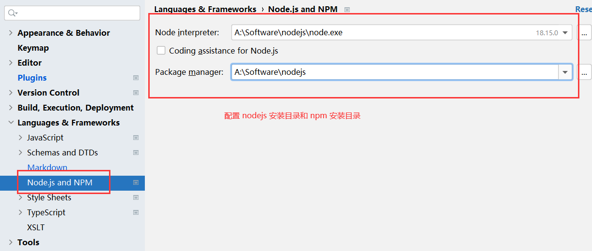

# JetBrains WebStorm安装说明

## 1、下载WebStorm

[官网下载地址](https://www.jetbrains.com/webstorm/download/other.html)

## 2、注册官方账号说明

IDEA 自版本号为 2021.2.x 开始，激活 IDEA 需要登录官方账号（没有的话需要先去官网注册一个）。

## 3、安装WebStorm

（1）启动 WebStorm-2021.1.3.exe


（2）点击 **Next >** ，选择安装目录。


（3）点击 **Next >**，根据需要选择。


（4）点击 **Next >**，点击 **Install** 。


（5）等待安装。


（6）点击 **Finish**。


## 4、第三方手段激活

在[第三方网站](https://www.jiweichengzhu.com/ide/code)下载激活包：

（1）选择激活包 **ja-netfilter**，输入下载码，下载激活包。

（2）点击下方获取正版激活码。


（3）选择对应版本的激活码。


（4）将下载激活包 `ja-netfilter.jar` 解压出来，并修改 `config`目录下的配置文件。


（5）修改 WebStorm 配置文件。

在 IDEA 安装目录 `A:\Software\JetBrains\WebStorm 2021.1.3\bin` 下找到 `idea64.exe.vmoptions` 、`idea.exe.vmoptions`两个文件，并打开。


在文件中最后一行中添加如下内容：

```txt
-javaagent:A:/Software/JetBrains/ja-netfilter/ja-netfilter.jar
```

**这个 ja-netfilter.jar 文件的路径，取决于 jar-netfilter.jar 文件存放的位置。**


（6）修改 IDEA 用户配置文件的位置。

在 IDEA 安装目录 `A:\Software\JetBrains\WebStorm 2021.1.3\bin` 下找到 `idea.properties` 文件，并打开。

找到如下内容：

```properties
# idea.config.path=${user.home}/.WebStorm/config
# idea.system.path=${user.home}/.WebStorm/system
# idea.plugins.path=${idea.config.path}/plugins
# idea.log.path=${idea.system.path}/log
```

这四行是用户配置文件默认的存放路径，将每一行起始位置的`#`删除，其中`${user.home}`指的是`A:\Users\Administrator`，`${idea.config.path}`指的是`idea.config.path`的路径，`idea.system.path`指的是`idea.system.path`；因此修改只需要将`${user.home}`替换为其他路径，就可以更换用户配置文件的存放路径。

```properties
idea.config.path=B:/Archive/Profile/.IntelliJIdea/config
idea.system.path=B:/Archive/Profile/.IntelliJIdea/system
idea.plugins.path=${idea.config.path}/plugins
idea.log.path=${idea.system.path}/log
```

（7）启动 IDEA 输入从第三方网站上获取的激活码，点击**Activate**。


# 配置WebStorm的Settings




