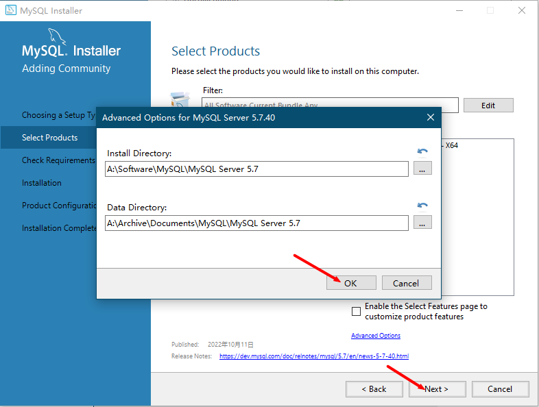

# MySQL安装说明

## 1、下载MySQL

[MySQL官网下载地址](https://www.mysql.com/cn/downloads/)

（1）找到页面中**MySQL Community Downloads**。


（2）点击页面中 **Download Archives**。


（3）点击页面中 **MySQL Community Server** 。


（4）选择下载的版本（选择5.7版本，新版本的MySQL存在一些不好解决的问题），选择安装的环境，点击右下方的 **Download** 。


## 2、安装MySQL

（1）启动 **MySQL** 安装包。


（2）勾选 **Custom** （自定义的安装的方式），点击 **Next**。


（3）点击左侧的 **+** 号，将列表展开，点击 **MySQL Server 5.7.40 x64** ，再点击 **→** 添加到需要安装的列表中。


（4）点击安装列表中的中  **MySQL Server 5.7.40 x64**，再点击下方的 **Advanced Options** 。


（5）**Install Directory** 是安装目录，**Data Directory** 是数据的数据的存放目录，可以根据需要自行更改。


（6） 依次点击 **OK** 和 **Next**。



（7）点击 **execute** 安装 **MySQL** 所需要的依赖。


（8） 等待依赖的安装。


（9）依次点击 **完成** 和 **Next** 。


（10）点击 **execute** 安装 **MySQL** 。


（11）安装完成后，点击 **Next**。


（12）点击 **Next** 对 **MySQL** 进行相关的配置。


（13）配置 MySQL 运行的环境，然后点击 **Next** 。

> Config Type: 
>
> ​       Development Computer : 安装 MySQL 的本机是一台开发环境的主机；
>
> ​       Server Computer : 安装 MySQL 的本机是一台服务器环境的主机；
>
> ​       Dedicated  Computer : 安装 MySQL 的本机是一台专用数据库主机（除了安装数据库之外，没有其他应用程序）
>
> TCP/IP : MySQL 运行时使用的主机端口号，（默认为 3306）。


（14）设置 **MySQL** 数据的 **root** 用户的登录密码。


（15）配置 **MySQL** 运行时，在服务列表中显示的名称（不能与服务列表中已存在的表项重名）。然后点击 **Next**。


（16）是否允许 **MySQL** 安装程序可以通过更新位于 **A:/Archive/Documents/MySQL/MySQL server 5.7/Data** 的文件和文件夹的权限来保护服务器的数据目录。（**保持默认即可**）


（17）点击 **execute** 。


（18）点击 **Finish** 完成 **MySQL** 数据库的配置，然后点击 **Next** 。


（19）点击 **Finish** 完成安装。


## 3、设置MySQL非自动启动

（1）右击桌面的 **此电脑** ，点击菜单栏中的 **管理** 。


（2）依次点击**服务和应用程序**中的**服务**，在右侧的服务列表中找到安装的**MySQL**。


（3）右击 **MySQL57** ，点击菜单栏中的 **属性**。


（4）将启动类型从**自动**改为**手动**，然后点击确定。


# mysql-notifier安装说明

## 1、下载mysql-notifier

[MySQL Notifier](https://downloads.mysql.com/archives/notifier/) 是一款MySQL数据库的辅助工具。它可以在系统任务栏通知区域（系统托盘）处驻留图标，用于快捷监视、更改服务器实例（服务）的状态。同时，也可以与一些图形化管理工具（如 MySQL Workbench）集成使用。 


## 2、安装mysql-notifier

（1）启动mysql-notifier安装程序。


（2）根据需要设置mysql-notifier的安装目录。


（3）点击 **Install** 安装mysql-notifier


（4）点击 **Finish** 完成安装。


## 3、开启/关闭mysql


通过右击任务栏中 mysql-notifier 的驻留图标，可以看到安装的 mysql 数据库当前的状态，通过点击 **Start**、**Stop**、**Restart** 选项，对数据库 MySQL 执行开启、关闭、重启的操作。


# MySQL常用命令

## 1、启动和关闭数据库

（1）windows系统

```shell
# 启动 mysql 数据库
net start mysql

# 关闭 mysql 数据库
net stop mysql

# 这需要注意 mysql 在 windows 系统中注册的名字不一定就是 mysql 需要先去 windows 系统的服务中看清楚
```


（2）Linux系统

```shell
# service 命令方式
# 启动 mysql 数据库
service mysql start

# 重启 mysql 数据库
service mysql restart

# 关闭 mysql 数据库
service mysql stop
```

```shell
# /ect/init.d/mysql 脚本方式,同 service 命令方式
# 启动 mysql 数据库
/etc/init.d/mysql start

# 重启 mysql 数据库
/etc/init.d/mysql restart

# 关闭 mysql 数据库
/etc/init.d/mysql stop
```

```shell
# mysqld 命令方式
# 启动 mysql 数据库
mysqld --user=mysql & # 这里的 mysql 指 Linux 系统中安装 mysql 数据库的用户
```

````shell
# mysqld_safe 命令方式
# 启动 mysql 数据库
mysqld_safe --defaults-file=/etc/my.cnf --user=mysql &

# mysqld_safe 是一个 shell 脚本,它会调用 mysqld 命令启动 mysql 数据库并监听数据库
# 当 mysql 数据库异常终止的时候, mysqld_safe 会自动重启 mysql 数据库
# 在生产环境中推荐使用
````

```shell
# mysqld_multi 命令
# 启动 mysql 数据库
mysqld_multi start

# 关闭 mysql 数据库
mysqld_multi stop

# 当一台机器存在多个 mysql 实例的时候
```

```shell
# mysqladmin 命令
# 关闭 mysql 数据库
mysqladmin -uroot -p -S /var/lib/mysql/mysql.sock shutdown

# 在生产环境中推荐使用
```

## 3、登录mysql

```shell
mysql -u root -p
```


## 3、创建数据库


## 4、创建数据表


## 2、将数据库或者数据表导出

打开命令窗口，执行如下指令

```shell
mysqldump -u root -p db_test>A:\Archive\Favorites\db_test.sql
```


# Navicat for mysql

## 1、连接mysql数据库

点击菜单左上角的 **连接** ，在下拉菜单中点击 **mysql** 。


>在弹出的窗口的 **常规** 选项卡内，
>
>（1）**连接名** 和 **主机** 保持一致方便分辨；
>
>（2）**主机** 是连接 mysql 数据库的地址，若是连接本机上的 mysql 数据库，直接使用 **localhost** 即可，若是连接非本机上的网络 mysql 数据库，**主机** 就要填写该网络 mysql 数据库的 ip 地址；
>
>（3）**端口号** 使用 3306 （mysql 数据库默认的端口号），若是修改为别的端口号，请自行更改；


>在弹出窗口的 **高级** 选项卡内：
>
>修改 **设置位置** ，即当前连接的相关信息的保存位置，Navicat 默认将信息保存在系统盘的根目录下。
>


右击新建的连接 **localhost** ，在弹出的菜单中，点击 **打开连接**。


## 2、新建数据库

右击新建的连接 **localhost** ，在弹出的菜单中点击 **新建数据库**。


>在弹出窗口的 **常规** 选项卡中：
>
>（1）输入 **数据库名称** ；
>
>（2）**字符集** 选择 utf-8 和 mysql 数据库连接的编码方式保持一致，防止中文乱码；
>
>（3）**排序规则** 选择 uft8_general_ci 即可。


右击新建的数据库 `db_test` ，在弹出菜单中，点击 **打开数据库**。


如下，即为数据库相关信息。


## 3、新建数据表

右击数据库中的 **表**（必须要先打开数据库，才能看到），在弹出菜单中，点击 **新建**表。


>在弹出的菜单，可以设置数据表的 **字段** 信息：
>
>（1）新建的表中默认只有一个字段，点击上方的 **添加字段** 可以追加新的字段；
>
>（2）点击 **插入字段** 可以在当前选中的字段前面插入一个新的字段；
>
>（3）点击 **删除字段** 可以删除当前选中的字段；
>
>（4）在下方有字符类型字段的编码，**字符集** 选择 utf-8 ，**排序规则** 选择 uft8_general_ci 和数据库的保持一致，防止中文乱码。


> 在弹出的菜单，点击 **选项** ，设置相关信息：
>
> （1）**引擎** 选择 InnoDB 这个 mysql 默认的存储引擎；
>
> （2）**字符集** 选择 utf-8 ，**排序规则** 选择 uft8_general_ci 和数据库的保持一致，防止中文乱码。


点击菜单中左上角的 **保存** 选项，在弹出的窗口中输入该数据表的名称。


## 4、数据表中文显示?

在创建的数据表在输入中文保存之后，若是所有的中文全部变成了 **?** 字符。


（1）方案一：

右击相应的连接，在选项卡中点击 **关闭连接**。


再次右击连接，在选项卡中点击 **编辑连接**。


在弹出的菜单中，点击 **高级** 选项卡，将 **编码**  修改为 **自动**。


此时，再次打开数据库的数据表，所有变成 **?** 的中文就都正常显示了。


方案二：

找到数据库的数据存放目录下找到数据库的配置文件，默认该目录存放在 mysql 的安装目录下 `C:\Program Files\MySQL\MySQL Server 5.7\my.ini` （Windows 系统环境中）。在配置文件中找到如下内容：

```ini
# The default character set that will be used when a new schema or table is
# created and no character set is defined
# character-set-server=utf8
```

将 `character-set-server` 前的 `#` 删除，将 `=` 之后的内容改为 `utf8`.

```ini
# The default character set that will be used when a new schema or table is
# created and no character set is defined
character-set-server=utf8
```

然后重启 mysql 数据库。