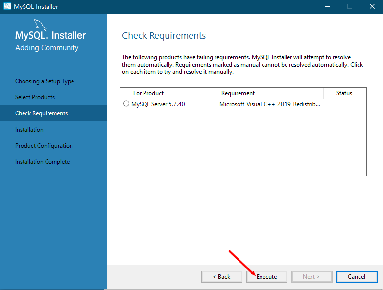

# MySQL安装说明

## 1、下载MySQL

[MySQL官网下载地址](https://www.mysql.com/cn/downloads/)

（1）找到页面中**MySQL Community Downloads**。

（2）点击页面中 **Download Archives**。

（3）点击页面中 **MySQL Community Server** 。

（4）选择下载的版本（选择5.7版本，新版本的MySQL存在一些不好解决的问题），选择安装的环境，点击右下方的 **Download** 。

## 2、安装MySQL

（1）启动 **MySQL** 安装包。

（2）勾选 **Custom** （自定义的安装的方式），点击 **Next**。

（3）点击左侧的 **+** 号，将列表展开，点击 **MySQL Server 5.7.40 x64** ，再点击 **→** 添加到需要安装的列表中。

（4）点击安装列表中的中  **MySQL Server 5.7.40 x64**，再点击下方的 **Advanced Options** 。

（5）**Install Directory** 是安装目录，**Data Directory** 是数据的数据的存放目录，可以根据需要自行更改。

（6） 依次点击 **OK** 和 **Next**。

（7）点击 **execute** 安装 **MySQL** 所需要的依赖。

（8） 等待依赖的安装。

（9）依次点击 **完成** 和 **Next** 。

（10）点击 **execute** 安装 **MySQL** 。

（11）安装完成后，点击 **Next**。

（12）点击 **Next** 对 **MySQL** 进行相关的配置。

（13）配置 MySQL 运行的环境，然后点击 **Next** 。

> Config Type: 
>
> ​       Development Computer : 安装 MySQL 的本机是一台开发环境的主机；
>
> ​       Server Computer : 安装 MySQL 的本机是一台服务器环境的主机；
>
> ​       Dedicated  Computer : 安装 MySQL 的本机是一台专用数据库主机（除了安装数据库之外，没有其他应用程序）
>
> TCP/IP : MySQL 运行时使用的主机端口号，（默认为 3306）。

（14）设置 **MySQL** 数据的 **root** 用户的登录密码。

（15）配置 **MySQL** 运行时，在服务列表中显示的名称（不能与服务列表中已存在的表项重名）。然后点击 **Next**。

（16）是否允许 **MySQL** 安装程序可以通过更新位于 **A:/Archive/Documents/MySQL/MySQL server 5.7/Data** 的文件和文件夹的权限来保护服务器的数据目录。（**保持默认即可**）

（17）点击 **execute** 。

（18）点击 **Finish** 完成 **MySQL** 数据库的配置，然后点击 **Next** 。

（19）点击 **Finish** 完成安装。

## 3、设置MySQL非自动启动

（1）右击桌面的 **此电脑** ，点击菜单栏中的 **管理** 。

（2）依次点击**服务和应用程序**中的**服务**，在右侧的服务列表中找到安装的**MySQL**。

（3）右击 **MySQL57** ，点击菜单栏中的 **属性**。

（4）将启动类型从**自动**改为**手动**，然后点击确定。

# mysql-notifier安装说明

## 1、下载mysql-notifier

[MySQL Notifier](https://downloads.mysql.com/archives/notifier/) 是一款MySQL数据库的辅助工具。它可以在系统任务栏通知区域（系统托盘）处驻留图标，用于快捷监视、更改服务器实例（服务）的状态。同时，也可以与一些图形化管理工具（如 MySQL Workbench）集成使用。 

## 2、安装mysql-notifier

（1）启动mysql-notifier安装程序。

（2）根据需要设置mysql-notifier的安装目录。

（3）点击 **Install** 安装mysql-notifier

（4）点击 **Finish** 完成安装。

## 3、开启/关闭mysql

通过右击任务栏中 mysql-notifier 的驻留图标，可以看到安装的 mysql 数据库当前的状态，通过点击 **Start**、**Stop**、**Restart** 选项，对数据库 MySQL 执行开启、关闭、重启的操作。