# springboot 相关版本说明

springboot 在2018年3月1日发布了springboot 2.0版本，这个版本完全基于 JDK 8 ，之后在2022年5月19日发布了2.7版本，该版本为2.x版本的最后一个主要版本，之后便是于2022年11月24日发布的3.x版本。

需要注意的是**从3.x版本开始springboot只支持jdk17及以上**。

Oracle在2017年的时候就将Java EE 8捐献给了Eclipse基金会，由于Oracle的限制，Eclipse基金会将产品名称更换为Jakarta EE，并使用了新的包名`jakarta.*`取代Java EE的`javax.*`。Jakarta EE 8在2019年时发布，它其实几乎没有做任何功能上的变更，主要是更换包名与品牌名称而已。而由于历史的影响，包括Spring Boot 2.x在内的主流框架，都仍然依赖的是Java EE 8，而没有迁移至Jakarta EE 8。所以在项目中导入的依赖仍然是`javax.*`，但是这一切将在Spring Boot 3.x之后改变，Spring Boot 3.x 同样迁移至了Jakarta EE 9。

# springboot支持类型和支持时间

**在支持类型方面：**

Spring Boot提供了两种支持类型，分别是：OSS support与Commercial support

**OSS support** 社区免费支持，顾名思义，这个支持是免费的，由Spring社区提供的，主要包括安全性及Bug修复补丁。支持时间较短。

**Commercial support** 商业支持，当然是收费的，在社区免费支持时间范围内提供专业支持，而在社区免费支持结束后仍然提供安全性及BUG修复相关的补丁。当然时间会更长。

**在支持时间上：**

**OSS support** 每个Spring Boot大版本，指的是Spring Boot 1或Spring Boot 2这个级别，不少于三年；而每个大版本下的主要版本，比如Spring Boot 2.1.x, Spring Boot 2.2.x这个级别，支持时间不少于一年。

**Commercial support**

商业支持的时间相应延长。

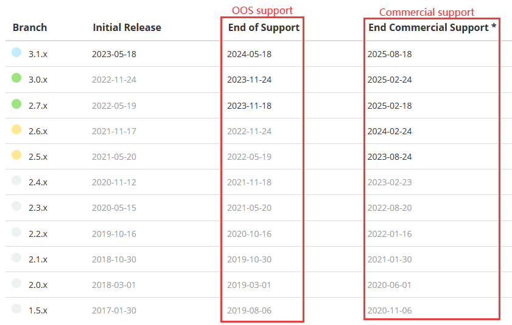

# 创建springboot项目

## 1、从springboot官网中创建springboot项目

[新建springboot项目](https://start.spring.io/)

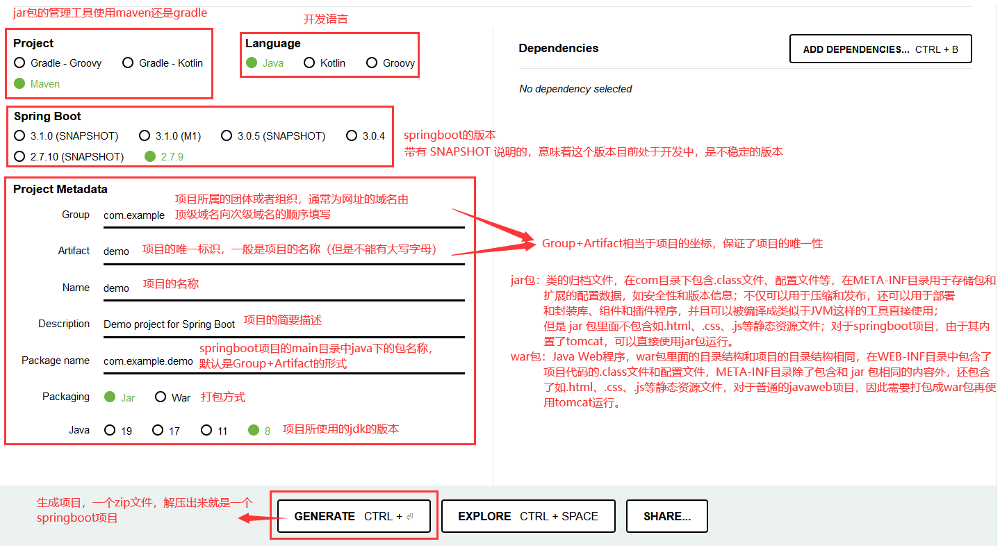

> Project：jar包的管理工具（Maven、Gradle）
>
> Language：编程语言（Java、Kotlin、Groovy）
>
> Spring Boot：springboot版本（带有 SNAPSHOT 表示这个版本目前处于开发中，属于不稳定版本）
>
> Group：项目所属的团体或者组织，通常为该团体或者组织的官方网址，从顶级域名向次级域名的顺序填写
>
> Artifact：项目的唯一标识，一般是项目的名称，**不能含有大写字母**
>
> Name：项目的名称
>
> Description：项目的简要描述
>
> Package name：springboot项目的main和test目录中java目录下的包名称，默认是Group+Artifact的形式
>
> Packaging：打包方式（jar、war）
>
> Java：项目所使用的 JDK 版本

> jar包：**类的归档文件**，在该包中的 com 目录下包含 `.class` 文件、配置文件等，META-INF 目录用于存储包和扩展的配置数据，如安全性和版本信息等；不仅可以用于压缩和发布，还可以用于部署和封装库、组件和插件程序，并且可以被编译成类似于 JVM 这样的工具直接使用；但是 jar 包中不包含 `.html`、`.css`、`.js` 等静态资源文件；对于 springboot 项目，由于其内置了 tomcat ，因此可以直接使用 jar 包运行。
>
> war包：**Java Web程序**，war 包里面的目录结构和项目的目录结构相同，在 WEB-INF 目录中包含了项目的代码的 `.class` 文件和配置文件，META-INF 目录中除了包含和 jar 包的 META-INF 目录中相同的内容外，还包含了`.html`、`.css`、`.js` 等静态资源文件，对于普通的 Java Web 项目，需要打包成 war 包，再使用 tomcat 运行。

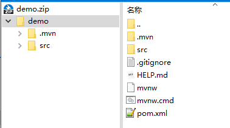

## 2、使用IDEA创建springboot项目


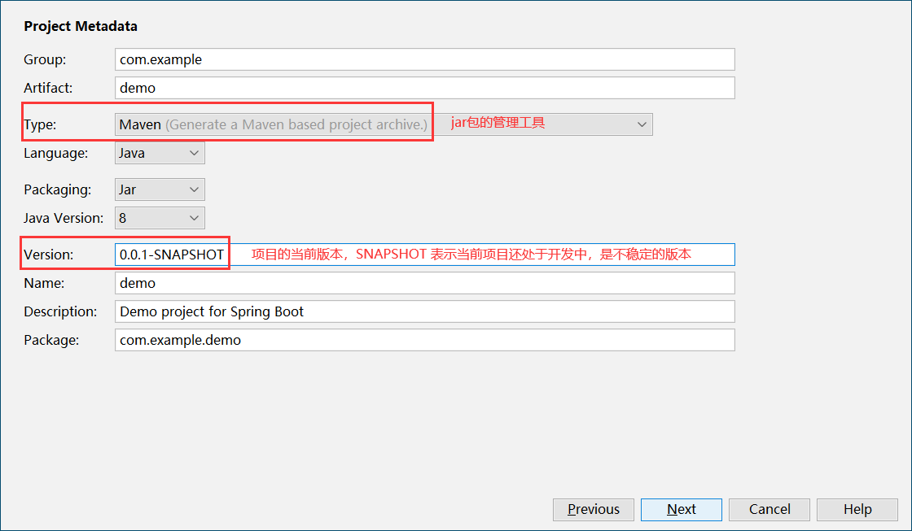


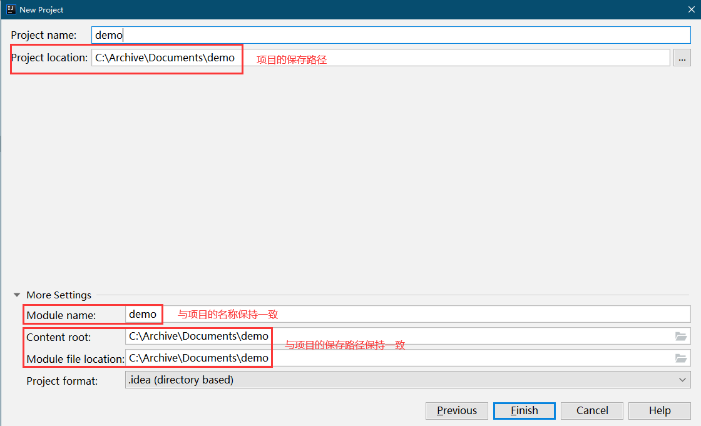


## 3、springboot项目文件目录说明

一个从 springboot 官网中创建的 springboot 项目的目录结构如下：

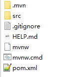

一个使用IDEA新建完成的springboot项目的目录结构如下：


> `.idea`目录是由软件IDEA建立的目录，在该目录下存放项目的配置信息，其中包括版本控制信息、历史记录等等。所以该目录与当前项目能否正常执行无关，它只是负责对代码的历史变化进行一个记录，便于回溯查找和复原。
>
> `.idea/codeStyles`目录下是本项目在IDEA中使用的代码样式配置信息。
>
> `.idea/libraries`目录下有`compiler.xml`，`encodings.xml`，`misc.xml`，`modules.xml`，`vcs.xml`，`workspace.xml`对应的分别是编辑器配置，编码配置，JS配置，项目模块配置，VSC目录映射和工作空间的相关配置信息。简单的说就是当你对项目操作的同时，编辑器就对你的重要操作进行描述记录。
>
> `.mvn`目录下的` maven-wrapper.jar `，` maven-wrapper.properties` 可以为Java工程指定某个指定的Maven版本，避免因为版本差异引起的诡异错误，统一项目的开发环境，不再需要提前安装Maven，简化了开发环境的配置，以及在项目运行时找不到maven的时候，它会自动下载一个，或者碰到你的项目maven和你环境里的mavn不兼容，它也会自动下载一个。 **但是由于服务器在国外，无论是等他自动下载还是管理非本地 jar 包，都是十分缓慢，甚至直接报错；特别是使用团体或者组织搭建的 maven 私服，有自己的配置文件和账号，使用这个玩意，还得需要知道maven下载在哪了，找到以后替换它的配置文件。**==该目录可以直接删除，使用本地安装的 maven 即可==。
>
> ├─`src`────────────────────────────────────目录是项目的源代码目录。
> │   ├─`main`
> │   │   ├─`java`─────────────────────────────────业务逻辑目录(bean, service, controller...)
> │   │   │   └─`application.java`─────────────────主程序类入口
> │   │   ├─`resources`────────────────────────────资源目录
> │   │   │   ├─`static`───────────────────────────静态资源目录(js, css, images...)
> │   │   │   ├─`templates`────────────────────────保存所有模板页面,由于SpringBoot默认使用嵌入式的tomcat默认不支持jsp页面,但可以使用模板引擎( freemarker, thymeleaf )
> │   │   │   └─`application.properties`───────────SpringBoot全局配置文件
> │   └─`test`
> │   │   └─`java`─────────────────────────────────单元测试业务逻辑目录
> └─────  └─`applocationTests.java`────────────单元测试主程序入口
>
> `.gitignore`文件当项目使用git做版本控制时用这个文件控制哪些文件或文件夹不被提交（不用git的话可删除，对项目运行没影响）。
>
> `HELP.md`文件是本项目的帮助文档，纯英文的，里面都是一些网址，==该文件可以直接删除，对项目运行没有影响==。
>
> `mvnw`程序是在**Linux操作系统**上处理mevan版本兼容问题， ==该文件可以直接删除，对项目运行没有影响==。
>
> `mvnw.cmd`程序**Windows操作系统**上处理mevan版本兼容问题， ==该文件可以直接删除，对项目运行没有影响==。
>
> `demo.iml`文件，每一个导入IDEA的项目都会生成一个项目同名的`.iml`文件，该文件用于保存你对这个项目的配置 （可以删除，但是删除了之后，程序重新导入后还会生成，而且由于配置丢失可能会造成程序异常）。

## 4、project.basedir目录

在 springboot 项目中 `${project.dir}/` 表示本项目的根目录。

## 5、classpath目录

在 springboot 项目中使用 `classpath:/` 表示本项目的 `${peoject.basedir}/src/mian/resources/` 目录。

# 引入Git/Github

## 1、IDEA中配置git

（1）点击`File`—>`Settings`


（2）点击`Version Control`—>`Git`—>`...`(选择git的安装路径)—>`Test`

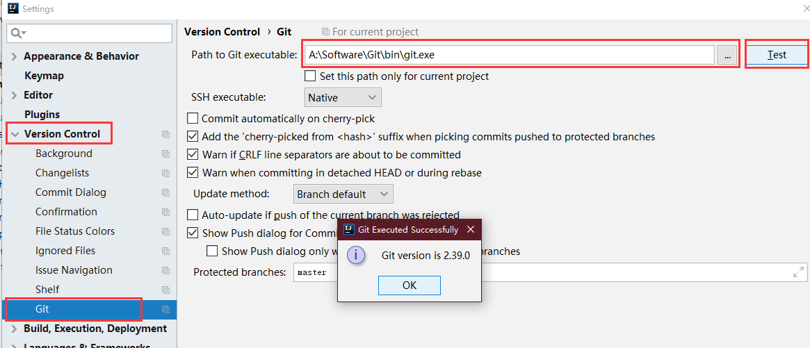

## 2、在github中创建repository

（1）登录github官网，点击`New`新建repository

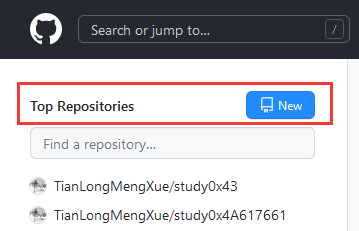

（2）填写 repository 相关信息，创建 repository

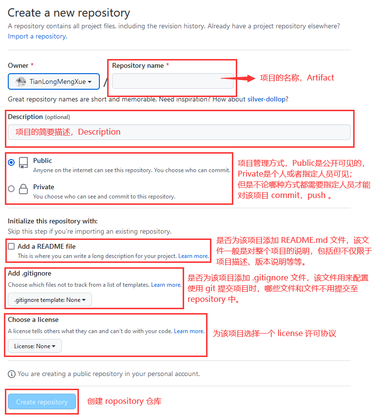

（3）关于License许可协议

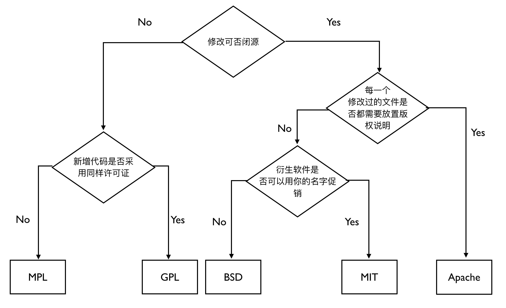

首先没有 License 的内容是默认会被版权保护，如果你想要的是开放给大家使用，就需要选择一个合适的 License ，只有这样才能赋予任何人使用、分享和修改这个软件的权力；MIT 最自由，简直就是没有任何限制，任何人都可以售卖我的软件，甚至可以用我的名字促销。BSD 和 Apache 协议也很自由，跟 MIT  的区别分别是不允许用作者本人名义促销和保护作者版权。GPL 可以说最霸道，对代码的修改部分也必须是 GPL 的，同时基于 GPL  代码而开发的代码也必须按照 GPL 发布，而 MPL ，也就是 Mozilla Public License  就温和一些，如果后续开发的代码中添加了新文件，同时新文件中也没有用到原来的代码，那么新文件可以不必继续沿用 MPL 。 

## 3、将新建的springboot项目上传至github

（1）将新建的 repository 使用 HTTPS 克隆到本地

启动 git 输入如下指令：

```shell
git clone "url"
```

==这里的 URL 是 repository 的 HTTPS 地址==。


（2）将创建的 springboot 项目复制到克隆到本地的 repository 中

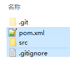

（3）在**该目录下**打开 git ，将项目上传，依次输入以下指令：

```shell
git branch -M main
git add src/ .gitignore pom.xml
git commit -m "init"
git push
```

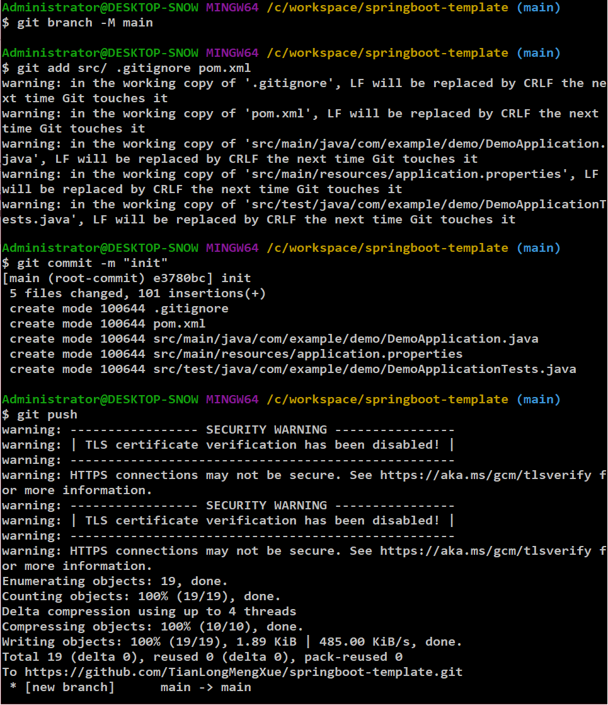

（4）刷新 github 上的 repository 界面，就能看到已经上传成功的内容

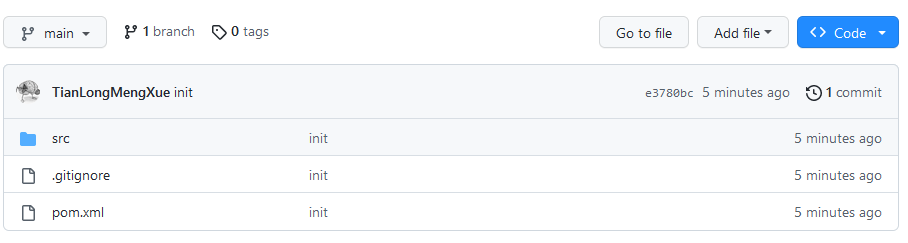

## 4、使用 IDEA 将项目的修改上传至 github

（1）使用 IDEA 打开 springboot 项目

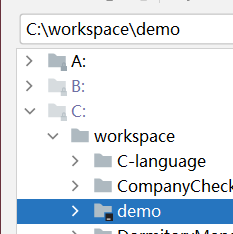

（2）

# 配置本地maven相关参数

## 1、配置全局maven使用阿里云镜像

本地安装的 maven 默认使用的是中央仓库，这个中央仓库的服务器在国外，这就导致了在使用过程中会出现下载 jar 包的过程十分漫长，而且有极大可能在等待许久之后，maven 直接报错的情况，因此需要在maven的`setting.xml`添加如下内容（A:\Software\Apache\maven-3.6.1\conf），这样配置之后，**所有的使用maven管理 jar 包的项目都默认使用阿里云镜像**。 通过使用国内的 jar 包仓库，可以加速 jar 包的下载。在`mirrors`节点里面添加子节点：

```xml
<mirror>
    <id>nexus-aliyun</id>
    <mirrorOf>central</mirrorOf>
    <name>Nexus aliyun</name>
    <url>http://maven.aliyun.com/nexus/content/groups/public</url>
</mirror>
```

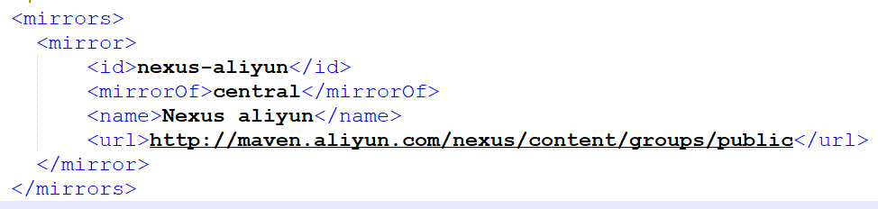

## 2、配置单个项目中maven使用阿里云镜像

在springboot项目的`pom.xml`文件中的`repositories`节点里面添加子节点：

```xml
<repository>
	<id>central</id>
	<name>aliyun maven</name>
	<url>http://maven.aliyun.com/nexus/content/groups/public/</url>
	<layout>default</layout>
	<!-- 是否开启发布版构件下载 -->
	<releases>
		<enabled>true</enabled>
	</releases>
	<!-- 是否开启快照版构件下载 -->
	<snapshots>
		<enabled>false</enabled>
	</snapshots>
</repository>
```

 注意：Maven默认中央仓库的 id 为 central，这个 id 是唯一的，因此使用`<id>central</id>`覆盖了默认的中央仓库。 

## 3、配置maven的本地仓库的路径

在maven的`setting.xml`添加如下内容（A:\Software\Apache\maven-3.6.1\conf），这样配置之后，**所有使用 maven 管理 jar 包的项目都会在这个路径下检索所需的 jar 包，以及远程下载的 jar 包也会保存在这个路径下 **。 在`settings`节点里面添加子节点：

```xml
<localRepository>B:\Archive\MavenRepository</localRepository>
```

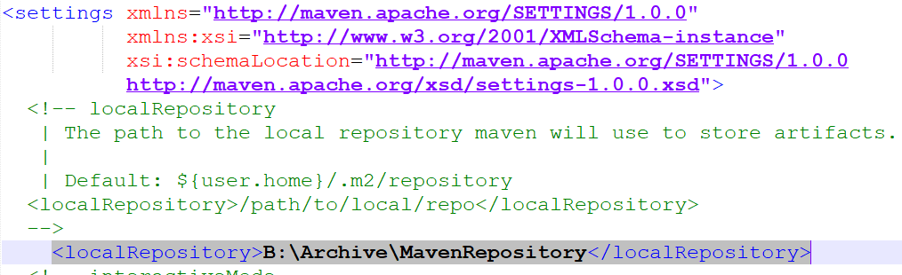

在IDEA中`Settings`—>`Build,Execution,Deployment`中点击`Override`指定`Settings.xml`和本地仓库的路径。

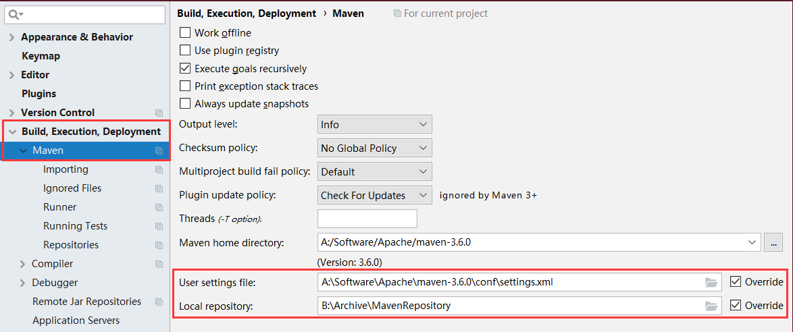

## 3、在IDEA中配置maven加载本地jar包

一般情况，maven 管理的 jar 包都是从中央仓库下载到本地仓库之后加载到项目中使用，但是也有一些自定义的 jar 包既不在中央仓库中、也不在本地仓库、甚至连组织或者团体自行构建的 maven 私服中也没有，这个时候就只能自行添加到项目中，然后在项目中配置 maven 对自定义 jar 包的管理。

（1）点击项目的根目录，点击`New`–>`Directory`，新建一个名为`lib`的目录。


（2）点击`File`—>`Project Structure`–->`Moudles`—>`DEpendencies`—>`+`—>`1 JARs or directories`选中刚才新建的目录`lib`

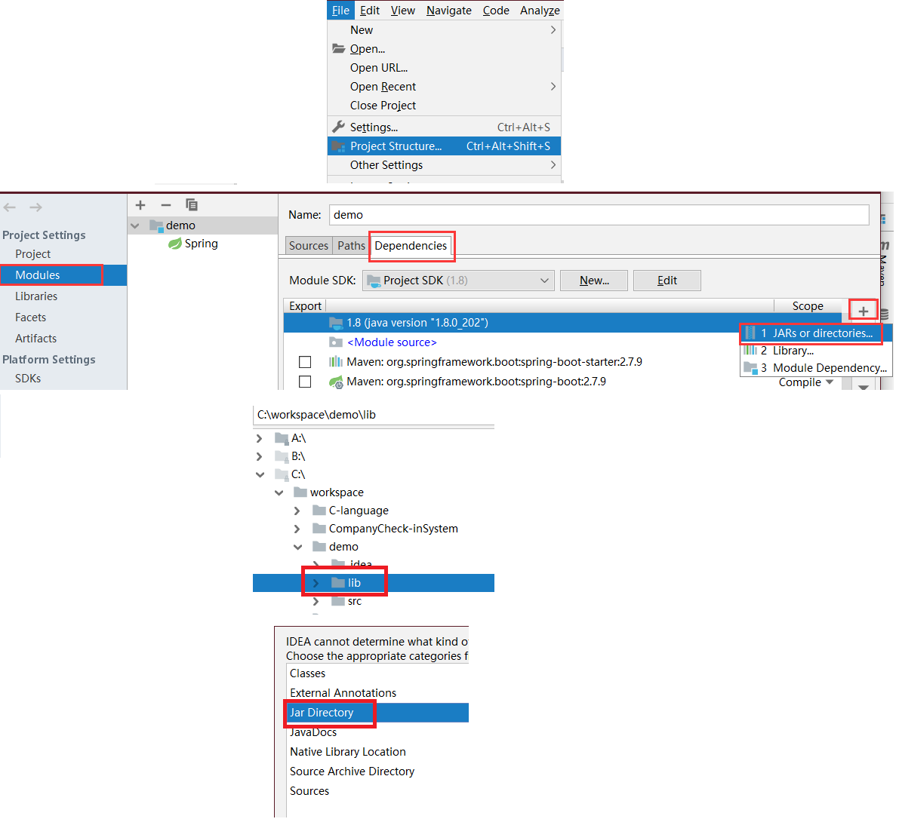


# 设置IDEA默认的换行符

点击`File`—>`Settings`––>`Editor`—>`Code Style`—>`Line`在`General`选项卡中点击`Line seperator`选择需要的文件换行符。

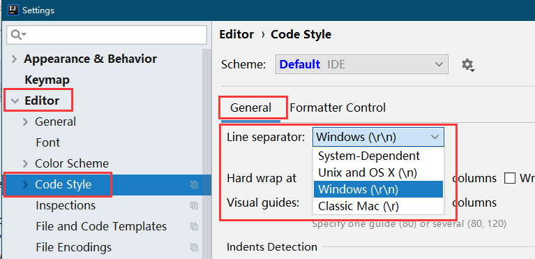

> `CR`是**MAC操作系统**老版本的文件行结尾标记，表示**回车**，但是后来的**MAC操作系统**统一换成`LF`，`LF`是**Unix和类Unix操作系统**的文件行结尾标记，表示**换行**，微软的**Windows操作系统**采用的是**CRLF**，表示**回车并换行**。 
>
> 在**电传打字机**中， 需要同时使用**换行符 (LF) 和回车符 (CR)** 以允许打字员从下一行文本的开头输入，单独使用**换行符 (LF)**只能让输入位置改变到下一行中相同列的位置，而单独使用**回车符 (CR)**只能让输入位置改变到本行的起始位置；后来在计算机中，由于当时内存的价格十分昂贵，且容量也十分有限，因此就提出了只使用**换行符 (LF) **同时实现换行和回车。
>
> 现代的打印机和众多的网络协议中所使用的字符流中也是使用`CRLF`作为文件的行结尾标记。

# application.properties


## 1、修改项目运行时的端口号

springboot的 web 项目在启动时，由于其内置的默认 web application 是 tomcat 因此在启动时的默认端口号为 **8080**。通过在文件`${project.basedir}/src/main/resources/application.properties`中添加如下内容，修改启动时的端口号。

```shell
server.port=65535
```

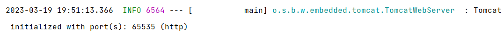

## 2、perperties文件给实体类赋值

（1）在 properties 文件中声明实体类的各个属性

```properties
name=梦雪
age=18
happy=false
birth=2099/05/08
```

（2）在实体类中导入 properties 文件，并使用`@Value("str")`和 SPeL 表达式赋值

```java
package com.example.demo.pojo;

import org.springframework.beans.factory.annotation.Value;
import org.springframework.context.annotation.PropertySource;
import org.springframework.stereotype.Component;

import java.util.Date;
import java.util.List;
import java.util.Map;

@Component
// classpath 指的是 ${project.basedir}/src/main/resources/
@PropertySource(value = "classpath:application.properties")
public class Person {
    // 使用 @Value 赋值,但是 @Value 不支持复杂的数据类型
    @Value("${name}")
    private String name;
    @Value("${age}")
    private Integer age;
    @Value("${happy}")
    private Boolean happy;
    @Value("${birth}")
    private Date birth;
    private Map<String,Object> maps;
    private List<Object> lists;
    private Dog dog;

    public Person(String name, Integer age, Boolean happy, Date birth, Map<String, Object> maps, List<Object> lists, Dog dog) {
        this.name = name;
        this.age = age;
        this.happy = happy;
        this.birth = birth;
        this.maps = maps;
        this.lists = lists;
        this.dog = dog;
    }
    public Person() {
    }
    public String getName() {
        return name;
    }
    public void setName(String name) {
        this.name = name;
    }
    public Integer getAge() {
        return age;
    }
    public void setAge(Integer age) {
        this.age = age;
    }
    public Boolean getHappy() {
        return happy;
    }
    public void setHappy(Boolean happy) {
        this.happy = happy;
    }
    public Date getBirth() {
        return birth;
    }
    public void setBirth(Date birth) {
        this.birth = birth;
    }
    public Map<String, Object> getMaps() {
        return maps;
    }
    public void setMaps(Map<String, Object> maps) {
        this.maps = maps;
    }
    public List<Object> getLists() {
        return lists;
    }
    public void setLists(List<Object> lists) {
        this.lists = lists;
    }
    public Dog getDog() {
        return dog;
    }
    public void setDog(Dog dog) {
        this.dog = dog;
    }
    @Override
    public String toString() {
        return "Person{" +
                "name='" + name + '\'' +
                ", age=" + age +
                ", happy=" + happy +
                ", birth=" + birth +
                ", maps=" + maps +
                ", lists=" + lists +
                ", dog=" + dog +
                '}';
    }
}
```

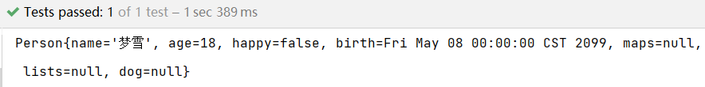


# application.yaml

springboot 的相关配置虽然可以使用配置文件`classpath:/application.properties`，但是 springboot 官方**推荐**使用配置文件`classpath:/application.yaml`。

`.yml` 或 `.yaml` 是使用YAML语言编写的一种以数据为中心的配置文件形式，比json、xml更适合作为配置文件。

## 1、yaml文件基本语法

yaml 文件是基于**key: value**键值对的方式，且对于**空格**要求十分的严格：

```yaml
name:snow # 错误写法
name: snow # 正确写法
```

key:(空格)value ，字面值直接写，字符串默认不需要加上单引号或是双引号。由双引号包裹的内容中，若有特殊字符，则特殊字符会作为本身想要表达的意思：

```yaml
name: "zhangsan \n lisi"
# 输出：zhangsan 换行 lisi
```

由单引号包裹的内容中，若有转义字符，则转义字符智慧作为普通的字符串数据输出：

```yaml
name: 'zhangsan \n lisi'
# 输出：zhangsan \n lisi
```

在 yaml 文件中声明一个 student 对象（或者一个 Map），该对象有两个属性 name 和 age ，YAML 语法中使用空格的缩进来控制层级关系，只要是左对齐的一列数据，都同属于一个层级：

```yaml
# 错误写法,声明了三个对象 student, name, age
student:
name: snow
age: 18

# 错误写法,声明了一个对象 student,但是该对象内还包含了一个 name 对象
student:
 name: snow
  age: 18
  
# 正确写法
student:
 name: snow
 age: 18
 
# 或者使用如下的写法也是正确的
student: {name: snow,age: 18}
```

在 yaml 文件中声明一个数组 pets ，包含三个元素 cat，dog，pig

```yaml
pets:
 - cat
 - dog
 - pig

# 或者使用如下的写法也是正确的
pets: [cat,dog,pig]
```

**注：在YAML语法中，属性和属性值是大小写敏感的。**

## 2、yaml文件直接给实体类赋值

一般情况下，使用`@Value("str")`的方式便可以给实体类赋值

```java
package com.example.demo.pojo;

import org.springframework.beans.factory.annotation.Value;
import org.springframework.stereotype.Component;

@Component // 注册为 spring 组件,并添加到 spring 组件中
public class Dog {
    @Value("旺财")
    private String name;
    @Value("3")
    private Integer age;
    public String getName() {
        return name;
    }
    public void setName(String name) {
        this.name = name;
    }
    public Integer getAge() {
        return age;
    }
    public void setAge(Integer age) {
        this.age = age;
    }
    public Dog(String name, Integer age) {
        this.name = name;
        this.age = age;
    }
    public Dog() {
    }
    @Override
    public String toString() {
        return "Dog{" +
                "name='" + name + '\'' +
                ", age=" + age +
                '}';
    }
}
```

```java
package com.example.demo;

import com.example.demo.pojo.Dog;
import org.junit.jupiter.api.Test;
import org.springframework.beans.factory.annotation.Autowired;
import org.springframework.boot.test.context.SpringBootTest;

@SpringBootTest
class DemoApplicationTests {
    @Autowired // 自动注入 spring 组件
    private Dog dog;
    @Test
    void contextLoads() {
        System.out.println(dog.toString());
    }
}

```

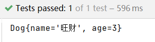

**但是很明显，若是一个实体类有多个成员属性，那么这种使用`@Value("str")`的方式就过于麻烦了，而且不方便后期修改。**所以在 yaml 文件中将实体类的相关属性都声明出来，然后使用 yaml 文件对该实体类进行赋值。

```yaml
person:
  name: snow
  age: 18
  happy: false
  birth: 2099/05/08
  maps: {water: 65%,feiwu: 100%}
  lists:
    - code
    - springboot
    - java
  dog:
    name: wangcai
    age: 3
```

```java
package com.example.demo.pojo;

import org.springframework.boot.context.properties.ConfigurationProperties;
import org.springframework.stereotype.Component;

import java.util.Date;
import java.util.List;
import java.util.Map;

@Component
// 将实体类 Perosn 和 yaml 文件中的 person 绑定,并将对应配置文件中每一个属性的值映射到实体类中
@ConfigurationProperties(prefix = "person")
public class Person {
    private String name;
    private Integer age;
    private Boolean happy;
    private Date birth;
    private Map<String,Object> maps;
    private List<Object> lists;
    private Dog dog;

    public Person(String name, Integer age, Boolean happy, Date birth, Map<String, Object> maps, List<Object> lists, Dog dog) {
        this.name = name;
        this.age = age;
        this.happy = happy;
        this.birth = birth;
        this.maps = maps;
        this.lists = lists;
        this.dog = dog;
    }
    public Person() {
    }
    public String getName() {
        return name;
    }
    public void setName(String name) {
        this.name = name;
    }
    public Integer getAge() {
        return age;
    }
    public void setAge(Integer age) {
        this.age = age;
    }
    public Boolean getHappy() {
        return happy;
    }
    public void setHappy(Boolean happy) {
        this.happy = happy;
    }
    public Date getBirth() {
        return birth;
    }
    public void setBirth(Date birth) {
        this.birth = birth;
    }
    public Map<String, Object> getMaps() {
        return maps;
    }
    public void setMaps(Map<String, Object> maps) {
        this.maps = maps;
    }
    public List<Object> getLists() {
        return lists;
    }
    public void setLists(List<Object> lists) {
        this.lists = lists;
    }
    public Dog getDog() {
        return dog;
    }
    public void setDog(Dog dog) {
        this.dog = dog;
    }
    @Override
    public String toString() {
        return "Person{" +
                "name='" + name + '\'' +
                ", age=" + age +
                ", happy=" + happy +
                ", birth=" + birth +
                ", maps=" + maps +
                ", lists=" + lists +
                ", dog=" + dog +
                '}';
    }
}
```

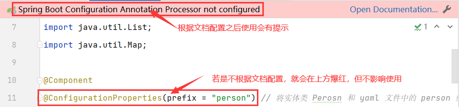

在文件 pom.xml 添加如下依赖，可以解决上述爆红问题。

```xml
<dependency>
	<groupId>org.springframework.boot</groupId>
	<artifactId>spring-boot-configuration-processor</artifactId>
</dependency>
```

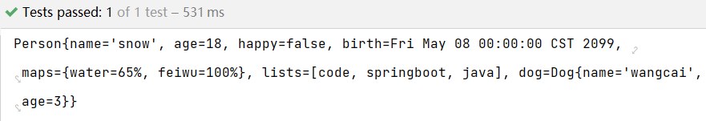

通过上面的对比，可以发现使用`@ConfigurationProperties(prefix = "person")`的方式要比`@Value()`方式更快捷、更方便，不仅如此`@ConfigurationProperties`的功能也更加强大。

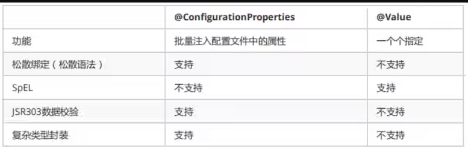

## 3、yaml文件中使用随机值

```yaml
person:
  name: snow${random.uuid} // 随机生成一个 uuid
  age: ${random.int} // 随机一个 int 类型的整数
  happy: false
  birth: 2099/05/08
  maps: {water: 65%,feiwu: 100%}
  lists:
    - ${person.happy:name} // 若是 person 有 happy 这个属性,那么就输出 happy 的值,否则输出 name
    - ${person.hello:hello} // 若是 person 有 hello 这个属性,那么就输出 hello 的值,否则输出 hello
    - java
  dog:
    name: ${random.value} // 随机生成一个字符串
    age: 3
```

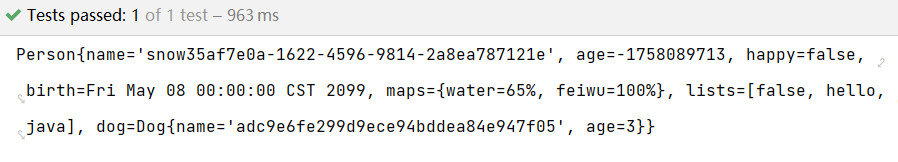

## 4、yaml的松散语法

```java
package com.example.demo.pojo;

import org.springframework.stereotype.Component;
import org.springframework.boot.context.properties.ConfigurationProperties;

@Component
@ConfigurationProperties(prefix = "person")
public class Dog {
    private String firstName; // 这里使用驼峰命名法
    private Integer age;
    public String getName() {
        return name;
    }
    public void setName(String name) {
        this.name = name;
    }
    public Integer getAge() {
        return age;
    }
    public void setAge(Integer age) {
        this.age = age;
    }
    public Dog(String name, Integer age) {
        this.name = name;
        this.age = age;
    }
    public Dog() {
    }
    @Override
    public String toString() {
        return "Dog{" +
                "name='" + name + '\'' +
                ", age=" + age +
                '}';
    }
}
```

```yaml
Dog:
 firstname: 旺财
 # first-name: 旺财
 # first_name:旺财
 age: 3
 
# 以上的三种方式都可以正确的为 firstName 赋值
```

## 5、yaml使用JSR303校验

使用 JSR303 校验需要在文件 pom.xml 中导入如下依赖：

```xml
<dependency>
	<groupId>org.springframework.boot</groupId>
	<artifactId>spring-boot-starter-validation</artifactId>
</dependency>
```

| Constraint                | 详细信息                                                   |
| ------------------------- | ---------------------------------------------------------- |
| @Null                     | 被注释的元素必须为null                                     |
| @NotNull                  | 被注释的元素必须不为null                                   |
| @AssertTrue               | 被注释的元素必须为true                                     |
| @AssertFalse              | 被注释的元素必须为false                                    |
| @Min(value)               | 被注释的元素必须为一个数字，且其值必须大于等于指定的最小值 |
| @Max(value)               | 被注释的元素必须为一个数字，且其值必须小于等于指定的最大值 |
| @DecimalMin(value)        | 被注释的元素必须为一个数字，且其值必须大于等于指定的最小值 |
| @DecimalMax(value)        | 被注释的元素必须为一个数字，且其值必须小于等于指定的最大值 |
| @Size(max, min)           | 被注释的元素的大小必须在指定的范围内                       |
| @Digits(integer,fraction) | 被注释的元素必须为一个数字，且其值必须在可以接受的范围内   |
| @Past                     | 被注释的元素必须是一个过去的日期                           |
| @Future                   | 被注释的元素必须是一个将来的日期                           |
| @Pattern(value)           | 被注释的元素必须符合指定的正则表达式                       |
| @Email                    | 被注释的元素必须是一个电子邮箱的地址                       |
| @Length                   | 被注释的字符串的长度必须在指定的范围内                     |
| @NotEmpty                 | 被注释的字符串必须非空                                     |
| @Range                    | 被注释的元素必须在合适的范围内                             |

## 6、yaml文件的位置

（1）`${project.basedir}/config/`

（2）`${project.basedir}/`

（3）`classpath:/config/`

（4）`classpath:/`

上述目录下的 yaml 文件执行的优先级顺序为从上至下。

>   springboot 项目运行时，项目中配置文件都会加载，但是当配置信息中有冲突时，加载顺序为 yml > yaml > properties
>
>   springboot 项目运行时，使用非项目路径下的外部配置文件时，和项目 jar 包同路径下的 properties 文件优先级最高，其次是同路径下的文件夹中的配置文件。

## 7、多环境下的yaml配置文件

在项目的`classpath:/`下创建`application.yaml`、`application-dev.yaml`、`application-test.yaml`三个配置文件。

（1）application-dev.yaml

```yaml
server:
 port: 8081
```

（2）application-test.yaml

```yaml
server:
 port: 8082
```

（3）application.yaml

```yaml
spring:
 profiles:
  avtive: dev
```

如上配置之后，当运行项目时，会自动加载 `application-dev.yaml` 中的配置。


以上的三个文件也可以卸载同一个配置文件中

```yaml
spring:
  profiles:
    active: dev
---
server:
  port: 8081
spring:
  config:
    activate:
      on-profile: dev
---
server:
  port: 8082
spring:
  config:
    activate:
      on-profile: test
```


# banner

## 1、banner基本说明

springboot 项目在启动的时候会在控制台中默认输出如下内容：

```shell
  .   ____          _            __ _ _
 /\\ / ___'_ __ _ _(_)_ __  __ _ \ \ \ \
( ( )\___ | '_ | '_| | '_ \/ _` | \ \ \ \
 \\/  ___)| |_)| | | | | || (_| |  ) ) ) )
  '  |____| .__|_| |_|_| |_\__, | / / / /
 =========|_|==============|___/=/_/_/_/
 :: Spring Boot ::               (v2.7.10)
```

这个文字图形在 springboot 中被称为 banner 。

## 2、自定义banner

在 `classpath:/` 目录下新建一个文本文件 **banner.txt** 并在文件中添加如下内容：

```text
*************************************************************************
这是一个 springboot 测试项目
*************************************************************************
```

运行 springboot 项目时，就会输出 **banner.txt** 文件中的内容。

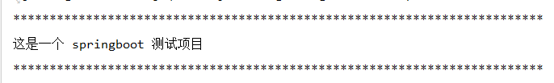

还可以在 **application.yaml** 文件中添加 `spring.banner.location=path` 的方式指定 banner.txt 文件的位置。

````yaml
spring.banner.location=classpath:/config/Banner.txt
````

````text
*************************************************************************
这是 classpath:/config/Banner.txt 文件中的 banner
*************************************************************************
````

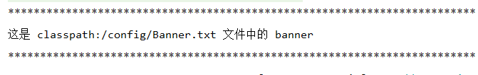

# springboot自动配置的原理-----待整理

[springboot 2.7.9 api](https://docs.spring.io/spring-boot/docs/2.7.9/api/)

## 1、核心依赖

在文件`${project.basedir}/pom.xml`中`spring-boot-starter-parent`继承了一个核心依赖`spring-boot-dependecise`，在这个依赖中包含了各类 jar 包的版本号信息。

````xml
<parent>
	<groupId>org.springframework.boot</groupId>
	<artifactId>spring-boot-starter-parent</artifactId>
	<version>2.7.9</version>
	<relativePath/>
</parent>
````

````xml
<parent>
    <groupId>org.springframework.boot</groupId>
    <artifactId>spring-boot-dependencies</artifactId>
    <version>2.7.9</version>
</parent>
````

```xml
<groupId>org.springframework.boot</groupId>
<artifactId>spring-boot-dependencies</artifactId>
<version>2.7.9</version>
```

因此在引入一些springboot所需的依赖时，不需要指定其版本，这些依赖在核心依赖中已经配置了默认的版本。

## 2、启动器

在一个springboot项目中包含多个启动器（或者叫启动场景），如`spring-boot-starter`、`spring-boot-starter-test`、`spring-boot-starter-web`等，这些启动器会将所需要的依赖自动导入到项目中；所以启动器实际上就是 springboot 封装的一个一个的功能场景。

```xml
<dependencies>
    <!-- web 应用的启动器 -->
		<dependency>
			<groupId>org.springframework.boot</groupId>
			<artifactId>spring-boot-starter-web</artifactId>
		</dependency>
    <!-- springboot 主程序的启动器 -->
		<dependency>
			<groupId>org.springframework.boot</groupId>
			<artifactId>spring-boot-starter</artifactId>
		</dependency>
    <!-- springboot 单元测试程序的启动器 -->
		<dependency>
			<groupId>org.springframework.boot</groupId>
			<artifactId>spring-boot-starter-test</artifactId>
			<scope>test</scope>
		</dependency>
</dependencies>
```

当项目需要使用什么功能时，只需要导入相应的启动器就可以了。

## 3、主程序

```java
// @SpringBootApplication 标注这个类是一个springboot的应用,导入启动类下的所有资源
@SpringBootApplication
public class DemoApplication {
	public static void main(String[] args) {
        // 启动 springboot 应用
		SpringApplication.run(DemoApplication.class, args);
	}
}
```

（1）`@SpringBootApplication`

```java
// @SpringBootConfiguration 这个注解是 springboot 的配置
@SpringBootConfiguration
	@Configuration // spring 配置类,由此可知 @SpringBootConfiguration 也是一个 spring 配置类
		@Component // spring 组件,由此可知 @SpringBootConfiguration 也是一个 spring 组件
// @EnableAutoConfiguration 自动配置
@EnableAutoConfiguration
	@AutoConfigurationPackage // 自动配置包
		@Import({Registrar.class}) // 自动配置'包注册'
	@Import({AutoConfigurationImportSelector.class}) // 自动配置导入选择类
// @ComponentScan 扫描目标下的文件
@ComponentScan(
    excludeFilters = {@Filter(
    type = FilterType.CUSTOM,
    classes = {TypeExcludeFilter.class}
), @Filter(
    type = FilterType.CUSTOM,
    classes = {AutoConfigurationExcludeFilter.class}
)}
)
```

# 引入spring-boot-starter-web

springboot 的 web 启动器，集成了如 web、webMVC、JSON、Tomcat等基础依赖组件，为 web 开发场景提供所需要的依赖。

## 1、添加依赖

在文件`${project.basedir}/pom.xml`文件中的`<dependencies></dependencies>`中添加如下内容。

```xml
<dependency>
	<groupId>org.springframework.boot</groupId>
	<artifactId>spring-boot-starter-web</artifactId>
</dependency>
```

这里`<version></version>`标签可以省略，在 `spring-boot-starter-parent` 中已经配置了默认的版本号。

## 2、启动项目输出

（1）编写文件`${project.basedir}/src/main/java/com/example/demo/controller/HelloWorldController.java`

```java
@Controller
@RequestMapping("/")
public class HelloWorldController {
    @GetMapping ("/hello")
    @ResponseBody
    public String hello () {
        return "Hello World!";
    }
}
```

以上的注解还可以使用如下的方式：

```java
@RestController
public class HelloWorldController {
    @GetMapping ("/hello")
    public String hello () {
        return "Hello World!";
    }
}
```

（2）启动浏览器，在地址栏中输入`localhost:8080/hello`，页面显示`HelloWorld!`


## 3、controller控制器

web 启动器提供了`@Controller`和`@RestController`两种注解用来标识控制类，负责接受和处理 HTTP 请求。

（1）`@Controller`注解

当 HTTP 请求的内容是页面或者数据时。

```java
@Controller
public class HelloController {
    @RequestMapping ("/hello")
    public String hello (ModelMap map) {
        map.addAttribute("name", "snow");
        return "Hello";
    }
}
```

在这个例子中，`HelloController`类型返回的是一个**hello.html**页面和**name: snow**的数据，通常`@Controller`注解与 thymeleaf 模板引擎结合使用，在**hello.html**页面中使用`${name}$`将数据显示出来。 

对于使用`@Controller`的类，其内的方法必须使用`@ResponseBody`注解，才能使用`return`返回字符串或者JSON格式的数据。

（2）`@RestController`注解

当 HTTP 请求的内容是数据时，使用`@RestController`注解的类，其内的方法返回的数据是文本内容，且默认将对象数据转换为JSON格式。

```java
@RestController
public class UserController {
    @RequestMapping ("/user")
    public User getUser () {
        User user = new User();
        user.setName("snow");
        user.setAge(18);
        return user;
    }
}
```

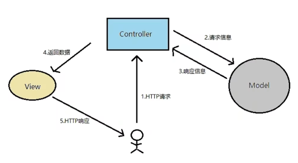

## 4、路由映射

web 启动器提供了`@RequestMapping`注解负责 URL 路由映射，接收 http 请求。

（1）注解标识的位置

`@RequestMapping`可以添加到Controller类或者Controller类中的方法上。若是添加到Controoler类上，那么这个Controller类中所有方法的URL都会被映射到这个URL路由下；若是添加到方法上，那么这个方法会被映射到这个URL路由下，且只对这个方法有效。

（2）注解的属性参数

 `@RequestMapping`常用的属性参数有`value`（URL路径，支持URL模板、正则表达式）、`method`（HTTP 请求的方法）、`consumes`（可选，请求的媒体类型，如application/JSON）、`produces`（响应的媒体类型）、`params，headers`（请求的参数及请求头的值）。

① `value`：如`@RequestMapping("/user")`，这种基本的URL路径；`@RequestMapping("/user/*.json")`这种使用通配符的URL路径。

>   通配符有`*`、`**`、`?`三种形式，其中`*`表示匹配任意字符，`**`表示匹配任意路径，`?`表示匹配任意一个字符。
>
>   优先级：`/user/add.json `>`/user/*.json`>`/user/**.json`

```java
@RequestMapping(value="/hello/**",method= RequestMethod.GET)
    public String hello () {
        return "Hello World!";
    }
```


**通配符的方式一般不使用。**

②`method`：HTTP 请求中有 GET、POST、PUT、DELETE等方法。在注解`@RequestMapping`中提供了`RequestMethod.GET`、`RequestMethod.POST`、`RequestMethod.PUT`、`RequestMethod.DELETE`等值，分别对应HTTP请求的方法；若是不使用method方法指定HTTP请求的方式，那么所有的HTTP请求方式都通过路由映射可以访问。

```java
@RequestMapping(value="/user",method=RequestMethod.GET)
```

除此之外，web 启动器还提供了`@GetMapping`、`@PostMapping`等注解代替上述使用method属性的`@RequestMapping`注解。

```java
@GetMapping("path") <==> @RequestMapping(value="path",method=RequesMethod.GET)
只能支持get方法请求

@PostMapping("path") <==> @RequestMapping(value="path",method=RequesMethod.POST)
只能支持post方法请求

@PutMapping("path") <==> @RequestMapping(value="path",method=RequesMethod.PUT)
只能支持put方法请求，修改方法，可用post代替

@DeleteMapping <==> @RequestMapping(value="path",method=RequesMethod.DELETE)
只能支持delete方法请求，删除方法，可用get代替
```

## 5、controller获取get请求中的数据

HTTP 请求使用 GET 方法携带了一些参数，向controller发送请求，此时，controller需要获取到这些数据。

>   localhost:8080/hello?name=snow

```java
// controlelr获取这个 get 请求中参数name携带的数据snow
@RestController
public class HelloController{
    @RequestMapping(value="/hello",method=RequestMethod.GET)
    // <==> @GetMapping("/hello")
    // 这里HTTP请求发送的数据通常都是文本,所以这里使用String类型接收数据
    public String hello(String name){
        return "hello "+name;
    }
}
```


>   localhost:8080/hello?name=snow&age=18

```java
// controlelr获取这个 get 请求中参数name携带的数据snow以及age携带的数据18
@RestController
public class HelloController{
    @RequestMapping(value="/hello",method=RequestMethod.GET)
    public String hello(String name,String age){
        return "hello "+name+" "+age;
    }
}
```


除了直接接收这些参数，还可以通过`@RequestParam`对这些参数添加一些条件。

>   localhost:8080/hello?nickname=snow

```java
@RestController
public class HelloController{
    @RequestMapping(value="/hello",method=RequestMethod.GET)
    // 当get请求中使用nickname传递参数时,将其映射到方法hello的name参数
    // 否则无法将nickname携带的数据赋值给方法hello的name参数
    // required=false表示get请求中这个参数不是必须的,
    // 否则get请求中必须包含这个参数,不然这个get请求就是非法的 0
    public String hello(@RequestParam(value="nickname",required=false) String name){
        return "hello "+name;
    }
}
```

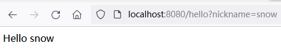

## 6、controller获取post请求中的数据

HTTP 请求使用 POST方法携带了一些参数，向controller发送请求，此时，controller需要获取到这些数据。

```java
@RestController
public class HelloController{
    @RequestMapping(value="/hello",method=RequestMethod.POST)
    public String hello(){
        return "POST请求";
    }
}
```

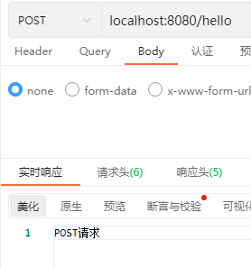

````java
@RestController
public class HelloController{
    @RequestMapping(value="/hello",method=RequestMethod.POST)
    public String hello(String name,String age){
        return "POST请求"+name+" "+age;
    }
}
````

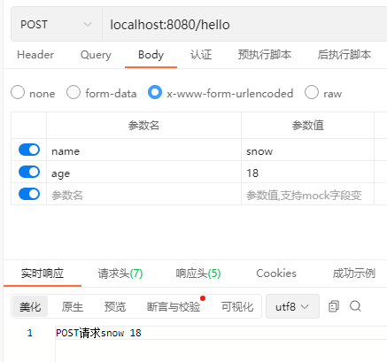

当传递的参数数量很多的时候，可以使用实体类封装所有的参数，但是**实体类中的各个成员属性的名称要和传递的参数的名称一致**。

```java
public class User {
    private String name;
    private String age;
    public User() {
    }
    public User(String name, String age) {
        this.name = name;
        this.age = age;
    }
    public String getName() {
        return name;
    }
    public void setName(String name) {
        this.name = name;
    }
    public String getAge() {
        return age;
    }
    public void setAge(String age) {
        this.age = age;
    }
    @Override
    public String toString() {
        return "User{" +
                "name='" + name + '\'' +
                ", age='" + age + '\'' +
                '}';
    }
}
```

```java
@RestController
public class HelloController{
    @RequestMapping(value="/hello",method=RequestMethod.POST)
    public String hello(User user){
        return "POST请求"+user.toString();
    }
}
```

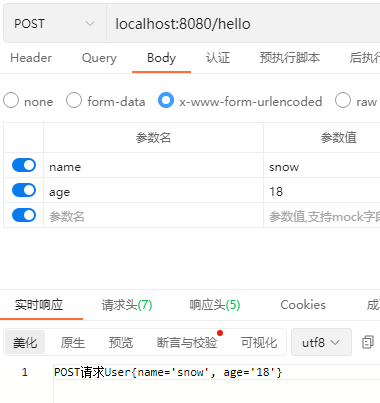

当HTTP使用POST方法传递的数据是JSON格式的时候：**需要注意JSON格式的数据是有数据类型的,因此接收参数的数据类型也要保持一致**。

```java
@RestController
public class HelloController{
    @RequestMapping(value="/hello",method=RequestMethod.POST)
    // 使用 @RequestBody 标识传递的参数是JSON格式
    public String hello(@RequestBody User user){
        return "POST请求@RequestBody"+user.toString();
    }
}
/*
{
	"name":"snow"  ---> String
	"age":"18" ----> String
	"age":18 ---> Integer 
}

*/
```

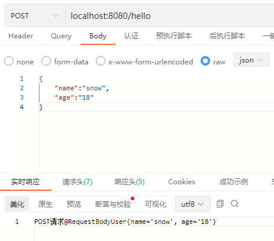

## 7、controller的参数注解

使用 controller 接收来自前端发送的数据时，通常会有无注解、@PathParam/@PathVariable、@RequestParam/@QueryParam、@RequestBody的形式。

（1）无注解的形式

在 controller 的方法中，直接表明参数类型和参数名称，不使用任何注解标识。这种情况下 **不能接收JSON格式的数据；即使前端不在请求中提供这些数据，controller 也不会报错。** 虽然 GET 和 POST 请求都可以使用，但是通常这种方式只用来接收前端发送的 GET 请求。

```java
@RestController
public class HelloController{
    @RequestMapping(value="/hello",method=RequestMethod.GET)
    public String hello(String name,String age){
        return "hello "+name+" "+age;
    }
}
```

（2）@PathParam/@PathVariable注解

@PathParam 和 @PathVariable 注解它们两个作用相同，用来接收使用 URL 传递的数据。 但是这种会将数据展示在 URL 中的方式，通常只用来接收前端发送的 GET 请求。

```java
@RestController
public class HelloController{
    @RequestMapping(value="/hello/{name}/{age}",method=RequestMethod.GET)
    public String hello(@PathVariable(value="name") String name,@PathParam(value="age") String age){
        // @PathVariable(value="name") String name,@PathParam(value="age") String age 中的 value 属性也可以省略
        // 即 @PathVariable("name") String name,@PathParam("age") String age
        return "hello "+name+" "+age;
    }
}
```

（3）@RequestParam/@QueryParam注解

@RequestParam 和 @QueryParam 注解它们两个的作用相同，用来接收前端发送的请求体中的数据。前端发送的 GET 和 POST 请求 controller 都可以接收；controller 方法中的参数可以是普通的数据类型，也可以是对象参数类型。**但是不能接收前端发送的 JSON 格式的数据。**

常用的形式为 `@RequestParam("value")` 和 `@QueryParam("value")` ，其中 `value` 是前端请求体中数据的标识符，`value` 和 controller 中参数的标识符可以不相同，但是一定要和前端发送的请求体中数据的标识符相同，否则数据不能进行映射。

```java
@RestController
public class HelloController{
    @RequestMapping(value="/hello",method=RequestMethod.POST)
    public String hello(
        @RequestParam("name") String name,
        @QueryParam("age") String age){
        return "hello "+name+" "+age;
    }
}
```

`@RequestParam` 注解支持四个参数：

- `value` : 与前端请求体中数据的标识符相同；
- `defaultValue` : 前端发送的请求体中，若是没有这个参数或者请求体中这个参数为空，那么就会将指定的默认值赋值给 controller 中这个参数。（`defaultValue` 的默认值为 `“”` ）
- `required` : 前端发送的请求体中是否必须包含该项参数。（`required`的默认值为 `true` ）
- `name` : 该项参数与 `value` 参数作用相同，`value` 是 `name` 的一个别名。

但是注解 `@QueryParam` 只有一个 `value` 参数。

```java
@RestController
public class HelloController{
    @RequestMapping(value="/hello",method=RequestMethod.POST)
    public String hello(
        @RequestParam(value="name", defaultValue="name", required=false) String name,
        @QueryParam(vaule="age") String age){
        return "hello "+name+" "+age;
    }
}
```

（4）@RequestBody注解

@RequestBody注解，**只能接收前端发送的 JSON 格式的数据，只能接收前端发送的 POST 请求**。

当 controller 使用 Map 接收时，Map 中的数据与前端请求体中 JSON 格式数据完全相同，前端中使用的数据标识符是什么，那么在 controller 中就使用相同数据标识符从 Map 中获取。

```java
@RestController
public class HelloController{
    @RequestMapping(value="/hello",method=RequestMethod.POST)
    public String hello(
        @RequestBody Map<String,Object> requestParam){
        String name = (String) requestParam.get("name");
        String age = (Integer) requestParam.get("age");
        return "hello "+name+" "+age;
    }
}
```

当 controller 使用实体类对象接收时，实体类中各个成员变量的标识符要和前端请求中发送的 JSON 格式数据中的数据项的标识符一一对应，否则不能映射，数据无法赋值。

```java
@RestController
public class HelloController{
    @RequestMapping(value="/hello",method=RequestMethod.POST)
    public String hello(
        @RequestBody Userinfo userinfo){
        System.out.println(userinfo.toString());
        return userinfo.toString();
    }
}
```

（5）@RequestHeader注解

`@RequestHeader`注解获取前端发送请求的请求头中包含的数据。

```java
@RestController
@CrossOrigin
@RequestMapping("/param")
public class ParamController {
    @PostMapping("/header")
    public Map<String,Object> testHeaderParam (
        // 这里用来接收请求头中数据的参数标识符一定要相同,不然无法映射成功匹配数据
        @RequestHeader String requestParam,
        HttpServletRequest request
    ) {
        System.out.println(requestParam);
        System.out.println(request.toString());
        Map<String,Object> result = new HashMap<>();
        result.put("requestParam", requestParam);
        result.put("request", request.toString());
        return result;
    }
}
```

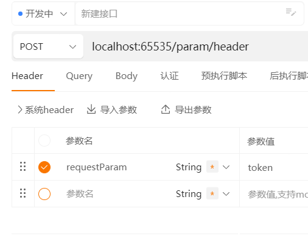

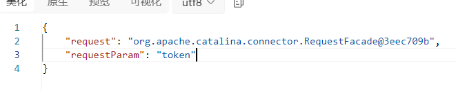

（6）@CookieValue注解

`@CookieValue`注解用来获取前端发送的请求中来自 cookie 中的数据。

```java
@RestController
@CrossOrigin
@RequestMapping("/param")
public class ParamController {
    @PostMapping("/cookie")
    public Map<String,Object> testCookieParam (
        // 这里参数的标识符一定要和 cookie 中数据的标识符完全相同,不然无法映射成功匹配数据
        @CookieValue String cookieParam,
        HttpServletRequest request
    ) {
        System.out.println(cookieParam);
        System.out.println(request.toString());
        Map<String,Object> result = new HashMap<>();
        result.put("cookieParam", cookieParam);
        result.put("request", request.toString());
        return result;
    }
}
```

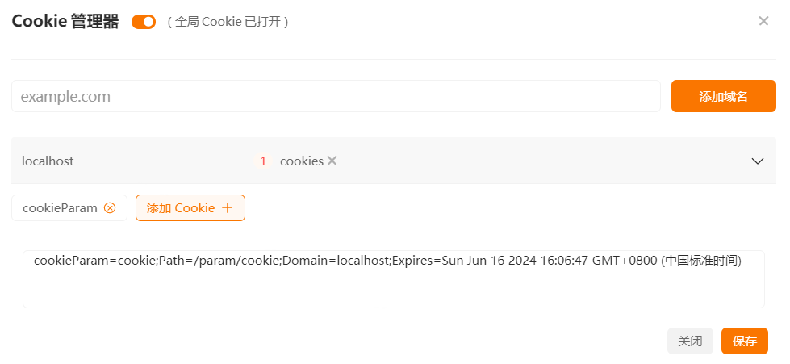

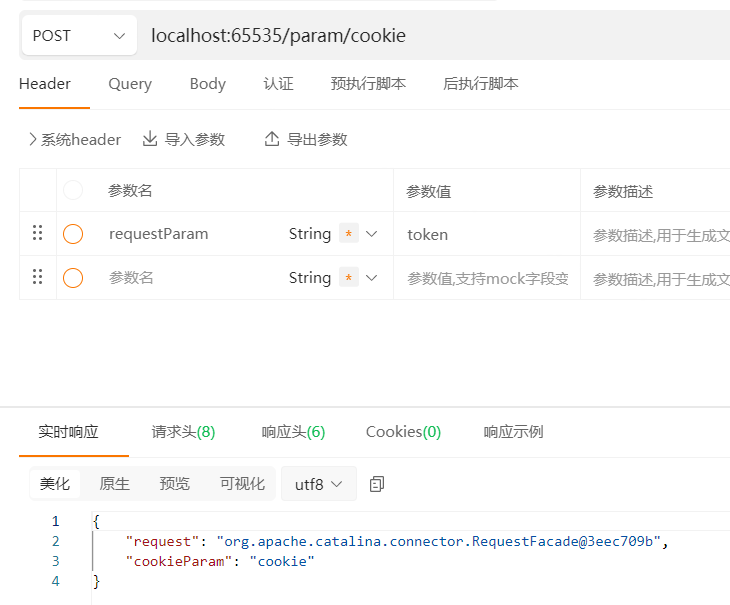

## 7、静态资源

（1）在 springboot 中定义了 默认的静态资源目录，项目开发中一般会将静态资源放置在这些静态资源目录下。

`classpath:/resources/`；`classpath:/static/`；`classpath:/public/`

将静态资源放在上述的目录下，可以通过浏览器直接访问位于这些目录下的静态资源。

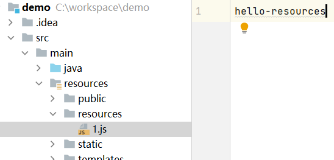

>   localhost:8080/1.js

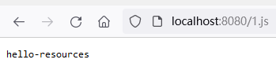

（2）若是 springboot 默认的静态资源虚拟的访问路径不足以满足项目需求，可以在配置文件中自定义虚拟路径。

```properties
# springboot 中默认的静态资源的虚拟路径是 /
# 在浏览器中可以直接使用 localhost:8080/静态资源名称 的方式访问
spring.mvc.static-path-pattern=/**

# 这个虚拟路径可以自行更改
spring.mvc.static-path-pattern=/snow/**
```

那么此时再使用`localhost:8080/`的方式就没有办法访问静态资源了。

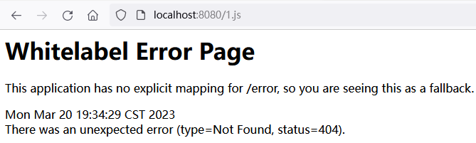

必须要使用`localhost:/8080/snow/`的URL路径去访问静态资源。

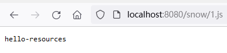

（3）若是 springboot 默认的静态资源目录不足以满足项目需求，还可以在配置文件中自定义额外的静态资源目录。

```properties
# 在 springboot 中默认的静态资源目录为
spring.web.resources.static-locations=classpath:/resources,classpath:/static,classpath:/public

# 以上三个路径不足以满足项目需求时,可以自定义额外的路径
spring.web.resources.static-locations=classpath:/resources,classpath:/static,classpath:/public,classpath:/css

# 这里一定要在默认的静态资源目录后面添加额外的目录,否则默认的静态资源目录就会失效
```

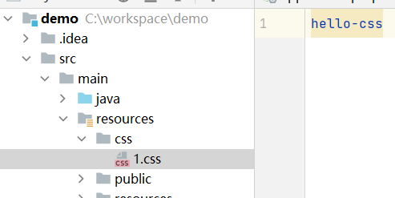

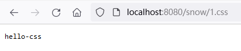

（4）静态资源目录的优先级

分别在`classpath:/resources`，`classpath:/static`，`classpath:/public`，`classpath:/css`四个静态资源目录下创建文件**1.css**。

>   resources/1.css文件内容如下：
>
>   hello-resources
>
>   static/1.css文件内容如下：
>
>   hello-static
>
>   public/1.css文件内容如下：
>
>   hello-public
>
>   css/1.css文件内容如下：
>
>   hello-css

在浏览器中直接访问文件**1.css**。

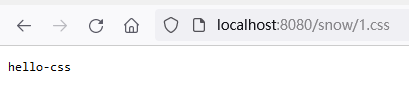

然后删除`css/1.css`再次访问。

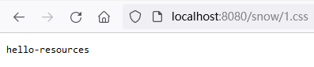

删除`resources/1.css`再次访问。

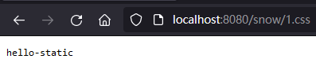

删除`static/1.css`再次访问。

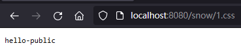

从以上同名文件的访问过程可以发现静态资源目录的优先级：自定义路径 > `classpath:/resources/` > `classpath:/static/` > `classpath:/public/`。

## 8、静态资源源码分析---待整理

在 IDEA 中双击 `shift` 搜索 `WebMvcAutoConfiguration`中找到 `addResourceHandlers`方法：

```java
public void addResourceHandlers(ResourceHandlerRegistry registry) {
    // 若是配置了静态资源的路径,那么默认的静态资源路径失效
    if (!this.resourceProperties.isAddMappings()) {
        logger.debug("Default resource handling disabled");
    } else {
        // 若是没有配置,那么classpath:/META-INF/resources/webjars/目录映射为/webjars/**目录
        this.addResourceHandler(registry, "/webjars/**", "classpath:/META-INF/resources/webjars/");
        this.addResourceHandler(registry, this.mvcProperties.getStaticPathPattern(), (registration) -> {
            registration.addResourceLocations(this.resourceProperties.getStaticLocations());
            if (this.servletContext != null) {
                ServletContextResource resource = new ServletContextResource(this.servletContext, "/");
                registration.addResourceLocations(new Resource[]{resource});
            }

        });
    }
}

private void addResourceHandler(ResourceHandlerRegistry registry, String pattern, String... locations) {
    this.addResourceHandler(registry, pattern, (registration) -> {
        registration.addResourceLocations(locations);
    });
}

private void addResourceHandler(ResourceHandlerRegistry registry, String pattern, Consumer<ResourceHandlerRegistration> customizer) {
    if (!registry.hasMappingForPattern(pattern)) {
        ResourceHandlerRegistration registration = registry.addResourceHandler(new String[]{pattern});
        customizer.accept(registration);
        registration.setCachePeriod(this.getSeconds(this.resourceProperties.getCache().getPeriod()));
        registration.setCacheControl(this.resourceProperties.getCache().getCachecontrol().toHttpCacheControl());
        registration.setUseLastModified(this.resourceProperties.getCache().isUseLastModified());
        this.customizeResourceHandlerRegistration(registration);
    }
}
```

在 springboot 中处理静态资源的路径有以下：

（1）`localhost:8080/webjars` ===> `classpath:/META-INF/resources/`

（2）`localhost:8080/` ===> `classpath:/resources/`；`classpath:/static/`；`classpath:/public/`

（3）使用`spring.web.resources.static-locations=URL`自定义静态资源路径。

（4）优先级：自定义路径 > `classpath:/resources/` > `classpath:/static/` > `classpath:/public/`

（5） 在配置文件中使用 `spring.mvc.static-path-pattern=URL`禁用以上所有静态资源路径。

## 9、自定义首页

在 IDEA 中双击 `shift` 搜索 `WebMvcAutoConfiguration`中找到 `addResourceHandlers`方法：

```java
public WelcomePageHandlerMapping welcomePageHandlerMapping(ApplicationContext applicationContext, FormattingConversionService mvcConversionService, ResourceUrlProvider mvcResourceUrlProvider) {
    WelcomePageHandlerMapping welcomePageHandlerMapping = new WelcomePageHandlerMapping(new TemplateAvailabilityProviders(applicationContext), applicationContext, this.getWelcomePage(), this.mvcProperties.getStaticPathPattern());
    welcomePageHandlerMapping.setInterceptors(this.getInterceptors(mvcConversionService, mvcResourceUrlProvider));
    welcomePageHandlerMapping.setCorsConfigurations(this.getCorsConfigurations());
    return welcomePageHandlerMapping;
}
```

通过点击 `this.getWelcomePage()` 类名，可以找到如下内容：

```java
private Resource getWelcomePage() {
    // 获取静态资源的路径
    String[] var1 = this.resourceProperties.getStaticLocations();
    int var2 = var1.length;

    for(int var3 = 0; var3 < var2; ++var3) {
        String location = var1[var3];
        // 遍历路径下的文件
        Resource indexHtml = this.getIndexHtml(location);
        if (indexHtml != null) {
            return indexHtml;
        }
    }

    ServletContext servletContext = this.getServletContext();
    if (servletContext != null) {
        return this.getIndexHtml((Resource)(new ServletContextResource(servletContext, "/")));
    } else {
        return null;
    }
}
```

通过点击 `this.getIndexHtml()` 类名，可以找到如下内容：

```java
private Resource getIndexHtml(String location) {
    return this.getIndexHtml(this.resourceLoader.getResource(location));
}

private Resource getIndexHtml(Resource location) {
    try {
        // 首页名称为 index.html 其路径为默认的静态资源路径下面
        Resource resource = location.createRelative("index.html");
        if (resource.exists() && resource.getURL() != null) {
            return resource;
        }
    } catch (Exception var3) {
    }
    return null;
}
```

在任意一个静态资源路径下创建一个`index.html`文件。

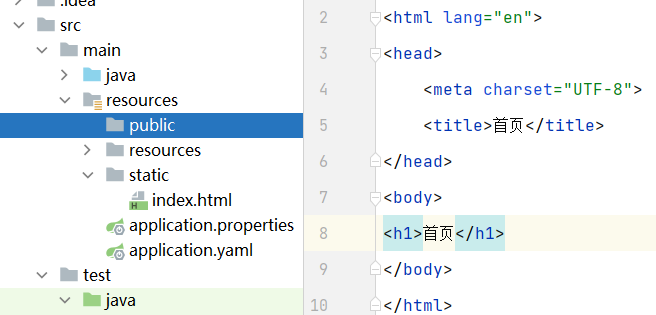

打开浏览器访问 `localhost:65535`，可以看到首页已显示。

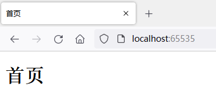

# service层

## 1、Service调用Service

MVC 基本原则：controller 、service 、dao 三层，同层之间不能相互调用，dao 层只能由对应的 service 调用封装 CRUD。

但是，当 service 层出现业务逻辑跨表的时候，就必然会需要 service 层之间的相同调用，**但是必须要遵循单向调用原则：**即 service A 调用 service B 那么就不能再有 service B 调用 service A 的情况出现，若是 service A 与 service B 不可避免的需要相互调用，那么就只能再封装一个 service C 将业务集中，然后 sercice A 和 service B 分别去调用 service C 构成单向调用。

# springboot文件上传

（1）文件上传的原理分析

页面表单中`enctype`属性规定在发送到服务器之前应该如何对表单数据进行编码；当表单的`enctype="application/x-www-form-urlencoded"`（默认属性值）时， from 表单中的数据格式为：**key=value&key=value**形式；而当表单的`enctype="multipart/form-data"`时，其传输数据的格式如下：

```html
<input tyep="text" name="name">
<input type="file" name="file">
```

>   用户输入“snow”并上传一个“文件上传.txt”文件
>
>   文件内容为：
>
>   aaa
>
>   bbb

```
--------------------------7de1a433602ac
Content-Disposition: form-data; name="name" snow
--------------------------7de1a433602ac
Content-Disposition: form-data; name="file"; filename="c:/文件上传.txt" Content-Type: text/plain
aaa
bbb
--------------------------7de1a433602ac
```

（2）springboot 文件上传功能的配置文件

① springboot 内置的 tomcat 中规定了请求文件最大大小为1MB，单次请求的文件的总大小不能超过10MB；

② 在配置文件中执行如下配置，更改默认的规定：

```properties
spring.servlet.multipart.max-file-size=10MB
spring.servlet.multipart.max-request-size=10MB
```

（3）springboot 文件上传功能的controller

```java
@RestController
public class FileUpLoadController {
    @PostMapping("/upload")
    // 无论文件是什么格式的,都要使用 MultipartFile 类型接收
    public String upload(String name, MultipartFile document, HttpServletRequest request) throws IOException {
        System.out.println(name);
        // 获取文件大小
        System.out.println("文件大小"+document.getSize());
        // 获取文件的类型
        System.out.println(document.getContentType());
        // 获取文件的名称
        System.out.println(document.getOriginalFilename());
        // System.out.println(System.getProperty("user.dir"));
        // 获取项目的所在文件目录路径(这个路径会随着IDEA每次运行项目发生改变),
        // 只有项目正式被部署时,这个路径才会固定下来
        String path = request.getServletContext().getRealPath("/upload/");
        System.out.println(path);
        saveFile(document, path);
        return "upload successfully!";
    }
    public void saveFile(MultipartFile document, String path) throws IOException {
        File dir = new File(path);
        // 判断存储文件的目录是否存在,若是不存在就将这个目录创建出来
        if(!dir.exists()){
            dir.mkdir();
        }
        // 见文件存储到中指定的目录中
        File file = new File(path+document.getOriginalFilename());
        document.transferTo(file);
    }
}
```

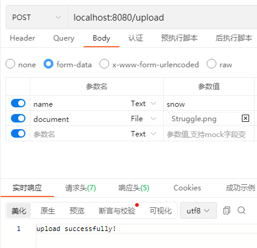

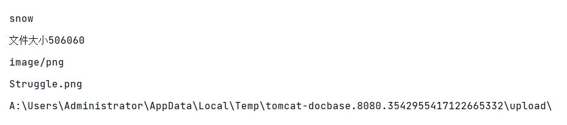

（4）若是希望用户可以直接访问到上传的文件，可以配置额外的自定义静态资源的路径

```properties
spring.web.resources.static-locations=/upload/
```

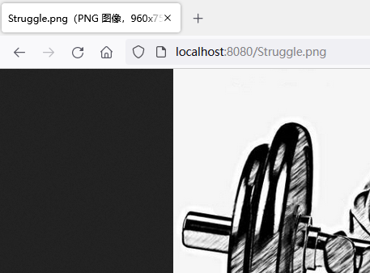

# springboot拦截器

## 1、拦截器的构成与作用

拦截器在 web 系统中非常常见，对于某些全局统一的操作，可以把它们提取到拦截器中实现。拦截器有如下几种使用场景：

（1）权限检查：如登录检查，进入处理程序检测是否登录，若果没有，则直接返回登录页面；

（2）性能监控：有时系统在某段时间内会莫名其妙的变得迟钝，可以通过拦截器在进入处理程序之前记录开始时间，在处理完成后记录结束时间，从而得到该请求的处理时间。

（3）通用行为：读取 cookie 得到用户信息并将用户对象放入请求，从而方改后续流程使用，还有提取 Locale、Theme 信息等，只要是多个处理程序都需要的，即可使用拦截器实现。

在 springboot 中定义了 `HandlerInterceptor`接口来实现自定义拦截器的功能，`HandlerInterceptor`接口定义了`preHandle`、`postGandle`、`afterCompletion`三种方法，通过重写这三种方法实现请求前、请求后等操作。

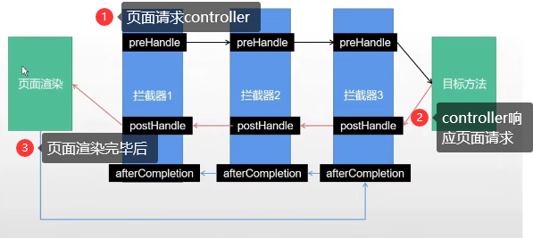

## 2、配置拦截器

```java
public class LoginInterceptor implements HandlerInterceptor {
    /**
     * 在HTTP请求交付controller处理之前调用拦截器
     */
    @Override
    public boolean preHandle(HttpServletRequest request, HttpServletResponse response, Object handler) throws Exception{
        if(条件){
            return true;
        } else {
            return false;
        }
    }
    
    @Override
    public void postHandle(HttpServletRequest request, HttpServletResponse response, Object handler, ModelAndView modelAndView) throws Exception {
        HandlerInterceptor.super.postHandle(request, response, handler, modelAndView);
    }

    @Override
    public void afterCompletion(HttpServletRequest request, HttpServletResponse response, Object handler, Exception ex) throws Exception {
        HandlerInterceptor.super.afterCompletion(request, response, handler, ex);
    }
}
```

除了需要定义拦截器外，还需要对拦截器进行注册，否则拦截器并不能生效。

（1）`addPathPatterns`方法定义拦截的地址；

（2）`excludePathPattern`方式定义哪些地址不被拦截器拦截；

（3）注册一个拦截器，但是没有使用`addPathPattern`方法，则默认该拦截器会拦截所有地址；

（4）注册一个拦截器，但是没有使用`excludePathPattern`方法，则默认该拦截器会拦截所有地址；

（5）注册一个拦截器，但是既没有使用`addPathPattern`方法，也没有使用`excludePathPattern`方法，则默认该拦截器会拦截所有地址。

```java
@Configuration
public class WebInterceptorConfig implements WebMvcConfigurer {
    public void addInterceptors(InterceptorRegistry registry) {
        // 拦截所有的请求 /**
        // 使用 / 只能拦截对于 localhost:8080/ 的请求
        // 使用 /* 只能拦截对于 localhost:8080/get 这样的一级请求,对于 localhost:8080/get/check 的二级请求不能拦截
        // 使用 /get/* 只能拦截对于 localhost:8080/get/check 这样的位于一级请求get/下的二级请求,对于 localhost:8080/get/check/out 的三级请求不能拦截
        registry.addInterceptor(new LoginInterceptor()).addPathPatterns("/**");
    }
}
```


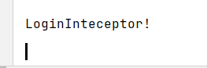

## 3、拦截器校验数据并将结果共享给controlloer

（1）使用 `request.setAttribute` 和 `request.getAttribute` 共享数据。

```java
@Override
public boolean preHandle(
    HttpServletRequest request,
    HttpServletResponse response,
    Object handler) throws Exception {
    request.setAttribute("request", "request");
    return true;
}
```

```java
@RestController
@CrossOrigin
@RequestMapping("/authorized")
public class AuthorizedController {
    @PostMapping("/get")
    public Map<String,Object> authorized (HttpServletRequest request, @RequestBody Map<String, Object> ret) {
        System.out.println(ret.get("qing"));
        System.out.println("request.getAttribute: "+request.getAttribute("request"));
        Map<String,Object> result = new HashMap<>();
        result.put("code", 200);
        result.put("authorized", true);
        result.put("qing", ret.get("qing"));
        result.put("request.getAttribute: ", request.getAttribute("request"));
        return result;
    }
}
```

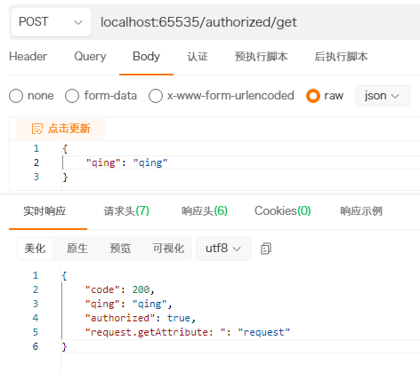

（2）使用 `request.getServletContext().setAttribute` 和 `request.getServletContext().getAttribute` 共享数据。

```java
@Override
public boolean preHandle(
    HttpServletRequest request,
    HttpServletResponse response,
    Object handler) throws Exception {
    request.getServletContext().setAttribute("getServletContext", "getServletContext");
    return true;
}
```

```java
@RestController
@CrossOrigin
@RequestMapping("/authorized")
public class AuthorizedController {
    @PostMapping("/get")
    public Map<String,Object> authorized (HttpServletRequest request, @RequestBody Map<String, Object> ret) {
        System.out.println(ret.get("qing"));
        System.out.println("request.getServletContext: "+request.getServletContext().getAttribute("getServletContext"));
        Map<String,Object> result = new HashMap<>();
        result.put("code", 200);
        result.put("authorized", true);
        result.put("qing", ret.get("qing"));
        result.put("request.getServletContext", request.getServletContext().getAttribute("getServletContext"));
        return result;
    }
}
```

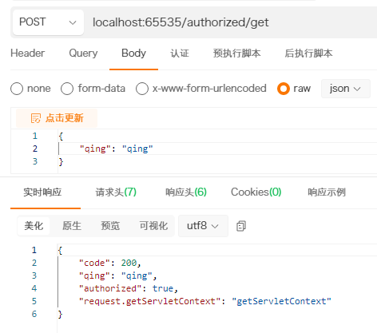

（3）使用 ThreadLocal 共享数据。

```java
public class AuthorizedThread {
    public static final ThreadLocal<String> authorizedThread = new ThreadLocal<>();

    public static void setAuthorizedThread(String userid) {
        authorizedThread.set(userid);
    }

    public static String getAuthorizedThread() {
        return authorizedThread.get();
    }

    public static void removeAuthorizedThread() {
        authorizedThread.remove();
    }
}
```

```java
@Override
public boolean preHandle(
    HttpServletRequest request,
    HttpServletResponse response,
    Object handler) throws Exception {
    AuthorizedThread.setAuthorizedThread("AuthorizedThread");
    return true;
}
@Override
public void afterCompletion(
    HttpServletRequest request, 
    HttpServletResponse response, 
    Object handler, 
    Exception ex) throws Exception {
    AuthorizedThread.removeAuthorizedThread();
    HandlerInterceptor.super.afterCompletion(request, response, handler, ex);
}
```

```java
@RestController
@CrossOrigin
@RequestMapping("/authorized")
public class AuthorizedController {
    @PostMapping("/get")
    public Map<String,Object> authorized (HttpServletRequest request, @RequestBody Map<String, Object> ret) {
        System.out.println(ret.get("qing"));
        System.out.println("AuthorizedInterceptor ThreadLocal: "+ AuthorizedThread.getAuthorizedThread());
        Map<String,Object> result = new HashMap<>();
        result.put("code", 200);
        result.put("authorized", true);
        result.put("qing", ret.get("qing"));
        result.put("AuthorizedInterceptor ThreadLocal", AuthorizedThread.getAuthorizedThread());
        return result;
    }
}
```

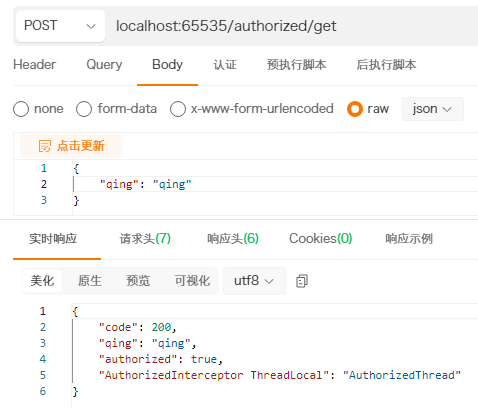

# RESTful API

## 1、RESTful 基本概念

RESTful（Represnetational State Transfer，表述性状态转移）定义了互联网软件服务的架构原则，当一个架构符合REST原则，则称之为RESTful架构。

RESTful 是目前流行的互联网软件服务架构设计风格，RESTful 不是一个标准，它更像一组客户端和服务器交互时的架构理念和设计原则，基于这种架构理念和设计原则的 Web API 更加简洁，更有层次。

> 原始的http请求API为：http://localhost:8080/api/order?id=1&status=1
> 符合RESTful API风格的http请求API为：http://localhost:8080/api/order/1/1

```java
// 原始的http请求API的controller
@RequestMapping("/api/order")
public String order(String id, String status){
    return id+" "+status;
}

// 符合RESTful API风格的http请求API的controller
@RequestMapping("/api/order/{id}/{status}")
public Object user (@PathVariable("id") String id, @PathVariable("status") String status){
     return id+" "+status;
}
```

## 2、RESTful的特点

在 RESTful 中每一个 URL 代表一种资源；

客户端应使用 GET、POST、PUT、DELETE 四种表示操作方式的动词对服务端资源进行操作，其中使用 GET 获取资源，使用 POST 新建资源（或者更新资源），使用 PUT 更新资源，使用 DELETE 删除资源；

服务端通过操作资源的表现形式来实现客户端的请求操作，资源的表现形式通常是 JSON 或者 HTML；

客户端和服务端之间的交互在请求之间是无状态的，从客户端到服务端的每个请求都包含必须的信息。

符合 RESTful 规范的 Web API 必须要具备**安全性**和**幂等性**。安全性，指安全的方法被期望不会产生任何副作用，即当使用GET 时，该操作只进行资源的获取，不会引起资源本身的改变，也不会引起服务器状态的改变；幂等性，幂等的方法保证了重复进行一个请求和一次请求的效果相同（不是指响应总是相同的，而是服务器上资源的状态从第一次请求后就不在发生变化了），在数学上幂等性时指 N 次变换和一次变换相同。

## 3、HTTP Method

一个 HTTP 请求除了使用 URL 标识目标资源外，还需要使用 HTTP 提供的 GET、POST、PUT、DELETE 等操作类型指定对该 Web 资源执行新建、读取、更新、删除操作。以下是一些常见的 HTTP 方法及其对应的符合 RESTful 规范的用法：

| HTTP 方法 | 操作   | 返回值                                                    | 特定返回值                                                   |
| --------- | ------ | --------------------------------------------------------- | ------------------------------------------------------------ |
| POST      | Create | 201（Craeated），提交或者保存资源                         | 404（Not Found）资源不存在，409（conflict）资源已存在        |
| GET       | Read   | 200（OK），获取资源或者数据列表，支持分页、排序和条件查询 | 200（OK）返回资源，404（Not Found）资源不存在                |
| PUT       | Update | 200（OK）或者204（No Content），修改资源                  | 404（Not Found）资源不存在，405（Method Not Allowed）禁止使用该方法调用 |
| PATCH     | Update | 200（OK）或者204（No Content），部分修改                  | 404（Not Found）资源不存在                                   |
| DELETE    | Delete | 200（OK），资源删除成功                                   | 404（Not Found）资源不存在，405（Method Not Allowed）禁止使用该方法调用 |

## 4、springboot 实现 RESTful API

在 springboot 的 Web 启动器完全支持开发 RESTful API ，并且提供了与 HTTP Method 相对应的注解。

```java
@GetMapping // GET 请求,获取资源
@PostMapping // POST 请求,新增资源
@PutMapping // PUT 请求,更新资源
@DeleteMapping // DELETE 请求,删除资源
@PatchMapping // PATCH 请求,部分更新资源
```

在 RESTful 架构中，每一个 URL 代表一种资源，因此不要在 URL 中使用动词（如 GET、POST、PUT、DELETE 等），只需要使用名词，且名词一般会和数据库的表格名称对应：

| HTTP Method | 接口地址 | 接口说明       |
| ----------- | -------- | -------------- |
| POST        | /user    | 创建用户       |
| GET         | /user/id | 根据id获取用户 |
| PUT         | /user    | 更新用户       |
| DELETE      | /user/id | 根据id删除用户 |

```java
@RestController
public class UserController{
    @GetMapping("/user/{id}") // 这是用{}和 @PathVariable动态获取URL中的数据
    public String getUserById(@PathVariable int id){
        return "根据"+id+"获取用户";
    }
    @PostMapping("/user")
    public String save(User user){
        return "添加用户";
    }
    @PutMapping("/user")
    public String update(User user){
        return "更新用户";
    }
    @DeleteMapping("/user/{id}")
    public String deleteUserById(@PathVariable int id){
        return "根据"+id+"删除用户";
    }
}
```

# 引入Swagger

## 1、Swagger基本概念

（1）Swagger 是一个规范和完整的框架，用于生成、描述、调用和可视化 RESTful 规范的 Web 服务的 API 表达工具。

（2）Swagger 能够自动生成完善的 RESTful API 文档，同时根据后台代码的修改同步更新，并提供完整的测试页面来调试 API .

## 2、添加依赖

```xml
<dependency>
    <groupId>io.springfox</groupId>
    <artifactId>springfox-swagger2</artifactId>
    <version>2.9.2</version>
</dependency>
<dependency>
    <groupId>io.springfox</groupId>
    <artifactId>springfox-swagger-ui</artifactId>
    <version>2.9.2</version>
</dependency>
<!-- 爆红 修改版本号3.0.0-->
```

## 3、Swagger配置类

```java
@Configuration // spring 配置类注解
@EnableSwagger2 // 启用 Swagger2 功能
public class Swagger2Config{
    @Bean
    public Docket createRestApi(){
        return new Docket(DocumentationType.SWAGGER_2)
            .apiInfo(apiInfo())
            .select()
            .apis(RequestHandlerSelectors.basePackage("com")) // com 包下面所有 api 都交付给 swagger2 管理
            .paths(PathSelectors.any())
            .build();
    }
    private ApiInfo apiInfo(){
        return new ApiInfoBuilder()
            .title("演示项目API") // API 文档标题
            .description("学习Swagger2的演示项目") // API 文件的简要描述
            .version("1.0") // API 文档的版本号
            .build();
    }
}
```

## 4、配置文件

```properties
spring.mvc.pathmatch.matching-strategy=ant_path_matcher
```

## 5、启动项目访问可视化页面

>   http://127.0.0.1:8080/swagger-ui.html

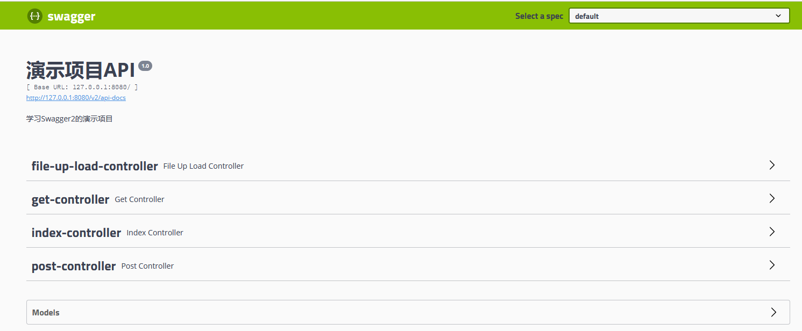

## 6、为Swagger添加接口注释

（1）` @ApiOperation("str") `

在controller的接口上添加注解`@ApiOperation("str")`，那么在Swagger的可视化界面上就可以看到对应的接口上被添加的说明。

```java
@RestController
public class PostController {
    @ApiOperation("添加用户")
    @RequestMapping(value="/hello",method=RequestMethod.POST)
    public String hello(@RequestBody User user){
        return "POST请求@RequestBody"+user.toString();
    }
}
```

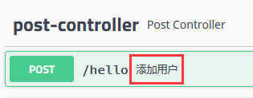

## 7、使用Swagger测试接口

（1）点击需要测试的接口，打开测试界面，然后点击**Try it out**启动测试。

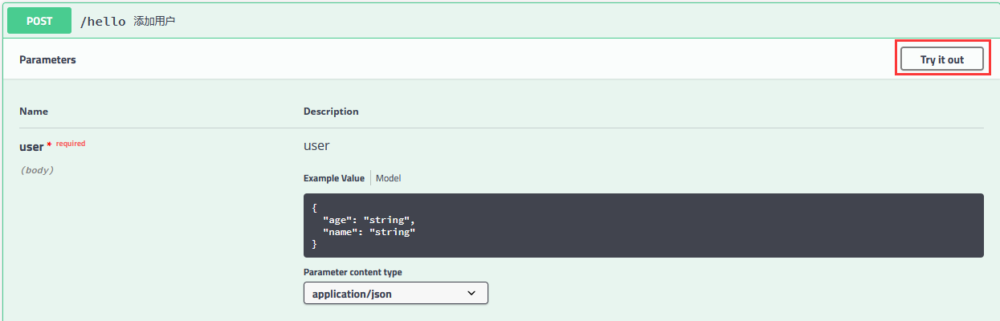

（2）输入需要传递的数据。

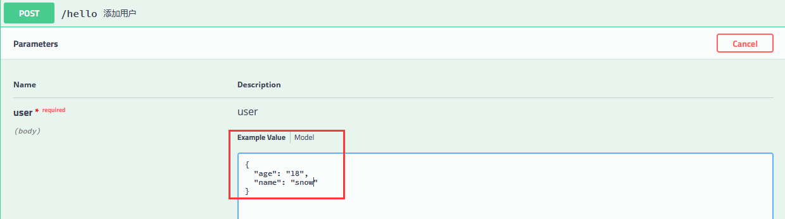

（3）点击下方的**Execute**启动测试。就可以在下方看到测试结果。


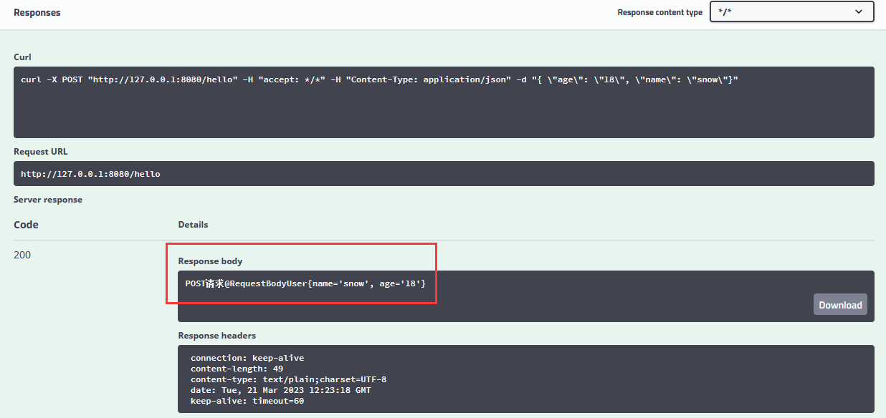


# 引入Mybatis

## 1、Mybatis基本说明

（1）一个持久层框架，用来对数据进行持久化操作。

（2）持久化：将数据从内存(瞬时存储)存入数据库、io文件中(永久存储)的整个过程。

（3）免除了 `JDBC` 中连接数据库操作、设置参数、获取的结果集。

（4）通过 XML 或注解来配置和映射原始类型、接口和 Java POJO（Plain Old Java Objects，普通老式 Java 对象）为数据库中的记录 。

## 2、添加依赖

```xml
<dependency>
    <groupId>org.mybatis.spring.boot</groupId>
    <artifactId>mybatis-spring-boot-starter</artifactId>
    <version>2.2.2</version>
</dependency>
<!-- MySQL 驱动依赖,一般需要和安装的 MySQL 数据库版本对应-->
<dependency>
    <groupId>mysql</groupId>
    <artifactId>mysql-connector-java</artifactId>
    <version>5.1.47</version>
</dependency>
```

## 3、配置文件

（1）分别在 `${project.basedir}/src/mian/java/com/e3e4e20/` 和 `classpath:/` 目录下新建目录 `mapper/` 。其中 `${project.basedir}/src/mian/java/com/e3e4e20/mapper/` 目录下存放 **Mybatis mapper** 的接口（**java interface**）文件，`classpath:/mapper/` 目录下存放 **Mybatis mapper** 的映射文件（**mapper.xml**） 。

（2）在文件 `classpath:/application.yaml` 中添加如下配置：

```yaml
spring.datasource.url=jdbc:mysql://192.168.1.110:3306/db_test?useSSL=false&characterEncoding=utf8
spring.datasource.username=root
spring.datasource.password=root
spring.datasource.driver-class-name=com.mysql.cj.jdbc.Driver
mybatis.mapper-locations=classpath:/mapper/*.xml
```

（3）在 **spring boot** 的启动类文件中添加注解 `@MapperScan("com.example.mapper")`

```java
@SpringBootApplication
@MapperScan("com.example.mapper")
public class DemoApplication { 
    public static void main(String[] args) { 
        SpringApplication.run(DemoApplication.class, args);
    }
}
```

## 4、连接数据库

（1）在数据库中新建数据库 **db_test** 并新建数据表 **t_login**

```shell
CREATE DATABASE `db_test` CHARACTER SET 'utf8' COLLATE 'utf8_general_ci';

CREATE TABLE `t_login`  (
  `id` int(16) NOT NULL,
  `name` varchar(255) CHARACTER SET utf8 COLLATE utf8_general_ci NULL DEFAULT NULL,
  `word` varchar(255) CHARACTER SET utf8 COLLATE utf8_general_ci NULL DEFAULT NULL,
  PRIMARY KEY (`id`) USING BTREE
) ENGINE = InnoDB CHARACTER SET = utf8 COLLATE = utf8_general_ci ROW_FORMAT = Dynamic;

insert into `t_login` (`id`,`name`,`word`) values(`1`,`name`,`word`);
```

（2）在目录 `src/test/java/com/e3e4e20/` 下新建目录 `utils/` 并新建文件 `MySQLConnectionTest.java` 并添加如下内容

```java
@SpringBootTest // spring boot 单元测试注解,使用该注解标识这个类是一个测试类
public class MySQLConnection {
    /*
    * @Autowire 一定需要添加,不然项目本身没有任何错误,
    * 但是一旦运行测试就会导致的 NullPointerException
    * 并且只有紧挨着 @Autowire 的一个成员变量起作用，
    * 之后的成员变量需要再添加注解 @Autowire
    * */
    @Autowired
    private DataSource dataSource;
    @Test
    public void testDataSource() throws SQLException {
        // 测试数据源（数据库连接是否成功）
        System.out.println(dataSource.getConnection());
    }
}
```

## 5、接口文件

在目录 `src/main/java/com/e3e4e20/mapper/` 下新建文件 **LoginMapper.java**，并添加如下内容

```java
@Mapper
@Repository
public interface LoginMapper {
    String selectUserById (Integer userid);
}
```

## 6、映射文件mapper.xml

在目录 `classpath:/mapper/` 新建文件 **LoginMapper.xml** ，并添加如下内容

```xml
<?xml version="1.0" encoding="UTF-8" ?>
<!DOCTYPE mapper PUBLIC "-//mybatis.org//DTD Mapper 3.0//EN" "https://mybatis.org/dtd/mybatis-3-mapper.dtd">
<mapper namespace="com.e3e4e20.mapper.LoginMapper">
    <select id="selectUserById" parameterType="Integer" resultType="String">
    	select `name` from `t_login` where `id`=#{userid}
    </select>
</mapper>
```

---

`namespace="com.e3e4e20.mapper.LoginMapper"` 

属性 `namespace` 需要指定的是映射的接口文件（java interface）。

---

`<select id="selectUserById" parameterType="Integer" resultType="String">`

（1）属性 `id` 是 `namespace` 映射的接口文件中的方法名称；

（2）属性 `parameterType` 是 `id` 指定的方法的参数类型；

（3）属性 `resultType` 是 `id` 指定的方法的返回值的类型。

---

```shell
select `name` from `t_login` where `id`=#{userid}
```

```java
String selectUserById (Integer userid);
```

在 **Mybatis** 中使用 `#{}` 方式对 SQL 语句传递参数，在 `#{}` 中参数的名称需要和映射接口方法的参数名称一致。

## 7、参数属性parameterType

（1）单个基本类型参数

```shell
String selectUserById (Integer userid);

<select id="selectUserById" parameterType="Integer" resultType="String">
	select `name` from `t_login` where `id`=#{userid}
</select>
```

---

属性 `parameterType="Integer"` 这里指的是 `String selectUserById (Integer userid)`  这个方法的参数类型是 `Integer` 类型。

---

（2）多个基本类型参数

```java
String selectUserByUseridUsername (Integer userid, String username);
```

此时，映射接口文件中方法的参数是 `Integer` 和 `String` ，但是 `parameterType` 没办法出现两个，也不能同时传递两个参数类型；

实际上，当映射的接口文件传递的是基本类型参数时，不论是一个还是多个都可以省略`parameterType` 属性

```xml
String selectUserById (Integer userid);

<select id="selectUserById" resultType="String">
	select `name` from `t_login` where `id`=#{userid}
</select>
```

```xml
String selectUserByUseridUsername (Integer userid, String username);

<select id="selectUserByUseridUsername" resultType="String">
	select `name` from `t_login` where `id`=#{userid} and `name`=#{username}
</select>
```

（3）`@Param` 注解传参

```java
String selectUserById (Integer userid);

// 对于映射接口方法,可以在参数中使用 @Param 注解

String selectUserById (@Param("id") Integer userid);
```

此时，在映射mapper文件中，`#{}` 中的参数名称就需要和 `@Param` 注解中名称保持一致。

```xml
<select id="selectUserById" resultType="String">
	select `name` from `t_login` where `id`=#{id}
</select>
```

```xml
String selectUserByUseridUsername (@Param("id") Integer userid, @Param("name") String username);

<select id="selectUserByUseridUsername" resultType="String">
	select `name` from `t_login` where `id`=#{id} and `name`=#{name}
</select>
```

（4）Map传参

```java
Map<String,Object> map = new HashMap<>();
map.put("id", 1);
map.put("word", "word");
```

```java
String selectUserByUseridUsername(Map<String,Object> map);
```

此时，映射接口文件方法的参数是一个 `Map` 集合，那么对应的映射mapper文件中就需要使用 `parameter="java.util.Map"` 指明参数类型。

在 SQL 语句中，`#{}` 中的参数名称是 `Map` 集合中的 `Key` 值的名称。

```xml
<select id="selectUserByUseridUsername" parameterType="java.util.Map" resultType="String">
	select `name` from `t_login` where `id`=#{id} and `name`=#{name}
</select>
```

（5）实体类（entity）传参

在目录 `src/main/java/com/e3e4e20/entity/` 下新建文件 `LoginEntity`

```java
public class LoginEntity {
    private String id;
    private String name;
    private String word;
    // 以下省略无参、有参构造方法,Getter Setter toString 方法
}
```

```java
String selectUserByUseridUsername(LoginEntity loginEntity);
```

此时，此时，映射接口文件方法的参数是一个实体类（entity），那么对应的映射mapper文件中就需要使用 `parameter="com.e3e4e20.entity.LoginEntity"` 指明参数类型。

在 SQL 语句中，`#{}` 中的参数名称是实体类（entity）中成员变量的名称。

```xml
<select id="selectUserByUseridUsername" parameterType="com.e3e4e20.entity.LoginEntity" resultType="String">
	select `name` from `t_login` where `id`=#{id} and `name`=#{name}
</select>
```

## 8、返回值属性resultType

（1）基本类型的返回值

```java
String selectUserById (@Param("id") Integer userid);
```

```xml
<select id="selectUserById" resultType="String">
	select `name` from `t_login` where `id`=#{id}
</select>
```

返回值是基本类型时，只需要在 `resultType` 直接指定类型即可。

（2）List类型返回值

```java
/*
 特别注意，这里的成员变量的名称一定要和数据库表中字段的名称保持一致
*/
public class LoginEntity {
    private String id;
    private String name;
    private String word;
    // 以下省略无参、有参构造方法,Getter Setter toString 方法
}
```

```java
List<LoginEntity> selectAllLoginUser ();
```

```xml
<!--
	LoginEntity : 成员变量名称 id,name,word
	数据库表 t_login 的字段名称 id,name,word
	一定要一一对应,且名称一致,不然 List<LoginEntity> 中的接收的所有数据都是 null
-->
<select id="selectAllLoginUser" resultType="com.e3e4e20.entity.LoginEntity">
	select * from `t_login`
</select>
```

当映射接口文件方法的返回值类型是一个 `List` 的时候，`resultType` 属性只需要指定为 `List` 的元素类型即可。

（3）Map类型返回值，返回数据库表中的一行数据

```java
Map<String,Object> selectUserByUserid(@Param("id") Integer userid);
```

```xml
<select id="selectUserByUserid" resultType="java.util.Map">
	select * from `t_login` where `id`=#{id}
</select>
```

查询结果，`Map<String,Object>` 中，`String` 对应的是数据库表中的字段名称（`id`,`name`,`word`），`Object` 对应是查询出来的表中的数据值。

（4）Map类型返回值，返回数据库表中的多行数据

```java
@MapKey("id")
Map<Integer,LoginEntity> selectAllLoginUser();
```

```xml
<select id="selectAllLoginUser" resultType="com.e3e4e20.entity.LoginEntity">
	select * from `t_login`
</select>
```

查询结果，`Map<Integer,LoginEntity>` 中，通过注解 `@MapKey("id")` 指定 `Integer` 的值为字段 `id` 的值，`LoginEntity` 对应的是数据库表中每一行的数据。

## 9、返回值属性resultMap

```java
// 实体类内容
public class LoginEntity {
    private String userid;
    private String username;
    private String password;
    // 以下省略无参、有参构造方法,Getter Setter toString 方法
}

// 数据库表中的字段名称, id,name,word
```

此时，若是使用这个实体类作为属性 `resultType` 的值，那么查询结果就会因为 实体类成员变量名称和数据库表字段名称不一致无法赋值，导致返回值为 `null`。

此时，就需要使用 `resultMap` 进行实体类成员变量和数据库表中字段名称进行一一映射，确保查询的结果可以正确的赋值给实体类成员变量。

```java
LoginEntity selectLoginUserByUserid (@Param("id") Integer userid);
```

```xml
<?xml version="1.0" encoding="UTF-8" ?>
<!DOCTYPE mapper PUBLIC "-//mybatis.org//DTD Mapper 3.0//EN" "https://mybatis.org/dtd/mybatis-3-mapper.dtd">
<mapper namespace="com.e3e4e20.mapper.LoginMapper">
    
    <resultMap id="Login" type="com.e3e4e20.entity.LoginEntity">
        <result property="userid" column="id"/>
        <result property="username" column="name"/>
        <result property="password" column="word"/>
    </resultMap>
    
    <select id="selectLoginUserByUserid" resultMap="Login">
    	select `name` from `t_login` where `id`=#{id}
    </select>
</mapper>
```

----

```xml
<resultMap id="Login" type="com.e3e4e20.entity.LoginEntity">
    <result property="userid" column="id"/>
    <result property="username" column="name"/>
    <result property="password" column="word"/>
</resultMap>
```

（1）使用 `id` 属性标识这个映射关系，映射的对象使用属性 `type` 来指定；

（2）属性 `property` 的值为属性 `type` 指定的实体类的成员变量的名称；

（3）属性 `column` 的值为数据库表中字段的名称。

----

```xml
<resultMap id="Login" type="com.e3e4e20.entity.LoginEntity">

<select id="selectLoginUserByUserid" resultMap="Login">
```

在 SQL 语句中使用 `resultMap` 属性调用这个映射关系。

## 10、CRUD

（1）在 `src/main/java/com/e3e4e20/entity/` 目录下新建文件 **LoginEntity.java** 

```java
public class LoginEntity {
    private String userid;
    private String username;
    private String password;
    // 以下省略无参、有参构造方法,Getter Setter toString 方法
}
```

（2）在 `src/main/java/com/e3e4e20/mapper/` 目录下新建文件 **LoginMapper.java**

```java
@Mapper
@Repository
public interface LoginMapper {
    String selectUserid (@Param("username") String username, @Param("password") String password);
    
    LoginEntity selectUserByUserid (@Param("id") String userid);
    
    List<LoginEntity> selectAllLoginUser();
    
    int addLoginUser(LoginEntity loginEntity);
    
    int updatePasswordByUserid (@Param("id") String userid, @Param("password") String password);
    
    int deleteLoginUserByUserid (@Param("id") String userid);
}
```

（3）在 `classpath:/mapper/` 目录下新建文件 `LoginMapper.xml`

```xml
<?xml version="1.0" encoding="UTF-8" ?>
<!DOCTYPE mapper PUBLIC "-//mybatis.org//DTD Mapper 3.0//EN" "https://mybatis.org/dtd/mybatis-3-mapper.dtd">
<mapper namespace="com.e3e4e20.mapper.LoginMapper">
    
    <resultMap id="Login" type="com.e3e4e20.entity.LoginEntity">
        <result property="userid" column="id"/>
        <result property="username" column="username"/>
        <result property="password" column="password"/>
    </resultMap>
    
    <select id="selectUserid" resultType="String">
        select `id` from `t_login` where `username`=#{username} and `password`=#{password}
    </select>
    
    <select id="selectUserByUserid" resultMap="Login">
        select * from `t_login` where `id`=#{id}
    </select>
    
    <select id="selectAllLoginUser" resultMap="Login">
        select * from `t_login`
    </select>
    
    <insert id="addLoginUser">
        insert into `t_login` (`id`,`username`,`password`) values(#{id},#{username},#{password})
    </insert>
    
    <update id="updatePasswordByUserid">
        update `t_login` set `password`=#{password} where `id`=#{id}
    </update>
    
    <delete id="deleteLoginUserByUserid">
        delete from `t_login` where `id`=#{id}
    </delete>
</mapper>
```


# 引入Mybatis-Plus

## 1、ORM简介

**ORM（Object Relational Mapping，对象关系映射）**是为了解决面向对象与关系型数据库存在的互不匹配现象的一种技术。ORM 通过使用描述对象和数据库之间映射的元数据将程序中的对象自动持久化到关系型数据库中。ORM 框架的本质是简化编程中操作数据库的编码。

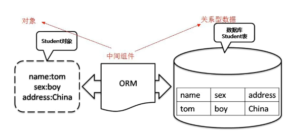

## 2、Mybatis和Mybatis-Plus

（1）Mybatis 是一款优秀的数据持久层 ORM 框架，它能够非常灵活的实现动态 SQL ，可以使用 XML 或注解来配置和映射原生信息，能够轻松地将 Java 的 POJO（Plain Oridinary Java Object，普通的 Java 对象）与数据库中的表和字段进行映射关联。

（2）Mybatis-Plus 是一个 Mybatis 的增强工具，在 Mybatis 的基础上做了改进增强，简化了开发。

## 3、添加依赖

```xml
<!-- Mybatis-Plus 的依赖,需要注意的是Mybatis-Plus是基于Mybatis的,因此添加了 Mybatis-Plus 依赖也会自动添加 Mybatis 的依赖,即可以直接使用 Mybatis 进行数据的操作 -->
<dependency>
    <groupId>com.baomidou</groupId>
    <artifactId>mybatis-plus-boot-starter</artifactId>
    <version>3.4.2</version>
</dependency>
<!-- MySQL 驱动依赖,一般需要和安装的 MySQL 数据库版本对应-->
<dependency>
    <groupId>mysql</groupId>
    <artifactId>mysql-connector-java</artifactId>
    <version>5.1.47</version>
</dependency>
<!-- 数据库连接池,可以一次性申请多个数据库的连接,加快与数据库的交互 -->
<dependency>
    <groupId>com.alibaba</groupId>
    <artifactId>druid-spring-boot-starter</artifactId>
    <version>1.1.20</version>
</dependency>
```

## 4、配置文件

```properties
spring.datasource.type=com.alibaba.druid.pool.DruidDataSource
spring.datasource.driver-class-name=mysql.jdbc.Driver
# localhost 是数据库所在的 ip 地址,mydb是数据库的名称
spring.datasource.url=jdbc:mysql://localhost:3306/mydb?useSSL=false&characterEncoding=utf8
spring.datasource.username=root
spring.datasource.password=root
mybatis-plus.configuration.log-impl=org.apache.ibatis.logging.stdout.StdOutImpl
mybatis.mapper-locations=classpath:com/e3e4e20/mapper/*.xml
```

```java
package com.example.demo;
@SpringBootApplication
// 添加@MapperScan指定 mapper文件的目录
@MapperScan("com.xx.mapper")
public class MybatisPlusDemoApplication{
    public static void main (String[] args){
        SpringApplication.run(MybatisPlusDemoApplication.class, args);
    }
}
```

```java
package com.example.demo;
@SpringBootTest
class DemoApplicationTests {
    @Autowired
    private DataSource dataSource;
    @Test
    public void contextLoads() {
    }
    @Test
    public void testDataSource() throws SQLException {
        // 测试数据源（数据库连接是否成功）
        System.out.println(dataSource.getConnection());
    }
}
```

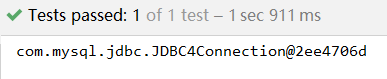

## 5、Mybatis CRUD注解

| 注解     | 功能                                  |
| -------- | ------------------------------------- |
| @Insert  | 添加数据                              |
| @Update  | 更新数据                              |
| @Delete  | 删除数据                              |
| @Select  | 查询数据                              |

```java
package com.e3e4e20.demo.entity;
// User实体类的属性必须要和数据库中user表的表项对应,
// 不一定每一个表项都需要,只需要定义需要的表项也是可以的
public class User{
    private String name;
    private String password;
    private String birth;
}
```

```java
package com.e3e4e20.demo.controller;
@RestController
public class UserController{
    // @Resource 和下面的 @Autowired 都可以
    @AutoWired
    private UserMapper usermapper;
    
    @GetMapping("/user")
    public List query(){
        List<User> users = usermapper.findAllUsers();
        System.out.println(users);
        return users;
    }
    
    @PostMapping("/user")
    public String save(User user){
        if(userMapper.insertUser(user) > 0){
            return "插入成功!";
        } else {
            return "插入失败!";
        }
    }
}
```

```java
package com.e3e4e20.demo.mapper;
// User 对应数据库中 user 表名
// mapper 映射文件是接口文件,具体的实现是交给 Mybatis 来完成的
// @MapperScan("com.xx.mapper") 和 @Mapper @Repository 注解两者只要有其中一个即可生效
@Mapper
@Repository
public interface UserMapper{
    // 查询所有用户
    @Select("select * from user")
    public List<User> findAllUsers();
    // 添加用户
    // 这里插入user表中的数据来自方法insertUser的参数
    // 使用#{name}这个name既对应数据库user表中的表项,也对应insertUser的参数user中的属性名称
    @Insert("insert into user values(#{name},#{password},#{birth})")
    // 方法的返回值表示插入的数据条数,若是插入失败则返回0
    public int insertUser(User user);
    // 更新数据
    @Update("update user set password=#{password},birth=#{birth} where name=#{name}")
    public updateUserByName(User user);
    // 删除数据
    @Delete("delete from user where name=#{name}")
    public deleteUserByName(String name);
    // 查找指定用户
    @Select("select * from user where name=#{name}")
    public findUserByName(String name);
}
```

## 6、Mybatis-Plus CRUD

```java
package com.e3e4e20.demo.mapper;
// User 对应数据库中 user 表名
// 在BaseMapper这个类中默认实现了所有CRUD的方法,不需要再写一次
// 具体有哪些方法,可以Ctrl+点击BaseMapper查看源码
@Mapper
public interface UserMapper extends BaseMapper<User>{}
/*
 * 注意：
 * 若是实体类中,有一个属性为 studentId ,那么在数据库中对应的表项需要是 student_id 否则报错
 * 在配置文件中 mybatis.configuration.map-underscore-tocamel-case:true 将下划线映射为驼峰命名
*/
```

需要注意的是，当实体类名和数据库表名不一致时，就需要在实体类上添加`@TableName("Str")`

```java
package com.e3e4e20.demo.entity;
/*
* 数据库表名为 t_user
* 实体类名为 User
*/
@TableName("t_user")
public class User{
    private String name;
    private String password;
    private String birth;
}
```

若是在数据库中表中有一个自增的 id 表项，可以使用`@TableId`指定。

```java
package com.e3e4e20.demo.entity;

public class User{
    @TableId(type = IdType.AUTO)
    private Integer id;
    private String name;
    private String password;
}
```

更多的 Mybatis-Plus 可以在 [Mybatis-Plus官网](https://baomidou.com/pages/24112f/)查找。

## 7、多表查询

| 注解 | 说明 |
| ---- | ---- |
| @Result  | 结果集封装，用来代替<id>标签和<Result>标签，@Result中可以使用如下属性<br/> - column：数据表的字段名称<br/> - property: 类中对应的属性名称<br/> - one: 与@One注解配合，进行一对一映射<br/> - many: 与@Many注解配合，进行一对多映射 |
| @Results | 代替<resultMap>标签，可以与@Result一起使用，封装多个结果集 |
| @One     | 代替<assocation>标签，用于指定查询中返回的单一对象<br/>通过selct属性指定用于多表查询的方法<br/>使用格式：@Result(column=“”,property=“”,one=@One(select=“”))<br/>一对一结果集封装 |
| @Many    | 代替<collection>标签，用于指定查询中返回的集合对象<br/>使用格式：@Result(column=“”,property=“”,many=@Many(select=“”))<br/>一对多结果集封装 |

==具体如何使用还是待日后再补充。==

# HTTP 状态码----待整理位置

当用户访问一个网页时，用户的浏览器会向网页所在服务器发出请求。当浏览器接收并显示网页前，此网页所在的服务器会返回一个包含 HTTP 状态码的信息头（server header）用以响应浏览器的请求。

HTTP 状态码的英文为 **HTTP Status Code**。。

下面是常见的 HTTP 状态码：

-   200 - 请求成功
-   301 - 资源（网页等）被永久转移到其它URL
-   404 - 请求的资源（网页等）不存在
-   500 - 内部服务器错误

（1）HTTP 状态码分类

HTTP 状态码由三个十进制数字组成，第一个十进制数字定义了状态码的类型。响应分为五类：

| 分类 | 分类描述                                       |
| ---- | ---------------------------------------------- |
| 1XX  | 信息，服务器收到请求，需要请求者继续执行操作   |
| 2XX  | 成功，操作被成功接收并处理                     |
| 3XX  | 重定向，需要进一步的操作以完成请求             |
| 4XX  | 客户端错误，请求包含语法错误或无法完成请求     |
| 5XX  | 服务器错误，服务器在处理请求的过程中发生了错误 |

（2）HTTP状态码列表:

| 状态码 | 状态码英文名称                  | 中文描述                                                     |
| ------ | ------------------------------- | ------------------------------------------------------------ |
| 100    | Continue                        | 继续。客户端应继续其请求                                     |
| 101    | Switching Protocols             | 切换协议。服务器根据客户端的请求切换协议。只能切换到更高级的协议，例如，切换到HTTP的新版本协议 |
| 200    | OK                              | 请求成功。一般用于GET与POST请求                              |
| 201    | Created                         | 已创建。成功请求并创建了新的资源                             |
| 202    | Accepted                        | 已接受。已经接受请求，但未处理完成                           |
| 203    | Non-Authoritative Information   | 非授权信息。请求成功。但返回的meta信息不在原始的服务器，而是一个副本 |
| 204    | No Content                      | 无内容。服务器成功处理，但未返回内容。在未更新网页的情况下，可确保浏览器继续显示当前文档 |
| 205    | Reset Content                   | 重置内容。服务器处理成功，用户终端（例如：浏览器）应重置文档视图。可通过此返回码清除浏览器的表单域 |
| 206    | Partial Content                 | 部分内容。服务器成功处理了部分GET请求                        |
| 300    | Multiple Choices                | 多种选择。请求的资源可包括多个位置，相应可返回一个资源特征与地址的列表用于用户终端（例如：浏览器）选择 |
| 301    | Moved Permanently               | 永久移动。请求的资源已被永久的移动到新URI，返回信息会包括新的URI，浏览器会自动定向到新URI。今后任何新的请求都应使用新的URI代替 |
| 302    | Found                           | 临时移动。与301类似。但资源只是临时被移动。客户端应继续使用原有URI |
| 303    | See Other                       | 查看其它地址。与301类似。使用GET和POST请求查看               |
| 304    | Not Modified                    | 未修改。所请求的资源未修改，服务器返回此状态码时，不会返回任何资源。客户端通常会缓存访问过的资源，通过提供一个头信息指出客户端希望只返回在指定日期之后修改的资源 |
| 305    | Use Proxy                       | 使用代理。所请求的资源必须通过代理访问                       |
| 306    | Unused                          | 已经被废弃的HTTP状态码                                       |
| 307    | Temporary Redirect              | 临时重定向。与302类似。使用GET请求重定向                     |
| 400    | Bad Request                     | 客户端请求的语法错误，服务器无法理解                         |
| 401    | Unauthorized                    | 请求要求用户的身份认证                                       |
| 402    | Payment Required                | 保留，将来使用                                               |
| 403    | Forbidden                       | 服务器理解请求客户端的请求，但是拒绝执行此请求               |
| 404    | Not Found                       | 服务器无法根据客户端的请求找到资源（网页）。通过此代码，网站设计人员可设置"您所请求的资源无法找到"的个性页面 |
| 405    | Method Not Allowed              | 客户端请求中的方法被禁止，HTTP请求需要为GET方法，即controller使用的不是GET方式接收数据 |
| 406    | Not Acceptable                  | 服务器无法根据客户端请求的内容特性完成请求                   |
| 407    | Proxy Authentication Required   | 请求要求代理的身份认证，与401类似，但请求者应当使用代理进行授权 |
| 408    | Request Time-out                | 服务器等待客户端发送的请求时间过长，超时                     |
| 409    | Conflict                        | 服务器完成客户端的 PUT 请求时可能返回此代码，服务器处理请求时发生了冲突 |
| 410    | Gone                            | 客户端请求的资源已经不存在。410不同于404，如果资源以前有现在被永久删除了可使用410代码，网站设计人员可通过301代码指定资源的新位置 |
| 411    | Length Required                 | 服务器无法处理客户端发送的不带Content-Length的请求信息       |
| 412    | Precondition Failed             | 客户端请求信息的先决条件错误                                 |
| 413    | Request Entity Too Large        | 由于请求的实体过大，服务器无法处理，因此拒绝请求。为防止客户端的连续请求，服务器可能会关闭连接。如果只是服务器暂时无法处理，则会包含一个Retry-After的响应信息 |
| 414    | Request-URI Too Large           | 请求的URI过长（URI通常为网址），服务器无法处理               |
| 415    | Unsupported Media Type          | 服务器无法处理请求附带的媒体格式                             |
| 416    | Requested range not satisfiable | 客户端请求的范围无效                                         |
| 417    | Expectation Failed              | 服务器无法满足Expect的请求头信息                             |
| 500    | Internal Server Error           | 服务器内部错误，无法完成请求                                 |
| 501    | Not Implemented                 | 服务器不支持请求的功能，无法完成请求                         |
| 502    | Bad Gateway                     | 作为网关或者代理工作的服务器尝试执行请求时，从远程服务器接收到了一个无效的响应 |
| 503    | Service Unavailable             | 由于超载或系统维护，服务器暂时的无法处理客户端的请求。延时的长度可包含在服务器的Retry-After头信息中 |
| 504    | Gateway Time-out                | 充当网关或代理的服务器，未及时从远端服务器获取请求           |
| 505    | HTTP Version not supported      | 服务器不支持请求的HTTP协议的版本，无法完成处理               |

# 引入spring-boot-devtools

springboot 提供了一个在项目运行时，当项目指定目录下的内容发生变化时，会自动重启项目的工具 devtools，这个重启的过程也称为热部署。

## 1、添加依赖

在 pom.xml 文件中添加如下依赖：

```xml
<dependency>
	<groupId>org.springframework.boot</groupId>
	<artifactId>spring-boot-devtools</artifactId>
    <optional>true</optional>
</dependency>
```

## 2、配置文件

在配置文件中添加如下内容：

```properties
# 启动热部署
spring.devtools.restart.enabled=true
# 指定目录下的修改需要执行自动重启
spring.devtools.restart.addtional-paths=src/main/java
# 指定目录下的修改不需要执行自动重启,即 classpath:/WEB-INF/ 目录下的修改不重启
# 不使用这个目录的话,或者需要使用这个目录的话,该配置可以不使用
spring.devtools.restart.exclude=static/**
```

## 3、在IDEA中配置项目自动编译

打开 IDEA 的 `Settings`–->`Build,execution,Deployment`–->`Compiler`–->`Build project automatically`

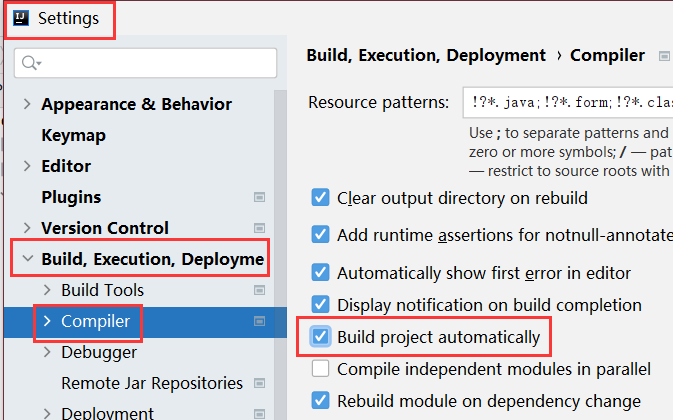

使用快捷键 `Ctrl+Shift+Alt+/`打开 Maintenance 界面，点击 Registry 界面，勾选 `compiler.automake.allow.when.app.running`

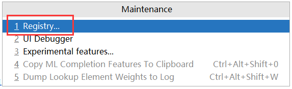


# 引入jwt-token

[localStorage Session Cookie说明](https://zhuanlan.zhihu.com/p/207106785)

## 1、前后端认证流程

（1）**Session** 认证

-   前端将用户的登录信息（用户名称和用户密码）发送给后端；
-   后端验证通过之后，将用户信息（用户身份信息、权限、登录时间等）保存在 **session** 中（保存的信息位于服务器中），并将这个 **session**  的 **id** 发送给前端；
-   前端使用 **localStorage** 、**session** 、**cookie** 保存这个 **id** ，之后每一次前端向后端发送的请求都会将这个 **id** 作为请求的一部分发送给后端；
-   后端收到这个 **id** 之后，从 **session** 中读取用户信息。

虽然 **Session** 认证的方式应用非常普遍，但是 **Session** 认证的扩展性不好。对于服务器集群，或者是跨域的服务导向架构，就要求 **Session** 数据共享，每台服务器都能够读取 **Session**，（保证每一台服务器读取到的 **Session** 数据相同）针对此种问题—般有两种方案：

-   一种解决方案是 **Session** 数据持久化，写入数据库或别的持久层（**Redis**）。各种服务收到请求后，都向持久层请求数据。这种方案的优点是架构清晰，缺点是工程量比较大。
-   一种方案是服务器不再保存 **Session** 数据，所有数据都保存在客户端，每次请求都发回服务器。Token认证就是这种方案的一个代表。

 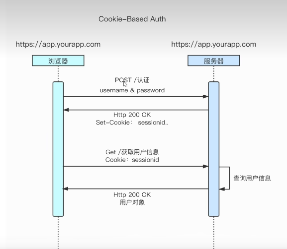

（2）**Token** 认证
**token** 是由后端产生的一串字符串，是前端访问资源接口(**API**)时所需要的资源凭证，流程如下：

-   前端使用用户名跟密码请求登录，后端收到请求，去验证用户名与密码；
-   后端验证成功后，后端会签发一个 **token** 并把这个 **token** 发送给前端；
-   前端收到 **token** 以后，使用 **localStorage** 、**session** 、**cookie** 存储起来；
-   前端每次向服务端请求资源的时候需要带着服务端签发的 **token** ；
-   后端收到请求，去验证客户端请求里面带着的 **token**，如果验证成功，就向客户端返回请求的数据。

**Token** 认证的特点：

-   基于 **token** 的用户认证是一种后端无状态的认证方式，后端不用存放 **token** 数据；
-   用解析 **token** 的计算时间换取 **session** 的存储空间，从而减轻服务器的压力，减少频繁的查询数据库，**token** 完全由应用管理，所以它可以避开同源策略。

 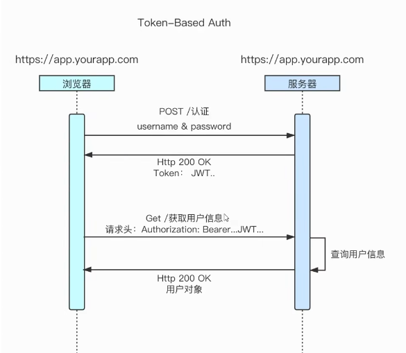


## 2、JWT基本说明

**JSON Web Token** (简称JWT）是一个 **Token** 认证的具体实现方式，是目前最流行的跨域认证解决方案。

**JWT** 的原理是，后端验证成功以后，生成一个JSON对象，发回给用户，具体如下：

```json
{
    "姓名":"张三",
    "角色":"管理员",
    "到期时间": "2018年7月1日0点0分"
}
```

前端与后端通信的时候，都要发回这个 **JSON** 对象。后端完全只靠这个对象认定用户身份。为了防止用户篡改数据，服务器在生成这个对象的时候，会加上签名。

前端收到后端发送的 **JWT**，可以储存在 **Cookie** 里面，也可以储存在 **localStorage**。前端每次向后端发送请求，都要带上这个 **JWT**，虽然可以把它放在 **Cookie** 里面自动发送，但是这样不能跨域。因此更好的做法是放在 **HTTP** 请求的头信息`Authorization`字段里面，单独发送。

## 3、JWT基本构成

**JWT** 的由三个部分组成，依次如下：**Header**(头部)、**Payload**(负载)、**Signature**(签名)。

（1）**Header**(头部)
**Header** 部分是一个 **JSON** 对象，描述 **JWT** 的元数据。

```json
{
    "a1g": "HS256",
    "typ": "iwT"
}
```

-   `alg` 属性表示签名的算法(algorithm)，默认是HMAC SHA256(写成HS256)
-   `typ` 属性表示这个令牌(token)的类型(type) ,JWT令牌统一写为JWT最后，将上面的JSON对象使用Base64URL 算法转成字符串。

（2）**Payload**(负载)

**Payload** 部分也是一个 **JSON** 对象，用来存放实际需要传递的数据。JWT规了7个官方字段，供选用。

```shell
iss (issuer):签发人
exp (expiration time):过期时间
sub (subject):主题
aud (audience):受众
nbf (Not Before):生效时间
iat (lssued At):签发时间
jti (JWT ID):编号
```

注意，==JWT默认是不加密的，任何人都可以读到，所以不要把秘密信息放在个部分==。**Payload** 部分也要使用Base64URL算法转成字符串。

（3）**Signature**(签名)

**Signature** 部分是对前两部分的签名，防止数据篡改。

-   首先，需要指定一个密钥(secret)。这个密钥只有服务器才知道，不能泄露给用户;
-   然后，使用Header里面指定的签名算法（默认是 HMAC SHA256)，按照下面的公式产生签名。

```shell
HMACSHA256(
	base64Ur1Encode(header) + "."+
	base64Ur1Encode(pay1oad),
	secret)
```

（4）生成 **JWT-token**

算出签名以后，把 **Header**、**Payload**、**Signature** 三个部分拼成一个字符串，每个部分之间用 **.** 分隔，就可以发送给前端。

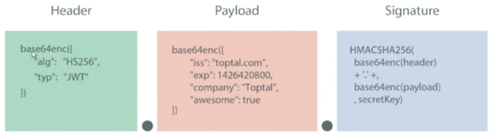

三个部分最终组合成完整的字符串如下：

```shell
# Header.Payload.Signature
eyJhbGci0iJIUzI1NiIsInR5cCI6IkpXVCJ9.
eyJzdWIiOiIxMjMENTY30DkwIiwibmFtZSI6IkpvaG4gRG91IiwiaXNTb2NpYWwiOnRydwV9.
4pcPyMD09olPSyXnrXCjTwXyr4BsezdI1AVTmud2fU4
```

## 4、添加依赖

```xml
<!-- JWT-Token 依赖 -->
<dependency>
    <groupId>io.jsonwebtoken</groupId>
    <artifactId>jjwt</artifactId>
    <version>0.9.1</version>
</dependency>
```

## 5、生成token

```java
public class TokenConfig {
    // token的有效期为 7 天(7*12*60*60=604800),这里使用的是秒
    private static long expire = 604800;
    // 秘钥
    private static String secret = "whatdoesnotdefeatyoumakesyoustronger";
    
    public static String createdToken (String userid) {
        Date now = new Date();
        Date expiration = new Date(now.getTime() + 1000 * expire);
        return Jwts.builder()
                .setHeaderParam("type", "JWT")
                .setSubject(userid)
                .setIssuedAt(now)
                .setExpiration(expiration)
                .signWith(SignatureAlgorithm.HS512,secret)
                .compact();
    }
}
```

## 6、解析token

```java
public class TokenConfig {
    // token的有效期为 7 天(7*12*60*60=604800),这里使用的是秒
    private static long expire = 604800;
    // 秘钥
    private static String secret = "whatdoesnotdefeatyoumakesyoustronger";
    
    public static Claims getClaimsByToken (String token) {
        return Jwts.parser()
                .setSigningKey(secret)
                .parseClaimsJws(token)
                .getBody();
    }
}
```

# 引入logging

## springboot的日志说明

springboot 默认使用 **SLF4J+Logback** 记录日志，并在项目启动时，以 info 级别输出到控制台。

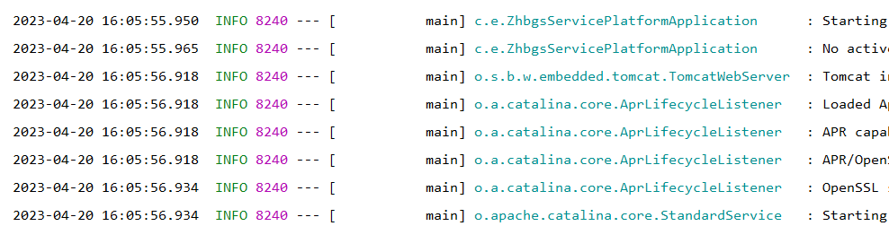

一条日志的内容包含如下几个方面：

- 日期时间，以 **YYYY-MM-DD HH:MM:SS.ms** （精确到毫秒）；
- 该条日志的级别，trace、debug、info、warn、error、fatal（6个级别）；
- 进程的id
- 分隔符 **—** 表示日志实际开始的位置；
- 线程名称使用 **[]** 括起来（可能会截断控制台的输出）；
- 日志名称，一般是源代码的类名；
- 日志的具体内容

## 添加Logback依赖

```xml
<dependency>
    <groupId>org.springframework.boot</groupId>
    <artifactId>spring-boot-starter-logging</artifactId>
</dependency>
```

## 日志级别

日志的级别有 6 类，从低级别到高级别分别为 **trace < debug < info < warn < error < fatal** 。

输出日志时，只会输出当前级别和高级别的日志，而不会输出低级别的日志；如 spring boot 默认的日志级别是 info 那么再输出日志时，只会输出 info 、warn、error、fatal 级别的日志，不会输出 trace 和 debug 级别的日志。

## 添加日志输出

```java
@SpringBootTest
public class LoggerTest {
    private final Logger logger = LoggerFactory.getLogger(LoggerTest.class);
    @Test
    void testLogging () {
        logger.info("info");
        logger.warn("warn");
        logger.error("error");
    }
}
```

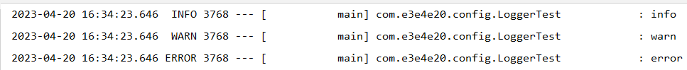

## 日志配置

在 spring boot 中 application.yaml 文件提供了如下的项目配置日志信息：

```properties
# 设置日志输出的级别,*为任意路径
logging.level.*=info

logging.level.root=warn # 默认日志输出的级别
logging.level.org.springframeword.web=warn # 指定类的日志输出级别

# 日志文件的名称
logging.file=spring.log
# 日志文件的存储路径,若是没有指定logging.file,那么文件名称默认为spring.log
logging.path
# 控制台中日志的样式
logging.pattern.console

logging.pattern.console=%d{yyyy-MM-dd HH:mm:ss.SSS} %-5level [%thread] %logger{15} - %msg%n

# 日志文件中日志的样式
logging.pattern.file
# 输出不同级别日志的样式,默认是 %5p
 logging.pattern.level
 # 当输出日志发生异常时的转换字
 logging.exception-conversion-word
 # 指定当前进程的 id
 PID
```

## 自定义日志配置

spring boot 项目中除了使用 applications.yaml 文件对日志进行一些基本的配置，还可以使用日志配置文件对日志的内容进行更为详细配置。

（1）使用不同的日志框架，就需要使用不同名称的配置文件：

- Logback：logback-spring.xml、logback-srping.groovy、logback.xml、logback.groovy
- Log4j：log4j-spring.properties、log4j-spring.xml、log4j.properties、log4j.xml
- Log4j2：log4j2-spring.xml、log4j2.xml
- JDK(java util logging)：logging.properties

spring 官方推荐使用 **-spring** 的文件名称作为日志的配置文件。

以上默认的配置文件的名称，可以直接在 `classpath:` 目录下创建。

 （2）还可以在 **application.yaml** 文件使用 `logging.config-classpath=relativePath` 指定自定义名称的配置文件。

（3）根节点 `configuration`

```xml
<?xml version="1.0" encoding="utf-8" ?>
<configuration scan="true" scanPeriod="60 seconds" debug="false">
<!-- scan 设置为 true 时,当日子文件发生改变时,将会重新加载配置文件,默认为 true -->
<!-- scanPeriod 设置扫描配置文件发生改变的时间间隔,当 scan 为 true 时,该属性生效,默认时间为 1 分钟,默认单位是 ms(没有给出时间单位时,使用默认时间单位) -->
<!-- debug 当设置为 true 时,输出 logback 内部的日志信息,实时查看 logback 运行状态,默认为 false -->
</configuration>
```

（4）子节点 `contextName`

```xml
<?xml version="1.0" encoding="utf-8" ?>
<configuration scan="true" scanPeriod="60 seconds" debug="false">
<!-- contextName 设置上下文名称,设置之后可以在标签元素中使用 %contextName% 引用设置的名称,一般不使用 -->
    <contextName>logback</contextName>
</configuration>
```

（5）子节点 `property`

```xml
<?xml version="1.0" encoding="utf-8" ?>
<configuration scan="true" scanPeriod="60 seconds" debug="false">
<!-- property 设置变量,设置之后可以在标签元素中使用 ${name} 的方式引用该变量,值为 value 对应的内容 -->
    <property name="logback.appname" value="appname"/>
</configuration>
```

（6）子节点 `appender`

```xml
<?xml version="1.0" encoding="utf-8" ?>
<configuration scan="true" scanPeriod="60 seconds" debug="false">
    <!-- 将日志内容输出到控制台 ConsoleAppender -->
    <appender name="console" class="ch.qos.logback.core.ConsoleAppender">
        <!-- 输出到控制台使用标签 layout 控制日志的输出的格式 -->
        <layout class="ch.qos.logback.classic.PatternLayout">
            <!-- 使用 pattern 标签控制输出的日志的格式 -->
            <pattern>
                %d{yyyy-MM-dd HH:mm:ss.SSS} %-5level [%thread] %logger{15} - %msg%n
            </pattern>
        </layout>
    </appender>
    <!-- 将日志输出到文件中 -->
    <appender name="file" class="ch.qos.logback.core.rolling.RollingFileAppender">
        <!-- 指定日志文件的存储位置 -->
        <File>C:/workspace/webapp/demo/logback.log</File>
        <!-- 输出到文件使用标签 encoder 控制日志的输出的格式 -->
        <encoder>
            <charset>UTF-8</charset>
            <!-- 使用 pattern 标签控制输出的日志的格式 -->
            <pattern>
                %d{yyyy-MM-dd HH:mm:ss.SSS} %-5level [%thread] %logger{15} - %msg%n
            </pattern>
        </encoder>
    </appender>
</configuration>
```

拆分日志文件，将指定级别的日志输出到指定的文件中。

```xml
<appender name="fileInfoLog" class="ch.qos.logback.core.rolling.RollingFileAppender">
        <!-- 由于 info 级别的日志中会包含 warn,error 级别的日志在内,因此需要将这两个级别的日志过滤掉 -->
        <filter class="ch.qos.logback.classic.filter.LevelFilter">
            <!-- 过滤掉 warn 级别的日志 -->
            <level>warn</level>
            <!-- 级别匹配为 warn 的就过滤 -->
            <onMatch>deny</onMatch>
            <!-- 级别不匹配 warn 的就输出 -->
            <onMismatch>accept</onMismatch>
        </filter>
        <filter class="ch.qos.logback.classic.filter.LevelFilter">
            <!-- 过滤掉 error 级别的日志 -->
            <level>error</level>
            <!-- 级别匹配为 error 的就过滤 -->
            <onMatch>deny</onMatch>
            <!-- 级别不匹配 error 的就输出 -->
            <onMismatch>accept</onMismatch>
        </filter>
        <!-- <File>与<FileNamePattern>两个同时存在时,那么当天的日志存放在<File>指定的文件名中,  -->
        <!-- 而非当日的日志会被重命名为<FileNamePattern>指定的文件名中  -->
        <!-- 若是没有<File>只有<FileNamePattern>时,那么只会使用<FileNamePattern>指定的文件名 -->
        <File>C:/workspace/webapp/demo/logback.info.log</File>
        <rollingPolicy class="ch.qos.logback.core.rolling.TimeBasedRollingPolicy">
            <FileNamePattern>C:/workspace/webapp/demo/logback.info.%d{yyyy-MM-dd}.log</FileNamePattern>
            <!-- 只保留最近90天的日志 -->
            <maxHistory>90</maxHistory>
            <!-- 指定日志文件的上限大小,当大小超过时,自动删除旧的日志 -->
            <totalSizeCap>1GB</totalSizeCap>
        </rollingPolicy>
        <encoder>
            <charset>UTF-8</charset>
            <pattern>
                %d{yyyy-MM-dd HH:mm:ss.SSS} %-5level [%thread] %logger{15} - %msg%n
            </pattern>
        </encoder>
    </appender>
```

(7)子节点 `root`

```xml
<?xml version="1.0" encoding="utf-8" ?>
<configuration scan="true" scanPeriod="60 seconds" debug="false">
    <root level="debug">
<!-- root 结点为必选结点,用来自动最基础的日志输出级别,只有一个 level 属性,可以包含一个或者多个便签 -->
<!-- level 指定日志输出级别,有 trace,debug,info,warn,error,all,off 七个属性值,大小写不区别,默认为 debug -->
        <appender-ref ref="console" />
<!-- ref 指定的属性值必须和 appender 的 name 属性值对应 -->
        <appender-ref ref="file" />
    </root>
</configuration>
```

(8)子节点 `logger`

```xml
<?xml version="1.0" encoding="utf-8" ?>
<configuration scan="true" scanPeriod="60 seconds" debug="false">
    <!-- 打印 mapper 包下所有类的日志信息,日志的级别为 debug ,并将此 logger 打印的信息向上传递 -->
    <!-- 不指定 level 属性,那么该 logger 默认使用 <root> 结点指定的 level -->
    <!-- 不指定 addtivity ,该属性默认为 true -->
    <logger name="com.e3e4e20.mapper" level="debug" addtivity="true" />
</configuration>
```

不指定 **level** 属性，不指定 **appender** 属性：

```xml
<?xml version="1.0" encoding="utf-8" ?>
<configuration scan="true" scanPeriod="60 seconds" debug="false">
    
    <!-- 这里省略了 <appender> 属性 name 为 console 和 file 的定义 -->
    
    <logger name="com.e3e4e20.mapper" addtivity="true" />
    
    <!-- 当执行 mapper 包下的类中的方法时,<logger>会将级别大于等于 info 的日志传递给 <root> 打印,而<logger> 本身不打印任何信息  -->
    <!-- <root> 将下级传递的信息交付给name属性值为 "console" 和 "file" 的 <appender> 处理-->
    
    <root level="info">
        <appender-ref ref="console" />
        <appender-ref ref="file" />
    </root>
</configuration>
```

指定 **level** 属性，指定 **appender** 属性：

```xml
<?xml version="1.0" encoding="utf-8" ?>
<configuration scan="true" scanPeriod="60 seconds" debug="false">
    
    <!-- 这里省略了 <appender> 属性 name 为 console 和 file 的定义 -->
    
    <logger name="com.e3e4e20.mapper" addtivity="false" level="debug">
        <appender-ref ref="console" />
    </logger>
    
    <!-- 当执行 mapper 包下的类中的方法时,<logger>会将级别大于等于 debug 的日志交付给name属性值为 "console" 的 <appender> 处理  -->
    <!-- <logger>不会将日志传递给 <root> 打印 -->
    <!-- 若是将 addtivity="false" 改为 addtivity="true" 那么 <logger>会将日志传递给 <root> 打印,这样在 console 控制台中日志信息就会被打印两次-->
    
    <root level="info">
        <appender-ref ref="console" />
        <appender-ref ref="file" />
    </root>
</configuration>
```

（9）多环境日志输出

```xml
<?xml version="1.0" encoding="utf-8" ?>
<configuration scan="true" scanPeriod="60 seconds" debug="false">

    <!-- 这里省略了 <appender> 属性 name 为 console 和 file 的定义 -->

    <!-- 测试环境+开发环境,多个属性值使用 , 隔开 -->
    <springProfile name="test,dev">
        <logger name="com.e3e4e20.mapper" addtivity="false" level="debug">
            <appender-ref ref="console" />
        </logger>
    </springProfile>

    <springProfile name="prod">
        <logger name="com.e3e4e20.mapper" addtivity="false" level="warn">
            <appender-ref ref="file" />
        </logger>
    </springProfile>


    <root level="info">
        <appender-ref ref="console" />
        <appender-ref ref="file" />
    </root>
</configuration>
```

在配置文件 **application.yaml** 中添加环境选项配置：

```yaml
spring.profiles.active: dev
```

# 引入汉字转拼音

## 1、pinyin4j基本说明

[pinyin4j](http://sourceforge.net/projects/pinyin4j/files/) 是一个将将简体和繁体中文转换到成拼音的Java开源类库，支持同一汉字有多个发音，支持拼音的格式化输出（包含声调）。

## 2、添加pinyin4j依赖

```xml
<dependency>
    <groupId>com.belerweb</groupId>
    <artifactId>pinyin4j</artifactId>
    <version>2.5.0</version>
</dependency>
```

## 3、常用的方法

```java
/*
 * HanyuPinyinOutputFormat defaultFormat = new HanyuPinyinOutputFormat();
 *
 * 控制大小写
 * UPPERCASE：大写  (ZHONG)
 * LOWERCASE：小写  (zhong)
 * defaultFormat.setCaseType(HanyuPinyinCaseType.UPPERCASE);
 *
 * WITHOUT_TONE：无音标  (zhong)
 * WITH_TONE_NUMBER：1-4数字表示英标  (zhong4)
 * WITH_TONE_MARK：直接用音标符（必须WITH_U_UNICODE否则异常）  (zhòng)
 * defaultFormat.setToneType(HanyuPinyinToneType.WITH_TONE_NUMBER);
 *
 * WITH_V：用 "v" 表示 "ü"  (nv)
 * WITH_U_AND_COLON：用"u:"表示 "ü"  (nu:)
 * WITH_U_UNICODE：直接用 "ü" (nü)
 * defaultFormat.setVCharType(HanyuPinyinVCharType.WITH_U_UNICODE);
 *
 * toHanyuPinyinStringArray如果传入的字符不是汉字不能转换成拼音，那么会直接返回null。
 *
 * String[] pinyin = PinyinHelper.toHanyuPinyinStringArray('重', defaultFormat);
 * for(String str: pinyin){
 *    System.out.println(str);
 * }
 */
```

## 4、获取汉字首字母

```java
/**
   * 获得一个中文汉字拼音首字母,且该字母为大写
   * @param chinese 一个中文汉字
   * @return 该汉字的首字母且该字母大写
   */
public String getUpperAlphabet(String chinese) {
    StringBuilder pinyinName = new StringBuilder();
    char[] nameChar = chinese.toCharArray();
    HanyuPinyinOutputFormat defaultFormat = new HanyuPinyinOutputFormat();
    defaultFormat.setCaseType(HanyuPinyinCaseType.UPPERCASE);
    defaultFormat.setToneType(HanyuPinyinToneType.WITHOUT_TONE);
    for (char c : nameChar) {
        if (c > 128) {
            try {
                pinyinName.append(PinyinHelper.toHanyuPinyinStringArray(
                    c, defaultFormat)[0].charAt(0));
            } catch (BadHanyuPinyinOutputFormatCombination e) {
                e.printStackTrace();
            }
        } else {
            pinyinName.append(c);
        }
    }
    return pinyinName.toString();
}
```

## 5、汉字转为拼音字母字符串

```java
/**
     * 将字符串中的中文转化为拼音,英文字符不变
     * @param chineseString 汉字
     * @return 一个纯小写字母的字符串
     */
public String getLowerPingYin(String chineseString) {
    HanyuPinyinOutputFormat format = new HanyuPinyinOutputFormat();
    format.setCaseType(HanyuPinyinCaseType.LOWERCASE);
    format.setToneType(HanyuPinyinToneType.WITHOUT_TONE);
    format.setVCharType(HanyuPinyinVCharType.WITH_V);
    StringBuilder output = new StringBuilder();
    if (chineseString != null && chineseString.length() > 0
        && !"null".equals(chineseString)) {
        char[] input = chineseString.trim().toCharArray();
        try {
            for (char c : input) {
                if (Character.toString(c).matches(
                    "[\\u4E00-\\u9FA5]+")) {
                    String[] temp = PinyinHelper.toHanyuPinyinStringArray(
                        c, format);
                    output.append(temp[0]);
                } else
                    output.append(Character.toString(c));
            }
        } catch (BadHanyuPinyinOutputFormatCombination e) {
            e.printStackTrace();
        }
    } else {
        return "*";
    }
    return output.toString();
}
```

