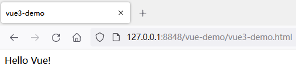
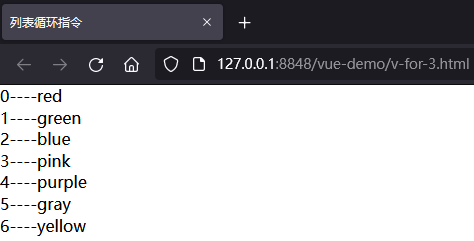
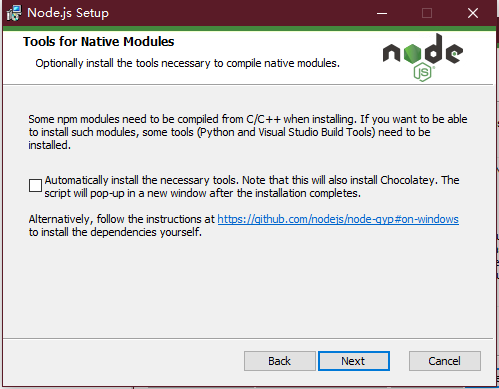
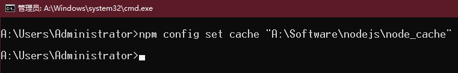
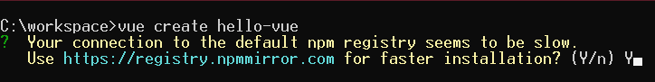
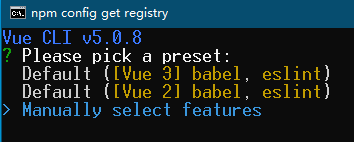
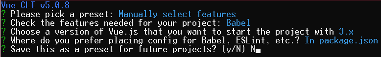
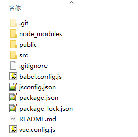
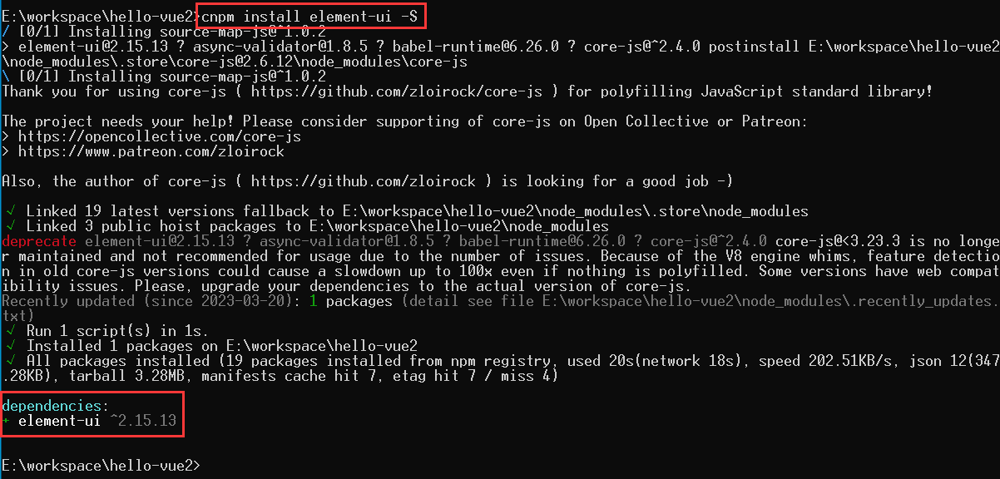
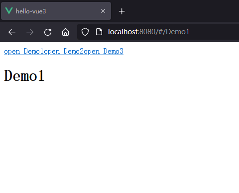

# vuejs简介

## 1、MVC架构模式

MVC（Model View Controller，模型-视图-控制器）架构模式。Model 是负责存储数据的中心，一方面，Model 不仅封装了各类数据对象，还封装了对这些数据处理的过程，另一方面，当数据发生改变，Model 还需要通知 View 改变展示的数据；View 是用户操作的界面，一方面，View 负责向用户渲染界面、展示数据，另一方面，View 需要将用户的操作交付给 Controller，还需要向 Model 查询数据的状态；Controler 负责与用户进行交互，一方面，Controller 负责将用户在 View 上的操作转换成对 Model 的操作，另一方面，Controller 负责对用户的操作选择合适的 View 进行渲染。

## 2、MVVM架构模式

MVVM（Model View ViewModel，模式-视图-视图模型），其核心是 ViewModel 。在 MVVM 架构模式中，View 单纯的负责渲染界面、展示数据，而 Model 封装了各类数据对象， 以及定义数据修改和操作的业务逻辑；但是 View 和 Model 之间是没有之间联系的，而是由 ViewModel 负责将 View 和 Model 连接起来实现双向的数据绑定，保证视图和数据一致性，即 View 发生改变，由封装好的核心 ViewModel 负责更新 Model，而 Model 发生改变，同样也是由 ViewModel 负责更新 View 。


## 3、vuejs框架

1、vuejs  是一款用于构建用户界面的 JavaScript 框架，它基于标准 HTML、CSS 和 JavaScript 构建；

2、vuejs 是一个典型的 MVVM 架构模型的框架 ，它提供了 MVVM 架构模式风格的双向数据绑定；

3、vuejs 是一套用于构建用户界面的渐进式框架，它提供了一套声明式的、组件化的编程模型。 

# vuejs快速入门

## 1、使用script脚本引入vue2

```html
<!-- 在HTML文件中导入 Vue.js ,即 MVVM 中的 VM -->
<!-- 本地引入vue -->
<script src="../js/vue-2.6.11.min.js"></script>
<!-- 在线引入vue -->
<script src="https://cdn.jsdelivr.net/npm/vue@2.7.14/dist/vue.js"></script>
```

```html
<!-- 在HTML文件中声明一个 id="app" 的DOM区域,这个DOM区域会被 vue 所控制,即 MVVM 中的 V -->
<div id="app">
    {{message}} <!-- {{ }}插值表达式，用来填充数据到 HTML 标签中,支持基本的计算、字符串的拼接 -->
</div>
```

```html
<!-- 创建 vm 实例对象 -->
<script>
    new Vue({
        el: '#app', // 指定当前 vue 实例要控制页面的哪一个区域,即 DOM 元素挂载的位置（其值可以是 CSS 选择器或者 DOM 元素）
        data: { // 指定数据源,即 MVVM 中的 M （其值为一个对象）
            message: 'Hello World!'
        },
        methods: { // 定义 JS 函数（其值为一个对象）
            
        }
    });
</script>
```


## 2、使用script脚本引入vue3

```html
<!-- 在HTML文件中导入 Vue.js ,即 MVVM 中的 VM -->
<!-- 在线引入vue -->
<script src="https://unpkg.com/vue@3/dist/vue.global.js"></script>
```

```html
<!-- 在HTML文件中声明一个 id="app" 的DOM区域,这个DOM区域会被 vue 所控制,即 MVVM 中的 V -->
<div id="app">
    {{message}}
</div>
```

```html
<!-- 创建 vm 实例对象和 M 模型 -->
<script>
    const vm = {
        data: function () { // 指定数据源,即 MVVM 中的 M
            return {
                message: 'Hello Vue!'
            }
        },
        methods: { // 定义 JS 函数（其值为一个对象）
            
        }
    }
    const app = Vue.createApp(vm) // 创建实例对象,即 MVVM 中的 VM
    app.mount('#app') // 指定当前 vue 实例要控制页面的哪一个区域,即 DOM 元素挂载的位置（其值可以是 CSS 选择器或者 DOM 元素）
</script>
```



## 3、vuejs基本指令v-cloak

```html
<div id="app">
    <!-- {{ data }} 的展示数据的方式称为模板指令 -->
    {{message}}
</div>
```

在实例中`{{message}}`这种使用`{{}}`的方式成为插值表达式。**但是在 DOM 模板尚未完成编译时，插值表达式**`{{message}}`**并不会被替换成相应的数据，而是先保留在 MVVM 的 View 中，在编译完成之后，再替换成相应的数据。**

因此用户可能先看到的是还没编译完成的双大括号标签，直到挂载的组件将它们替换为实际渲染的内容。为了解决这种情况，可以使用如下的方式：

```html
<!DOCTYPE html>
<html>
    <head>
        <meta charset="utf-8">
        <title>内容渲染指令</title>
        <script src="https://unpkg.com/vue@3/dist/vue.global.js"></script>
        <style>
            [v-cloak] {
                display: none;
            }
        </style>
    </head>
    <body>
        <div id="app">
            <p v-cloak>
            	{{message}}
            </p>
        </div>
        <script>
            const vm = {
                data: function () {
                    return {
                        message: 'hello vue!'
                    }
                }
            }
            const app = Vue.createApp(vm)
            app.mount('#app')
        </script>
    </body>
</html>
```

实现原理： 在尚未完成编译 DOM 模板时， `v-cloak` 会保留在所绑定的元素上，配合像 `[v-cloak] { display: none }` 这样的 CSS 规则，可以在组件编译完毕前隐藏原始模板，直到相关组件实例被挂载后才移除。即直到编译完成前，`<p v-cloak>{{message}}</p>` 将不可见。

## 4、vuejs基本指令v-text

```html
<!DOCTYPE html>
<html>
    <head>
        <meta charset="utf-8">
        <title>内容渲染指令</title>
        <script src="https://unpkg.com/vue@3/dist/vue.global.js"></script>
        <style>
            [v-cloak] {
                display: none;
            }
        </style>
    </head>
    <body>
        <div id="app">
            <p v-text="message"></p>
            <p v-cloak>
                {{message}}
            </p>
        </div>
        <script>
            const vm = {
                data: function () {
                    return {
                        message: 'hello vue!'
                    }
                }
            }
            const app = Vue.createApp(vm)
            app.mount('#app')
        </script>
    </body>
</html>
```


但是 `v-text` 指令和`{{text}}` 插值表达式是有区别的，`v-text`指令会覆写整个标签内部的内容，而`{{text}}`插值表达式仅仅只是使用数据替换整个插值表达式。

```html
<!DOCTYPE html>
<html>
    <head>
        <meta charset="utf-8">
        <title>内容渲染指令</title>
        <script src="https://unpkg.com/vue@3/dist/vue.global.js"></script>
        <style>
            [v-cloak] {
                display: none;
            }
        </style>
    </head>
    <body>
        <div id="app">
            <p v-text="message"><span>message</span></p>
            <p v-cloak><span>message: {{message}}</span></p>
        </div>
        <script>
            const vm = {
                data: function () {
                    return {
                        message: 'hello vue!'
                    }
                }
            }
            const app = Vue.createApp(vm)
            app.mount('#app')
        </script>
    </body>
</html>
```


在 DOM 模板渲染完成之后，原本位于`<p v-text="message"></p>`之间的内容`<span>message</span>`直接被`message`内的数据覆盖，而使用插值表达式的`<p v-cloak><span>message: {{message}}</span></p>`中间的`<span>message: </span>`部分没有被覆盖，而是保留了下来。

```html
<div id="app">
    <p v-text="message"></p>
    <p v-cloak>
        {{message}}
    </p>
</div>
<!-- 在这种单纯的往标签内插入文本数据,并且标签内部没有其他内容会被覆写时，那么两种方式都可以 -->
<!-- 但是一旦标签内部含有其他内容时,就只能使用 {{}} 插值表达式的方式-->
```

## 5、vuejs基本指令v-html

```html
<!DOCTYPE html>
<html>
    <head>
        <meta charset="utf-8">
        <title>内容渲染指令</title>
        <script src="https://unpkg.com/vue@3/dist/vue.global.js"></script>
    </head>
    <body>
        <div id="app">
            <p>姓名：{{name}}</p>
            <p>性别：{{sex}}</p>
            <p>{{desc}}</p>
            <!-- v-html="" 的展示数据的方式称为 v-html 指令 -->
            <!-- v-html 指令对传入的数据进行 html 渲染 -->
            <p v-html="desc"></p>
        </div>
        <script>
            const vm = {
                data() {
                    return {
                        name: 'snow',
                        sex: '18',
                        desc: '<a href="https://www.baidu.com">百度</a>'
                    }
                }
            }
            const app = Vue.createApp(vm)
            app.mount('#app')
        </script>
    </body>
</html>
```


## 6、vuejs基本指令v-bind

①`v-bind`的基本用法

```html
<!DOCTYPE html>
<html>
    <head>
        <meta charset="utf-8">
        <title>属性绑定指令</title>
        <script src="https://unpkg.com/vue@3/dist/vue.global.js"></script>
    </head>
    <div id="app">
        <!-- v-bind:attrbute="data" 展示数据的方式称为属性绑定指令 -->
        <!-- v-bind:attrbute="data" 将数据 data 填充到对应的属性中 -->
        <!-- v-bind:attrbute="data" 与 :attrbute="data" 效果相同 -->
        <a v-bind:href="link">百度</a>
        <input type="text" :placeholder="inputType" />
        
        <!-- 使用不带参数的 v-bind，将多个属性绑定到单个元素上 -->
        <div v-bind="objectOfAttrs"></div>
    </div>
    <script>
        const vm = {
            data: function () {
                return {
                    link: 'https://www.baidu.com',
                    // 文本框的占位符
                    inputType: '请输入内容',
                    // 图片的src地址
                    imgSrc: './images/demo.jpg',
                    w: '500px',
                    objectOfAttrs: {
                        id: 'container',
                        class: 'wrapper'
                    }
                }
            }
        }
        const app = Vue.createApp(vm)
        app.mount('#app')
    </script>
    </body>
</html>
```


- 使用`v-bind`绑定**动态参数**中的表达式应当是一个**字符串**，或者为`null`。 特殊值 `null` 意为显式移除该绑定。其他非字符串的值会触发警告。 
- 动态参数表达式中不能出现如空格或者引号，在 HTML 属性名称（HTML 属性名称是一个字符串）中都是不合法的。
- HTML 属性名称是不区分大小写字母的（即`someAttr`和`someattr`是等价的），因此在 HTML 文件中使用动态参数需要避免使用大写字母。

### ②`v-bind`为属性绑定数组和对象

使用`v-bind`绑定元素属性`class`时，其内容可以是**数组或者对象**。

```html
<!DOCTYPE html>
<html>
    <head>
        <meta charset="utf-8">
        <title>属性绑定指令2</title>
        <style>
            * {
                margin: 0;
                padding: 0;
            }

            .base {
                width: 300px;
                height: 100px;
                margin: 10px 20px;
                background-color: pink;
                font-size: 20px;
            }

            .active {
                background-color: skyblue;
            }

            .error {
                background-color: purple;
            }

            .borderUp {
                border-top: 20px solid #f10125;
            }

            .borderDown {
                border-bottom: 20px solid #f10125;
            }
        </style>
        <script src="https://unpkg.com/vue@3/dist/vue.global.js"></script>
    </head>
    <body>
        <div id="app">
            <div class="base borderUp borderDown">class类名绑定属性</div>
            <div class="base" :class="['borderUp','borderDown']">v-bind:class绑定数组</div>
            <div class="base" :class="[borderUp,borderDown]">v-bind:class绑定数组VM.data</div>
            <div class="base" :class="borderStyle">v-bind:class绑定数组名</div>
            <div class="base" :class="{active: isActive,error: isError}">
                <p>v-bind:class绑定对象</p>
                <button @click="changeStyle">"改变样式"</button>
            </div>
            <div class="base" :class="objStyle">
                <p>v-bind:class绑定对象名</p>
                <button @click="changeStyle2">"改变样式"</button>
            </div>
        </div>
        <script>
            const vm = {
                data: function() {
                    return {
                        borderUp: 'borderUp',
                        borderDown: 'borderDown',
                        borderStyle: ['borderUp', 'borderDown'],
                        isActive: true,
                        isError: false,
                        objStyle: {
                            active: true,
                            error: false
                        }
                    }
                },
                methods: {
                    changeStyle() {
                        this.isActive = !this.isActive;
                        this.isError = !this.isError;
                    },
                    changeStyle2() {
                        this.objStyle.active = !this.objStyle.active;
                        this.objStyle.error = !this.objStyle.error;
                    }
                }
            }
            const app = Vue.createApp(vm)
            app.mount('#app')
        </script>
    </body>
</html>
```


使用`v-bind`绑定元素属性`style`时，其内容可以是数组或者对象。

```html
<!DOCTYPE html>
<html>
    <head>
        <meta charset="utf-8">
        <title>属性绑定指令3</title>
        <style>
            * {
                margin: 0;
                padding: 0;
            }

            .base {
                width: 300px;
                height: 100px;
                margin: 10px 20px;
                background-color: pink;
                font-size: 20px;
            }
        </style>
        <script src="https://unpkg.com/vue@3/dist/vue.global.js"></script>
    </head>
    <body>
        <div id="app">
            <div class="base" style="border-top: 20px solid #f10125;border-bottom: 20px solid #f10125;">style类名绑定属性</div>
            <div class="base" :style="[borderUp, borderDown]">v-bind:style绑定数组</div>
            <!-- 元素的属性不区分大小写,元素的属性值也是不区分大小写的, -->
            <!-- 因此元素的属性和属性值都是小写字母且字母与字母之间使用短横线 - 连接 -->
            <!-- 但是在 JS 中是区分大小写的,因此 js 采用驼峰格式命名 -->
            <!-- 即在 JS 中使用 borderTop 名称对应属性值 border-top -->
            <div class="base" :style="{borderTop: borderUpStyle, borderBottom: borderDownStyle}">v-bind:style绑定对象</div>
            <div class="base" :style="borderStyle">v-bind:style绑定对象</div>
        </div>
        <script>
            const vm = {
                data: function() {
                    return {
                        borderUp: {'border-top': '20px solid #f10125'},
                        borderDown: {'border-bottom': '20px solid #f10125'},
                        borderUpStyle: '20px solid #f10125',
                        borderDownStyle: '20px solid #f10125',
                        borderStyle: {
                            'border-top': '20px solid #f10125',
                            'border-bottom': '20px solid #f10125'
                        }
                    }
                },
                methods: {
                    changeStyle() {
                        this.isActive = !this.isActive;
                        this.isError = !this.isError;
                    },
                    changeStyle2() {
                        this.objStyle.active = !this.objStyle.active;
                        this.objStyle.error = !this.objStyle.error;
                    }
                }
            }
            const app = Vue.createApp(vm)
            app.mount('#app')
        </script>
    </body>
</html>
```


## 7、vuejs基本语法-JS表达式

```html
<!DOCTYPE html>
<html>
    <head>
        <meta charset="utf-8">
        <title>使用JavaScript表达式</title>
        <script src="https://unpkg.com/vue@3/dist/vue.global.js"></script>
    </head>
    <body>
        <div id="app">
            <p>{{num + 1}}</p>
            <p>{{ok ? 'True' : 'False'}}</p>
            <p>{{message.split('').reverse().join('')}}</p>
            <!-- 在属性中进行字符串的拼接 -->
            <p :id="'list-' + id">xxx</p>
            <p :id="`list-${id}`">xxx</p>
            <!-- 显示数据对象中的成员值 -->
            <p>{{user.name}}</p>
            <!-- 在绑定的表达式中使用一个组件暴露的方法 -->
            <span :title="toTitleDate(date)">
                {{ formatDate(date) }}
            </span>
        </div>
        <script>
            const vm = {
                data: function () {
                    return {
                        num: 9,
                        ok: false,
                        message: 'ABC',
                        id: 3,
                        user: {
                            name: 'zs'
                        },
                        date: Date()
                    }
                },
                methods: {
                    toTitleDate(date){
                        return date
                    },
                    formatDate(date){
                        return date
                    }
                }
            }
            const app = Vue.createApp(vm)
            app.mount('#app')
        </script>
    </body>
</html>
```


每个绑定仅支持**单一表达式**，也就是一段能够被求值的 JavaScript 代码。一个简单的判断方法是是否可以合法地写在 `return` 后面。 

模板中的表达式将被沙盒化，仅能够访问到有限的全局对象列表。该列表中会暴露常用的内置全局对象，比如 `Math` 和 `Date`。

没有显式包含在列表中的全局对象将不能在模板内表达式中访问，例如用户附加在 `window` 上的属性。然而，你也可以自行在 `app.config.globalProperties`上显式地添加它们，供所有的 Vue 表达式使用。

## 8、vuejs基本指令v-on

### ①`v-on`的基本用法

```html
<!DOCTYPE html>
<html>
    <head>
        <meta charset="utf-8">
        <title>事件绑定指令</title>
        <script src="https://unpkg.com/vue@3/dist/vue.global.js"></script>
    </head>
    <body>
        <div id="app">
            <h3>count的值为{{count}}</h3>
            <!-- v-on:evnt="function" 展示数据的方式称为事件绑定指令 -->
            <!-- v-on:evnt="function" 调用函数处理数据并将数据填充到对应的属性中 -->
            <!-- v-on:evnt="function" 与 @evnt="function" 效果相同 -->
            <button v-on:click="count+=1">+1</button>
            <button @click="count+=1">+1</button>
        </div>
        <script>
            const vm = {
                data: function () {
                    return {
                        count: 0
                    }
                }
            }
            const app = Vue.createApp(vm)
            app.mount('#app')
        </script>
    </body>
</html>
```


````html
<!DOCTYPE html>
<html>
    <head>
        <meta charset="utf-8">
        <title>事件绑定指令2</title>
        <style>
            button {
                display: block;
            }
        </style>
        <script src="https://unpkg.com/vue@3/dist/vue.global.js"></script>
    </head>
    <body>
        <div id="app">
            <p v-text="number"></p>
            <!-- 使用 v-on 绑定事件时,除了可以将函数方法体直接写在 DOM 元素的属性内 -->
            <!-- 还可以将函数直接封装在 VM 实例对象中的 methods 对象中 -->
            <!-- 即 v-on:click="function" 与 v-on:click="functionName" 效果相同 -->
            <button @click="number+=1">+1</button>
            <button @click="addNumber">+1</button>
        </div>
        <script>
            const vm = {
                data: function () {
                    return {
                        number: 1
                    }
                },
                methods: {
                    addNumber() {
                        // 这里的 this 指代的是当前 VM 实例,即 const vm = {...} 创建的 vm 对象
                        this.number+=1
                    }
                }
            }
            const app = Vue.createApp(vm)
            app.mount('#app')
        </script>
    </body>
</html>
````


```html
<!DOCTYPE html>
<html>
    <head>
        <meta charset="utf-8">
        <title>事件绑定指令3</title>
        <style>
            button {
                display: block;
            }
        </style>
        <script src="https://unpkg.com/vue@3/dist/vue.global.js"></script>
    </head>
    <body>
        <div id="app">
            <p v-text="number"></p>
            <p v-text="message1"></p>
            <p v-text="message2"></p>
            <!-- 使用函数名调用函数时,当该函数没有参数时, $event 作为该函数的默认参数 -->
            <!-- 并且在调用该函数时,可以直接使用函数名称,不需要将参数写出来 -->
            <button @click="addfunction1">+1</button>
            <button @click="addfunction2">+2</button>
            <button @click="addfunction3($event)">+3</button>
            <hr />
            <p v-text="result"></p>
            <p v-text="message3"></p>
            <p v-text="message4"></p>
            <!-- 当函数的参数部分有多个时,在调用时必须要将每一个参数写出来 -->
            <!-- 此时有函数参数存在,且没有直接传递 $event 参数,函数中是不能使用的 -->
            <button @click="addfunction4(2,4)">2+4</button>
            <!-- 当函数的参数不止一个时,且参数中有 $event 作为参数时, $event 必须 -->
            <!-- 是参数列中的最后一个参数 -->
            <button @click="addfunction5(3,5,$event)">3+5</button>
        </div>
        <script>
            const vm = {
                data: function () {
                    return {
                        number: 1,
                        message1: 'event.target.tagName',
                        message2: 'event.target.innerHTML',
                        result: 0,
                        message3: 'event.target.tagName',
                        message4: 'event.target.innerHTML'
                    }
                },
                methods: {
                    addfunction1 () {
                        this.number += 1,
                            this.message1 = event.target.tagName,
                            this.message2 = event.target.innerHTML
                    },
                    addfunction2 (event) {
                        this.number += 2,
                            this.message1 = event.target.tagName,
                            this.message2 = event.target.innerHTML
                    },
                    addfunction3 (event) {
                        this.number += 3,
                            this.message1 = event.target.tagName,
                            this.message2 = event.target.innerHTML
                    },
                    addfunction4 (num1, num2) {
                        this.result = num1 + num2
                    },
                    addfunction5 (num1, num2, event) {
                        this.result = num1 + num2,
                            this.message3 = event.target.tagName,
                            this.message4 = event.target.innerHTML
                    }
                }
            }
            const app = Vue.createApp(vm)
            app.mount('#app')
        </script>
    </body>
</html>
```


### ②`v-on`的事件修饰符

绑定事件指令 `v-on` 除了以上的基本用法之后，还有一些**事件修饰符**可以使用。

```html
<!DOCTYPE html>
<html>
    <head>
        <meta charset="utf-8">
        <title>事件绑定指令4</title>
        <style>
            button {
                display: block;
            }
        </style>
        <script src="https://unpkg.com/vue@3/dist/vue.global.js"></script>
    </head>
    <body>
        <div id="app">
            <p>{{message}} --- {{number}}</p>
            <div @click="changeMessage" style="width: 100px; height: 100px; background-color: pink;">
                <button @click="add">+1</button>
            </div>
        </div>
        <script>
            const vm = {
                data: function () {
                    return {
                        message: 'hello Vuejs',
                        number: 10
                    }
                },
                methods: {
                    changeMessage () {
                        this.message = 'sjeuV olleh'
                    },
                    add () {
                        this.number+=1
                    }
                }
            }
            const app = Vue.createApp(vm)
            app.mount('#app')
        </script>
    </body>
</html>
```


以上例子中，可以发现，DOM 元素 `div` 绑定了事件 `changeMessage` ，当点击了子元素 `button` 时，不仅仅触发了 `button` 的事件，而且还同时触发了父元素 `div` 的事件，这种情况就称为**冒泡**。在 javascript 中提供了`stopPropagation()` 函数，而在 vuejs 中提供了事件修饰符 `.stop` 阻止这种触发子元素事件时，同时还会触发父元素事件的情况。

```html
<!DOCTYPE html>
<html>
    <head>
        <meta charset="utf-8">
        <title>事件绑定指令4</title>
        <style>
            button {
                display: block;
            }
            [v-cloak] {
                display: none;
            }
        </style>
        <script src="https://unpkg.com/vue@3/dist/vue.global.js"></script>
    </head>
    <body>
        <div id="app">
            <p v-cloak>{{message}} --- {{number}}</p>
            <div @click="changeMessage" style="width: 100px; height: 100px; background-color: pink;">
                <button @click="add1">+1</button>
            </div>
            <div @click="changeMessage2" style="width: 100px; height: 100px; background-color: pink;">
                <p>event</p>
                <button @click="add2">+2</button>
            </div>
            <div @click="changeMessage3" style="width: 100px; height: 100px; background-color: pink;">
                <p>.stop</p>
                <!-- 使用 vuejs 提供的 .stop 事件修饰符阻止冒泡-->
                <button @click.stop="add3">+3</button>
            </div>
        </div>
        <script>
            const vm = {
                data: function () {
                    return {
                        message: 'hello Vuejs',
                        number: 10
                    }
                },
                methods: {
                    changeMessage () {
                        this.message = 'sjeuV olleh'
                    },
                    changeMessage2 () {
                        this.message = 'sjeuV olleh event'
                    },
                    changeMessage3 () {
                        this.message = 'sjeuV olleh stop'
                    },
                    add1 () {
                        this.number+=1
                    },
                    add2 (event) {
                        // 使用 JS 函数,阻止冒泡
                        event.stopPropagation(),
                            this.number+=2
                    },
                    add3 () {
                        this.number+=3
                    }
                }
            }
            const app = Vue.createApp(vm)
            app.mount('#app')
        </script>
    </body>
</html>
```


除了阻止冒泡的，在 JavaScript 中也提供了阻止 DOM 元素默认行为的函数 `preventDefault()`，在 vuejs 中也提供了事件修饰符 `.prevent`方式。

```html
<!DOCTYPE html>
<html>
    <head>
        <meta charset="utf-8">
        <title>事件绑定指令5</title>
        <style>
            a {
                display: block;
            }
            [v-cloak] {
                display: none;
            }
        </style>
        <script src="https://unpkg.com/vue@3/dist/vue.global.js"></script>
    </head>
    <body>
        <div id="app">
            <p v-text="message"></p>
            <a href="https://www.baidu.com">百度</a>
            <a href="https://www.baidu.com" @click="prevent1">百度</a>
            <!-- 使用 vuejs 提供的 .prevent 事件修饰符阻止元素默认行为 -->
            <a href="https://www.baidu.com" @click.prevent="prevent2">百度</a>
        </div>
        <script>
            const vm = {
                data: function () {
                    return {
                        message: ''
                    }
                },
                methods: {
                    prevent1 (event) {
                        // 使用 JS 阻止元素默认行为
                        event.preventDefault(),
                        this.message = 'event.preventDefault()'
                    },
                    prevent2 () {
                        this.message = '.prevent'
                    }
                }
            }
            const app = Vue.createApp(vm)
            app.mount('#app')
        </script>
    </body>
</html>
```


vuejs 提供的事件修饰符，除了单独使用，还可以组合使用。

```html
<!DOCTYPE html>
<html>
    <head>
        <meta charset="utf-8">
        <title>事件绑定指令6</title>
        <style>
            a {
                display: block;
                margin-top: 30px;
            }
            [v-cloak] {
                display: none;
            }
            .message {
                width: 200px;
                height: 100px;
                background-color: pink;
            }
        </style>
        <script src="https://unpkg.com/vue@3/dist/vue.global.js"></script>
    </head>
    <body>
        <div id="app">
            <p v-text="message"></p>
            <p v-text="prevent"></p>
            <a href="https://www.baidu.com" @click.prevent="prevent1">百度.prevent</a>
            <div @click.stop="changeMessage1" class="message">
                <a href="https://www.baidu.com" @click.prevent="prevent2">百度.prevent</a>
            </div>
            <div @click.stop="changeMessage2" class="message">
                <a href="https://www.baidu.com" @click.stop="prevent3">百度.stop</a>
            </div>
            <div @click.stop="changeMessage3" class="message">
                <a href="https://www.baidu.com" @click.stop.prevent="prevent4">百度.stop.prevent</a>
            </div>
            <div @click.stop="changeMessage4" class="message">
                <a href="https://www.baidu.com" @click.prevent.stop="prevent5">百度.prevent.stop</a>
            </div>
        </div>
        <script>
            const vm = {
                data: function () {
                    return {
                        message: 'hello vuejs',
                        prevent: 'init'
                    }
                },
                methods: {
                    prevent1 () {
                        this.prevent = '.prevent'
                    },
                    prevent2 () {
                        this.prevent = '百度.prevent'
                    },
                    prevent3 () {
                        this.prevent = '百度.stop'
                    },
                    prevent4 () {
                        this.prevent = '百度.stop.prevent'
                    },
                    prevent5 () {
                        this.prevent = '百度.prevent.stop'
                    },
                    changeMessage1 () {
                        this.message = 'sjeuv olleh ----- 1'
                    },
                    changeMessage2 () {
                        this.message = 'sjeuv olleh ----- 2'
                    },
                    changeMessage3 () {
                        this.message = 'sjeuv olleh ----- 3'
                    },
                    changeMessage4 () {
                        this.message = 'sjeuv olleh ----- 4'
                    },
                }
            }
            const app = Vue.createApp(vm)
            app.mount('#app')
        </script>
    </body>
</html>
```


上例中，同时使用事件修饰符`.stop`和`.prevent`既阻止了冒泡，又阻止了 DOM 元素的默认行为。而且`.stop.prevent`和`.prevent.stop`实现的效果相同。

| 事件修饰符 | 说明                                                         |
| ---------- | ------------------------------------------------------------ |
| `.stop`    | 阻止当前元素的事件触发行为向父元素及其更高辈分元素传递的冒泡行为。 |
| `.prevent` | 阻止当前元素自身的默认自带的事件行为。                       |
| `.self`    | 阻止当前元素触发非该元素自身所绑定的事件，即该元素只能触发它自身绑定的事件。 |
| `.capture` | 为当前元素添加事件侦听器并启用事件捕获模式，当发生冒泡行为时，<br/>优先触发使用该事件修饰符的元素所绑定的事件；<br/>若是有多个元素使用了该事件修饰符，则触发事件的顺序是由外而内的方式，<br/>即优先触发辈分最高的父级元素所绑定的事件，然后再触发子元素所绑定的事件。 |
| `.once`    | 使用该事件修饰符的元素，其绑定的事件只会被触发一次。         |
| `.passive` | 使用该修饰符的元素，若是其绑定的事件中包含了`preventDefault()`函数，<br/>那么在触发事件的时候，会直接跳过`preventDefault()`函数，不会执行。 |

>==特别注意：==
>
>**事件修饰符是有使用顺序要求的：**
>
>例如： `@click.prevent.self` 会阻止**该元素及其子元素的所有点击事件的默认行为**，而 `@click.self.prevent` 则只会阻止对该元素本身的点击事件的默认行为。 
>
>**事件修饰符是有冲突的：**
>
>例如： `.passive` 已经向浏览器表明了**不想阻止事件的默认行为**。若是同时使用了`.passive`和`.prevent`，则 `.prevent` 会被忽略，并且浏览器会抛出警告。 

### ③`v-on`的按键修饰符

在监听键盘事件时，需要检查特定的按键。vuejs 提供了在 `v-on` 或 `@` 监听按键事件时添加按键修饰符。

```html
<!-- 当按键 enter 触发抬起时,调用函数 submit-->
<input type="button" value="submit" @keyup.enter="submit" />
```

| 按键修饰符  | 说明                          |
| ----------- | ----------------------------- |
| `.enter`    | 按键**Enter**                 |
| `.tab`      | 按键**Tab**                   |
| `.delete`   | 按键**Delete**和**Backspace** |
| `.esc`      | 按键**Esc**                   |
| `.space`    | 按键**Space**                 |
| `.up`       | 按键**↑**                     |
| `.down`     | 按键**↓**                     |
| `.left`     | 按键**←**                     |
| `.right`    | 按键**→**                     |
| `.按键代码` | 按键代码对应的按键            |

```html
<!-- 当使用键盘上其他非 vuejs 提供的按键时,可以使用对应按键的代码 -->
<!-- 例如键盘上的 C 按键对应的按键代码为 67 那么就可以使用 v-on 绑定按键代码 -->
<input type="button" @keyup.67="C" />
```

获取对应按键的按键代码：

```html
<!DOCTYPE html>
<html>
    <head>
        <meta charset="utf-8">
        <title></title>
    </head>
    <body onkeyup="getCode(event)">
        <input id="display" vlaue="code" />
        <script>
            function getCode(event) {
                var code = event.keyCode;
                console.log(code);
                document.getElementById("display").value = code;
            }
        </script>
    </body>
</html>
```

### ④`v-on`的系统按键修饰符

| 系统按键修饰符 | 说明                                             |
| -------------- | ------------------------------------------------ |
| `.ctrl`        | 按键**Ctrl**                                     |
| `.alt`         | 按键**Alt**                                      |
| `.shift`       | 按键**Shift**                                    |
| `.meta`        | 按键**windows(Windows系统)，Command(Mac系统)等** |

```html
<!-- Ctrl -->
<input @keyup.ctrl="control" />

<!-- Alt + Enter -->
<input @keyup.alt.enter="clear" />

<!-- Ctrl + 点击 -->
<div @click.ctrl="doSomething">Do something</div>
```

**需要注意： 系统按键修饰符和常规按键不同。与 **`keyup` **事件一起使用时，该按键必须在事件发出时处于按下状态。换句话说，**`keyup.ctrl` **只会在仍然按住** `ctrl` **但松开了另一个键时被触发。若你单独松开** `ctrl` **键将不会触发。 **

即当使用`ctrl+f`时，不是依次按下并松开`ctrl`和`F`键，必须一直按着`ctrl`再去按下并抬起`f`键。

###  ⑤`v-on`鼠标按键修饰符

| 鼠标按键修饰符 | 说明     |
| -------------- | -------- |
| `.left`        | 鼠标左键 |
| `.right`       | 鼠标右键 |
| `.middle`      | 鼠标中键 |

### ⑥`v-on`按键限定修饰符

 `.exact` 修饰符允许控制触发一个事件所需的确定组合的系统按键修饰符。

```html
<!-- 当按下 Ctrl 时，即使同时按下 Alt 或 Shift 也会触发 -->
<input type="button" value="submit" @click.enter="submit" />

<!-- 仅当按下 Ctrl 且未按任何其他键时才会触发 -->
<button @click.ctrl.exact="onCtrlClick">A</button>

<!-- 仅当没有按下任何系统按键时触发 -->
<button @click.exact="onClick">A</button>
```

## 9、vuejs基本指令v-model

```html
<!DOCTYPE html>
<html>
    <head>
        <meta charset="utf-8">
        <title>双向绑定指令</title>
        <script src="https://unpkg.com/vue@3/dist/vue.global.js"></script>
    </head>
    <body>
        <div id="app">
            <input type="text" v-model="message">
            <p v-text="message"></p>
        </div>
        <script>
            const vm = {
                data: function () {
                    return {
                        message: 'hello'
                    }
                }
            }
            const app = Vue.createApp(vm)
            app.mount('#app')
        </script>
    </body>
</html>
```


```html
<!DOCTYPE html>
<html>
    <head>
        <meta charset="utf-8">
        <title>双向绑定指令</title>
        <script src="https://unpkg.com/vue@3/dist/vue.global.js"></script>
    </head>
    <body>
        <div id="app">
            <span>v-model way: </span>
            <input type="text" v-model="message" />
            <p v-text="message"></p>
            <span>v-bind and v-on way: </span>
            <input type="text" :value="message" @input="message=$event.target.value" />
        </div>
        <script>
            const vm = {
                data: function () {
                    return {
                        message: 'hello'
                    }
                }
            }
            const app = Vue.createApp(vm)
            app.mount('#app')
        </script>
    </body>
</html>
```


由此可见，`v-model="message"`等价于`v-bind:value="message" v-on:input="$event.target.value"`，其中`v-bind:value="message"`绑定一个属性`value`用于绑定 MVVM  中 M 的 `message` 数据，`v-on:input="$event.target.value"` 为当前标签绑定`input`事件，用于动态监听用户输入的信息，当界面上产生输入事件后，浏览器会生成一个event对象，这个event对象就包含了输入的信息，然后将用户输入的信息赋值给 MVVM 中 M 的`message`。

```html
<!DOCTYPE html>
<html>
    <head>
        <meta charset="utf-8">
        <title>双向绑定指令2</title>
        <script src="https://unpkg.com/vue@3/dist/vue.global.js"></script>
    </head>
    <body>
        <div id="app">
            <!--当v-model绑定的是同一个变量，可以不加name属性来实现radio的互斥-->
            <label for="right">
                <input type="radio" id="right" name="judge" value="对" v-model="judge">对
            </label>
            <label for="wrong">
                <input type="radio" id="wrong" name="judge" value="错" v-model="judge">错
            </label>
            <h2>你的判断是：{{judge}}</h2>
        </div>
        <script>
            const vm = {
                data: function () {
                    return {
                        judge: '对' // 目的：选择之后将值绑定到judge中
                    }
                }
            }
            const app = Vue.createApp(vm)
            app.mount('#app')
        </script>
    </body>
</html>
```


```html
<!DOCTYPE html>
<html>
	<head>
		<meta charset="utf-8">
		<title>双向绑定指令3</title>
		<script src="https://unpkg.com/vue@3/dist/vue.global.js"></script>
	</head>
	<body>
		<div id="app">
		    <label for="ok">
		        <input type="checkbox" id="ok" v-model="isOk">可以
		    </label>
		    <h4>{{isOk}}</h4>
		</div>
		<script>
		    const vm = {
				data: function () {
					return {
						isOk: false
					}
				}
			}
			const app = Vue.createApp(vm)
			app.mount('#app')
		</script>
	</body>
</html>
```


```html
<!DOCTYPE html>
<html>
    <head>
        <meta charset="utf-8">
        <title>双向绑定指令4</title>
        <script src="https://unpkg.com/vue@3/dist/vue.global.js"></script>
    </head>
    <body>
        <div id="app">
            <input type="checkbox" value="香蕉" v-model="fruits">香蕉
            <input type="checkbox" value="苹果" v-model="fruits">苹果
            <input type="checkbox" value="梨子" v-model="fruits">梨子
            <h4>爱吃的水果是：{{fruits}}</h4>
        </div>
        <script>
            const vm = {
                data: function () {
                    return {
                        fruits: []
                    }
                }
            }
            const app = Vue.createApp(vm)
            app.mount('#app')
        </script>
    </body>
</html>
```


```html
<!DOCTYPE html>
<html>
    <head>
        <meta charset="utf-8">
        <title>双向绑定指令5</title>
        <script src="https://unpkg.com/vue@3/dist/vue.global.js"></script>
    </head>
    <body>
        <div id="app">
            <select name="" id="" v-model="type">
                <option value="电影">电影</option>
                <option value="动漫">动漫</option>
                <option value="电视剧">电视剧</option>
            </select>
            <h4>喜欢的视频类型是：{{type}}</h4>
        </div>
        <script>
            const vm = {
                data: function () {
                    return {
                        type:'动漫'
                    }
                }
            }
            const app = Vue.createApp(vm)
            app.mount('#app')
        </script>
    </body>
</html>
```


```html
<!DOCTYPE html>
<html>
    <head>
        <meta charset="utf-8">
        <title>双向绑定指令6</title>
        <script src="https://unpkg.com/vue@3/dist/vue.global.js"></script>
    </head>
    <body>
        <div id="app">
            <input type="text" v-model="msg1" />
            <div>{{msg1}}</div>
            <input type="text" v-model.lazy="msg2" />
            <div>{{msg2}}</div>
            <input type="text" v-model.number="msg3" />
            <div>{{msg3}}</div>
            <input type="text" v-model.trim="msg4" />
            <div>{{msg4}}</div>
        </div>
        <script type="text/javascript">
            const vm = {
                data: function () {
                    return {
                        msg1: 'Hello Vue',
                        msg2: 'lazy',
                        msg3: '123',
                        msg4: ' trim '
                    }
                }
            }
            const app = Vue.createApp(vm)
            app.mount('#app')
        </script>
    </body>
</html>
```


`v-model` 在默认情况下同步了输入框的数据，就是说输入框数据一有改变，对应的 **data** 中的数据就会自动发生改变。通过使用`.lazy`修饰符可以让数据在失去焦点之后才更新。

默认情况下，输入框得到的数据最后都转换成字符串形式。`.number` 修饰符可以将输入框得到的内容转为数字类型。

 `.trim` 修饰符可以去掉从输入框获取的内容的左右两侧的空格。

## 7、vuejs基本指令v-if与v-show

```html
<!DOCTYPE html>
<html>
    <head>
        <meta charset="utf-8">
        <title>条件渲染指令</title>
        <script src="https://unpkg.com/vue@3/dist/vue.global.js"></script>
    </head>
    <body>
        <div id="app">
            <button @click="flag=!flag">Toggle flag</button>
            <p v-if="flag">请求成功------v-if控制</p>
            <p v-show="flag">请求成功-------v-show控制</p>
        </div>
        <script>
            const vm = {
                data: function () {
                    return {
                        flag: false
                    }
                }
            }
            const app = Vue.createApp(vm)
            app.mount('#app')
        </script>
    </body>
</html>
```


`v-if`渲染的 DOM 元素，在条件为 `false` 时，该 DOM 并不会被渲染到界面中（若该 DOM 已存在，则该 DOM 会被移除），只有当条件为 `true` 时，才会将该 DOM 渲染到界面中。

`v-show` 渲染 DOM 元素，首先将该 DOM 元素渲染到界面中，当条件为 `false` 时，通过 CSS 样式 `display:none` 方式将该 DOM 不显示，当条件为 `true` 时，通过将 CSS 样式 `display:none` 删除将该 DOM 显示。

当一个标签需要被频繁的显示和隐藏时，使用`v-show`指令会有更好的性能；而`v-if`指令渲染的标签，通常一次渲染之后就不会再有变动了。

```html
<!DOCTYPE html>
<html>
    <head>
        <meta charset="utf-8">
        <title>条件渲染指令</title>
        <script src="https://unpkg.com/vue@3/dist/vue.global.js"></script>
    </head>
    <body>
        <div id="app">
            <p v-if="num > 0.5">随机数 > 0.5</p>
            <p v-else>随机数 <= 0.5</p>
            <hr />
            <p v-if="type === 'A'">优秀</p>
            <p v-else-if="type === 'B'">良好</p>
            <p v-else-if="type === 'C'">合格</p>
            <p v-else>差</p>
            <div v-show="a">
                测试
            </div>
            <button @click="a=!a">点击</button>
        </div>
        <script>
            const vm = {
                data: function () {
                    return {
                        num: Math.random(),
                        type: 'A',
                        a: false
                    }
                }
            }
            const app = Vue.createApp(vm)
            app.mount('#app')
        </script>
    </body>
</html>
```


## 8、vuejs基本指令v-for

### ①用数组渲染一个列表。

```html
<!DOCTYPE html>
<html>
    <head>
        <meta charset="utf-8">
        <title>列表循环指令</title>
        <style>
            *{
                margin: 0;
                padding: 0;
            }
        </style>
        <script src="https://unpkg.com/vue@3/dist/vue.global.js"></script>
    </head>
    <body>
        <div id="app">
            <!-- items 是数组名称, item 是遍历数组时用作元素别名 -->
            <li v-for="item in items">
                {{item}}
            </li>
        </div>
        <script>
            const vm = {
                data: function () {
                    return {
                        colorsArr: ['red', 'green', 'blue', 'pink', 'purple', 'gray', 'yellow'],
                    }
                }
            }
            const app = Vue.createApp(vm)
            app.mount('#app')
        </script>
    </body>
</html>
```


### ②用数组渲染一个列表并输出索引（即数组下标）。

```html
<!DOCTYPE html>
<html>
    <head>
        <meta charset="utf-8">
        <title>列表循环指令2</title>
        <script src="https://unpkg.com/vue@3/dist/vue.global.js"></script>
    </head>
    <body>
        <div id="app">
            <!-- index 是数组元素的下标,这个标识符是固定的 -->
            <li v-for="(item, index) in colorsArr">
                {{item}}-----{{index}}
            </li>
        </div>
        <script>
            const vm = {
                data: function () {
                    return {
                        colorsArr: ['red', 'green', 'blue', 'pink', 'purple', 'gray', 'yellow'],
                    }
                }
            }
            const app = Vue.createApp(vm)
            app.mount('#app')
        </script>
    </body>
</html>
```


### ③搭配 `v-bind:key` 管理状态

```html
<!DOCTYPE html>
<html>
    <head>
        <meta charset="utf-8">
        <title>列表循环指令</title>
        <style>
            *{
                margin: 0;
                padding: 0;
            }
        </style>
        <script src="https://unpkg.com/vue@3/dist/vue.global.js"></script>
    </head>
    <body>
        <div id="app">
            <!-- 数组下标在一个数组中和数组元素是一对一的关系,因此数组下标具有唯一性 -->
            <!-- 因此 index 可以作为该数组的 v-bind:key="attribute" 动态元素-->
            <!-- 但是使用数组下标作为 v-bind:key="attribute" 是存在隐患的 -->
            <li v-for="(item, index) in colorsArr" :key="index">
                {{index}}----{{item}}
            </li>
        </div>
        <script>
            const vm = {
                data: function () {
                    return {
                        colorsArr: ['red', 'green', 'blue', 'pink', 'purple', 'gray', 'yellow'],
                    }
                }
            }
            const app = Vue.createApp(vm)
            app.mount('#app')
        </script>
    </body>
</html>
```



```html
<!DOCTYPE html>
<html>
    <head>
        <meta charset="utf-8">
        <title>列表循环指令</title>
        <script src="https://unpkg.com/vue@3/dist/vue.global.js"></script>
    </head>
    <body>
        <div id="app">
            <input type="text" v-model="name">
            <button @click="addItem">add</button>
            <ul>
                <li v-for="(item,index) in content" :key="index">
                    <input type="checkbox" />
                    {{item}}
                </li>
            </ul>
        </div>
        <script>
            const vm = {
                data: function () {
                    return {
                        content: ['red','yellow','purple'],
                        name: ''
                    }
                },
                methods: {
                    addItem (event) {
                        this.content.unshift(this.name);
                        this.name = ''
                    }
                }
            }
            const app = Vue.createApp(vm)
            app.mount('#app')
        </script>
    </body>
</html>
```


从上例中可以看出，当**数组的下标**作为`v-bind:key`的属性值时，一旦数组内容发生变化，由于和数组内容一一对应的数组下标并不会随之变化，就会导致两者的不同步。因此**不能使用数组下标作为数组内容会发生变化的数组的**`v-bind:key`的属性值。

```html
<!DOCTYPE html>
<html>
    <head>
        <meta charset="utf-8">
        <title>列表循环指令5</title>
        <script src="https://unpkg.com/vue@3/dist/vue.global.js"></script>
    </head>
    <body>
        <div id="app">
            <input type="text" v-model="name">
            <button @click="addItem">add</button>
            <ul>
                <li v-for="(item,index) in content" :key="item.id">
                    <input type="checkbox" />
                    {{item.color}}
                </li>
            </ul>
        </div>
        <script>
            const vm = {
                data: function () {
                    return {
                        content: [
                            {id: 0, color: 'red'},
                            {id: 1, color: 'purple'},
                            {id: 2, color: 'yellow'}
                        ],
                        name: ''
                    }
                },
                methods: {
                    addItem (event) {
                        this.content.unshift({id: this.content.length, color: this.name});
                        this.name = '';
                    }
                }
            }
            const app = Vue.createApp(vm)
            app.mount('#app')
        </script>
    </body>
</html>
```


## 11、vuejs基本指令v-pre

```html
<!DOCTYPE html>
<html>
    <head>
        <meta charset="utf-8">
        <title>不编译指令</title>
        <script src="https://unpkg.com/vue@3/dist/vue.global.js"></script>
    </head>
    <body>
        <div id="app">
            <p v-pre>{{message1}}</p>
            <p v-pre>{{message2}}</p>
        </div>
        <script type="text/javascript">
            const vm = {
                data: function () {
                    return {
                        message1: '<h1>Hello Vue<h1>',
                        message2: 'Hello Vue'
                    }
                }
            }
            const app = Vue.createApp(vm)
            app.mount('#app')
        </script>
    </body>
</html>
```


`v-pre` 跳过具有该指令的标签及其所有子标签的编译。 即所有 Vue 模板语法都会被保留并按原样渲染。最常见的用例就是显示原始双大括号标签及内容。 

## 13、vuejs基本指令v-once

```html
<!DOCTYPE html>
<html>
    <head>
        <meta charset="utf-8">
        <title>一次编译指令</title>
        <script src="https://unpkg.com/vue@3/dist/vue.global.js"></script>
    </head>
    <body>
        <div id="app">
            <p v-once>{{message}}</p>
            <input type="text" v-model="message" />
            <p v-text="message"></p>
        </div>
        <script type="text/javascript">
            const vm = {
                data: function () {
                    return {
                        message: 'hello'
                    }
                }
            }
            const app = Vue.createApp(vm)
            app.mount('#app')
        </script>
    </body>
</html>
```


具有 `v-once` 指令标签和组件仅被渲染一次，并跳过之后的更新。在随后的重新渲染，元素/组件及其所有子项将被当作静态内容并跳过渲染，这可以用来优化更新时的性能。 

## 14、vuejs基本指令v-memo


# 引入NPM

## 1、NPM简介

-   NPM（Node Package Manager）是一个 Nodejs 的包管理和分发工具。
-   NPM 常用的功能就是安装和更新项目依赖。

## 2、安装Nodejs

（1）Nodejs 是一个基于 Chrome V8 引擎的 JavaScript 运行时环境。其内部集成了 NPM 工具。

（2）[Nodejs官网](https://nodejs.org/zh-cn)

（3）在官网下载**长期维护版本**。


（4）**nodejs** ==版本说明==，node.js V17 版本中使用了 OpenSSL 3.0 ，而 OpenSSL 3.0 对允许算法和密钥大小增加了严格的限制。使用 nodejs V17 之前版本构建的项目在升级了 [nodejs](https://so.csdn.net/so/search?q=nodejs&spm=1001.2101.3001.7020) 版本后会报错。

```json
/* package.json */
"scripts": {
    "serve": "SET NODE_OPTIONS=--openssl-legacy-provider && vue-cli-service serve",
    "build": "SET NODE_OPTIONS=--openssl-legacy-provider && vue-cli-service build"
  },
```

```shell
# 还可以通过在项目的根目录下,使用如下命令
set NODE_OPTION=--openssl-legacy-provider
```

在这些项目项目中添加 `SET NODE_OPTIONS=--openssl-legacy-provider` 方式不允许 nodejs 使用最新版本 OpenSSL 3.0 ，可以解决因为 nodejs 版本导致的问题，但是随着后续版本的迭代，OpenSSL 3.0 不再归为最新版本后， OpenSSL 3.0 也会成为 **openssl-legacy-provider**  （旧版本的 OpneSSL）一员，此时这种方式就不再生效。

因此若是想要直接解决问题，可以安装 nodejs V17 之前的 nodejs V16 版本。


（4） 下载完成后启动安装，点击 **Next** 。


（5）勾选 **I accept the terms int the License Agreement** ，点击 **Next** 。


（6）选择安装目录，点击 **Next** 。


（7）点击 **Next** 。


（8）点击 **Next** 。



（9）点击 **Install** ，等待安装。


（10）点击 **Finish** 完成安装。


## 3、配置Nodejs环境变量

（1）右击桌面图标 **此电脑** ，点击菜单栏中的 **属性** ，打开设置。


（2）点击 **高级系统设置**。


（3）点击**环境变量**。


（4）在 **系统变量** 下面点击 **新建** 。


（5）创建如下两个系统变量。


```shell
NODE_HOME=A:\Software\nodejs
NODE_PATH=A:\Software\nodejs
```

（6）按下 **Win+R** 打开运行，输入 **CMD** ，按下回车建，输入`npm -v`，按下回车建。

```shell
npm -v
```


当界面中输出 npm 的版本号时，表示 NPM 工具可以可以正常使用了。

（7）配置 Nodejs 的缓存目录。

```shell
npm config set cache "A:\Software\nodejs\node_cache"
```



（8）配置 Nodejs 全局依赖安装目录。

```shell
npm config set prefix "A:\Software\nodejs"
```


（9）安装 **cnpm** ，使用阿里云镜像，确保能够正常下载依赖，使用**npm**可以下载依赖，但是下载速度十分缓慢，极其容易出现下载不成功的情况。

```shell
npm install -g cnpm --registry=https://registry.npm.taobao.org
```


界面中没有出现==ERROR==提示就表示安装成功了。**之后在项目中下载依赖的时候，就可以使用 cnpm 代替 npm **。

（10）禁用 **npm** 自带的 **https** 认证。


这是由于npm的认证处于开启状态，下载验证未通过导致的下载失败，所以只需要取消npm的https认证即可跳过验证直接下载我们所需要的资源

```shell
npm config set strict-ssl false
```


## 4、NPM相关CMD指令

| 命令（其中 “[]” 内的内容表示可选项）    | 说明                                                         |
| --------------------------------------- | ------------------------------------------------------------ |
| npm init [-y\|-yes]                     | 初始化目录，生成 **package.json** ，-y 或者 -yes 表示所有的选项均选择 yes |
| npm install                             | 安装 **package.json** 中所有的依赖                           |
| npm install –production                 | 安装 **package.json** 中 **denpendecies** 所有的依赖         |
| npm install <packageName>               | 安装指定依赖                                                 |
| npm install <packageName> [-g]          | 全局安装指定依赖                                             |
| npm install <packageName> [-S]          | 安装指定依赖至项目目录下，并在**package.json**文件的**dependencies**节点写入依赖 |
| npm install <packageName> [--save]      | 安装指定依赖至项目目录下，并在**package.json**文件的**dependencies**节点写入依赖 |
| npm install <packageName> [-D]          | 安装指定依赖至项目目录下，并在**package.json**文件的 **devDependencies** 节点写入依赖 |
| npm install <packageName> [--save-dev]  | 安装指定依赖至项目目录下，并在**package.json**文件的 **devDependencies** 节点写入依赖 |
| npm install <packageName> [--no-save]   | 安装指定依赖，且依赖不需要记录在 **package.json** 中         |
| npm uninstall <packageName>             | 移除指定依赖                                                 |
| npm prune                               | 移除没有记录在 **package.json** ，但是存在于 **node_moudle** 中的依赖 |
| npm update                              | 升级全部依赖的版本                                           |
| npm update <packageName>                | 升级指定依赖的版本                                           |
| npm outdated                            | 查看过期依赖                                                 |
| npm list <packageName>                  | 查看指定依赖当前的版本                                       |
| npm search <string>                     | 搜索包含关键字的依赖                                         |
| npm ls [-g] [--depth=0]                 | 查看项目中或全部的依赖包，可指定层级为 0                     |
| npm view <packageName> [field] [--json] | 查看依赖信息，包含历史版本；可指定 field 查看某个键值；可使用  --json 参数指定结果以 json 格式显示结果 |
| npm home <packageName>                  | 在浏览器端打开依赖的主页                                     |
| npm repo <packageName>                  | 在浏览器端打开依赖的 github 的地址                           |
| npm docs <packageName>                  | 查看依赖的文档                                               |
| npm bugs <packageName>                  | 查看依赖的 bug                                               |

**在安装了 cnpm 之后，以上命令都可以使用 cnpm 代替 npm 使用**。

# 引入vue-cli

## 1、vue-cli简介

-   vue-cli 是由 vuejs 官方提供的用于快速搭建一个带有热重载（即在代码修改后不必刷新页面就可以呈现修改后的效果）及构建生产版本等功能的单页面应用的构建工具，俗称**脚手架**。
-   vue-cli 可以使用 webpack 工具构建，也可以使用项目内的配置文件进行配置。

## 2、安装vue-cli

```shell
cnpm install -g @vue/cli
```


## 3、使用vue-cli创建vue项目

（1）在放置项目的目录下，按住**Shift**右击，点击菜单栏中的**在此处打开命令窗口**。


（2）输入输入指令，创建vue项目。

```shell
# hello-vue 是创建的vue项目的名称
vue create hello-vue
```


（3）若是出现如下内容，提示使用默认的 NPM 创建项目下载依赖时很很慢，是否使用 cnpm 快速创建。直接输入 **Y**。



（4）选择如何创建项目。


>   Default ([Vue 3] babel, eslint) -------- 使用 Vue 3版本和 eslint 校验，创建vue项目
>
>   Default ([Vue 2] babel, eslint) -------- 使用 Vue 2版本和 eslint 校验，创建vue项目
>
>   Manually select features ------------- 使用自定义选项创建 vue 项目

**若是只是为了学习vue的基本语法和知识点，可以直接选择**==Manually select features==**创建 vue 项目。**

## 4、Manually select features创建vuejs3项目

（1）使用键盘的方向键选择 Manually select features 选项，按下键盘的 Enter 键。



（2）在选择项目环境依赖支持中只勾选`Babel`（ Babel 是一个JavaScript编译器，主要用于将采用 ECMAScript 2015+ 语法编写的代码转换为向后兼容的 JavaScript 语法，以便能够运行在当前和旧版本的浏览器或其他环境中 ）选项（使用键盘的方向键，按下键盘空格键表示选择或者取消选择），按下键盘的 Enter 键确定。


（3）基本语法和知识点 vue 3 和 vue 2 相差不多，可以随意选择，一般学习阶段就选择最新版本的。


（4）选择依赖信息记录在哪里，这里勾选 **package.json** 文件。（类似于 maven 的 pom.xml 文件）


（5）是否保存以上全部的选择作为一份快照，以便下次可以快速创建项目。这里直接输入 **N** 。



（6）等待 vue-cli 创建项目。


（7）依次输入以下命令，进入项目目录，然后运行项目，测试项目是否可以直接运行。

```shell
cd hello-vue
cnpm run serve
```


（8）打开浏览器输入地址，能够显示如下界面，表示创建的项目没有问题。

```text
http://localhost:8080/
```


（9）按 **Ctrl+C** 结束 vue 项目的运行。


## 5、vue项目目录结构说明



>├─.git───────────────────使用 git 进行版本管理时的目录，若是不使用 git 可以删除
>├─node_modules─────────────本项目使用的依赖包的存储目录
>├─public───────────────────静态资源目录
>│  ├─favicon.ico───────────——–页面图标
>│  └─index.html────────────首页
>├─src──────────────────────项目源码目录
>│  ├─assets────────────────资源目录
>│  │  └─logo.png
>│  ├─components────────────vue组件目录，即 **.vue** 文件存放目录
>│  │  └─HelloWorld.vue
>│  ├─App.vue───────────────根组件
>│  └─main.js───────────────项目的入口文件
>├─.gitignore───────────────git的忽略文件，若是不使用 git 可以删除
>├─babel.config.js──────────Babel配置文件
>├─jsconfig.json───────────
>├─package.json─────────────项目的包管理配置文件
>├─package-lock.json
>└─README.md────────────────项目说明

## 6、package.json

```json
// 记录了项目的基本信息
{
  "name": "hello-vue", // 本项目的名称
  "version": "0.1.0", // 本项目的版本号
  "private": true, // 项目权限是否私有,true表示本项目是私有的不允许 npm 自动收集项目信息对外公布
  "scripts": {
      // 通过命令行输入 npm run serve  本地创建一个 web 服务器,运行项目,在 web 服务器运行期间,项目的所有修改,服务器会自动刷新浏览器页面,同步修改到浏览器
    "serve": "vue-cli-service serve",
      // 通过命令行输入 npm run build 将整个项目打包生成发布版本
    "build": "vue-cli-service build"
  },
  "dependencies": { // 项目的全局依赖
    "core-js": "^3.8.3",
    "vue": "^3.2.13"
  },
  "devDependencies": { // 项目的开发依赖
    "@vue/cli-plugin-babel": "~5.0.0",
    "@vue/cli-service": "~5.0.0"
  },
  "browserslist": [
    "> 1%",
    "last 2 versions",
    "not dead",
    "not ie 11"
  ]
}
```

## 7、App.vue与HelloWorld.vue

```vue
<!-- template 组件的文件结构 -->
<template>
	
	<!-- HelloWorld 是一个自定义标签(组件) -->
	<HelloWorld msg="Welcome to Your Vue.js App"/>
</template>

<!-- 组件的 javascript 代码,即行为代码 -->
<script>
    import HelloWorld from './components/HelloWorld.vue'

    export default {
        name: 'App',
        components: {
            HelloWorld
        }
    }
</script>

<!-- 组件的 css 样式 -->
<style>
    #app {
        font-family: Avenir, Helvetica, Arial, sans-serif;
        -webkit-font-smoothing: antialiased;
        -moz-osx-font-smoothing: grayscale;
        text-align: center;
        color: #2c3e50;
        margin-top: 60px;
    }
</style>
```

将 App.vue 中的自定义标签（组件）`<HelloWorld msg="Welcome to Your Vue.js App"/>`删除掉。


整个 vuejs 的启动页面就只剩下了一个 logo 图标。

```vue
<!-- template 组件的文件结构 -->
<template>
<div class="hello">
    <h1>{{ msg }}</h1>
    <p>
        For a guide and recipes on how to configure / customize this project,<br>
        check out the
        <a href="https://cli.vuejs.org" target="_blank" rel="noopener">vue-cli documentation</a>.
    </p>
    <h3>Installed CLI Plugins</h3>
    <ul>
        <li><a href="https://github.com/vuejs/vue-cli/tree/dev/packages/%40vue/cli-plugin-babel" target="_blank" rel="noopener">babel</a></li>
    </ul>
    <h3>Essential Links</h3>
    <ul>
        <li><a href="https://vuejs.org" target="_blank" rel="noopener">Core Docs</a></li>
        <li><a href="https://forum.vuejs.org" target="_blank" rel="noopener">Forum</a></li>
        <li><a href="https://chat.vuejs.org" target="_blank" rel="noopener">Community Chat</a></li>
        <li><a href="https://twitter.com/vuejs" target="_blank" rel="noopener">Twitter</a></li>
        <li><a href="https://news.vuejs.org" target="_blank" rel="noopener">News</a></li>
    </ul>
    <h3>Ecosystem</h3>
    <ul>
        <li><a href="https://router.vuejs.org" target="_blank" rel="noopener">vue-router</a></li>
        <li><a href="https://vuex.vuejs.org" target="_blank" rel="noopener">vuex</a></li>
        <li><a href="https://github.com/vuejs/vue-devtools#vue-devtools" target="_blank" rel="noopener">vue-devtools</a></li>
        <li><a href="https://vue-loader.vuejs.org" target="_blank" rel="noopener">vue-loader</a></li>
        <li><a href="https://github.com/vuejs/awesome-vue" target="_blank" rel="noopener">awesome-vue</a></li>
    </ul>
    </div>
</template>

<!-- 组件的 javascript 代码,即行为代码 -->
<script>
    export default {
        name: 'HelloWorld',
        props: {
            msg: String
        }
    }
</script>

<!-- 组件的 css 样式 -->
<!-- Add "scoped" attribute to limit CSS to this component only -->
<style scoped>
    h3 {
        margin: 40px 0 0;
    }
    ul {
        list-style-type: none;
        padding: 0;
    }
    li {
        display: inline-block;
        margin: 0 10px;
    }
    a {
        color: #42b983;
    }
</style>
```


也就是说 vue 项目的启动界面的文本说明部分，是由文件 HelloWorld.vue 提供的。然后使用`<HelloWorld msg="Welcome to Your Vue.js App"/>`将 HelloWorld.vue 的内容引入到 App.vue 中来。 可以得出**vue 项目的启动页面分拆分成了两个 .vue 文件，两个文件各自负责不同的页面部分，最后再将两个文件渲染到同一个页面上**。 

App.vue 通过`<HelloWorld msg="Welcome to Your Vue.js App"/>`这种标签的形式将一个独立的文件 HelloWorld.vue 引入到本文件中，这种开发方式称为**组件化的开发思想**。

在 App.vue 文件中有如下内容：

```vue
<script>
    import HelloWorld from './components/HelloWorld.vue'
    ....
</script>
```

这种使用 `import` 的方式将一个文件导入到另一个文件使用的方式，称之为**模块化的开发思想**。

## 8、组件化的开发思想

组件化的开发是 vuejs 最强大的功能之一，使用组件可以扩展 HTML 元素，封装可重用的代码。

vuejs 的组件系统可以使用小型、独立的通常可复用的组件构建大型应用。


其中 App.vue 就是 vuejs 提供的一个根组件。HelloWorld.vue 组件通过嵌套在 App.vue 这个根组件中，共同组成一个完整的前端页面。

## 9、vue组件的基本构成

从以上的 App.vue 和 HelloWorld.vue 这两个由 vuejs 提供组件中可以看出一个 vuejs 组件的基本构成为：

-   vuejs 中规定组件的后缀名为 **.vue**
-   vuejs 中每一个的组建的名称使用**大驼峰命名法**
-   每一个 **.vue** 组件都是由三部分构成：
    -   `template`组件的模板结构，包含基本的 HTML 标签和其他 **.vue** 组件
    -   `script`组件的 javascript 代码部分
    -   `style`组件的 css 样式

>   一、骆驼命名法
>
>   　　**小驼峰法（camel方法）**变量一般用小驼峰法标识。
>
>   　　第一个单词以小写字母开始；第二个单词的首字母大写或每一个单词的首字母都采用大写字母，例如：myFirstName、myLastName
>
>   　　**大驼峰法（Upper Camel Case）**也称为：**帕斯卡命名法**常用于类名，函数名，属性，命名空间。
>
>   　　相比小驼峰法，大驼峰法把第一个单词的首字母也大写了。例如：public class DataBaseUser
>
>   　　下面是分别用骆驼式命名法和下划线法命名的同一个函数：
>
>   　　 printEmployeePaychecks()；骆驼式命名法——函数名中的每一个逻辑断点都有一个大写字母来标记
>
>   　　print_employee_paychecks()；下划线法----函数名中的每一个逻辑断点都有一个下划线来标记。
>
>   二、匈牙利命名法
>
>   　　基本原则是：变量名=属性+类型+对象描述。
>
>   　　匈牙利命名法关键是：标识符的名字以一个或者多个小写字母开头作为前缀；前缀之后的是首字母大写的一个单词或多个单词组合，该单词要指明变量的用途。
>
>   　　匈牙利命名法通过在变量名前面加上相应的小写字母的符号标识作为前缀，标识出变量的作用域，类型等。这些符号可以多个同时使用，顺序是先m_（成员变量），再指针，再简单数据类型，再其他。
>
>   　　例如：m_lpszStr, 表示指向一个以0字符结尾的字符串的长指针成员变量。
>
>   

## 10、main.js

main.js 文件它是一个 vue 项目的入口文件。它基于模块化的开发思想，使用 `import` 的方式将需要的模块导入，从而完成前端代码的组织。在早期的前端开发使用 `script` 标签的方式将外部文件（模块）导入。

```js
import { createApp } from 'vue' // 使用 import 将 vuejs 中的 createApp 函数导入
import App from './App.vue' // 使用 import 将 App.vue 组件导入

createApp(App).mount('#app') // 调用 creataApp 函数将 App 组件传入,并使用 mount 将 DOM 元素挂载
// #app 位于 public 目录下的 index.html 文件中 <div id="app">...</div>
// 当 vue 项目运行的时候, App.vue 中的内容就会被渲染到 index.html 文件中 <div id="app">...</div> 标签当中去,之后就能够在浏览器中显示出来
```

## 11、Manually select features创建vuejs2项目

（1）使用键盘的方向键选择 Manually select features 选项，按下键盘的 Enter 键。


（2）在选择项目环境依赖支持中只勾选`Babel`（ Babel 是一个JavaScript编译器，主要用于将采用 ECMAScript 2015+ 语法编写的代码转换为向后兼容的 JavaScript 语法，以便能够运行在当前和旧版本的浏览器或其他环境中 ）选项（使用键盘的方向键，按下键盘空格键表示选择或者取消选择），按下键盘的 Enter 键确定。


（3）选择 **2.x** 的 vuejs 2 的版本。


（4）选择依赖信息记录在哪里，这里勾选 **package.json** 文件。（类似于 maven 的 pom.xml 文件）


（5）是否保存以上全部的选择作为一份快照，以便下次可以快速创建项目。这里直接输入 **N** 。


（6）等待 vue-cli 创建项目。


（7）依次输入以下命令，进入项目目录，然后运行项目，测试项目是否可以直接运行。

```shell
cd hello-vue2
cnpm run serve
```


（8）打开浏览器输入地址，能够显示如下界面，表示创建的项目没有问题。

```shell
http://localhost:8080/
```


（9）按 **Ctrl+C** 结束 vue 项目的运行。


## 12、vuejs2与vuejs3的一些差异

（1）在 vuejs 2 与 vuejs3 的项目中 **main.js** 文件的构成有差异：

在 vuejs 2 中 main.js 内容如下：

```js
import Vue from 'vue'
import App from './App.vue'

Vue.config.productionTip = false

new Vue({
  render: h => h(App),
}).$mount('#app')
```

在 vuejs 3 中 main.js 内容如下：

```js
import { createApp } from 'vue'
import App from './App.vue'

createApp(App).mount('#app')
```

对比之下可以发现在 vuejs 2 中是通过导入一个 `Vue` 实例对象，然后通过通过 `new Vue(...)` 的方式创建一个 `Vue` 实例。而在 vuejs 3 中则是通过导入一个 `createApp()` 函数，将根组件 App.vue 作为参数传入创建一个 Vue 实例。

（2）在 vuejs 2 与 vuejs3 的项目中 **.vue** 文件中`<template></template>`标签的构成有差异：

```vue
<!-- 在 vuejs 2 中 -->
<template>
  <div>
      <!-- 所有的内容都必须被一对 div 标签包含在内,template内只能有一个根标签, -->
      <!-- 若是在 template 出现了多个根标签,那么在执行 npm run serve 时,-->
      <!-- 项目的编译加载的进度会直接卡死在某个进度,不再执行进行下去 -->
  </div>
</template>
```

```vue
<!-- 在 vuejs 3 中 -->
<template>
<!-- template 内允许有多个根标签 -->
</template>
```


# 引入element-ui

## 1、element-ui基本说明

element-ui 是由饿了么公司提供的一套基于 vuejs 的前端UI框架。element-ui 分为基于 vuejs 2.x 版本的 element-ui 框架和基于 vuejs 3.x 版本的 element-plus 框架。

## 2、vuejs2引入全局element-ui

（1）[针对 vuejs 2 版本的 element-ui](https://element.eleme.cn/#/zh-CN/component/quickstart)

（2）在工作目录下启动 CMD 窗口，输入如下命令：

```shell
cnpm install element-ui -S
```



（3）在 **src/main.js** 文件中添加如下内容：

```js
import Vue from 'vue';
import App from './App.vue';
// 将 element-ui 导入
import ElementUI from 'element-ui';
// 将 element-ui 样式主题导入
import 'element-ui/lib/theme-chalk/index.css';
// 将 element-ui 挂载
Vue.use(ElementUI);
Vue.config.productionTip = false;
new Vue({
    render: h => h(App),
}).$mount('#app');
```

## 3、vuejs2按需导入element-ui


## 4、vuejs3引入全局element-plus

（1）[针对 vuejs 3 版本的 element-plus](https://element-plus.org/zh-CN/guide/installation.html)

（2）在工作目录下启动 CMD 窗口，输入如下命令安装 element-plus 到项目目录下：

```shell
cnpm install element-plus -S
```


（3）在 **src/main.js** 文件中添加如下内容：

```js
import { createApp } from 'vue';
import App from './App.vue';
// 导入 element-plus 和主题样式文件 index.css
import ElementPlus from 'element-plus';
import 'element-plus/dist/index.css';

const app = createApp(App);
// 将 element-plus 挂载
index.use(ElementPlus);
index.mount('#app');
```

（4）引入 element-plus 时，可以传入一个包含 `size` 和 `zIndex` 属性的全局配置对象。 `size` 用于设置表单组件的默认尺寸，`zIndex` 用于设置弹出组件的层级，`zIndex` 的默认值为 `2000`。

在 **src/main.js** 文件中添加如下内容：

```js
import { createApp } from 'vue';
import App from './App.vue';
// 导入 element-plus 和主题样式文件 index.css
import ElementPlus from 'element-plus';
import 'element-plus/dist/index.css';

const app = createApp(App);
// 将 element-plus 挂载,以及设置表达尺寸和弹出组件的层级
index.use(ElementPlus, {size: 'small', zIndex: 2000});
index.mount('#app');
```

（5）安装 element-plus 提供的 icons 图标集合库，以便正常使用 element-plus 提供的含有 icons 的组件

```shell
cnpm install @element-plus/icons-vue -S
```


在 **src/main.js** 文件中添加如下内容：

```js
import { createApp } from 'vue';
import Index from './Index.vue';
import ElementPlus from 'element-plus';
import 'element-plus/dist/index.css';
// 将所有 icons 图标库导入并设置别名 ElementPlusIconsVue
import * as ElementPlusIconsVue from '@element-plus/icons-vue'

const index = createApp(Index);
index.use(ElementPlus, {size: 'small', zIndex: 3000});
// 将整个 icons 图标库内的图标注册到 VM 实例的组件中
for (const [key, component] of Object.entries(ElementPlusIconsVue)) {
    index.component(key, component);
}
index.mount('#index');
```

（6）在 **.vue** 文件中引入 element-plus

将 element-plus 官网上的组件库的中需要的组件的源代码复制到需要使用这个组件的 **.vue** 文件中。

```vue
<template>
	<!-- 这里放置 HTML 相关代码 -->
    <el-row class="mb-4">
        <el-button>Default</el-button>
        <el-button type="primary">Primary</el-button>
        <el-button type="success">Success</el-button>
        <el-button type="info">Info</el-button>
        <el-button type="warning">Warning</el-button>
        <el-button type="danger">Danger</el-button>
    </el-row>
    <el-row class="mb-4">
        <el-button plain>Plain</el-button>
        <el-button type="primary" plain>Primary</el-button>
        <el-button type="success" plain>Success</el-button>
        <el-button type="info" plain>Info</el-button>
        <el-button type="warning" plain>Warning</el-button>
        <el-button type="danger" plain>Danger</el-button>
    </el-row>
    <el-row class="mb-4">
        <el-button round>Round</el-button>
        <el-button type="primary" round>Primary</el-button>
        <el-button type="success" round>Success</el-button>
        <el-button type="info" round>Info</el-button>
        <el-button type="warning" round>Warning</el-button>
        <el-button type="danger" round>Danger</el-button>
    </el-row>
    <el-row class="mb-4">
        <el-button icon="Search"></el-button>
        <el-button type="primary" icon="Edit"></el-button>
        <el-button type="success" icon="Check"></el-button>
        <el-button type="info" icon="Message"></el-button>
        <el-button type="warning" icon="Star"></el-button>
        <el-button type="danger" icon="Delete"></el-button>
    </el-row>
</template>

<script>
    // 这里引入所有的自定义 HTML 标签,以及 icons 图标库中的图标
import {ElRow,ElButton} from 'element-plus'
import {
    Search,
    Edit,
    Check,
    Message,
    Star,
    Delete,
} from '@element-plus/icons-vue'
export default {
    name: "ButtonDemo",
    components: {
        ElRow,
        ElButton,
        Search,
        Edit,
        Check,
        Message,
        Star,
        Delete,
    }
}
</script>
```

运行 vue 项目，显示结果如下：


## 5、vuejs3按需导入element-plus

（1）[针对 vuejs 3 版本的 element-plus](https://element-plus.org/zh-CN/guide/installation.html)

（2）在工作目录下启动 CMD 窗口，输入如下命令：

```shell
cnpm install element-plus -S
```


（3）配置 element-plus 按需导入以减少项目打包时的体积，在项目目录下安装额外的插件来导入要使用的组件：

 ```shell
cnpm install unplugin-vue-components unplugin-auto-import -D
 ```


（4）在 **webpack.config.js** 文件中添加如下内容：（方式一）

```js
const AutoImport = require('unplugin-auto-import/webpack')
const Components = require('unplugin-vue-components/webpack')
const { ElementPlusResolver } = require('unplugin-vue-components/resolvers')

module.exports = {
  plugins: [
    AutoImport({
      resolvers: [ElementPlusResolver()],
    }),
    Components({
      resolvers: [ElementPlusResolver()],
    }),
  ],
}
```


# 引入font-awesome

## 1、font-awesome基本说明

[font-awesome](https://fontawesome.dashgame.com/) 是一个 icons 图标库。

## 2、安装font-awesome

```shell
cnpm install font-awesome -S
```


## 2、在vue项目中引入font-awesome

在 **src/main.js** 文件中添加如下内容：

```js
import 'font-awesome/css/font-awesome.min.css'
```

在任意组件中使用`<i></i>`或者`<span></span>`标签添加 font-awesome 提供的 icon 图标。

```vue
<template>
    <i class="fa fa-user-circle-o"></i>
    <span class="fa fa-user-circle-o"></span>
</template>
```


在`<template></template>`中使用`<i></i>`或者`<span></span>`标签，添加属性`class="fa 图标名称"` 就可以将相关的 icon 图标添加的到组件中。

# 引入axios

## 1、axios基本说明

[axios](https://www.axios-http.cn) 是一个基于 promise 网络请求库，用于前端或者 nodejs 和服务器之间通信，使用 XMLHttpRequests 发送网络请求，并能自动完成 JSON 数据转换。

## 2、安装axios

```shell
cnpm install axios -S
```


## 3、在vue项目中引入axios

（1）在目录 **src/** 下新建目录 **axios/** 并新建文件 **index.js** ，添加如下内容：

```js

```


在 **src/main.js** 文件中引入 **axios** 或者只在需要向服务器发送请求的组件内引入 **axios**

```js
import axios from 'axios'
```

## 4、发送请求

（1）get 请求

```js
// 向给定ID的用户发起请求
axios.get('localhost:8080/user?ID=12345')
    .then(fucntion (response){
          // 处理成功的情况
          console.log(response);
          })
              .catch(function (error){
                  // 处理错误的情况
                  console.log(error);
              })
                  .then(fucntion (){
                        // 总是会执行
                        })
```

```js
// 上述请求也可以按以下方式完成
axios.get('localhost:8080/user', {
    params: {
      ID: 12345
    }
  })
  .then(function (response) {
    console.log(response);
  })
  .catch(function (error) {
    console.log(error);
  })
  .then(function () {
    // 总是会执行
  }); 
```

（2）post 请求

```js
axios.post('localhost:8080/user', {
    ID: 12345
  })
  .then(function (response) {
    console.log(response);
  })
  .catch(function (error) {
    console.log(error);
  });
```

axios 会自动将发送的数据转化为 JSON 格式，因此后端收到数据需要进行数据格式的转换。

（3）异步回调

```js
// 支持async/await用法
async function getUser() {
  try {
    const response = await axios.get('/user?ID=12345');
    console.log(response);
  } catch (error) {
    console.error(error);
  }
}
```

 由于`async/await` 是ECMAScript 2017 （ES8）中的一部分，而且在IE和一些旧的浏览器中不支持，所以使用时务必要小心。 

## 5、axios向springboot发送请求及跨域问题

（1）

## 5、配置全局axios

```js
// 导入 axios 依赖
import axios from "axios";
/*
 * 配置全局URL前缀
 * 之后所有组件中使用axios发送请求时,其使用的url路径前面都要拼接这个前缀
*/
axios.defaults.baseURL="http://localhost:8080";
// 将axios注册到 vue 实例中作为全局自定义属性,之后每个组件中都可以直接在内部使用axios
vue.prototype.$http=axios; // vuejs 2.x
app.config.globalProperties.$http=axios; // vuejs 3.x
```

此时，在组件中发送 http 请求时，请求的方式和 URL 就要使用如下的方式：

```js
this.$http.get('/user', { // 在向服务器发送请求时,会自动拼接配置的 baseURL 
    // 此时发送请求的 URL 实际上是 http://localhost:8080/user
    params: {
      ID: 12345
    }
  })
  .then(function (response) {
    console.log(response);
  })
  .catch(function (error) {
    console.log(error);
  })
  .then(function () {
    // 总是会执行
  }); 
```

# 引入cookie与token


# 引入vue-router

## 1、vue-router基本说明

（1）vue-router 是一个由 vuejs 官方提供的路由插件，能够轻松的管理 SPA（single page web application，单 Web 页面应用程序，即在一个 HTML 文件内用户与应用程序交互时动态更新该页面的 Web 应用程序 ）项目中组件的切换；

（2）vuejs 的单页面应用是基于路由和组件的，路由用于设定访问路径，并将路径和组件映射起来；

（3）vue-router 有基于 vuejs 2.x 的 [vue-router 3.x](https://v3.router.vuejs.org/zh/) 版本和基于 vuejs 3.x 的 [vue-router 4.x](https://router.vuejs.org/zh/) 版本。

## 2、安装vue-router

```shell
cnpm install vue-router@3 -S # 安装 vue-router 3.x 版本
cnpm install vue-router@4 -S # 安装 vue-router 4.x 版本

# 若是不指定使用哪一个版本的 vue-router 那么 cnpm 会默认下载最新版本的
# cnpm install vue-router -S
# 只会直接安装最新的版本
```


## 3、在vuejs2中引入vue-router3

（1）在 **src/** 目录下新建目录 **router/** 并在该目录下新建文件 **index.js** （文件名称自定义即可），然后在文件内添加如下内容。

```js
import Vue from "vue";
import VueRouter from "vue-router";

// 将 VueRourt 添加到 Vue 实例中,即设置为插件
Vue.use(VueRouter);

const router = {
    // 指定 hash 属性与组件的对应关系
    routes:[],
};

export default router; // 将创建的 vue-router 对象暴露出去
```

（2）在文件 **src/main.js** 文件中添加如下内容：

```js
import Vue from 'vue';
import App from './App.vue';
/*
* 导入 vue-router 对象的完整写法应该如下：
* import router from "@/router/index.js";
* 但是当创建的 router 对象的文件名称是 index.js 的时候,可以省略 /index.js 这个完整的路径写法
* 即 import router from "@/router";
* */
import router from "@/router";
Vue.config.productionTip = false;
new Vue({
    render: h => h(App),
    // 将创建的 vue-router 添加到 vue 实例中
    router: router,
}).$mount('#app');
```

## 4、vue-router3使用示例

现有如下的组件结构：


（1）在 **src/components/** 目录下，新建组件 Demo1.vue Demo2.vue Demo3.vue 以及 Child1.vue Child2.vue Child3.vue 


```vue
<!-- Demo1.vue-->
<template>
<div>
    <h1>Demo1</h1>
</div>
</template>

<script>
export default {
    name: "Demo1"
}
</script>

<style scoped>

</style>
```

```vue
<!-- Demo2.vue-->
<template>
<div>
    <h1>Demo2</h1>
</div>
</template>

<script>
export default {
    name: "Demo2"
}
</script>

<style scoped>

</style>
```

```vue
<!-- Demo3.vue-->
<template>
<div>
    <h1>Demo3</h1>
</div>
</template>

<script>
export default {
    name: "Demo3"
}
</script>

<style scoped>

</style>
```

```vue
<!-- Child1.vue-->
<template>
<div>
    <h1>Child1</h1>
</div>
</template>

<script>
export default {
    name: "Child1"
}
</script>

<style scoped>

</style>
```

```vue
<!-- Child2.vue-->
<template>
<div>
    <h1>Child2</h1>
</div>
</template>

<script>
export default {
    name: "Child2"
}
</script>

<style scoped>

</style>
```

```vue
<!-- Child3.ve-->
<template>
<div>
    <h1>Child3</h1>
</div>
</template>

<script>
export default {
    name: "Child3"
}
</script>

<style scoped>

</style>
```

（2）使用路由管理 **Demo1.vue** **Demo2.vue** **Demo3.vue** ， 在 **src/router/index.js** 文件中添加如下内容：

```js
import Vue from "vue";
import VueRouter from "vue-router";
// 导入创建的所有组件
import Demo1 from "../components/Demo1.vue";
import Demo2 from "../components/Demo2.vue";
import Demo3 from "../components/Demo3.vue";

Vue.use(VueRouter);

const router = new VueRouter({
    routes: [
        {path: "/Demo1", component: Demo1}, // 当访问 /Demo1 时在浏览器中渲染组件 Demo1
        {path: "/Demo2", component: Demo2}, // 当访问 /Demo2 时在浏览器中渲染组件 Demo2
        {path: "/Demo3", component: Demo3}, // 当访问 /Demo3 时在浏览器中渲染组件 Demo3
    ],
});
export default router;
```

（3）在 **App.vue** 文件中将组件 **Demo1** **Demo2** **Demo3** 使用`<router-link to="path"></router-link>` 标签添加进来，使用标签 `<router-view></router-view>` 指定渲染在 **App.vue** 文件中的位置。

```vue
<!-- App.vue-->
<template>
<!--  声明路由连接  -->
<router-link to="/Demo1">open Demo1</router-link>
<router-link to="/Demo2">open Demo2</router-link>
<router-link to="/Demo3">open Demo3</router-link>
<!--  声明路由占位符  -->
<router-view></router-view>
</template>

<script>
    export default {
        name: "App",
</script>

<style scoped>

</style>
```


（4）使用路由管理 **Child1.vue** **Child2.vue** **Child3.vue** ，在 **src/router/index.js** 文件中添加如下内容：

```js
import Vue from "vue";
import VueRouter from "vue-router";
import Demo1 from "../components/Demo1.vue";
import Demo2 from "../components/Demo2.vue";
import Demo3 from "../components/Demo3.vue";
// 导入创建的所有组件
import Child1 from "../components/Child1.vue";
import Child2 from "../components/Child2.vue";
import Child3 from "../components/Child3.vue";

Vue.use(VueRouter);

const router = new VueRouter({
    routes: [
        {path: "/Demo1", component: Demo1},
        {path: "/Demo2", component: Demo2},
        {path: "/Demo3", component: Demo3},
        {path: "/Demo2/Child1", component: Child1}, // 访问路径 /Demo2/Child1 将 Child1 渲染到浏览器中
        {path: "/Demo2/Child2", component: Child2},// 访问路径 /Demo2/Child2 将 Child2 渲染到浏览器中
        {path: "/Demo2/Child3", component: Child3},// 访问路径 /Demo2/Child3 将 Child3 渲染到浏览器中
    ],
});
export default router;
```

使用完整的路由方式添加各个组件是可以的，但是当组件的数量过多时，使用这种方式就会略显繁琐，因此在 vue-router 中提供的一个==嵌套路由==的方式去简化路由路径，具体如下：

```js
import Vue from "vue";
import VueRouter from "vue-router";
import Demo1 from "../components/Demo1.vue";
import Demo2 from "../components/Demo2.vue";
import Demo3 from "../components/Demo3.vue";
import Child1 from "../components/Child1.vue";
import Child2 from "../components/Child2.vue";
import Child3 from "../components/Child3.vue";

Vue.use(VueRouter);

const router = new VueRouter({
    routes: [
        {path: "/Demo1", component: Demo1},
        {
            path: "/Demo2",
            component: Demo2,
            children: [
                {path: "Child1", component: Child1}, // 当访问 /Demo2/Child1 时在浏览器中渲染组件 Child1 ,这里的 path 前面不需要 / 了
                {path: "Child2", component: Child2},
                {path: "Child3", component: Child3},
            ],
        },
        {path: "/Demo3", component: Demo3},
    ],
});
export default router;
```

（5）在 **Demo2.vue** 文件中将组件 **Child1.vue** **Child2.vue** **Child3.vue** 使用`<router-link to="path"></router-link>` 标签添加进来，使用标签 `<router-view></router-view>` 指定渲染在 **Demo2.vue** 文件中的位置。

```vue
<template>
<h1>Demo2</h1>
<router-link to="/Demo2/Child1">open Child1</router-link>
<router-link to="/Demo2/Child2">open Child2</router-link>
<router-link to="/Demo2/Child3">open Child3</router-link>
<router-view></router-view>
</template>

<script>
    export default {
        name: "Demo2"
    }
</script>

<style scoped>

</style>
```


## 5、vue-router3路由重定向

==路由重定向==，（当用户访问其他路径时，强制用户的界面跳转到指定路由的对应的界面）。在这个 **Demo-Child** 示例中，没有与 `path= "/"` 对应的组件，因此为了解决界面不会在打开时什么都不显示，这里使用==路由重定向==的方式，指定`path="/"`默认渲染 **Demo1.vue** ，在 **src/router/index.js** 文件中添加如下内容：

```js
import Vue from "vue";
import VueRouter from "vue-router";
import Demo1 from "../components/Demo1.vue";
import Demo2 from "../components/Demo2.vue";
import Demo3 from "../components/Demo3.vue";
import Child1 from "../components/Child1.vue";
import Child2 from "../components/Child2.vue";
import Child3 from "../components/Child3.vue";

Vue.use(VueRouter);

const router = new VueRouter({
    routes: [
        {path: "/", redirect: "/Demo1"}, // 当访问 / 路径时,默认在浏览器中渲染组件 Demo1
        {path: "/Demo1", component: Demo1},
        {
            path: "/Demo2",
            component: Demo2,
            children: [
                {path: "Child1", component: Child1},
                {path: "Child2", component: Child2},
                {path: "Child3", component: Child3},
            ],
        },
        {path: "/Demo3", component: Demo3},
    ],
});
export default router;
```


## 6、vue-router3动态路由

若是在  **Child1.vue** 中包含了三个列表 **List1** **List2** **List3** ，这三个列表的结构和样式相同，但是显示的数据不同，那么就可以有如下的解决方案：

- 方式一：在 **src/components/** 目录下新建  **List1.vue** **List2.vue** **List3.vue**  然后注册路由，添加到 **Child1.vue** 中，但是这种方式只能处理这种列表数量少的情况，若是有几十个列表，这种方式根本没有复用性；

- 方式二：在 **vue-router** 中提供的了一中==动态路由==的方式，将路由地址 `path="URL"` 中的部分定义为参数项，从而提高路由规则的复用性。

（1）在文件 **src/router/index.js** 文件中添加如下内容：

```js
import Vue from "vue";
import VueRouter from "vue-router";
import Demo1 from "../components/Demo1.vue";
import Demo2 from "../components/Demo2.vue";
import Demo3 from "../components/Demo3.vue";
import Child1 from "../components/Child1.vue";
import Child2 from "../components/Child2.vue";
import Child3 from "../components/Child3.vue";
// 添加 List 组件
import List from "@/components/List";

Vue.use(VueRouter);

const router = new VueRouter({
    routes: [
        {path: "/", redirect: "/Demo1"},
        {path: "/Demo1", component: Demo1},
        {
            path: "/Demo2",
            component: Demo2,
            children: [
                {
                    path: "Child1",
                    component: Child1,
                    children: [ // 当访问 /Demo2/Child1/List/id 时,将 List 组件渲染到浏览器
                        /*
                         * 在路由中的 :id 可以被动态获取,因此称为 动态路由
                         * props: true 在路由规则中开启 props 传值
                        */
                        {path: "List/:id", component: List, props: true}
                    ]
                {path: "Child2", component: Child2},
                {path: "Child3", component: Child3},
            ],
        },
        {path: "/Demo3", component: Demo3},
    ],
});
export default router; // 将穿件的 vue-router 对象暴露出去
```

（2）新建文件 **List.vue** ，并在 **List.vue** 文件中通过获取 `:id` 的值，然后渲染指定的列表内容。

```vue
<!-- List.vue -->
<template>
<div>
    <h3>List</h3>
    <h4>这里显示的是{{$route.params.id}}个 List 的内容:</h4>
</div>
</template>

<script>
export default {
    name: "List"
}
</script>

<style scoped>

</style>
```

（3）在 **Child1.vue** 文件中将组件 **List.vue** 使用`<router-link to="path"></router-link>` 标签添加进来，使用标签 `<router-view></router-view>` 指定渲染在 **Child1.vue** 文件中的位置。

```vue
<template>
<div>
    <h2>Child1</h2>
    <router-link to="/Demo2/Child1/List/1">查看列表详情1</router-link>
    <router-link to="/Demo2/Child1/List/2">查看列表详情2</router-link>
    <router-link to="/Demo2/Child1/List/3">查看列表详情3</router-link>
    <router-link to="/Demo2/Child1/List/4">查看列表详情4</router-link>
    <router-view></router-view>
</div>
</template>

<script>
export default {
    name: "Child1"
}
</script>

<style scoped>

</style>
```


## 7、vue-router3编程式导航

除了使用`<router-link>`标签的方式，还可以使用 vue-router 提供的实例方法 `.push("URL")`方式。

```vue
<script>
    export default {
        methods: {
            goToList: function (id) {
                this.$router.push("/Demo2/Child1/List/${id}");
            }
        }
    }
</script>
```

## 8、vue-router3导航守卫

导航守卫可以控制路由的访问权限，全局的导航守卫会拦截每个路由规则，从而对每个路由进行访问权限的控制。在文件 **src/router/index.js** 中添加如下内容：

```js
/*
 * 确保 next 函数在任何给定的导航守卫中都被严格调用一次。
 * 它可以出现多于一次，但是只能在所有的逻辑路径都不重叠的情况下，
 * 否则钩子永远都不会被解析或报错。
 * 这里有一个在用户未能验证身份时重定向到 /login 的示例
*/
router.beforeEach((to, from, next) => {
  if (to.name !== 'Login' && !isAuthenticated){
      next({ name: 'Login' });
  } else {
      next();
  }
});
```

`to`表示要进入的路由，`from`当前导航正要离开的路由，`next`是否允许前往`to`指向的路由。

在守卫的方法中若是声明了`next`参数，则必须要调用`next()`函数，否则降不允许用户访问任何一个路由，其中`next()`表示直接放行，`next(false)`强制停留在当前页面，`next("/login")`强制跳转到登录页面。

## 9、在vuejs3中引入vue-router4

（1）在 **src/** 目录下新建目录 **router/** 并在该目录下新建文件 **index.js** （文件名称自定义即可），然后在文件内添加如下内容。

```js
import {createRouter, createWebHashHistory} from "vue-router";

const routes = [];

const router = createRouter ({
    history: createWebHashHistory('/'),
    routes,
});

export default router;
```

（2）在文件 **src/main.js** 文件中添加如下内容：

```js
import { createApp } from 'vue';
import App from './App.vue';
// 导入 vue-router 实例
import router from "@/router";

const app = createApp(App);

// 挂载 vue-router 实例
app.use(router);
app.mount('#index');
```

## 10、vue-router4使用示例

现有如下的组件结构：


（1）在 **src/components/** 目录下，新建组件 **Demo1.vue** **Demo2.vue** **Demo3.vue** 以及 **Child1.vue** **Child2.vue** **Child3.vue** 


```vue
<!-- Demo1.vue-->
<template>
<div>
    <h1>Demo1</h1>
</div>
</template>

<script>
export default {
    name: "Demo1"
}
</script>

<style scoped>

</style>
```

```vue
<!-- Demo2.vue-->
<template>
<div>
    <h1>Demo2</h1>
</div>
</template>

<script>
export default {
    name: "Demo2"
}
</script>

<style scoped>

</style>
```

```vue
<!-- Demo3.vue-->
<template>
<div>
    <h1>Demo3</h1>
</div>
</template>

<script>
export default {
    name: "Demo3"
}
</script>

<style scoped>

</style>
```

```vue
<!-- Child1.vue-->
<template>
<div>
    <h1>Child1</h1>
</div>
</template>

<script>
export default {
    name: "Child1"
}
</script>

<style scoped>

</style>
```

```vue
<!-- Child2.vue-->
<template>
<div>
    <h1>Child2</h1>
</div>
</template>

<script>
export default {
    name: "Child2"
}
</script>

<style scoped>

</style>
```

```vue
<!-- Child3.ve-->
<template>
<div>
    <h1>Child3</h1>
</div>
</template>

<script>
export default {
    name: "Child3"
}
</script>

<style scoped>

</style>
```

（2）使用路由管理 **Demo1.vue** **Demo2.vue** **Demo3.vue** ， 在 **src/router/index.js** 文件中添加如下内容：

```js
import {createRouter, createWebHashHistory} from "vue-router";
// 导入所有组件
import Demo1 from '../components/Demo1.vue';
import Demo2 from '../components/Demo2.vue';
import Demo3 from '../components/Demo3.vue';

const routes = [
    {path: '/Demo1', component: Demo1},
    {path: '/Demo2', component: Demo2},
    {path: '/Demo3', component: Demo3},
];

const router = createRouter ({
    history: createWebHashHistory('/'),
    routes,
});

export default router;
```

（3）在 **App.vue** 文件中将组件 **Demo1** **Demo2** **Demo3** 使用`<router-link to="path"></router-link>` 标签添加进来，使用标签 `<router-view></router-view>` 指定渲染在 **App.vue** 文件中的位置。

```vue
<!-- App.vue-->
<template>
<!--  声明路由连接  -->
<router-link to="/Demo1">open Demo1</router-link>
<router-link to="/Demo2">open Demo2</router-link>
<router-link to="/Demo3">open Demo3</router-link>
<!--  声明路由占位符  -->
<router-view></router-view>
</template>

<script>
    export default {
        name: "App",
</script>

<style scoped>

</style>
```


（4）使用路由管理 **Child1.vue** **Child2.vue** **Child3.vue** ，在 **src/router/index.js** 文件中添加如下内容：

```js
import {createRouter, createWebHashHistory} from "vue-router";
import Demo1 from "../components/Demo1.vue";
import Demo2 from "../components/Demo2.vue";
import Demo3 from "../components/Demo3.vue";
// 导入创建的所有组件
import Child1 from "../components/Child1.vue";
import Child2 from "../components/Child2.vue";
import Child3 from "../components/Child3.vue";

const routes = [
    {path: "/Demo1", component: Demo1},
    {path: "/Demo2", component: Demo2},
    {path: "/Demo3", component: Demo3},
    {path: "/Demo2/Child1", component: Child1}, // 访问路径 /Demo2/Child1 将 Child1 渲染到浏览器中
    {path: "/Demo2/Child2", component: Child2},// 访问路径 /Demo2/Child2 将 Child2 渲染到浏览器中
    {path: "/Demo2/Child3", component: Child3},// 访问路径 /Demo2/Child3 将 Child3 渲染到浏览器中
];
const router = createRouter ({
    history: createWebHashHistory('/'),
    routes,
});
export default router;
```

使用完整的路由方式添加各个组件是可以的，但是当组件的数量过多时，使用这种方式就会略显繁琐，因此在 vue-router 中提供的一个==嵌套路由==的方式去简化路由路径，具体如下：

```js
import {createRouter, createWebHashHistory} from "vue-router";
import Demo1 from '../components/Demo1.vue';
import Demo2 from '../components/Demo2.vue';
import Demo3 from '../components/Demo3.vue';
// 导入创建的所有组件
import Child1 from '../components/Child1.vue';
import Child2 from '../components/Child2.vue';
import Child3 from '../components/Child3.vue';

const routes = [
    {path: '/Demo1', component: Demo1},
    {
        path: '/Demo2',
        component: Demo2,
        children: [
            {path: 'Child1', component: Child1},
            {path: 'Child2', component: Child2},
            {path: 'Child3', component: Child3},
        ],
    },
    {path: '/Demo3', component: Demo3},
];

const router = createRouter ({
    history: createWebHashHistory('/'),
    routes,
});

export default router;
```

（5）在 **Demo2.vue** 文件中将组件 **Child1.vue** **Child2.vue** **Child3.vue** 使用`<router-link to="path"></router-link>` 标签添加进来，使用标签 `<router-view></router-view>` 指定渲染在 **Demo2.vue** 文件中的位置。

```vue
<template>
<h1>Demo2</h1>
<router-link to="/Demo2/Child1">open Child1</router-link>
<router-link to="/Demo2/Child2">open Child2</router-link>
<router-link to="/Demo2/Child3">open Child3</router-link>
<router-view></router-view>
</template>

<script>
    export default {
        name: "Demo2"
    }
</script>

<style scoped>

</style>
```


## 11、vue-router4路由重定向

==路由重定向==，（当用户访问其他路径时，强制用户的界面跳转到指定路由的对应的界面）。在这个 **Demo-Child** 示例中，没有与 `path= "/"` 对应的组件，因此为了解决界面不会在打开时什么都不显示，这里使用==路由重定向==的方式，指定`path="/"`默认渲染 **Demo1.vue** ，在 **src/router/index.js** 文件中添加如下内容：

```js
import {createRouter, createWebHashHistory} from "vue-router";
import Demo1 from '../components/Demo1.vue';
import Demo2 from '../components/Demo2.vue';
import Demo3 from '../components/Demo3.vue';
import Child1 from '../components/Child1.vue';
import Child2 from '../components/Child2.vue';
import Child3 from '../components/Child3.vue';

const routes = [
    {path: "/", redirect: "/Demo1"}, // 当访问 / 路径时,默认在浏览器中渲染组件 Demo1
    {path: '/Demo1', component: Demo1},
    {
        path: '/Demo2',
        component: Demo2,
        children: [
            {path: 'Child1', component: Child1},
            {path: 'Child2', component: Child2},
            {path: 'Child3', component: Child3},
        ],
    },
    {path: '/Demo3', component: Demo3},
];

const router = createRouter ({
    history: createWebHashHistory('/'),
    routes,
});

export default router;
```


## 12、vue-router4动态路由

若是在  **Child1.vue** 中包含了三个列表 **List1** **List2** **List3** ，这三个列表的结构和样式相同，但是显示的数据不同，那么就可以有如下的解决方案：

- 方式一：在 **src/components/** 目录下新建  **List1.vue** **List2.vue** **List3.vue**  然后注册路由，添加到 **Child1.vue** 中，但是这种方式只能处理这种列表数量少的情况，若是有几十个列表，这种方式根本没有复用性；

- 方式二：在 **vue-router** 中提供的了一中==动态路由==的方式，将路由地址 `path="URL"` 中的部分定义为参数项，从而提高路由规则的复用性。

（1）在文件 **src/router/index.js** 文件中添加如下内容：

```js
import {createRouter, createWebHashHistory} from "vue-router";
import Demo1 from '../components/Demo1.vue';
import Demo2 from '../components/Demo2.vue';
import Demo3 from '../components/Demo3.vue';
import Child1 from '../components/Child1.vue';
import Child2 from '../components/Child2.vue';
import Child3 from '../components/Child3.vue';
// 导入组件
import List from '../components/List.vue'

const routes = [
    {path: "/", redirect: "/Demo1"},
    {path: '/Demo1', component: Demo1},
    {
        path: '/Demo2',
        component: Demo2,
        children: [
            {
                path: 'Child1',
                component: Child1,
                children: [ // 当访问 /Demo2/Child1/List/id 时,将 List 组件渲染到浏览器
                    /*
                     * 在路由中的 :id 可以被动态获取,因此称为 动态路由
                     * props: true 在路由规则中开启 props 传值
                    */
                    {path: 'List/:id', component: List, props: true},
                ],
            },
            {path: 'Child2', component: Child2},
            {path: 'Child3', component: Child3},
        ],
    },
    {path: '/Demo3', component: Demo3},
];

const router = createRouter ({
    history: createWebHashHistory('/'),
    routes,
});

export default router;
```

（2）新建文件 **List.vue** ，并在 **List.vue** 文件中通过获取 `:id` 的值，然后渲染指定的列表内容。

```vue
<!-- List.vue -->
<template>
<div>
    <h3>List</h3>
    <h4>这里显示的是{{$route.params.id}}个 List 的内容:</h4>
</div>
</template>

<script>
export default {
    name: "List"
}
</script>

<style scoped>

</style>
```

（3）在 **Child1.vue** 文件中将组件 **List.vue** 使用`<router-link to="path"></router-link>` 标签添加进来，使用标签 `<router-view></router-view>` 指定渲染在 **Child1.vue** 文件中的位置。

```vue
<template>
<div>
    <h2>Child1</h2>
    <router-link to="/Demo2/Child1/List/1">查看列表详情1</router-link>
    <router-link to="/Demo2/Child1/List/2">查看列表详情2</router-link>
    <router-link to="/Demo2/Child1/List/3">查看列表详情3</router-link>
    <router-link to="/Demo2/Child1/List/4">查看列表详情4</router-link>
    <router-view></router-view>
</div>
</template>

<script>
export default {
    name: "Child1"
}
</script>

<style scoped>

</style>
```



## 13、vue-router4编程式导航

除了使用`<router-link>`标签的方式，还可以使用 vue-router 提供的实例方法 `.push("URL")`方式。

```vue
<script>
    export default {
        methods: {
            goToList: function (id) {
                this.$router.push("/Demo2/Child1/List/${id}");
            }
        }
    }
</script>
```


## 14、vue-router4导航守卫

导航守卫可以控制路由的访问权限，全局的导航守卫会拦截每个路由规则，从而对每个路由进行访问权限的控制。在文件 **src/router/index.js** 中添加如下内容：

```js
/*
 * 确保 next 函数在任何给定的导航守卫中都被严格调用一次。
 * 它可以出现多于一次，但是只能在所有的逻辑路径都不重叠的情况下，
 * 否则钩子永远都不会被解析或报错。
 * 这里有一个在用户未能验证身份时重定向到 /login 的示例
*/
router.beforeEach((to, from, next) => {
  if (to.name !== 'Login' && !isAuthenticated){
      next({ name: 'Login' });
  } else {
      next();
  }
});
```

`to`表示要进入的路由，`from`当前导航正要离开的路由，`next`是否允许前往`to`指向的路由。

在守卫的方法中若是声明了`next`参数，则必须要调用`next()`函数，否则降不允许用户访问任何一个路由，其中`next()`表示直接放行，`next(false)`强制停留在当前页面，`next("/login")`强制跳转到登录页面。

## 15、vue-router4路由懒加载-----待整理

当打包构建应用时，JavaScript 包会变得非常大，影响页面加载。如果我们能把不同路由对应的组件分割成不同的代码块，然后当路由被访问的时候才加载对应组件，这样就会更加高效。

Vue Router 支持开箱即用的[动态导入](https://developer.mozilla.org/en-US/docs/Web/JavaScript/Reference/Statements/import#Dynamic_Imports)，这意味着你可以用动态导入代替静态导入：

```js
// 将
// import UserDetails from './views/UserDetails.vue'
// 替换成
const UserDetails = () => import('./views/UserDetails.vue')

const router = createRouter({
  // ...
  routes: [{ path: '/users/:id', component: UserDetails }],
})
```

`component` (和 `components`) 配置接收一个返回 Promise 组件的函数，Vue Router **只会在第一次进入页面时才会获取这个函数**，然后使用缓存数据。这意味着你也可以使用更复杂的函数，只要它们返回一个 Promise ：

```
const UserDetails = () =>
  Promise.resolve({
    /* 组件定义 */
  })
```

一般来说，对所有的路由**都使用动态导入**是个好主意。

# 引入vuex

## 1、组件的数据以及组件之间的数据传递方式

（1）组件本身由内部的 **data** 提供数据；

（2）子组件由父组件使用 **props** 传递数据；

（3）兄弟组件间通过 **Vuex** 等统一数据源提供数据共享。

在 **src/components/** 目录下新建文件 **Movie.vue**。

```vue
<template>
  <h2 v-cloak>{{message}}</h2>
  <h2 v-cloak>{{name}}</h2>
  <h3 v-cloak>{{rating}}</h3>
  <button @click="addFav">添加搜藏</button>
</template>

<script>
export default {
  name: "Movie",
  props:[ // 子组件通过 props 属性,将本组件的一些属性对外暴露,父组件在调用子组件时,通过这些属性将属性值传递给子组件
      "name",
      "rating",
      "message",
  ],
  data: function () {
    return {
    }
  },
  methods: {
    addFav () {
      alert("搜藏成功!");
    }
  }
}
</script>

<style scoped>

</style>
```

在 **src/** 目录下文件 `Index.vue` 中添加如下内容：

```vue
<!-- HTML 标签名称和 HTML 标签的属性名称都是不区分大小写字母的 -->
<!-- 因此 HTML 默认统一使用使用小写字母,且字母与字母之间使用短横线连接 -->
<!-- 如：<Movie /> 和 <movie /> 是一样的 -->
<!-- 如：-->
<template>
  <h1>This is test tip.</h1>
  <h1 v-cloak>{{title}}</h1>
  <!-- 通过子组件使用 props 属性暴露出来的属性,通过属性="属性值"的方式将值传递给子组件 -->
  <Movie v-for="movie in movieLists" :key="movie.id" :name="movie.name" :rating="movie.rating" message="tips"/>
</template>

<script>
import Movie from "@/components/Movie"; // 导入子组件 Movie

export default {
  name: "Index",
  components: { // 组件注册,创建可以进行任意次复用的 vue 组件
    Movie, // 将子组件添加到本组件的 vue 实例对象中,之后子组件名称可以作为自定义标签使用
  },
  data: function () { // 为当前组件 Index 提供数据
    return {
      title: "This is a movies lists.",
      movieLists: [
        {id: 1, name: "first", rating: 8.8},
        {id: 2, name: "second", rating: 8.7},
        {id: 3, name: "third", rating: 8.9}
      ],
    }
  }
}
</script>

<style scoped>

</style>
```


## 2、vuex基本说明

（1）对于组件化开发，一个规模较大的应用往往需要跨越多个组件，在多层嵌套的父子组件之间进行数据传递是一件十分麻烦的事情，而且 **vuejs** 还没有为兄弟组件之间的数据共享提供之间的方法。

（2）**vuex** 是一个专为 **vuejs** 应用程序开发的状态管理库，**vuex** 为了 **vuejs** 提供了一个 **全局的状态管理器** ，采用集中式存储的方式将所有分散在 **vuejs** 应用程序中的所有 **vue** 组件中的共享数据交由状态管理器保存。

（3）**vuex** 提供了基于 vuejs 2.x 版本的 [vuex 3.x](https://v3.vuex.vuejs.org/zh/) 版本和基于 vuejs 3.x 版本的 [vuex 4.x](https://vuex.vuejs.org/zh/guide/) 版本。

## 2、安装vuex

```shell
cnpm install -S vuex@3 # 安装 vuex 3.x 版本
cnpm install -S vuex@4 # 安装 vuex 4.x 版本
# 若是直接使用
# cnpm install -S vuex
# 或者
# cnpm install -S vuex@next
# 下载的都是最新版本
```


## 3、vuex工作原理


每一个 **vuex** 应用的核心就是 **store**（仓库）。**store** 可以看作一个容器，它包含着应用中大部分的 **state (状态)** 。**vuex** 和单纯的全局对象有以下两点不同：

- Vuex 的状态存储是响应式的。当 Vue 组件从 store 中读取状态的时候，若 store 中的 state 发生变化，那么相应的组件也会相应地得到高效更新。
- 不能直接改变 store 中的 state。改变 store 中的 state 的唯一途径就是显式地 **commit (提交) mutation** 。这样可以方便地跟踪每一个 state 的变化，从而能够实现一些工具更好地了解应用运行。

store 提供了 State 、Actions、Mutations、Getter、Module

其中 state 负责存储共享数据；mutations 负责同步修改 state 中的数据；actions 负责异步处理数据并将结果交付 mutations 去修改 state 中对应的数据；getter 负责执行读取 state 中的内容并执行一些操作（如：从数据中筛选出符合条件的数据）然后将结果交付给需要的组件；若是一个 store 中包含了过多的 state 、actions、mutations、getter 时，会使得一个 store 显得十分庞大，这个时候可以使用 module 将这些 state 、actions、mutations、getter 按类别拆分，然后在注册到 store 中去。

## 4、vuejs2引入vuex3


## 5、vuejs3引入vuex4

（1）在目录 **src/** 下新建目录 **store/** 并在目录下新建文件 **index.js** ，添加如下内容：

```js
import {createStore} from "vuex";

const store = createStore({
    state () {
        return {}
    },
    mutations: {},
    actions: {},
    getters: {},
});

export default store;
```

（2）在文件 **src/main.js** 添加如下内容：

```js
import { createApp } from 'vue';
import App from './App.vue';
import store from "@/store"

const app = createApp(App);

app.use(store);
app.mount('#index');
```

## 6、vuex4基本用法

（1）在目录 **src/components/** 下，新建文件 **Count.vue** 。

```vue
<template>
<h1 v-text="getResult"></h1>
<button @click="increment">点我啊</button>
</template>

<script>
export default {
    name: "Count",
    methods: {
        increment () {
            this.$store.commit("increment"); // 调用定义在 mutations 中的函数 increment
            // console.log(this.$store.state.result);
        }
    },
    computed: { // computed 用来构建一些当前组件专用的数据
        getResult () {
            // 获取 state 中的数据 result 的值
            return this.$store.state.result;
        }
    }
}
</script>

<style scoped>

</style>
```

（2）在文件 **src/main.js** 中添加如下内容：

```vue
<template>
    <Count></Count>
</template>

<script>
import Count from "@/components/Count";

export default {
    name: "App",
    components: {
        Count,
    },
}
</script>

<style scoped>

</style>
```


# 引入mockjs

## 1、mockjs基本说明

（1）[mockjs](https://github.com/nuysoft/Mock/wiki)是一款前端用来模拟服务器响应的工具，它会拦截 Ajax 请求并随机生成相应数据；

（2）**mockjs** 非常简单方便、无侵入性，基本上能够覆盖常用的接口类型，支持生成随机的文本、数字、布尔值、日期、邮箱、链接、图片、颜色等。

## 2、安装mockjs

```shell
cnpm install -D mockjs
```


## 3、vuejs引入mockjs

（1）在 **src/** 目录下新建目录 **mock/** 目录并新建文件 **index.js** ，添加如下内容：

```js
// 导入 mockjs
import Mock from "mockjs";
// 使用 mockjs 模拟数据
Mock.mock("/Demo2/Child1/List", {
    "ret": 0,
    "data": {
        "mtime": "@datetime", // 生成随机的时间
        "score|1-800": 800, // 随机生成1-800的数字
        "rank|1-100": 100, // 随机生成1-100的数字
        "stars|1-5": 5, // 随机生成1-5的数字
        "nickname": "@cname", // 随机生成中文名字
        "img": "@image('200x100', '#ffcc33', '#fff', 'png', 'Fast Mock')", // 生成图片
    }
});
```

（2）在文件 **src/main.js** 中添加如下内容：

```js
import { createApp } from 'vue';
import App from './App.vue';
import "@/mock/index.js";

const app = createApp(App);

app.mount('#index');
```

（3）在文件 **src/App.vue** 中添加如下内容：

```vue
<template>
    <p v-cloak>{{result}}</p>
</template>

<script>
import axios from "axios";

export default {
    name: "App",
    data: function () {
        return {
            result: {},
        }
    },
    mounted: function () {
        axios.get("/Demo2/Child1/List").then(res=>{
            // console.log(res.data);
            this.result = res.data;
        });
    }
}
</script>

<style scoped>

</style>
```


## 4、mockjs语法规范

（1）mockjs 的语法规范包括两部分：

①数据模板定义规范（Data Template Definition，DTD）

②数据占位符定义规范（Data Placeholder Definition，DPD）

（2）数据模板

数据模板由三个部分组成：**属性名name**、**生成规则rule**、**属性值value**

```json
"name|rule": value
```

生成规则有7种类型可以使用：

```json
"name|min-max": value
"name|count": value
"name|min-max.dmin-dmax": value
"name|min-max-dcount": value
"name|count.dmin-dmax": value
"name|count.dcount": value
"name|+step": value
```

但是生成规则的含义需要依赖于**属性值value**的类型才能确定。

```json
// 随机重复生成min~max个 string 组成一个字符串
"name|min-max": string

// 重复生成count个 string 组成一个字符串
"name|count": string

// 属性值依次递增1,初始值为number
"name|+1": number

// 生成一个在min~max之间的数值,number没有实际意义,只表示生成的一定是个数值
"name|min-max": number

// 生成一个浮点数,整数部分在min~max之间,小数部分保留dmin~dmax位
"name|min-max.dmin-dmax": number

// 生成一个布尔值,true的概率为1/2,false的概率为1/2
"name|1": true

// 生成一个布尔值,value的概率为min/(min+max),!value的概率为max/(min+max)
"name|min-max": value

// 从对象 Object 中读取 count 个属性
"name|count": object

// 从对象 Object 中读取 min~max 个属性
"name|min-max": object

// 从数组中 array 随机选取一个元素
"name|1": array

// 从数组中 array 顺序选区一个元素
"name|+1": array

// 重复生成min~max次 array 然后组成一个新的 array
"name|min-max": array

// 重复生成count次 array 然后组成一个新的 array
"name|count": array

// 执行函数 function 将其返回值作为属性值
"name": function

// 根据正则表达式 regexp 反向生成一个可以匹配的字符串,用于生成自定义格式的字符串
"name": regexp
```

（4）数据占位符

**占位符**只是在属性值字符串中占个位置，并不出现在最终的属性值中。**占位符**的格式为：

```
@占位符
@占位符(参数 [, 参数])
```

**注意：**

1.  用 `@` 来标识其后的字符串是 **占位符**。
2.  **占位符**引用的是 `Mock.Random` 中的方法。
3.  通过 `Mock.Random.extend()` 来扩展自定义**占位符**。
4.  ***占位符*** 也可以引用 **数据模板** 中的属性。
5.  **占位符**会优先引用 **数据模板** 中的属性。
6.  **占位符**支持 **相对路径** 和 **绝对路径**。

## 5、Mock.setup()方法

```js
Mock.setup({
    timeout: 400, // 延时 400ms
});

Mock.setup({
    timeout: "200-400"; // 延时 200-400 ms
});
```

## 6、Mock.mock()方法

> `Mock.mock(rurl?, rtype?,template|function(options));`
>
> rurl：表示需要拦截的 URL ，可以时 URL 字符串或者 URL 正则（可选）；
>
> rtype：表示需要拦截的 Ajax 请求类型，如：GET、POST、PUT、DELETE 等（可选）；
>
> template：表示数据模板，可以是对象或者字符串（可选）；
>
> function：表示用于生成相应数据的函数（可选）；
>
> options： 指向本次请求的 Ajax 选项集，含有 `url`、`type` 和 `body` 三个属性。

（1）`Mock.mock( template )`

根据数据模板生成模拟数据。

（2）`Mock.mock( rurl, template )`

记录数据模板。当拦截到匹配 `rurl` 的 Ajax 请求时，将根据数据模板 `template` 生成模拟数据，并作为响应数据返回。

（3）`Mock.mock( rurl, function( options ) )`

记录用于生成响应数据的函数。当拦截到匹配 `rurl` 的 Ajax 请求时，函数 `function(options)` 将被执行，并把执行结果作为响应数据返回。

（4）`Mock.mock( rurl, rtype, template )`

记录数据模板。当拦截到匹配 `rurl` 和 `rtype` 的 Ajax 请求时，将根据数据模板 `template` 生成模拟数据，并作为响应数据返回。

（5）`Mock.mock( rurl, rtype, function( options ) )`

记录用于生成响应数据的函数。当拦截到匹配 `rurl` 和 `rtype` 的 Ajax 请求时，函数 `function(options)` 将被执行，并把执行结果作为响应数据返回。

## 7、Mock.random()方法

Mock.Random 是一个工具类，用于生成各种随机数据。

**Mock.Random 的方法在数据模板中称为『占位符』，书写格式为 `@占位符(参数 [, 参数])` 。**

Mock.Random 提供的完整方法（占位符）如下：

| Type          | Method                                                       |
| ------------- | ------------------------------------------------------------ |
| Basic         | boolean, natural, integer, float, character, string, range, date, time, datetime, now |
| Image         | image, dataImage                                             |
| Color         | color                                                        |
| Text          | paragraph, sentence, word, title, cparagraph, csentence, cword, ctitle |
| Name          | first, last, name, cfirst, clast, cname                      |
| Web           | url, domain, email, ip, tld                                  |
| Address       | area, region                                                 |
| Helper        | capitalize, upper, lower, pick, shuffle                      |
| Miscellaneous | guid, id                                                     |

例如需要随机生成一个 email 邮箱地址：

```js
var Random = Mock.Random
Random.email();
// => "n.clark@miller.io"
Mock.mock('@email');
// => "y.lee@lewis.org"
Mock.mock( { email: '@email' } );
// => { email: "v.lewis@hall.gov" }
```

==任何一个 Mock.Random方法都可以作为一个 Mock.mock 的数据模板参数使用==

### Basic类型

```js
// 返回一个随机的布尔值。
Random.boolean()

// 返回 current 概率为 min / (min + max), 返回 !current 概率为 max / (min + max)
Random.boolean( min, max, current )

// 返回一个随机的自然数（大于等于 0 的整数）
Random.natural()

// 指示随机自然数的最小值,默认值为 0
Random.natural( min )

// 指示随机自然数的最大值,默认值为 9007199254740992
Random.natural( max )

//指示随机自然数的最大值与最小值
Random.natural( min, max )

// 返回一个随机的整数。
Random.integer()

// 随机整数的最小值 min 默认值为 -9007199254740992
// 随机整数的最大值 max 默认值为 9007199254740992
Random.integer( min )
Random.integer( min, max )

// 返回一个随机的浮点数
// 整数部分的最小值 min 默认值为 -9007199254740992
// 整数部分的最大值 max 默认值为 9007199254740992
// 小数部分位数的最小值 dmin 默认值为 0
// 小数部分位数的最大值 dmax 默认值为 17
Random.float()
Random.float( min )
Random.float( min, max )
Random.float( min, max, dmin )
Random.float( min, max, dmin, dmax )

// 返回一个随机字符
// 字符串 pool 表示字符池，将从中选择一个字符返回。
Random.character()
// lower/upper/number/symbol 四个字符串中随机返回其中一个字符
Random.character( 'lower/upper/number/symbol' )
Random.character( pool )

// 返回一个随机字符串
// 字符串 pool 表示字符池，将从中选择一个字符返回
// 随机字符串的最小长度 min 默认值为 3
// 随机字符串的最大长度 max 默认值为 7
Random.string()
Random.string( length )
Random.string( pool, length )
Random.string( min, max )
Random.string( pool, min, max )

// 返回一个整型数组 start,stop,step 均为整数
// start 可选,数组中整数的起始值
// stop 必选,数组中整数的结束值（不包含在返回值中）
// step 可选,数组中整数之间的步长,默认值为 1
Random.range( stop )
Random.range( start, stop )
Random.range( start, stop, step )
```

### Date类型

| Format | Description                                              | Example      |
| ------ | -------------------------------------------------------- | ------------ |
| yyyy   | A full numeric representation of a year, 4 digits        | 1999 or 2003 |
| yy     | A two digit representation of a year                     | 99 or 03     |
| y      | A two digit representation of a year                     | 99 or 03     |
| MM     | Numeric representation of a month, with leading zeros    | 01 to 12     |
| M      | Numeric representation of a month, without leading zeros | 1 to 12      |
| dd     | Day of the month, 2 digits with leading zeros            | 01 to 31     |
| d      | Day of the month without leading zeros                   | 1 to 31      |
| HH     | 24-hour format of an hour with leading zeros             | 00 to 23     |
| H      | 24-hour format of an hour without leading zeros          | 0 to 23      |
| hh     | 12-hour format of an hour without leading zeros          | 1 to 12      |
| h      | 12-hour format of an hour with leading zeros             | 01 to 12     |
| mm     | Minutes, with leading zeros                              | 00 to 59     |
| m      | Minutes, without leading zeros                           | 0 to 59      |
| ss     | Seconds, with leading zeros                              | 00 to 59     |
| s      | Seconds, without leading zeros                           | 0 to 59      |
| SS     | Milliseconds, with leading zeros                         | 000 to 999   |
| S      | Milliseconds, without leading zeros                      | 0 to 999     |
| A      | Uppercase Ante meridiem and Post meridiem                | AM or PM     |
| a      | Lowercase Ante meridiem and Post meridiem                | am or pm     |
| T      | Milliseconds, since 1970-1-1 00:00:00 UTC                | 759883437303 |

```js
// 返回一个随机的日期字符串
// 指示生成的日期字符串的格式,默认值为 yyyy-MM-dd
Random.date()
Random.date(format)

// 返回一个随机的时间字符串
// 指示生成的时间字符串的格式,默认值为 HH:mm:ss
Random.time()
Random.time( format )

// 返回一个随机的日期和时间字符串
// 指示生成的日期和时间字符串的格式,默认值为 yyyy-MM-dd HH:mm:ss
Random.datetime()
Random.datetime( format )

// 返回当前的日期和时间字符串
// unit 表示时间单位,用于对当前日期和时间进行格式化,
// 可选值有：year、month、week、day、hour、minute、second、week，默认不会格式化
// format 指示生成的日期和时间字符串的格式。默认值为 yyyy-MM-dd HH:mm:ss
Ranndom.now( unit, format )
Ranndom.now()
Ranndom.now( format )
Ranndom.now( unit )
```

### Image类型

```js
// 生成一个随机的图片地址
// size 指示图片的宽高，格式为 '宽x高',默认为： '300x250', '250x250', '240x400', '336x280', 
// '180x150', '720x300', '468x60', '234x60', '88x31', '120x90', '120x60', '120x240', 
// '125x125', '728x90', '160x600', '120x600', '300x600' 随机其中一个尺寸
// background 指示图片的背景色。默认值为 '#000000'
// forefround 指示图片的前景色（文字）。默认值为 '#FFFFFF'
// format 指示图片的格式。默认值为 'png'，可选值包括：'png'、'gif'、'jpg'
// text 指示图片上的文字。默认值为参数 size ,即该图片的尺寸
Random.image()
Random.image( size )
Random.image( size, background )
Random.image( size, background, text )
Random.image( size, background, foreground, text )
Random.image( size, background, foreground, format, text )

// 生成一段随机的 Base64 图片编码
// size 指示图片的宽高，格式为 '宽x高',默认为： '300x250', '250x250', '240x400', '336x280', 
// '180x150', '720x300', '468x60', '234x60', '88x31', '120x90', '120x60', '120x240', 
// '125x125', '728x90', '160x600', '120x600', '300x600' 随机其中一个尺寸
// text 指示图片上的文字。默认值为参数 size ,即该图片的尺寸
Random.dataImage()
Random.dataImage( size )
Random.dataImage( size, text )
```

### Color类型

```js
// 随机生成一个有吸引力的颜色，格式为 '#RRGGBB'
Random.color()
// => "#3538B2"

// 随机生成一个有吸引力的颜色，格式为 '#RRGGBB'
Random.hex()
// => "#3538B2"

// 随机生成一个有吸引力的颜色，格式为 'rgb(r, g, b)'
Random.rgb()
// => "rgb(242, 198, 121)"

// 随机生成一个有吸引力的颜色，格式为 'rgba(r, g, b, a)'
Random.rgba()
// => "rgba(242, 198, 121, 0.13)"

// 随机生成一个有吸引力的颜色，格式为 'hsl(h, s, l)'
Random.hsl()
// => "hsl(345, 82, 71)"
```

### Text类型

```js
// 随机生成一段文本
// len ,可选,指示文本中句子的个数,默认值为 3 到 7 之间的随机数
// min ,可选,指示文本中句子的最小个数,默认值为 3
// max ,可选,指示文本中句子的最大个数,默认值为 7
Random.paragraph()
Random.paragraph( len )
Random.paragraph( min, max )

Random.paragraph()
// => "Yohbjjz psxwibxd jijiccj kvemj eidnus disnrst rcconm bcjrof tpzhdo ncxc yjws jnmdmty. Dkmiwza ibudbufrnh ndmcpz tomdyh oqoonsn jhoy rueieihtt vsrjpudcm sotfqsfyv mjeat shnqmslfo oirnzu cru qmpt ggvgxwv jbu kjde. Kzegfq kigj dtzdd ngtytgm comwwoox fgtee ywdrnbam utu nyvlyiv tubouw lezpkmyq fkoa jlygdgf pgv gyerges wbykcxhwe bcpmt beqtkq. Mfxcqyh vhvpovktvl hrmsgfxnt jmnhyndk qohnlmgc sicmlnsq nwku dxtbmwrta omikpmajv qda qrn cwoyfaykxa xqnbv bwbnyov hbrskzt. Pdfqwzpb hypvtknt bovxx noramu xhzam kfb ympmebhqxw gbtaszonqo zmsdgcku mjkjc widrymjzj nytudruhfr uudsitbst cgmwewxpi bye. Eyseox wyef ikdnws weoyof dqecfwokkv svyjdyulk glusauosnu achmrakky kdcfp kujrqcq xojqbxrp mpfv vmw tahxtnw fhe lcitj."
    
Random.paragraph(2)
// => "Dlpec hnwvovvnq slfehkf zimy qpxqgy vwrbi mok wozddpol umkek nffjcmk gnqhhvm ztqkvjm kvukg dqubvqn xqbmoda. Vdkceijr fhhyemx hgkruvxuvr kuez wmkfv lusfksuj oewvvf cyw tfpo jswpseupm ypybap kwbofwg uuwn rvoxti ydpeeerf."
    
Random.paragraph(1, 3)
// => "Qdgfqm puhxle twi lbeqjqfi bcxeeecu pqeqr srsx tjlnew oqtqx zhxhkvq pnjns eblxhzzta hifj csvndh ylechtyu."

// 随机生成一段中文文本
Random.cparagraph()
Random.cparagraph( len )
Random.cparagraph( min, max )

Random.cparagraph()
// => "给日数时化周作少情者美制论。到先争劳今已美变江以好较正新深。族国般建难出就金感基酸转。任部四那响成族利标铁导术一或已于。省元切世权往着路积会其区素白思断。加把他位间存定国工取除许热规先法方。"
    
Random.cparagraph(2)
// => "去话起时为无子议气根复即传月广。题林里油步不约认山形两标命导社干。"
    
Random.cparagraph(1, 3)
// => "候无部社心性有构员其深例矿取民为。须被亲需报每完认支这明复几下在铁需连。省备可离展五斗器就石正队除解动。"

// 随机生成一个句子，第一个单词的首字母大写
// len ,可选,指示句子中单词的个数,默认值为 12 到 18 之间的随机数
// min ,可选,指示句子中单词的最小个数,默认值为 12
// max ,可选,指示句子中单词的最大个数,默认值为 18
Random.sentence()
Random.sentence( len )
Random.sentence( min, max )

Random.sentence()
// => "Jovasojt qopupwh plciewh dryir zsqsvlkga yeam."
Random.sentence(5)
// => "Fwlymyyw htccsrgdk rgemfpyt cffydvvpc ycgvno."
Random.sentence(3, 5)
// => "Mgl qhrprwkhb etvwfbixm jbqmg."

// 随机生成一段中文文本
Random.csentence()
Random.csentence( len )
Random.csentence( min, max )

Random.csentence()
// => "第任人九同段形位第律认得。"
    
Random.csentence(2)
// => "维总。"
    
Random.csentence(1, 3)
// => "厂存。"

// 随机生成一个单词
// len ,可选,指示单词中字符的个数,默认值为 3 到 10 之间的随机数
// min ,可选,指示单词中字符的最小个数,默认值为 3
// max ,可选,指示单词中字符的最大个数,默认值为 10
Random.word()
Random.word( len )
Random.word( min, max )

Random.word()
// => "fxpocl"
Random.word(5)
// => "xfqjb"
Random.word(3, 5)
// => "kemh"

// 随机生成一个汉字
// pool ,可选,汉字字符串,表示汉字字符池,将从中选择一个汉字字符返回
// min ,可选,随机汉字字符串的最小长度,默认值为 1
// max ,可选,随机汉字字符串的最大长度,默认值为 1
Random.cword()
Random.cword( pool )
Random.cword( length )
Random.cword( pool, length )
Random.cword( min, max )
Random.cword( pool, min, max )

Random.cword()
// => "干"
Random.cword('零一二三四五六七八九十')
// => "六"
Random.cword(3)
// => "别金提"
Random.cword('零一二三四五六七八九十', 3)
// => ""七七七""
Random.cword(5, 7)
// => "设过证全争听"
Random.cword('零一二三四五六七八九十', 5, 7)
// => "九七七零四"

// 随机生成一句标题，其中每个单词的首字母大写
// len ,可选,指示单词中字符的个数,默认值为 3 到 7 之间的随机数
// min ,可选,指示单词中字符的最小个数,默认值为 3
// max ,可选,指示单词中字符的最大个数,默认值为 7
Random.title()
Random.title( len )
Random.title( min, max )

Random.title()
// => "Rduqzr Muwlmmlg Siekwvo Ktn Nkl Orn"
Random.title(5)
// => "Ahknzf Btpehy Xmpc Gonehbnsm Mecfec"
Random.title(3, 5)
// => "Hvjexiondr Pyickubll Owlorjvzys Xfnfwbfk"

// 随机生成一句中文标题
// len ,可选,指示单词中字符的个数,默认值为 3 到 7 之间的随机数
// min ,可选,指示单词中字符的最小个数,默认值为 3
// max ,可选,指示单词中字符的最大个数,默认值为 7
Random.ctitle()
    Random.ctitle( len )
    Random.ctitle( min, max )

Random.ctitle()
// => "证构动必作"
Random.ctitle(5)
// => "应青次影育"
Random.ctitle(3, 5)
// => "出料阶相"
```

### Name类型

```js
// 随机生成一个常见的英文名
Random.first()
// => "Nancy"

// 随机生成一个常见的英文姓
Random.last()
// => "Martinez"

// 随机生成一个常见的英文姓名
// middle ,可选,布尔值,指示是否生成中间名
Random.name()
// => "Larry Wilson"
Random.name(true)
// => "Helen Carol Martinez"

// 随机生成一个常见的中文名。
Random.cfirst()
// => "曹"

// 随机生成一个常见的中文姓。
Random.clast()
// => "艳"

// 随机生成一个常见的中文姓名。
Random.cname()
// => "袁军"
```

### Web类型

```js
// 随机生成一个 URL。
// protocol ,指定 URL 协议,例如 http
// host ,指定 URL 域名和端口号,例如 nuysoft.com
Random.url()
// => "mid://axmg.bg/bhyq"
Random.url('http')
// => "http://splap.yu/qxzkyoubp"
Random.url('http', 'nuysoft.com')
// => "http://nuysoft.com/ewacecjhe"

// 随机生成一个 URL 协议。返回以下值之一：'http'、'ftp'、'gopher'、'mailto'、'mid'、'cid'、'news'、'nntp'、'prospero'、'telnet'、'rlogin'、'tn3270'、'wais'。
Random.protocol()
// => "ftp"

// 随机生成一个域名。
Random.domain()
// => "kozfnb.org"

// 随机生成一个顶级域名（Top Level Domain）。
Random.tld()
// => "net"

// 随机生成一个邮件地址。
// domain ,指定邮件地址的域名,例如 nuysoft.com。
Random.email()
// => "x.davis@jackson.edu"
Random.email('nuysoft.com')
// => "h.pqpneix@nuysoft.com"

// 随机生成一个 IP 地址。
Random.ip()
// => "34.206.109.169"
```

### Address类型

```js
// 随机生成一个（中国）大区。
Random.region()
// => "华北"

// 随机生成一个（中国）省（或直辖市、自治区、特别行政区）。
Random.province()
// => "黑龙江省"

// 随机生成一个（中国）市。
// prefix ,可选,布尔值,指示是否生成所属的省。
Random.city()
// => "唐山市"
Random.city(true)
// => "福建省 漳州市"

// 随机生成一个（中国）县。
// prefix ,可选,布尔值,指示是否生成所属的省、市
Random.county()
// => "上杭县"
Random.county(true)
// => "甘肃省 白银市 会宁县"

// 随机生成一个邮政编码（六位数字）。
Random.zip()
// => "908812"
```

### Helper类型

```js
// 把字符串的第一个字母转换为大写。
Random.capitalize('hello')
// => "Hello"

// 把字符串转换为大写。
Random.upper('hello')
// => "HELLO"

// 把字符串转换为小写。
Random.lower('HELLO')
// => "hello"

// 从数组中随机选取一个元素，并返回。
Random.pick(['a', 'e', 'i', 'o', 'u'])
// => "o"

// 打乱数组中元素的顺序，并返回
Random.shuffle( arr )

Random.shuffle(['a', 'e', 'i', 'o', 'u'])
// => ["o", "u", "e", "i", "a"]
```

### Miscellaneous类型

```js
// 随机生成一个 GUID。
Random.guid()
// => "662C63B4-FD43-66F4-3328-C54E3FF0D56E"

// 随机生成一个 18 位身份证。
Random.id()
// => "420000200710091854"

// 生成一个全局的自增整数。
// step ,可选,整数自增的步长,默认值为 1。
Random.increment()
Random.increment( step )

Random.increment()
// => 1
Random.increment(100)
// => 101
Random.increment(1000)
// => 1101
```

### Mock.Random.extend()

在需要时还可以为 Mock.Random 扩展方法，然后在数据模板中通过 `@扩展方法` 引用。例如：

```js
Random.extend({    
    constellation: function(date) {        
        var constellations = ['白羊座', '金牛座', '双子座', '巨蟹座', '狮子座', '处女座', '天秤座', '天蝎座', '射手座', '摩羯座', '水瓶座', '双鱼座']        
        return this.pick(constellations)    
    } 
});
Random.constellation();
// => "水瓶座" 
Mock.mock('@CONSTELLATION'); 
// => "天蝎座" 
Mock.mock({    
    constellation: '@CONSTELLATION' 
}); // => { constellation: "射手座" }
```

## 8、Mock.valid()方法

> Mock.valid( template, data ) 校验真实数据 `data` 是否与数据模板 `template` 匹配。
>
> template：必选。表示数据模板，可以是对象或字符串。例如 `{ 'list|1-10':[{}] }`、`'@EMAIL'`。
>
> data：必选。表示真实数据。

```js
var template = {
    name: 'value1'
}
var data = {
    name: 'value2'
}
Mock.valid(template, data)
// =>
[
    {
        "path": [
            "data",
            "name"
        ],
        "type": "value",
        "actual": "value2",
        "expected": "value1",
        "action": "equal to",
        "message": "[VALUE] Expect ROOT.name'value is equal to value1, but is value2"
    }
]
```

## 9、Mock.toJSONSchema()方法

 把 Mock.js 风格的数据模板 `template` 转换成 JSON

```js
var template = {
    'key|1-10': '★'
}
Mock.toJSONSchema(template)
// =>
{
    "name": undefined,
    "path": [
        "ROOT"
    ],
    "type": "object",
    "template": {
        "key|1-10": "★"
    },
    "rule": {},
    "properties": [{
        "name": "key",
        "path": [
            "ROOT",
            "key"
        ],
        "type": "string",
        "template": "★",
        "rule": {
            "parameters": ["key|1-10", "key", null, "1-10", null],
            "range": ["1-10", "1", "10"],
            "min": 1,
            "max": 10,
            "count": 3,
            "decimal": undefined,
            "dmin": undefined,
            "dmax": undefined,
            "dcount": undefined
        }
    }]
}
```

```js
var template = {
    'list|1-10': [{}]
}
Mock.toJSONSchema(template)
// =>
{
    "name": undefined,
    "path": ["ROOT"],
    "type": "object",
    "template": {
        "list|1-10": [{}]
    },
    "rule": {},
    "properties": [{
        "name": "list",
        "path": ["ROOT", "list"],
        "type": "array",
        "template": [{}],
        "rule": {
            "parameters": ["list|1-10", "list", null, "1-10", null],
            "range": ["1-10", "1", "10"],
            "min": 1,
            "max": 10,
            "count": 6,
            "decimal": undefined,
            "dmin": undefined,
            "dmax": undefined,
            "dcount": undefined
        },
        "items": [{
            "name": 0,
            "path": ["data", "list", 0],
            "type": "object",
            "template": {},
            "rule": {},
            "properties": []
        }]
    }]
}
```

# vue-element-admin后端集成方案

## 1、vue-element-admin基本说明

 [vue-element-admin](https://panjiachen.github.io/vue-element-admin-site/zh/guide/) 是一个后台前端解决方案，它基于 **vue** 和 **element-ui** 实现。它使用了最新的前端技术栈，内置了 i18 国际化解决方案，动态路由，权限验证，提炼了典型的业务模型，提供了丰富的功能组件，它可以帮助你快速搭建企业级中后台产品原型。 

## 2、安装与运行

```shell
# 克隆项目
git clone https://github.com/PanJiaChen/vue-element-admin.git

# 进入项目目录
cd vue-element-admin

# 安装依赖
npm install

# 建议不要用 cnpm 安装 会有各种诡异的bug 可以通过如下操作解决 npm 下载速度慢的问题
npm install --registry=https://registry.npm.taobao.org

# 本地开发 启动项目
npm run dev
```


# 重构vue项目

使用 **vue-cli** 创建一个 **vuejs 3.x** 的 **vue** 项目。

## 1、修改index.html

将文件 **public/index.html** 中的标签 `<body></body>` 中的内容全部清除，并为 `<body></body>` 标签添加属性 `id="index"` 。

```html
<!DOCTYPE html>
<html lang="">
  <head>
    <meta charset="utf-8">
    <meta http-equiv="X-UA-Compatible" content="IE=edge">
    <meta name="viewport" content="width=device-width,initial-scale=1.0">
    <link rel="icon" href="<%= BASE_URL %>favicon.ico">
    <title><%= htmlWebpackPlugin.options.title %></title>
  </head>
  <body id="index">
    <!-- built files will be auto injected -->
  </body>
</html>
```

## 2、修改文件main.js

将 **main.js** 文件中的 `App` 和 `App.vue` 统一修改为 `Index` 和 `Index.vue` 。

```js
import { createApp } from 'vue'
import Index from './Index.vue'

createApp(Index).mount('#index')
```

通过以上的更改之后，整个项目就不是将 `App.vue` 这个根组件渲染到 `index.html` 中的属性为 `id="app"` 的标签内，而是将 `Index.vue` 这个根组件渲染到 `Index.html` 中 `<body id="index"></body>` 的标签内。

## 3、创建新的根组件Index.vue

在 **src/** 目录下新建文件 `Index.vue`，并添加如下内容：

```vue
<template>
  <h1>This is test tip.</h1>
  <h1 v-cloak>{{title}}</h1>
</template>

<script>

export default { // 组件 vue 实例对象,即 MVVM 中的 VM
  name: "Index", // 组件 vue 实例的标识符
  data: function () { // 组件 vue 实例的模型,即 MVVM 中的 M
      title: "This is a movie lists."
  },
}
</script>

<style scoped>

</style>
```

此时在当前工程目录下启动 CMD 窗口，输入 `cnpm run serve` 将 vue 项目运行，此时显示内容如下。


## 4、修改文件vue.condig.js

（1）修改**vue-cli**创建的本地web服务器的启动端口号

```js
module.exports = defineConfig({
    devServer: {
        port: 108, // 使用 port 指定新的端口号
        open: true, // 在 web 服务器创建完成后,自动打开默认的浏览器显示项目
    }
})
```


## 4、增加view和layout目录

在 **src/** 目录下新增 **view/** 和 **layout/** 目录，此时在 **src/** 目录下有三个目录 **components/** 、**view/** 、**layout/** 三个目录可以存放 **.vue** 文件，这三个目录之间的区别如下：

-   **components/** 目录下存放可以重用的 **vue** 组件；
-   **view/** 目录下存放单个 web 页面中使用的路由组件；
-   **layout/** 目录下存放 web 页面，vuejs 是用来构建单页面应用的，但是一个完整的 web 程序必然不止一个页面，此时就需要将这些完整的 web 页面存放在 **layout/** 目录下。

## 5、新建config目录

在 **src/** 目录下新建 **config/** 目录，这个目录负责存放与 **vue-router** 、**axios** 、**vuex** 等框架的配置文件。

（1）**vue-router**的相关配置

```js
/* src/config/router.config.js */
import { createRouter, createWebHashHistory } from "vue-router";

const routes = [];

const router = createRouter({
    history: createWebHashHistory("/"),
    routes,
});

export default router;
```

（2）**axios**的相关配置

```js
/* src/config/axios.config.js */
import axios from "axios";
axios.defaults.baseURL="http://localhost:8080";
export default axios;
```

（3）**vuex**的相关配置

```js
/* src/config/vuex.config.js */
import { createStore } from "vuex";
const store = createStore({
    state () {
        return {}
    },
    mutations: {},
    actions: {},
    getters: {},
});

export default store;
```

（4）将所有的配置内容导入到文件 **main.js** 中

```js
/* src/main.js */
import { createApp } from "vue";
import Index from "@/Index.vue";
import ElementPlus from "element-plus";
import "element-plus/dist/index.css"
import "font-awesome/css/font-awesome.min.css"
import Router from "@/config/router.config.js";
import Axios from "@/config/axios.config.js";
import Vuex from "@/config/vuex.config.js";

const index = createApp(Index);

index.use(ElementPlus);
index.use(Router);
index.config.globalProperties.$http = Axios;
index.use(Vuex);

index.mount("#index");
```


